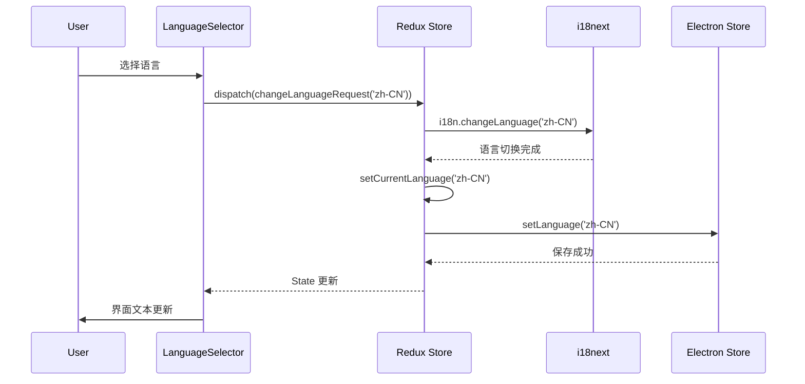
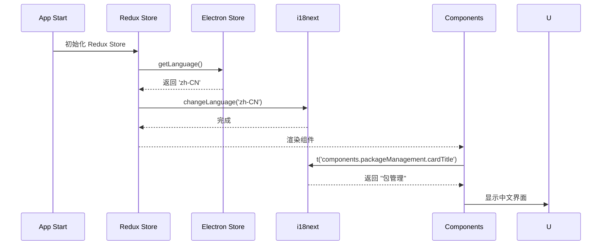

# 国际化架构设计文档

## 概述

本文档详细描述 Hagicode Desktop 国际化（i18n）系统的技术架构、设计决策和实现细节。

## 架构概览

### 系统组件图

```
┌─────────────────────────────────────────────────────────────┐
│                         User Interface                      │
│  ┌─────────────┐  ┌──────────────┐  ┌──────────────────┐  │
│  │ Components  │  │  Pages       │  │ LanguageSelector │  │
│  └──────┬──────┘  └──────┬───────┘  └────────┬─────────┘  │
│         │                │                    │             │
│         └────────────────┴────────────────────┘             │
│                          │                                  │
│                   useTranslation()                          │
└──────────────────────────┼──────────────────────────────────┘
                           │
                           ▼
┌─────────────────────────────────────────────────────────────┐
│                      i18next Layer                          │
│  ┌──────────────┐  ┌─────────────┐  ┌──────────────────┐   │
│  │ I18nextProvider│ │ i18n Instance│ │  i18next Config  │   │
│  └──────────────┘  └──────┬──────┘  └──────────────────┘   │
│                            │                                  │
│                   Translation Resources                      │
│  ┌─────────┐  ┌──────────┐  ┌─────────┐                     │
│  │ common  │  │component │  │  pages  │                     │
│  └─────────┘  └──────────┘  └─────────┘                     │
└─────────────────────────────────────────────────────────────┘
                           │
                           ▼
┌─────────────────────────────────────────────────────────────┐
│                    State Management                         │
│  ┌──────────────────────────────────────────────────────┐  │
│  │                    Redux Store                        │  │
│  │  ┌─────────────┐  ┌──────────────┐  ┌────────────┐  │  │
│  │  │ i18nSlice   │  │ otherSlices  │  │ rootState  │  │  │
│  │  └──────┬──────┘  �───────────────  └────────────┘  │  │
│  └─────────┼──────────────────────────────────────────┘  │
│            │ setCurrentLanguage(language)                  │
└────────────┼───────────────────────────────────────────────┘
             │
             ▼
┌─────────────────────────────────────────────────────────────┐
│                   Persistence Layer                         │
│  ┌─────────────────────────────────────────────────────┐   │
│  │              electron-store                          │   │
│  │  Key: appSettings.language                           │   │
│  │  Value: 'zh-CN' | 'en-US' | ...                      │   │
│  └─────────────────────────────────────────────────────┘   │
└─────────────────────────────────────────────────────────────┘
```

## 核心组件设计

### 1. i18next 配置

#### 文件结构
```
src/renderer/i18n/
├── index.ts              # 导出 i18n 实例
├── config.ts             # 配置常量
└── locales/
    ├── zh-CN/
    │   ├── common.json
    │   ├── components.json
    │   └── pages.json
    └── en-US/
        ├── common.json
        ├── components.json
        └── pages.json
```

#### 配置参数

```typescript
// src/renderer/i18n/config.ts
export const i18nConfig = {
  // 默认语言
  lng: 'zh-CN',

  // 回退语言链
  fallbackLng: {
    default: ['en-US'],
    'zh-HK': ['zh-CN', 'en-US'],
    'zh-TW': ['zh-CN', 'en-US'],
  },

  // 默认命名空间
  defaultNS: 'common',

  // 可用命名空间
  ns: ['common', 'components', 'pages'],

  // 命名空间加载顺序
  nsSeparator: ':',

  // 键名分隔符
  keySeparator: '.',

  // 插值配置
  interpolation: {
    escapeValue: false, // React 已经转义
    formatSeparator: ',',
    format: (value, format) => {
      // 自定义格式化逻辑
      if (format === 'uppercase') return value.toUpperCase();
      if (format === 'lowercase') return value.toLowerCase();
      return value;
    },
  },

  // React 特定配置
  react: {
    useSuspense: false, // 禁用 Suspense，避免阻塞渲染
    bindI18n: 'languageChanged',
    bindI18nStore: 'added',
    transEmptyNodeValue: '',
    transSupportBasicHtmlNodes: true,
    transKeepBasicHtmlNodesFor: ['br', 'strong', 'i', 'p'],
  },

  // 检测和缓存
  detection: {
    order: ['store', 'navigator'],
    caches: ['store'],
  },

  // 调试模式（生产环境设为 false）
  debug: process.env.NODE_ENV === 'development',

  // 加载策略
  backend: {
    loadPath: '/locales/{{lng}}/{{ns}}.json',
  },

  // 保存缺失的翻译键（开发模式）
  saveMissing: process.env.NODE_ENV === 'development',
  saveMissingTo: 'current',
  missingKeyHandler: (lng, ns, key) => {
    console.warn(`Missing translation key: ${lng}:${ns}:${key}`);
  },
};
```

### 2. Redux 状态管理

#### State 结构

```typescript
// src/renderer/store/slices/i18nSlice.ts

interface Language {
  code: string;        // ISO 639-1 语言代码 + ISO 3166-1 国家代码
  name: string;        // 英文名称（用于显示）
  nativeName: string;  // 本地语言名称（用于显示）
  flag?: string;       // Emoji 国旗（可选）
}

interface I18nState {
  currentLanguage: string;           // 当前语言代码
  availableLanguages: Language[];    // 可用语言列表
  isLoading: boolean;                // 加载状态
  error: string | null;              // 错误信息
}

const initialState: I18nState = {
  currentLanguage: 'zh-CN',
  availableLanguages: [
    {
      code: 'zh-CN',
      name: 'Simplified Chinese',
      nativeName: '简体中文',
      flag: '🇨🇳',
    },
    {
      code: 'en-US',
      name: 'English',
      nativeName: 'English',
      flag: '🇺🇸',
    },
  ],
  isLoading: false,
  error: null,
};
```

#### Actions 和 Reducers

```typescript
import { createSlice, PayloadAction } from '@reduxjs/toolkit';

const i18nSlice = createSlice({
  name: 'i18n',
  initialState,
  reducers: {
    setCurrentLanguage: (state, action: PayloadAction<string>) => {
      state.currentLanguage = action.payload;
    },
    setAvailableLanguages: (state, action: PayloadAction<Language[]>) => {
      state.availableLanguages = action.payload;
    },
    setLoading: (state, action: PayloadAction<boolean>) => {
      state.isLoading = action.payload;
    },
    setError: (state, action: PayloadAction<string | null>) => {
      state.error = action.payload;
    },
  },
});

export const {
  setCurrentLanguage,
  setAvailableLanguages,
  setLoading,
  setError,
} = i18nSlice.actions;

export default i18nSlice.reducer;

// Selectors
export const selectCurrentLanguage = (state: RootState) =>
  state.i18n.currentLanguage;

export const selectAvailableLanguages = (state: RootState) =>
  state.i18n.availableLanguages;
```

#### Saga 集成

```typescript
// src/renderer/store/sagas/i18nSaga.ts

import { put, takeEvery, call, select } from 'redux-saga/effects';
import { setCurrentLanguage } from '../slices/i18nSlice';
import i18n from '../../i18n';

// 监听语言切换 action
function* changeLanguageSaga(action: PayloadAction<string>) {
  const language = action.payload;

  try {
    // 调用 i18next 切换语言
    yield call([i18n, 'changeLanguage'], language);

    // 更新 Redux state
    yield put(setCurrentLanguage(language));

    // 持久化到 electron-store
    if (window.electronAPI?.setLanguage) {
      yield call([window.electronAPI, 'setLanguage'], language);
    }
  } catch (error) {
    console.error('Failed to change language:', error);
  }
}

// 应用启动时加载语言偏好
function* loadInitialLanguageSaga() {
  try {
    // 从 electron-store 读取
    const savedLanguage =
      window.electronAPI?.getLanguage &&
      (yield call([window.electronAPI, 'getLanguage']));

    if (savedLanguage) {
      yield call([i18n, 'changeLanguage'], savedLanguage);
      yield put(setCurrentLanguage(savedLanguage));
    }
  } catch (error) {
    console.error('Failed to load initial language:', error);
  }
}

export function* i18nSaga() {
  yield takeEvery('i18n/changeLanguageRequest', changeLanguageSaga);
  yield takeEvery('i18n/loadInitialLanguage', loadInitialLanguageSaga);
}
```

### 3. 翻译资源管理

#### 命名空间划分原则

| 命名空间 | 用途 | 示例键 |
|---------|------|--------|
| `common` | 通用 UI 文本，跨组件复用 | `common.button.save`, `common.status.loading` |
| `components` | 组件特定文本 | `components.packageManagement.cardTitle` |
| `pages` | 页面级文本 | `pages.settings.title` |

#### 翻译键命名规范

**格式**：`category.entity.attribute`

**示例**：
```json
{
  "components": {
    "packageManagement": {
      "cardTitle": "包管理",
      "cardDescription": "管理 Web 服务包的安装",
      "installStatus": {
        "installed": "已安装",
        "notInstalled": "未安装"
      },
      "versionLabel": "版本",
      "installButton": "安装包",
      "installingButton": "安装中..."
    }
  }
}
```

#### 翻译资源示例

```json
// src/renderer/i18n/locales/zh-CN/common.json
{
  "button": {
    "save": "保存",
    "cancel": "取消",
    "confirm": "确认",
    "delete": "删除",
    "edit": "编辑",
    "close": "关闭",
    "refresh": "刷新",
    "install": "安装",
    "uninstall": "卸载"
  },
  "status": {
    "loading": "加载中...",
    "success": "成功",
    "error": "错误",
    "warning": "警告",
    "info": "信息"
  },
  "form": {
    "required": "必填",
    "optional": "可选",
    "selectPlaceholder": "请选择...",
    "inputPlaceholder": "请输入..."
  }
}

// src/renderer/i18n/locales/zh-CN/components.json
{
  "packageManagement": {
    "cardTitle": "包管理",
    "cardDescription": "管理 Web 服务包的安装",
    "platformLabel": "平台",
    "installationStatusLabel": "安装状态",
    "installedVersionLabel": "已安装版本",
    "selectVersionLabel": "选择要安装的版本",
    "versionPlaceholder": "-- 选择版本 --",
    "installingProgress": "安装中...",
    "noPackagesMessage": "没有可用的包。请确保包源目录存在于：",
    "availableVersionsCount": "可用版本：找到 {{count}} 个"
  },
  "webServiceStatus": {
    "cardTitle": "Web 服务状态",
    "cardDescription": "查看和管理 Web 服务运行状态"
  }
}
```

#### 插值和复数支持

```json
{
  "message": {
    "welcome": "欢迎，{{name}}！",
    "itemCount_one": "{{count}} 个项目",
    "itemCount_other": "{{count}} 个项目"
  }
}
```

### 4. 组件集成模式

#### 基础用法

```typescript
import React from 'react';
import { useTranslation } from 'react-i18next';

const PackageManagementCard: React.FC = () => {
  const { t } = useTranslation('components');

  return (
    <Card>
      <CardHeader>
        <CardTitle>{t('packageManagement.cardTitle')}</CardTitle>
        <CardDescription>
          {t('packageManagement.cardDescription')}
        </CardDescription>
      </CardHeader>
      {/* ... */}
    </Card>
  );
};
```

#### 多命名空间

```typescript
const { t } = useTranslation(['common', 'components']);

t('common.button.save');
t('components.packageManagement.cardTitle');
```

#### 插值

```typescript
t('message.welcome', { name: 'John' });
// 输出：欢迎，John！
```

#### 动态键名

```typescript
const status = 'installed';
t(`packageManagement.installStatus.${status}`);
// 当 status = 'installed' 时，输出：已安装
```

### 5. 语言选择器组件

#### 组件设计

```typescript
// src/renderer/components/settings/LanguageSelector.tsx

import React from 'react';
import { useTranslation } from 'react-i18next';
import { useSelector, useDispatch } from 'react-redux';
import {
  Select,
  SelectContent,
  SelectItem,
  SelectTrigger,
  SelectValue,
} from '@/components/ui/select';
import { Label } from '@/components/ui/label';
import { RootState, AppDispatch } from '@/store';
import { selectCurrentLanguage, selectAvailableLanguages } from '@/store/slices/i18nSlice';
import { changeLanguageRequest } from '@/store/sagas/i18nSaga';

export const LanguageSelector: React.FC = () => {
  const { t, i18n } = useTranslation('pages');
  const dispatch = useDispatch<AppDispatch>();
  const currentLanguage = useSelector(selectCurrentLanguage);
  const availableLanguages = useSelector(selectAvailableLanguages);

  const handleLanguageChange = (languageCode: string) => {
    dispatch(changeLanguageRequest(languageCode));
  };

  return (
    <div className="space-y-2">
      <Label htmlFor="language-selector">
        {t('settings.language.label')}
      </Label>
      <Select
        value={currentLanguage}
        onValueChange={handleLanguageChange}
      >
        <SelectTrigger id="language-selector">
          <SelectValue />
        </SelectTrigger>
        <SelectContent>
          {availableLanguages.map((lang) => (
            <SelectItem key={lang.code} value={lang.code}>
              <span className="mr-2">{lang.flag}</span>
              <span>{lang.nativeName}</span>
              <span className="text-muted-foreground ml-2">
                ({lang.name})
              </span>
            </SelectItem>
          ))}
        </SelectContent>
      </Select>
    </div>
  );
};
```

#### UI 设计

```
┌─────────────────────────────────────────┐
│ 语言                                     │
│ ┌─────────────────────────────────────┐ │
│ │ 🇨🇳 简体中文 (Simplified Chinese)   │ │
│ │   ▼                                 │ │
│ └─────────────────────────────────────┘ │
│   🇨🇳 简体中文 (Simplified Chinese)     │
│   🇺🇸 English (English)                 │
└─────────────────────────────────────────┘
```

### 6. 持久化机制

#### Electron Store Schema

```typescript
// src/main/store.ts

import Store from 'electron-store';

interface AppSettings {
  language: string;
  // ... 其他设置
}

interface StoreSchema {
  appSettings: AppSettings;
}

const store = new Store<StoreSchema>({
  defaults: {
    appSettings: {
      language: 'zh-CN',
    },
  },
});

export default store;
```

#### IPC 通信

```typescript
// src/main/ipc.ts

import { ipcMain } from 'electron';
import store from './store';

ipcMain.handle('get-language', () => {
  return store.get('appSettings.language');
});

ipcMain.handle('set-language', (_event, language: string) => {
  store.set('appSettings.language', language);
  return language;
});
```

```typescript
// src/preload/index.d.ts

export interface ElectronAPI {
  getLanguage: () => Promise<string>;
  setLanguage: (language: string) => Promise<string>;
}
```

## 数据流设计

### 语言切换流程



### 应用启动语言加载流程



## 扩展性设计

### 添加新语言

**步骤**：

1. 创建新的语言目录：
   ```
   src/renderer/i18n/locales/ja-JP/
   ```

2. 创建翻译资源文件：
   ```
   common.json, components.json, pages.json
   ```

3. 更新 `i18nSlice` 中的可用语言列表：
   ```typescript
   {
     code: 'ja-JP',
     name: 'Japanese',
     nativeName: '日本語',
     flag: '🇯🇵',
   }
   ```

4. i18next 会自动加载新语言资源

### 动态加载语言包（未来扩展）

```typescript
// 动态导入语言包
const loadLanguage = async (lng: string) => {
  const resources = await import(`./locales/${lng}/index.ts`);
  i18n.addResourceBundle(lng, 'common', resources.common);
  i18n.addResourceBundle(lng, 'components', resources.components);
  i18n.addResourceBundle(lng, 'pages', resources.pages);
};
```

### 翻译管理工具（未来扩展）

```typescript
// 翻译资源提取 CLI
npm run extract-i18n

// 翻译完整性检查
npm run check-i18n

// 翻译资源同步
npm run sync-i18n
```

## 性能优化

### 资源懒加载

- 按命名空间动态加载翻译资源
- 仅加载当前语言和回退语言的资源

### 缓存策略

- 使用 i18next 内置的资源缓存
- IndexedDB 持久化缓存（可选）

### 渲染优化

- 使用 React.memo 避免不必要的重渲染
- i18n state 变化时仅重渲染受影响的组件

```typescript
export const PackageManagementCard = React.memo(() => {
  const { t } = useTranslation('components');
  // ...
});
```

## 测试策略

### 单元测试

```typescript
// i18nSlice.test.ts
describe('i18nSlice', () => {
  it('should set current language', () => {
    const state = i18nReducer(initialState, setCurrentLanguage('en-US'));
    expect(state.currentLanguage).toBe('en-US');
  });
});
```

### 集成测试

```typescript
// LanguageSelector.test.tsx
describe('LanguageSelector', () => {
  it('should change language when selection changes', () => {
    const { getByRole } = render(<LanguageSelector />);
    const select = getByRole('combobox');
    fireEvent.change(select, { target: { value: 'en-US' } });
    expect(i18n.language).toBe('en-US');
  });
});
```

### E2E 测试

```typescript
// e2e/i18n.spec.ts
test('should persist language preference', async ({ app, electronApp }) => {
  const window = await app.firstWindow();
  await window.selectOption('#language-selector', 'en-US');
  await electronApp.close();

  // 重启应用
  const app2 = await electronApp.launch({ ...appOptions });
  const window2 = await app2.firstWindow();
  const selectedLang = await window2.inputValue('#language-selector');
  expect(selectedLang).toBe('en-US');
});
```

## 安全考虑

### 翻译资源验证

- 验证 JSON 格式正确性
- 防止通过翻译键注入恶意代码
- 限制翻译资源大小，防止 DoS

### 输入转义

- i18next 默认转义插值变量
- HTML 内容需明确配置使用 trans 组件

## 故障处理

### 缺失翻译键

```typescript
// 开发模式：记录警告
missingKeyHandler: (lng, ns, key) => {
  console.warn(`Missing translation: ${lng}:${ns}:${key}`);
},

// 生产模式：返回回退语言的翻译或键名
```

### 资源加载失败

```typescript
// 使用回退语言
i18n.changeLanguage('zh-CN').catch(() => {
  i18n.changeLanguage('en-US');
});
```

### 持久化失败

```typescript
// 降级到默认语言
try {
  await window.electronAPI.setLanguage(language);
} catch (error) {
  console.error('Failed to save language preference:', error);
  // 继续使用，仅不保存偏好
}
```

## 监控和日志

### 关键指标

- 当前语言分布（通过错误报告或使用统计）
- 缺失翻译键频率
- 语言切换成功率
- 加载时间

### 日志记录

```typescript
// 记录语言切换
logger.info('Language changed', {
  from: previousLanguage,
  to: newLanguage,
  timestamp: Date.now(),
});

// 记录缺失翻译
logger.warn('Missing translation key', {
  key,
  namespace,
  language,
});
```
