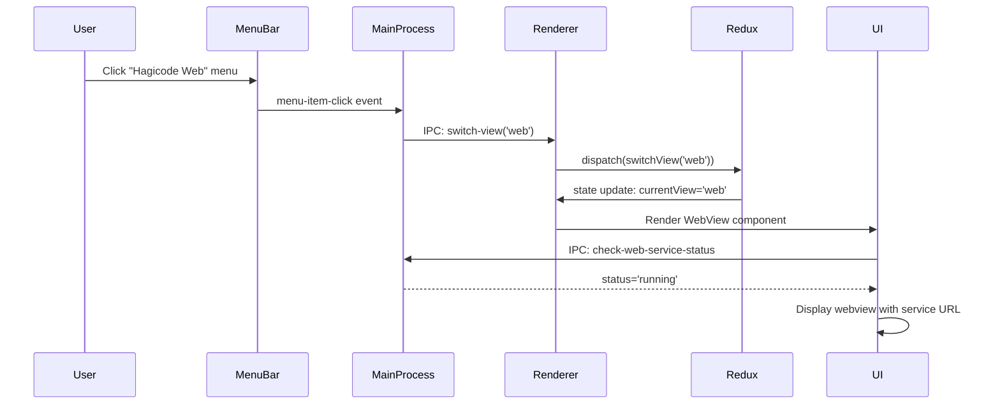
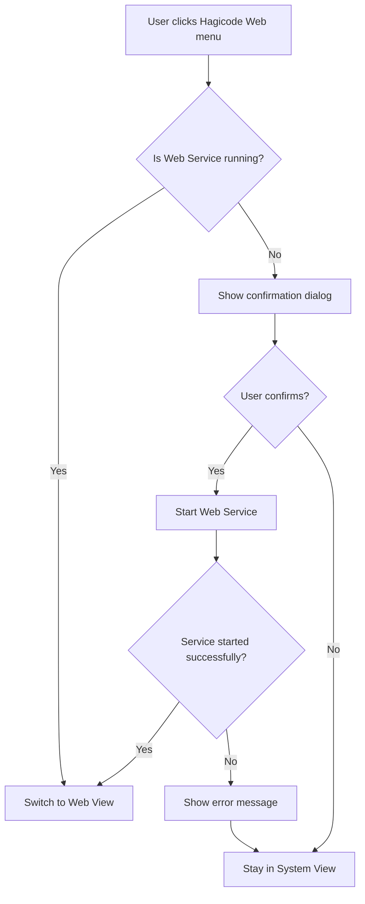
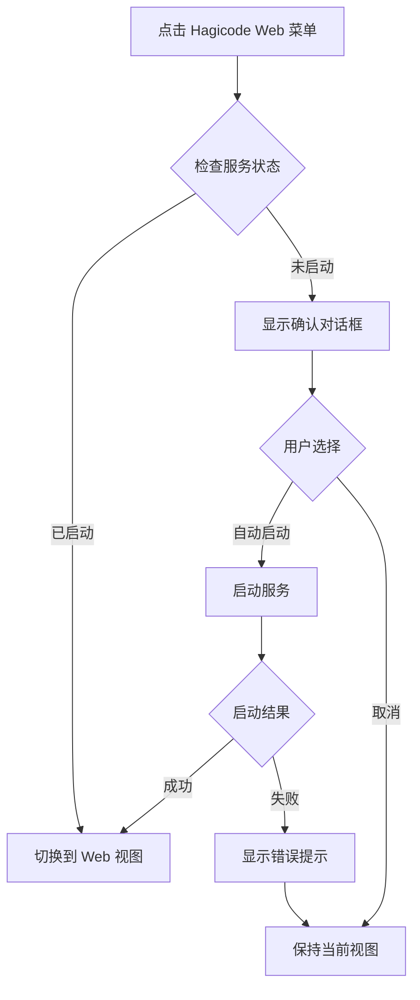

# Design Document: 顶部菜单栏功能

## 变更 ID
`electron-top-menu-bar-implementation`

## 架构决策

### 1. 视图切换方案选择

**决策：使用单窗口 + Redux 状态切换**

方案对比：

| 方案 | 优点 | 缺点 | 选择 |
|------|------|------|------|
| 单窗口 + Redux 状态切换 | 实现简单，内存占用低，状态管理统一 | 视图切换需重新渲染 | ✓ 选中 |
| 多窗口架构 | 各窗口独立，互不影响 | 资源占用高，窗口管理复杂 | ✗ |
| Electron BrowserView | 官方支持，隔离性好 | API 复杂，与 React 集成困难 | ✗ |

**理由**：
- 当前应用已有成熟的 Redux 状态管理
- 用户主要在单一视图内操作，不需要同时显示多个视图
- 实现复杂度最低，维护成本最低

### 2. Web 视图实现方案

**决策：使用 `<webview>` 标签**

方案对比：

| 方案 | 优点 | 缺点 | 选择 |
|------|------|------|------|
| `<webview>` 标签 | 简单易用，与 React 集成方便 | 安全性需注意 | ✓ 选中 |
| `BrowserView` API | 官方推荐，隔离性强 | API 复杂，渲染进程访问受限 | ✗ |
| `iframe` 标签 | 标准 HTML，兼容性好 | 跨域限制严重 | ✗ |

**安全考虑**：
```javascript
// <webview> 安全配置
<webview
  src="http://localhost:36556"
  nodeintegration="false"
  contextisolation="true"
  disablewebsecurity="false"
  partition="persist:webview"
/>
```

### 3. 菜单结构设计

```
菜单结构（Windows/Linux）:
┌─────────────────────────────────────────────────────┐
│ System Management          │  │ Hagicode Web           │
│  ├─ Dependencies           │  │  ├─ Open Web UI      │
│  ├─ Web Service Status     │  │  ├─ Navigate         │
│  ├─ Packages               │  │  │   ├─ Back         │
│  ├─ Settings               │  │  │   ├─ Forward      │
│  └─ ─────────────          │  │  │   └─ Refresh      │
│                            │  │  └─ Dev Tools        │
│ Help                       │  │                      │
│  ├─ About                  │  │                      │
│  └─ Documentation          │  │                      │
└─────────────────────────────────────────────────────┘

菜单结构（macOS）:
┌─────────────────────────────────────────────────────┐
│ [App Menu]           │ System Management │ Web │ Help│
│  ├─ About Hagicode     │                   │      │     │
│  ├─ Settings...      │                   │      │     │
│  └─ Quit             │                   │      │     │
└─────────────────────────────────────────────────────┘
```

## 数据流设计

### 视图切换流程



### Web 服务状态检查流程



## Redux 状态设计

### 新增 Slice: `viewSlice`

```typescript
// src/renderer/store/slices/viewSlice.ts
interface ViewState {
  currentView: 'system' | 'web';
  isViewSwitching: boolean;
  webServiceUrl: string | null;
  previousView: 'system' | 'web' | null;
}

const initialState: ViewState = {
  currentView: 'system',
  isViewSwitching: false,
  webServiceUrl: null,
  previousView: null,
};
```

### Redux Actions

```typescript
// Actions
switchView: (view: 'system' | 'web') => void;
updateWebServiceUrl: (url: string) => void;
setViewSwitching: (isSwitching: boolean) => void;
```

## IPC 通信设计

### 新增 IPC 通道

| 通道名 | 方向 | 用途 | 参数 | 返回值 |
|--------|------|------|------|--------|
| `switch-view` | Renderer → Main | 请求切换视图 | `{ view: 'system' \| 'web' }` | `boolean` |
| `get-current-view` | Renderer → Main | 获取当前视图 | - | `string` |
| `view-changed` | Main → Renderer | 视图变更通知 | `{ view: string, url?: string }` | - |
| `check-web-service-before-switch` | Renderer → Main | 切换前检查服务 | - | `{ running: boolean, url?: string }` |

### IPC 处理器实现（主进程）

```typescript
// src/main/main.ts 新增
ipcMain.handle('switch-view', async (_, view: 'system' | 'web') => {
  if (view === 'web') {
    // 检查 Web 服务状态
    const status = await webServiceManager?.getStatus();
    if (status?.status !== 'running') {
      return {
        success: false,
        reason: 'web-service-not-running',
        canStart: true
      };
    }
  }

  currentView = view;
  mainWindow?.webContents.send('view-changed', { view });

  return { success: true };
});
```

## 组件设计

### WebView 组件

```typescript
// src/renderer/components/WebView.tsx
interface WebViewProps {
  src: string;
  onLoadingChange?: (isLoading: boolean) => void;
  onError?: (error: Error) => void;
}

function WebView({ src, onLoadingChange, onError }: WebViewProps) {
  const webViewRef = useRef<Electron.WebviewTag>(null);

  const handleNavigate = (direction: 'back' | 'forward') => {
    // 导航控制
  };

  const handleRefresh = () => {
    // 刷新
  };

  return (
    <div className="web-view-container">
      <div className="web-view-toolbar">
        <button onClick={() => handleNavigate('back')}>←</button>
        <button onClick={() => handleNavigate('forward')}>→</button>
        <button onClick={handleRefresh}>⟳</button>
      </div>
      <webview
        ref={webViewRef}
        src={src}
        style={{ width: '100%', height: '100%' }}
        nodeintegration="false"
        contextisolation="true"
      />
    </div>
  );
}
```

### MenuManager 模块

```typescript
// src/main/menu-manager.ts
class MenuManager {
  private menu: Menu | null = null;
  private currentLanguage: string = 'zh-CN';

  constructor(private mainWindow: BrowserWindow) {}

  createMenu(language: string): Menu {
    const template = this.getMenuTemplate(language);
    this.menu = Menu.buildFromTemplate(template);
    Menu.setApplicationMenu(this.menu);
    return this.menu;
  }

  updateMenuLanguage(language: string): void {
    this.currentLanguage = language;
    this.createMenu(language);
  }

  private getMenuTemplate(language: string): MenuItemConstructorOptions[] {
    // 根据语言返回菜单模板
    const i18n = this.getTranslations(language);
    return [
      {
        label: i18n.systemManagement,
        submenu: [
          {
            label: i18n.dependencies,
            accelerator: 'CmdOrCtrl+1',
            click: () => this.switchView('system')
          },
          { type: 'separator' },
          // ...
        ]
      },
      {
        label: i18n.hagicoWeb,
        submenu: [
          {
            label: i18n.openWebUI,
            accelerator: 'CmdOrCtrl+2',
            click: () => this.switchView('web')
          }
          // ...
        ]
      }
    ];
  }

  private switchView(view: 'system' | 'web'): void {
    this.mainWindow.webContents.send('switch-view', view);
  }

  private getTranslations(language: string) {
    // 加载翻译文件
  }
}
```

## App.tsx 集成设计

```typescript
// src/renderer/App.tsx (修改后)
function App() {
  const { t } = useTranslation('common');
  const currentView = useSelector((state: RootState) => state.view.currentView);
  const dispatch = useDispatch();

  useEffect(() => {
    // 监听来自主进程的视图切换事件
    window.electronAPI.onViewChange((view: 'system' | 'web') => {
      dispatch(switchView(view));
    });
  }, [dispatch]);

  return (
    <div className="min-h-screen">
      {currentView === 'system' && (
        <SystemManagementView />
      )}
      {currentView === 'web' && (
        <WebView src={webServiceUrl} />
      )}
    </div>
  );
}
```

## 国际化设计

### 新增翻译键

```json
// src/renderer/i18n/locales/zh-CN/common.json
{
  "menu": {
    "systemManagement": "系统管理",
    "hagicoWeb": "Hagicode Web",
    "dependencies": "依赖项",
    "webService": "Web 服务",
    "packages": "包管理",
    "settings": "设置",
    "openWebUI": "打开 Web 界面",
    "navigate": "导航",
    "back": "后退",
    "forward": "前进",
    "refresh": "刷新",
    "devTools": "开发者工具"
  }
}
```

```json
// src/renderer/i18n/locales/en-US/common.json
{
  "menu": {
    "systemManagement": "System Management",
    "hagicoWeb": "Hagicode Web",
    "dependencies": "Dependencies",
    "webService": "Web Service",
    "packages": "Packages",
    "settings": "Settings",
    "openWebUI": "Open Web UI",
    "navigate": "Navigation",
    "back": "Back",
    "forward": "Forward",
    "refresh": "Refresh",
    "devTools": "Developer Tools"
  }
}
```

## 错误处理设计

### Web 服务未启动场景



### Web 视图加载失败场景

```typescript
// WebView 组件错误处理
<webview
  onError={(event) => {
    const error = event.detail;
    if (error.isTopLevel) {
      // 顶级导航错误
      showErrorNotification(t('webView.loadFailed', { reason: error.reason }));
    }
  }}
  onDidFailLoad={(event) => {
    if (event.isMainFrame) {
      // 主框架加载失败
      showErrorNotification(t('webView.navigationFailed'));
    }
  }}
/>
```

## 性能考虑

1. **视图切换优化**
   - 使用 React.memo 避免不必要的重新渲染
   - 视图组件懒加载（React.lazy）

2. **Web 视图资源管理**
   - 切换回系统管理时暂停 webview 内容加载
   - 使用 `<webview>` 的 `preload` 属性预加载关键资源

3. **状态持久化**
   - 使用 electron-store 保存上次打开的视图
   - 应用启动时恢复到上次视图

## 测试策略

### 单元测试
- `viewSlice` 的 action 和 reducer 测试
- `MenuManager` 的菜单创建和更新测试

### 集成测试
- IPC 通信测试（视图切换请求/响应）
- Web 服务状态检查测试

### E2E 测试场景
1. 启动应用，默认显示系统管理视图
2. 点击 "Hagicode Web" 菜单，切换到 Web 视图
3. 使用快捷键 `Cmd/Ctrl+1` 切换回系统管理
4. 在 Web 服务未启动时点击菜单，显示确认对话框
5. 切换语言后菜单文本正确更新

## 代码变更清单

### 新增文件
```
src/main/
  menu-manager.ts                    # 菜单管理器

src/renderer/components/
  WebView.tsx                        # Web 视图组件
  SystemManagementView.tsx           # 系统管理视图（重构）

src/renderer/store/slices/
  viewSlice.ts                       # 视图状态管理

src/renderer/store/sagas/
  viewSaga.ts                        # 视图相关副作用
```

### 修改文件
```
src/main/main.ts                     # 集成菜单管理器、添加 IPC 处理器
src/renderer/App.tsx                 # 集成视图切换逻辑
src/renderer/store/index.ts          # 添加 viewReducer
src/preload/index.mjs                # 添加视图相关 API
src/renderer/i18n/locales/*/common.json  # 添加菜单翻译
```

### 配置文件变更
```
electron-builder.yml                 # 无需变更
package.json                         # 无新增依赖
tsconfig.json                        # 无需变更
```

## 安全注意事项

1. **`<webview>` 安全配置**
   - 始终设置 `nodeintegration="false"`
   - 启用 `contextisolation="true"`
   - 使用独立的 `partition` 隔离会话

2. **Web 服务 URL 验证**
   - 仅允许加载 localhost URL
   - 验证端口配置在合法范围内（1024-65535）

3. **IPC 通信安全**
   - 渲染进程到主进程的所有切换请求都经过验证
   - 不暴露敏感的系统 API 给 webview 内容
