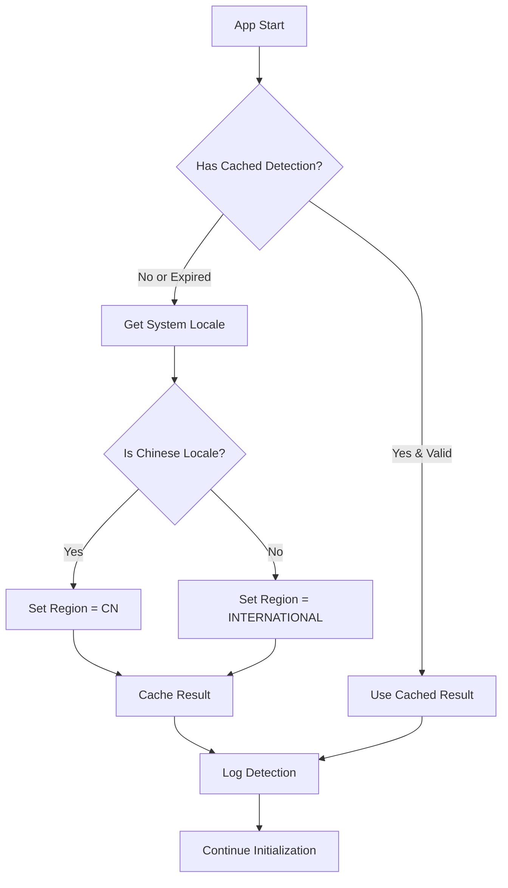
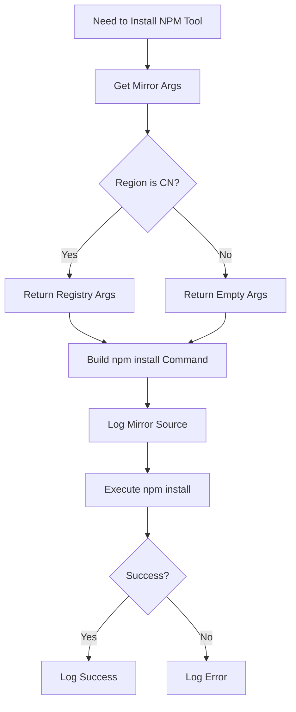
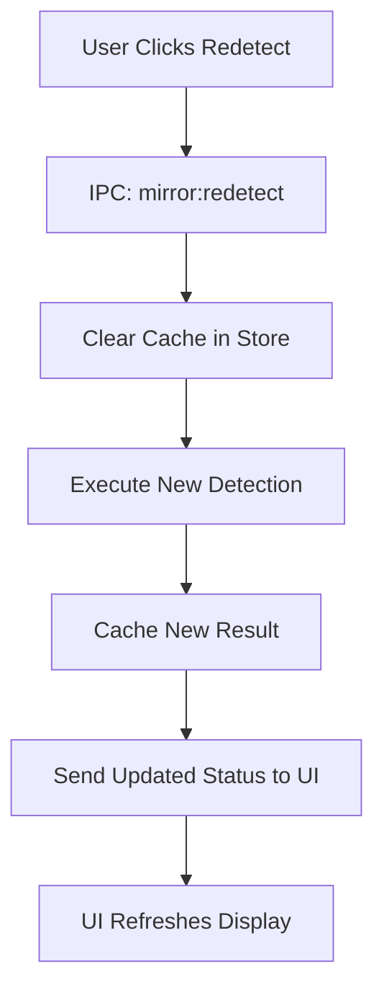

# 设计文档：智能 npm 镜像自动配置

## 架构概述

本变更引入一个轻量级的辅助模块，实现基于系统语言的地区检测和 npm 镜像自动配置功能。

```
┌─────────────────────────────────────────────────────┐
│                 Hagicode Desktop App                  │
├─────────────────────────────────────────────────────┤
│                                                      │
│  Application Start                                  │
│       │                                             │
│       ▼                                             │
│  ┌──────────────────────────────────────────────┐  │
│  │         NpmMirrorHelper                       │  │
│  │  - detectRegion()  [app.getLocale()]          │  │
│  │  - getNpmInstallArgs()                        │  │
│  │  - Cache Detection Result                     │  │
│  └──────────────────────────────────────────────┘  │
│       │                                             │
│       ▼                                             │
│  ┌──────────────────────────────────────────────┐  │
│  │    electron-store (npmRegionDetection)        │  │
│  │    { region: 'CN' | 'INTERNATIONAL',          │  │
│  │      detectedAt: timestamp }                  │  │
│  └──────────────────────────────────────────────┘  │
│                                                      │
│  NPM Tools Installation:                            │
│  ┌──────────────────────────────────────────────┐  │
│  │  Claude Code / OpenSpec Install               │  │
│  │       │                                       │  │
│  │       ▼                                       │  │
│  │  Get args from NpmMirrorHelper                │  │
│  │       │                                       │  │
│  │       ▼                                       │  │
│  │  npm install <pkg> --registry <mirror_url>    │  │
│  └──────────────────────────────────────────────┘  │
│                                                      │
│  (Optional) UI: MirrorStatusCard                    │
│  ┌──────────────────────────────────────────────┐  │
│  │  Region: 🇨🇳 China                           │  │
│  │  Mirror:  ✓ Taobao NPM Mirror                │  │
│  │  [Redetect]                                  │  │
│  └──────────────────────────────────────────────┘  │
│                                                      │
└─────────────────────────────────────────────────────┘
```

## 核心模块设计

### NpmMirrorHelper 模块

**职责**：基于系统语言检测用户地区，并提供相应的 npm 安装参数

**文件位置**：`src/main/npm-mirror-helper.ts`

**接口设计**：

```typescript
type Region = 'CN' | 'INTERNATIONAL';

interface DetectionResult {
  region: Region;
  detectedAt: Date;
  method: 'locale' | 'cache';
}

class NpmMirrorHelper {
  constructor(private store: electronStore, private log: electronLog) {}

  /**
   * 检测用户地区（基于系统语言）
   */
  detectRegion(): Region;

  /**
   * 获取 npm 安装所需的镜像参数
   * @returns npm 命令参数数组，如 ['--registry', 'https://...']
   */
  getNpmInstallArgs(): string[];

  /**
   * 缓存检测结果
   */
  private cacheDetectionResult(result: DetectionResult): void;

  /**
   * 获取缓存的检测结果
   */
  private getCachedDetection(): DetectionResult | null;

  /**
   * 执行完整的检测流程（带缓存）
   */
  detectWithCache(): DetectionResult;

  /**
   * 清除检测缓存
   */
  clearCache(): void;
}
```

**检测逻辑**：

```typescript
// 地区检测逻辑（简化版）
const CHINESE_LOCALES = ['zh-CN', 'zh-TW', 'zh-HK', 'zh-SG'];

function detectRegion(): Region {
  const locale = app.getLocale();

  // 检查是否为中文语言代码
  if (CHINESE_LOCALES.includes(locale)) {
    return 'CN';
  }

  // 默认为国际地区
  return 'INTERNATIONAL';
}
```

**npm 参数生成**：

```typescript
function getNpmInstallArgs(): string[] {
  const region = this.detectWithCache().region;

  if (region === 'CN') {
    return ['--registry', 'https://registry.npmmirror.com'];
  }

  return []; // 国际地区使用默认官方源
}
```

**缓存策略**：

```typescript
interface CacheConfig {
  key: string; // 'npmRegionDetection'
  ttl: number; // 7 天（毫秒）
}

function getCachedDetection(): DetectionResult | null {
  const cached = this.store.get('npmRegionDetection') as DetectionResult;

  if (!cached) {
    return null;
  }

  const now = new Date();
  const cacheAge = now.getTime() - new Date(cached.detectedAt).getTime();

  if (cacheAge > CACHE_TTL) {
    return null; // 缓存过期
  }

  return cached;
}
```

## 集成点设计

### 应用启动时检测

**位置**：`src/main/main.ts`

```typescript
// 在 app.on('ready') 中
app.on('ready', async () => {
  // ... 其他初始化代码 ...

  // 执行地区检测（异步，不阻塞启动）
  const mirrorHelper = new NpmMirrorHelper(store, log);
  const detection = mirrorHelper.detectWithCache();

  log.info(`Region detected: ${detection.region} (method: ${detection.method})`);

  // ... 继续其他初始化 ...
});
```

### NPM 工具安装集成

**示例：Claude Code 安装**

```typescript
// 原始安装代码（假设）
async function installClaudeCode() {
  const packageName = '@anthropic-ai/claude-code';
  await execAsync(`npm install -g ${packageName}`);
}

// 集成镜像辅助工具后
async function installClaudeCode(mirrorHelper: NpmMirrorHelper) {
  const packageName = '@anthropic-ai/claude-code';
  const mirrorArgs = mirrorHelper.getNpmInstallArgs().join(' ');
  const cmd = `npm install -g ${mirrorArgs} ${packageName}`.trim();

  log.info(`Installing ${packageName} with mirror: ${mirrorArgs || 'official'}`);
  await execAsync(cmd);
  log.info(`${packageName} installed successfully`);
}
```

**示例：OpenSpec 安装**

```typescript
async function installOpenSpec(mirrorHelper: NpmMirrorHelper) {
  const packageName = '@openspec/cli';
  const mirrorArgs = mirrorHelper.getNpmInstallArgs();

  const spawnArgs = ['install', '-g', packageName];
  if (mirrorArgs.length > 0) {
    spawnArgs.unshift(...mirrorArgs);
  }

  log.info(`Installing ${packageName} with registry: ${mirrorArgs[1] || 'official'}`);
  await spawnAsync('npm', spawnArgs);
  log.info(`${packageName} installed successfully`);
}
```

## 数据模型

### electron-store 配置结构

```typescript
interface AppConfig {
  // ... 现有配置 ...

  npmRegionDetection?: {
    region: 'CN' | 'INTERNATIONAL';
    detectedAt: string; // ISO timestamp
    method: 'locale' | 'cache';
  };
}
```

### 日志格式

```typescript
// 检测日志
{
  level: 'info',
  message: 'Region detected: CN (method: locale)',
  timestamp: '2025-02-04T10:30:00.000Z'
}

// 安装日志（中国用户）
{
  level: 'info',
  message: 'Installing @anthropic-ai/claude-code with mirror: --registry https://registry.npmmirror.com',
  timestamp: '2025-02-04T10:30:05.000Z'
}

// 安装日志（国际用户）
{
  level: 'info',
  message: 'Installing @anthropic-ai/claude-code with mirror: official',
  timestamp: '2025-02-04T10:30:05.000Z'
}
```

## 流程图

### 应用启动检测流程



### NPM 工具安装流程



### 缓存清除流程（可选功能）



## 可选 UI 组件

### MirrorStatusCard

**职责**：显示当前镜像配置状态

**文件位置**：`src/renderer/components/MirrorStatusCard.tsx`

**UI 设计（简化版）**：

```
┌─────────────────────────────────────────┐
│  NPM Mirror Configuration               │
├─────────────────────────────────────────┤
│                                         │
│  📍 Detected Region: 🇨🇳 China        │
│                                         │
│  📦 Current Mirror:                     │
│     ✓ Taobao NPM Mirror                 │
│     (https://registry.npmmirror.com)    │
│                                         │
│  ┌───────────────────────────────────┐ │
│  │  ℹ️ NPM tools will automatically  │ │
│  │     use this mirror for faster    │ │
│  │     downloads in China            │ │
│  └───────────────────────────────────┘ │
│                                         │
│           [Redetect]                    │
└─────────────────────────────────────────┘
```

**组件状态**：

```typescript
interface MirrorStatus {
  region: 'CN' | 'INTERNATIONAL' | null;
  mirrorUrl: string;
  mirrorName: string;
  detectedAt: Date | null;
}

function MirrorStatusCard() {
  const [status, setStatus] = useState<MirrorStatus | null>(null);

  useEffect(() => {
    // IPC: mirror:getStatus
    ipcRenderer.invoke('mirror:getStatus').then(setStatus);
  }, []);

  const handleRedetect = async () => {
    // IPC: mirror:redetect
    const newStatus = await ipcRenderer.invoke('mirror:redetect');
    setStatus(newStatus);
  };

  // ... render UI ...
}
```

**IPC 通信**：

```typescript
// Main Process (src/main/main.ts)
ipcMain.handle('mirror:getStatus', () => {
  const detection = mirrorHelper.detectWithCache();
  return {
    region: detection.region,
    mirrorUrl: detection.region === 'CN'
      ? 'https://registry.npmmirror.com'
      : 'https://registry.npmjs.org',
    mirrorName: detection.region === 'CN' ? 'Taobao NPM Mirror' : 'Official npm',
    detectedAt: detection.detectedAt
  };
});

ipcMain.handle('mirror:redetect', () => {
  mirrorHelper.clearCache();
  const detection = mirrorHelper.detectWithCache();
  // 返回格式同上
  return { /* ... */ };
});
```

## 国际化

### 新增翻译键

**中文 (`zh-CN/common.json`)**：

```json
{
  "mirror": {
    "title": "NPM 镜像配置",
    "region": "检测地区",
    "currentMirror": "当前镜像源",
    "official": "官方源",
    "taobao": "淘宝镜像",
    "redetect": "重新检测",
    "info": "NPM 工具将自动使用此镜像以加快下载速度",
    "regions": {
      "CN": "中国",
      "INTERNATIONAL": "国际"
    }
  }
}
```

**英文 (`en-US/common.json`)**：

```json
{
  "mirror": {
    "title": "NPM Mirror Configuration",
    "region": "Detected Region",
    "currentMirror": "Current Mirror",
    "official": "Official",
    "taobao": "Taobao Mirror",
    "redetect": "Redetect",
    "info": "NPM tools will automatically use this mirror for faster downloads",
    "regions": {
      "CN": "China",
      "INTERNATIONAL": "International"
    }
  }
}
```

## 错误处理

### 错误场景与处理策略

| 场景 | 错误信息 | 日志级别 | 用户操作 |
|------|----------|----------|----------|
| 系统语言检测失败 | "Failed to detect system locale, using INTERNATIONAL as default" | warn | 无需操作，自动降级 |
| 缓存读取失败 | "Failed to read detection cache, performing new detection" | info | 无需操作，自动重试 |
| npm 安装失败（镜像问题） | "NPM install failed, check logs for details" | error | 查看日志，可选：手动重试 |
| electron-store 写入失败 | "Failed to cache detection result" | warn | 无需操作，下次重启重新检测 |

## 测试策略

### 单元测试

**NpmMirrorHelper 测试**：

```typescript
describe('NpmMirrorHelper', () => {
  it('should detect CN region for zh-CN locale', () => {
    // Mock app.getLocale() to return 'zh-CN'
    const helper = new NpmMirrorHelper(mockStore, mockLog);
    const region = helper.detectRegion();
    expect(region).toBe('CN');
  });

  it('should detect INTERNATIONAL region for en-US locale', () => {
    // Mock app.getLocale() to return 'en-US'
    const helper = new NpmMirrorHelper(mockStore, mockLog);
    const region = helper.detectRegion();
    expect(region).toBe('INTERNATIONAL');
  });

  it('should return registry args for CN region', () => {
    // Mock detection to return CN
    const helper = new NpmMirrorHelper(mockStore, mockLog);
    const args = helper.getNpmInstallArgs();
    expect(args).toEqual(['--registry', 'https://registry.npmmirror.com']);
  });

  it('should return empty args for INTERNATIONAL region', () => {
    // Mock detection to return INTERNATIONAL
    const helper = new NpmMirrorHelper(mockStore, mockLog);
    const args = helper.getNpmInstallArgs();
    expect(args).toEqual([]);
  });

  it('should cache detection result', () => {
    const helper = new NpmMirrorHelper(mockStore, mockLog);
    helper.detectWithCache();
    expect(mockStore.set).toHaveBeenCalledWith(
      'npmRegionDetection',
      expect.objectContaining({ region: expect.any(String) })
    );
  });

  it('should use cached result if valid', () => {
    // Mock cached result (recent)
    const helper = new NpmMirrorHelper(mockStore, mockLog);
    const result = helper.detectWithCache();
    expect(result.method).toBe('cache');
  });

  it('should ignore expired cache', () => {
    // Mock cached result (old, > 7 days)
    const helper = new NpmMirrorHelper(mockStore, mockLog);
    const result = helper.detectWithCache();
    expect(result.method).toBe('locale');
  });
});
```

### 集成测试

- 应用启动时自动检测
- NPM 工具安装时使用正确的镜像参数
- 缓存机制正常工作

### 手动测试场景

1. **中文系统 + Claude Code 安装**：
   - 设置系统语言为中文
   - 安装 Claude Code
   - 验证日志显示使用淘宝镜像

2. **英文系统 + OpenSpec 安装**：
   - 设置系统语言为英文
   - 安装 OpenSpec
   - 验证日志显示使用官方源

3. **缓存验证**：
   - 重启应用
   - 验证使用缓存的检测结果
   - 清除缓存并重新检测

## 性能考虑

- **检测速度**：系统语言检测 < 1ms（几乎即时）
- **启动影响**：完全不阻塞应用启动
- **内存占用**：单个辅助类 + 一个缓存配置（可忽略）
- **磁盘 I/O**：仅在首次检测或缓存过期时写入 electron-store

## 安全考虑

- **镜像源可信度**：淘宝 npm 镜像是官方维护的知名镜像
- **不修改全局配置**：仅通过命令行参数指定镜像，不影响用户其他 npm 项目
- **日志隐私**：不记录用户 IP 或敏感信息，仅记录地区检测结果
- **用户控制**：用户可以查看当前配置，虽然不需要手动配置

## 未来扩展

### 潜在功能

1. **IP 地址检测**（可选增强）：
   - 添加 IP 地址检测作为系统语言的补充
   - 处理使用英文系统的中文用户

2. **手动覆盖**（可选）：
   - 允许高级用户强制指定地区
   - 通过环境变量或配置文件

3. **更多镜像源**（可选）：
   - 支持腾讯云、华为云等镜像
   - 根据网络延迟自动选择最优镜像

4. **详细配置面板**（可选）：
   - 提供完整的镜像配置 UI
   - 支持自定义镜像 URL
   - 连接测试和速度比较

### 扩展点

- `detectRegion()` 可以添加更多检测方法
- `getNpmInstallArgs()` 可以支持更多镜像源
- UI 可以从简单的状态卡片发展为完整的配置面板

## 与原设计的对比

| 方面 | 原设计 | 简化设计 |
|------|--------|----------|
| 地区检测方法 | IP + 语言 + 时区 | 仅语言检测 |
| 依赖源管理 | 多源管理（npm、本地、自定义） | 无（仅 NPM 工具） |
| UI 复杂度 | 完整配置面板 | 可选状态卡片 |
| 用户操作 | 手动选择和配置 | 完全自动化 |
| 任务数 | 25 个 | 12 个 |
| 实现复杂度 | 中等 | 低 |
| 维护成本 | 中等 | 低 |

## 关键设计决策

### 为什么选择系统语言检测？

1. **简单可靠**：`app.getLocale()` 是 Electron 提供的稳定 API
2. **即时响应**：无需网络请求，检测时间 < 1ms
3. **隐私友好**：不涉及 IP 地址查询
4. **覆盖核心用户**：大部分中文用户使用中文系统

**权衡**：部分使用英文系统的中文用户可能无法被识别为 CN 地区，但这可以通过未来添加 IP 检测来改进。

### 为什么使用命令行参数而非修改 .npmrc？

1. **影响范围受控**：仅影响当前安装命令，不影响用户其他项目
2. **无权限问题**：无需修改用户配置文件
3. **易于回退**：下次安装可以轻松切换镜像
4. **透明性**：通过日志清晰记录使用的镜像源

**权衡**：需要确保所有安装代码都集成了镜像辅助工具。

### 为什么 UI 是可选的？

1. **零配置理念**：用户无需手动操作，系统自动处理
2. **减少复杂度**：UI 开发和维护成本较高
3. **主要价值在后端**：核心功能是自动使用镜像，UI 只是信息展示
4. **渐进增强**：可以先实现核心功能，UI 作为后续增强

## 总结

这个简化设计聚焦于核心需求：
- 为中国用户提供快速的 NPM 工具安装体验
- 完全自动化，零用户配置
- 实现简单，维护成本低
- 易于测试和验证

核心是一个轻量级的辅助模块，通过系统语言检测地区，并在安装 NPM 工具时自动使用合适的镜像源。
