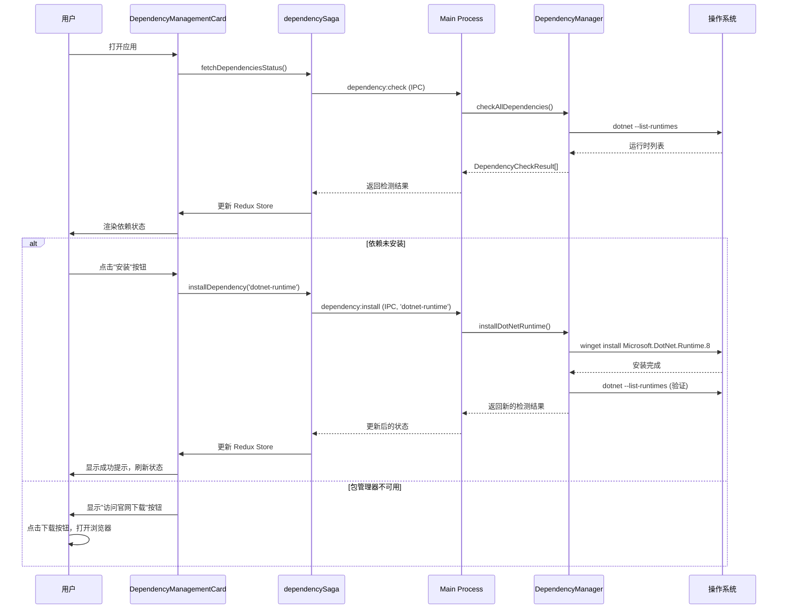
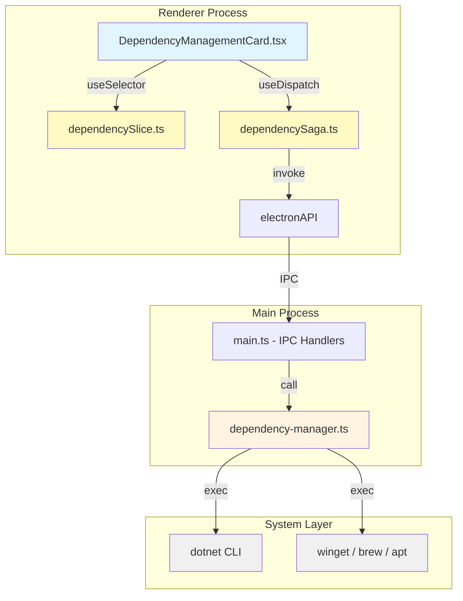
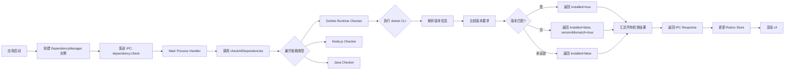
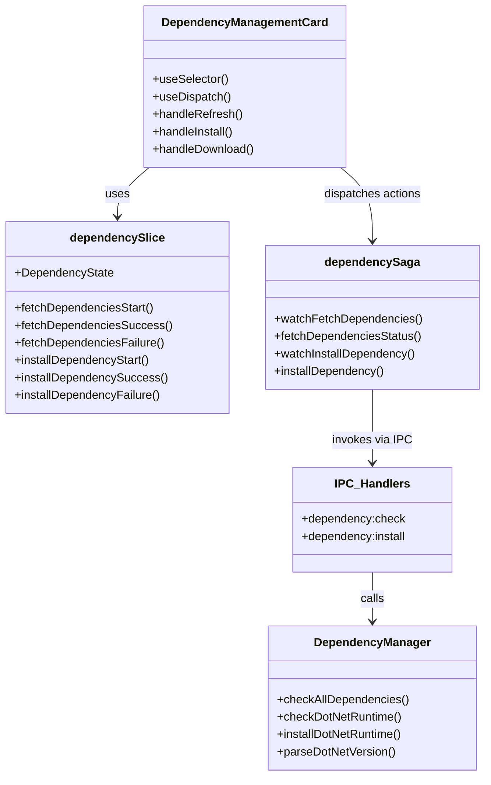

## Context

Hagicode Desktop 是一个基于 Electron 的跨平台桌面应用，用于管理和监控 Hagicode Server。当前应用已实现嵌入式 Web 服务管理、包管理等功能，但在部署 Web 服务时，用户主机环境可能缺少必要的运行时依赖项（如 .NET Runtime）。

当缺少这些依赖时，Web 服务无法正常启动或运行。用户需要手动检查和安装依赖，这增加了使用门槛，并导致故障排查困难。

### Stakeholders

- **最终用户**：希望快速部署和使用 Web 服务，不希望处理复杂的依赖问题
- **开发团队**：需要维护依赖检测逻辑，并支持多平台

### Constraints

- 必须支持 Windows、macOS、Linux 三大平台
- 必须遵循项目现有的架构模式（IPC 通信、Redux 状态管理）
- 第一阶段仅支持 .NET Runtime，后续扩展其他依赖类型
- 安装依赖可能需要管理员权限

## Goals / Non-Goals

### Goals

- 提供自动化的系统依赖检测能力
- 为用户提供清晰的依赖状态展示
- 提供便捷的依赖安装引导（自动化或手动）
- 建立可扩展的依赖管理架构，便于后续添加更多依赖类型

### Non-Goals

- 不在第一阶段实现所有依赖类型（仅 .NET Runtime）
- 不实现依赖的自动更新功能
- 不实现依赖版本的自动降级或升级（仅检测和引导安装）
- 不实现复杂的依赖关系解析（如依赖 A 依赖依赖 B）

## Decisions

### Decision 1: 使用 CLI 命令检测依赖

**选择**：执行系统命令（如 `dotnet --list-runtimes`）来检测依赖安装状态。

**理由**：
- 跨平台兼容性好，.NET CLI 在所有平台都提供相同的命令
- 可以获取详细的版本信息
- 无需依赖额外的 Node.js 模块

**替代方案**：
1. 检查注册表（Windows）或文件系统路径（macOS/Linux）
   - 优点：更快速
   - 缺点：平台差异大，维护成本高，无法准确获取版本信息

2. 使用 Node.js 模块（如 `node-dotnet`）
   - 优点：封装良好
   - 缺点：增加依赖，可能存在跨平台兼容性问题

### Decision 2: 使用系统包管理器安装依赖

**选择**：优先调用系统包管理器（Windows: winget, macOS: brew, Linux: apt/dnf），并提供官方下载链接作为备选。

**理由**：
- 利用用户系统已有的工具，无需额外下载安装程序
- winget/brew/apt 是各平台推荐的安装方式，用户体验好
- 提供下载链接作为备选，确保在包管理器不可用时用户仍有安装途径

**替代方案**：
1. 仅提供下载链接，引导用户手动安装
   - 优点：简单，无需处理安装逻辑
   - 缺点：用户体验差，需要手动下载和安装

2. 内置安装程序，自动静默安装
   - 优点：用户体验最好
   - 缺点：增加应用体积，需要处理 UAC 权限，安全风险高

### Decision 3: 独立的 Redux Slice 管理依赖状态

**选择**：创建独立的 `dependencySlice` 和 `dependencySaga` 管理依赖状态。

**理由**：
- 遵循项目现有的架构模式（如 `webServiceSlice`）
- 职责分离清晰，依赖状态与 Web 服务状态解耦
- 便于后续扩展和测试

**替代方案**：
1. 将依赖状态合并到 `webServiceSlice`
   - 优点：减少文件数量
   - 缺点：职责混杂，`webServiceSlice` 已包含进程和包管理状态

2. 使用 React Context 和 hooks
   - 优点：简单轻量
   - 缺点：与项目现有架构不一致，难以处理复杂的异步操作

### Decision 4: 依赖类型枚举和可扩展检测器架构

**选择**：使用依赖类型枚举（`DependencyType`）和可扩展的检测器函数映射。

**理由**：
- 便于后续添加新的依赖类型（Node.js、Java 等）
- 检测逻辑解耦，每种依赖有独立的检测函数
- 类型安全，减少运行时错误

**架构设计**：
```typescript
enum DependencyType {
  DotNetRuntime = 'dotnet-runtime',
  NodeJs = 'nodejs',
  JavaRuntime = 'java-runtime',
}

type DependencyChecker = (requiredVersion?: string) => Promise<DependencyCheckResult>;

const dependencyCheckers: Record<DependencyType, DependencyChecker> = {
  [DependencyType.DotNetRuntime]: checkDotNetRuntime,
  // 未来扩展：
  // [DependencyType.NodeJs]: checkNodeJs,
  // [DependencyType.JavaRuntime]: checkJavaRuntime,
};
```

## UI/UX Design

### 依赖管理卡片布局

```
┌──────────────────────────────────────────────────────────────────┐
│  📦 系统依赖管理                                       [🔄 刷新]  │
├──────────────────────────────────────────────────────────────────┤
│                                                                   │
│  检测 Web 服务所需的系统运行时依赖项                               │
│                                                                   │
│  ┌────────────────────────────────────────────────────────────┐  │
│  │  .NET Runtime (ASP.NET Core)                    ✅ 已安装   │  │
│  │                                                              │  │
│  │  当前版本: 8.0.11                                            │  │
│  │  要求版本: >= 8.0.0                                          │  │
│  │  状态: 版本匹配，满足要求                                     │  │
│  └────────────────────────────────────────────────────────────┘  │
│                                                                   │
│  ┌────────────────────────────────────────────────────────────┐  │
│  │  Node.js                                     ⚠️ 未安装       │  │
│  │                                                              │  │
│  │  要求版本: >= 18.0.0                                         │  │
│  │                                                              │  │
│  │  Web 服务需要 Node.js 运行时环境                              │  │
│  │                                                              │  │
│  │  [📦 使用包管理器安装]    [🔗 访问官网下载]                   │  │
│  └────────────────────────────────────────────────────────────┘  │
│                                                                   │
└──────────────────────────────────────────────────────────────────┘
```

### 状态指示器设计

| 状态 | 图标 | 颜色 | 文本 |
|------|------|------|------|
| 已安装且版本匹配 | ✅ | 绿色 (`text-green-500`) | 已安装 |
| 未安装 | ❌ | 红色 (`text-red-500`) | 未安装 |
| 已安装但版本不匹配 | ⚠️ | 黄色 (`text-yellow-500`) | 版本不匹配 |
| 检测中 | 🔄 | 灰色 (`text-gray-500`) | 检测中... |
| 安装中 | ⏳ | 蓝色 (`text-blue-500`) | 安装中... |

### 用户交互流程



### 加载和错误状态

**加载状态**：
- 在检测过程中显示旋转加载图标
- 禁用刷新按钮
- 显示"正在检测依赖..."提示

**错误状态**：
- 检测失败时显示错误警告框
- 提供重试按钮
- 记录详细错误日志到控制台

**安装进度**：
- 如果支持，显示安装进度条（如 winget 的进度输出）
- 安装过程中禁用安装按钮
- 显示"正在安装，请稍候..."提示

### 响应式设计

- 移动端（< 768px）：卡片垂直堆叠，按钮全宽显示
- 平板（768px - 1024px）：卡片保持两列布局
- 桌面（> 1024px）：完整的卡片布局

## Technical Design

### 架构图



### 数据流图



### 组件关系图



### 接口设计

```typescript
// 依赖检测结果
export interface DependencyCheckResult {
  name: string;                    // 依赖名称，如 ".NET Runtime"
  type: DependencyType;            // 依赖类型枚举
  installed: boolean;              // 是否已安装
  version?: string;                // 当前版本（如已安装）
  requiredVersion?: string;        // 要求的版本范围
  versionMismatch?: boolean;       // 版本是否不匹配
  installCommand?: string;         // 安装命令（如可用）
  downloadUrl?: string;            // 官方下载链接
  description?: string;            // 依赖描述
}

// 依赖类型枚举
export enum DependencyType {
  DotNetRuntime = 'dotnet-runtime',
  NodeJs = 'nodejs',
  JavaRuntime = 'java-runtime',
}

// 安装选项
export interface InstallOptions {
  usePackageManager: boolean;      // 是否使用包管理器
  elevationRequired?: boolean;     // 是否需要管理员权限
}

// 安装进度
export interface DependencyInstallProgress {
  dependencyType: DependencyType;
  stage: 'preparing' | 'installing' | 'verifying' | 'completed' | 'error';
  progress: number;                // 0-100
  message: string;
}
```

### IPC 通信协议

**渲染进程 → 主进程**：

```typescript
// 检查所有依赖
window.electronAPI.checkDependencies()
// 返回: Promise<DependencyCheckResult[]>

// 安装指定依赖
window.electronAPI.installDependency(dependencyType: DependencyType, options?: InstallOptions)
// 返回: Promise<boolean>
```

**主进程 → 渲染进程（事件推送）**：

```typescript
// 依赖状态变化（可选，用于实时更新）
window.electronAPI.onDependencyStatusChange((status: DependencyCheckResult[]) => void)

// 安装进度更新
window.electronAPI.onDependencyInstallProgress((progress: DependencyInstallProgress) => void)
```

### 错误处理策略

1. **检测失败**：
   - 捕获子进程执行异常
   - 返回 `installed: false` 状态
   - 在 UI 中显示"检测失败"错误提示
   - 提供"重试"按钮

2. **安装失败**：
   - 捕获安装命令异常
   - 解析错误消息（权限不足、网络错误等）
   - 显示友好的错误提示
   - 提供备选方案（下载链接）

3. **版本解析失败**：
   - 使用正则表达式健壮地解析版本字符串
   - 解析失败时标记为"版本未知"
   - 建议用户手动检查

### 性能考虑

- **缓存检测结果**：在短时间内（如 30 秒）避免重复检测
- **异步检测**：使用 `Promise.all` 并行检测多个依赖
- **懒加载**：仅在用户打开依赖管理面板时执行检测
- **防抖刷新**：防止用户频繁点击刷新按钮

## Risks / Trade-offs

### Risks

1. **平台兼容性风险**
   - **风险**：不同操作系统的包管理器行为差异
   - **缓解**：充分测试三大平台，提供备用的下载链接

2. **权限问题**
   - **风险**：安装依赖可能需要管理员权限，导致失败
   - **缓解**：检测权限，提示用户以管理员身份运行或手动安装

3. **版本兼容性**
   - **风险**：.NET Runtime 版本更新可能导致检测逻辑失效
   - **缓解**：使用健壮的版本解析逻辑，定期测试新版本

4. **用户环境差异**
   - **风险**：用户可能使用非标准的 .NET 安装路径
   - **缓解**：依赖 `dotnet` CLI 而非文件系统检测

### Trade-offs

1. **自动化 vs 用户控制**
   - **选择**：优先使用包管理器自动安装，提供下载链接作为备选
   - **权衡**：牺牲完全自动化的便利性，换取更高的成功率和安全性

2. **检测频率**
   - **选择**：仅在打开面板时检测，不定期轮询
   - **权衡**：节省系统资源，但可能无法实时反映依赖状态变化

3. **MVP 范围**
   - **选择**：第一阶段仅支持 .NET Runtime
   - **权衡**：快速交付核心功能，但用户可能需要其他依赖类型

## Migration Plan

此变更为新增功能，不涉及现有功能迁移。

### 部署步骤

1. **开发阶段**：
   - 实现 `DependencyManager` 模块
   - 添加 IPC handlers
   - 创建 Redux slice 和 saga
   - 实现 UI 组件

2. **测试阶段**：
   - 在三大平台上测试检测和安装功能
   - 测试边界情况（权限、网络、版本不匹配等）
   - 进行 UI/UX 测试

3. **部署阶段**：
   - 合并到主分支
   - 构建应用安装包
   - 发布到各平台

### Rollback

如果出现问题，可以通过以下方式回滚：

1. 从 `App.tsx` 中移除 `DependencyManagementCard` 组件
2. 从 Redux store 中移除 `dependencyReducer` 和 `dependencySaga`
3. 从 `main.ts` 中移除依赖相关的 IPC handlers

回滚后不影响现有 Web 服务和包管理功能。

## Open Questions

1. **.NET Runtime 版本要求**：
   - 当前 Web 服务具体需要哪个版本的 .NET Runtime？（8.0？9.0？）
   - 是否需要支持多个主版本（如 8.x 和 9.x）？

2. **包管理器检测**：
   - 如何判断系统是否安装了 winget/brew/apt？
   - 如果包管理器不可用，是否需要提供其他安装方式？

3. **UAC 权限提示**：
   - 在 Windows 上，winget 安装可能触发 UAC 提示
   - 是否需要在应用启动时请求管理员权限？

4. **离线场景**：
   - 如果用户离线，下载链接是否有效？
   - 是否需要提供离线安装包？

5. **后续依赖类型优先级**：
   - 在 .NET Runtime 之后，下一个应该支持哪个依赖类型？（Node.js？Java？）
