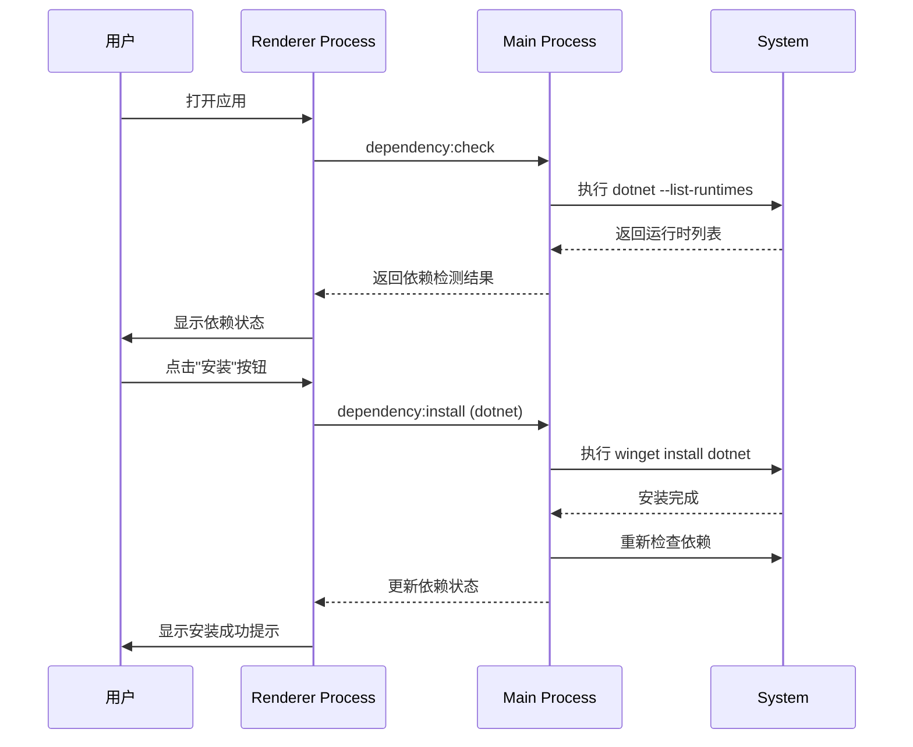
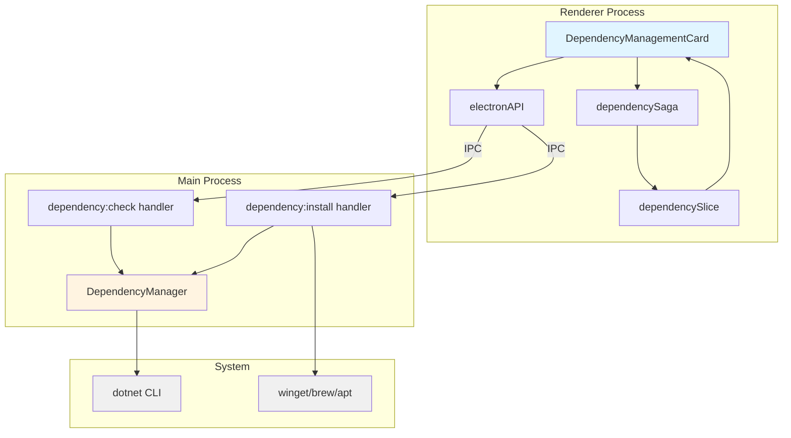
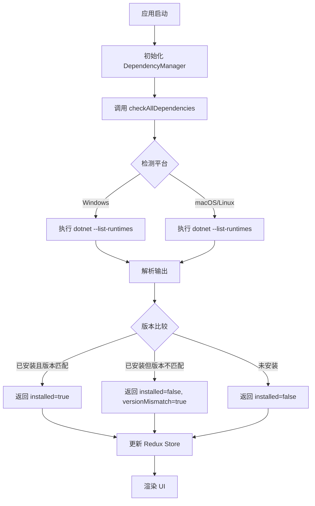

# Change: 系统依赖管理面板实现

## Why

当前 Hagicode Desktop 在部署 Web 服务时，用户主机环境可能缺少必要的运行时依赖项（如 .NET Runtime）。这导致：

1. **依赖状态不透明**：用户无法直观了解当前主机是否已安装 Web 服务所需的运行时环境
2. **缺少安装引导**：当依赖项缺失时，应用无法提供安装指引或自动化安装流程
3. **用户体验不佳**：用户需要手动检查和安装依赖，增加了使用门槛
4. **故障排查困难**：Web 服务启动失败时，难以快速定位是否为依赖项缺失导致

此变更加入系统依赖检测和管理能力，提升用户体验和降低使用门槛。

## What Changes

- **ADDED** 系统依赖检测功能：自动检测主机是否安装 .NET Runtime 及其版本
- **ADDED** 独立的依赖管理面板组件 `DependencyManagementCard.tsx`
- **ADDED** 主进程依赖管理模块 `dependency-manager.ts`，提供跨平台依赖检测能力
- **ADDED** IPC handlers 支持依赖检查和安装操作
- **ADDED** Redux 状态管理（`dependencySlice` 和 `dependencySaga`）处理依赖状态
- **ADDED** 国际化支持（中文、英文）的依赖管理相关翻译
- **MODIFIED** `App.tsx` 添加依赖管理卡片组件
- **MODIFIED** `main.ts` 注册依赖管理相关的 IPC handlers
- **MODIFIED** `preload/index.ts` 暴露依赖管理 API 给渲染进程

## UI Design Changes

### 依赖管理面板布局

```
┌─────────────────────────────────────────────────────────────┐
│  📦 系统依赖管理                                    [刷新]  │
├─────────────────────────────────────────────────────────────┤
│                                                               │
│  ┌─────────────────────────────────────────────────────┐   │
│  │ .NET Runtime (ASP.NET Core)            ✅ 已安装     │   │
│  │                                                     │   │
│  │ 版本: 8.0.11                                        │   │
│  │ 要求: >= 8.0.0                                      │   │
│  │ 状态: 版本匹配                                      │   │
│  └─────────────────────────────────────────────────────┘   │
│                                                               │
│  ┌─────────────────────────────────────────────────────┐   │
│  │ Node.js Runtime                          ❌ 未安装    │   │
│  │                                                     │   │
│  │ 要求: >= 18.0.0                                     │   │
│  │                                                     │   │
│  │ [使用包管理器安装]    [访问官网下载]                  │   │
│  └─────────────────────────────────────────────────────┘   │
│                                                               │
└─────────────────────────────────────────────────────────────┘
```

### 用户交互流程



## Code Flow Changes

### 架构概览



### 依赖检测数据流



## Impact

### 受影响的规范
- **specs/dependency-management/spec.md** (新增) - 系统依赖管理能力规范

### 受影响的代码
- `src/main/dependency-manager.ts` (新增) - 依赖检测和管理逻辑
- `src/main/main.ts` (修改) - 添加 IPC handlers
- `src/preload/index.ts` (修改) - 暴露依赖管理 API
- `src/renderer/components/DependencyManagementCard.tsx` (新增) - 依赖管理 UI 组件
- `src/renderer/store/slices/dependencySlice.ts` (新增) - 依赖状态管理
- `src/renderer/store/sagas/dependencySaga.ts` (新增) - 依赖副作用处理
- `src/renderer/App.tsx` (修改) - 集成依赖管理卡片
- `src/renderer/i18n/locales/*/components.json` (修改) - 添加翻译

### 用户体验影响
- **正面影响**：降低使用门槛，自动检测并引导安装依赖
- **正面影响**：故障快速定位，明确显示依赖状态
- **正面影响**：统一管理界面，所有依赖项在一个面板中集中管理
- **潜在风险**：自动安装依赖可能需要管理员权限（通过 UAC 提示处理）

### 技术债务
- **维护成本**：需要维护依赖检测和安装逻辑
- **平台适配**：需要测试不同操作系统下的检测和安装行为
- **版本兼容性**：需要跟进 .NET Runtime 的版本更新

### 后续扩展
- 支持 Node.js 依赖检测
- 支持 Java Runtime 检测
- 支持 Docker 依赖检测
- 添加更多包管理器支持（chocolatey、snap 等）
