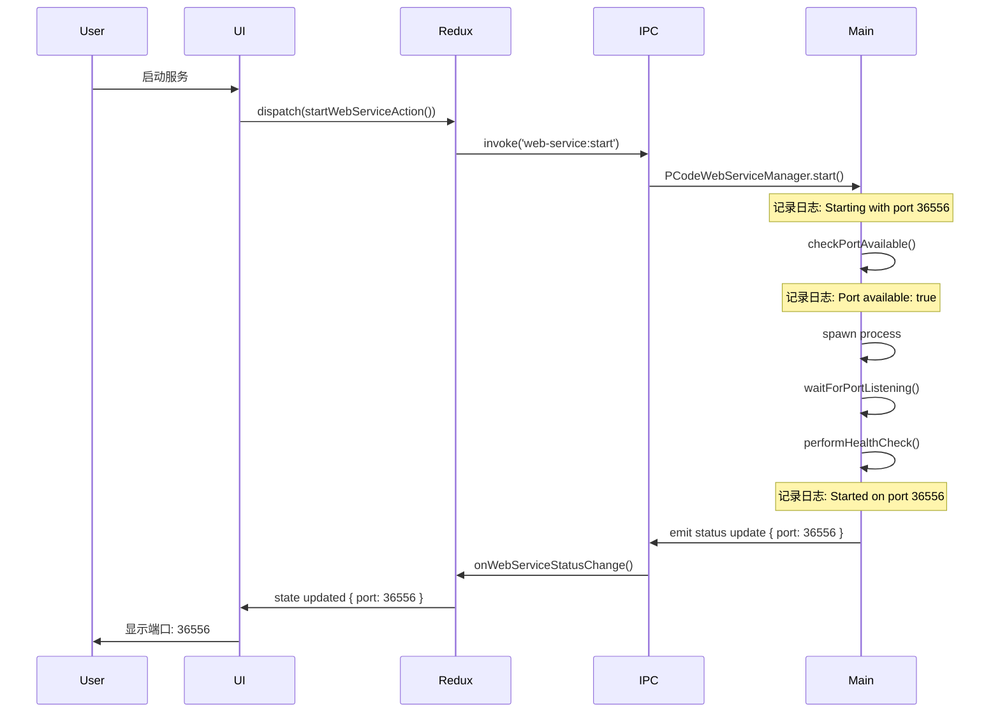
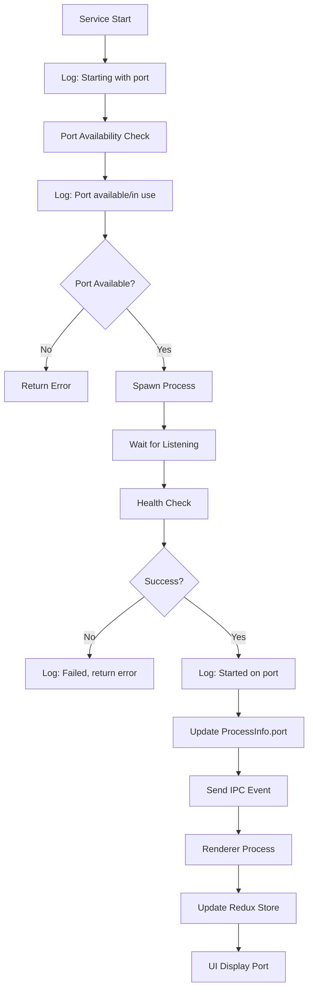
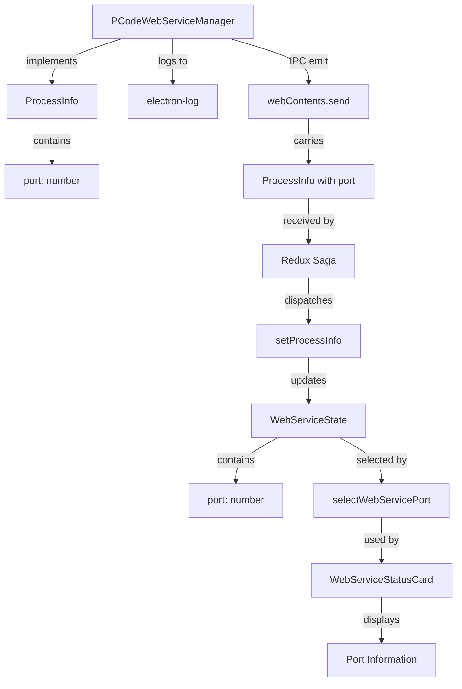
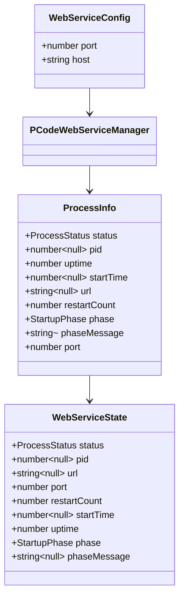

# Design Document: Web Service Port Information Visibility

## Context

Hagicode Desktop 是一款基于 Electron 的跨平台桌面应用，作为 Hagicode Server 的本地管理和监控工具。当前应用通过嵌入式 Web 服务管理器（`web-service-manager.ts`）启动和管理本地 Web 服务。

**默认端口配置**: 系统使用端口 **36556** 作为嵌入式 Web 服务的默认端口。

### Current State

- Web 服务启动时，端口信息（默认 36556）仅在配置文件中定义
- UI 中显示服务 URL（包含端口），但未单独展示端口号
- 启动日志缺少端口配置和检查的详细记录
- Redux Store 状态中未包含端口字段
- IPC 通信的数据结构中未包含端口信息

### Problem

用户无法清晰地看到服务将使用的端口号，降低了系统的可观察性和可维护性。当出现端口冲突等问题时，缺乏完整的日志记录来辅助诊断。

## Goals / Non-Goals

### Goals

1. **增强信息透明度** - 在 UI 中清晰展示服务使用的端口号
2. **完善日志记录** - 在启动日志中记录端口配置、检查和最终使用情况
3. **改进数据流** - 通过 IPC 正确传递端口信息到渲染进程
4. **保持兼容性** - 不破坏现有功能，确保跨平台兼容

### Non-Goals

1. **端口配置功能** - 本次不实现用户修改端口号的功能
2. **端口冲突解决** - 不实现自动端口冲突检测和解决
3. **多端口支持** - 当前仍为单端口服务
4. **高级端口管理** - 如端口绑定到特定网卡等功能

## Decisions

### Decision 1: 扩展现有数据结构而非创建新的

**Choice**: 在现有的 `ProcessInfo` 和 `WebServiceState` 接口中添加 `port` 字段，而不是创建新的数据结构。

**Rationale**:
- 端口信息是服务状态的核心组成部分，与 PID、Uptime 等信息同等重要
- 扩展现有结构可以保持代码一致性，减少迁移成本
- 避免 IPC 通信层级的复杂化

**Alternatives Considered**:
1. **创建独立的 PortInfo 结构** - 增加复杂度，不利于代码维护
2. **使用 URL 解析获取端口** - 依赖 URL 格式，不够健壮

### Decision 2: 在服务详情网格中添加独立端口列

**Choice**: 在 `WebServiceStatusCard` 的服务详情网格中添加独立的 "Port" 列，与 URL 并列显示。

**Rationale**:
- 端口号是用户常查看的关键信息，独立显示更清晰
- 保持现有 UI 布局，仅扩展一列，改动最小
- 便于用户快速识别端口信息，辅助配置其他服务

**Alternatives Considered**:
1. **仅显示 URL，不单独显示端口** - 信息透明度不够
2. **替换 URL 为端口显示** - 损失完整的 URL 信息
3. **在工具提示中显示** - 需要额外交互，不够直观

### Decision 3: 日志级别使用 info

**Choice**: 端口相关的日志使用 `info` 级别，而非 `debug` 或 `warn`。

**Rationale**:
- 端口信息是常规运维需要的关键信息，应默认记录
- 便于问题排查和审计，不需要调整日志级别
- 与现有日志风格保持一致

**Alternatives Considered**:
1. **使用 debug 级别** - 生产环境可能不记录，不利于排查
2. **使用 warn 级别** - 语义不正确，端口信息不是警告

### Decision 4: 端口字段为必填而非可选

**Choice**: 在 `ProcessInfo` 和 `WebServiceState` 中，`port` 字段为必填（`number` 类型），而非可选（`number | null`）。

**Rationale**:
- Web 服务始终需要端口号，即使是未启动状态也有配置的端口
- 避免 null 检查，简化代码逻辑
- 提供默认值（36556），确保字段始终有效

**Alternatives Considered**:
1. **设为可选字段** - 增加空值检查逻辑，复杂度高
2. **使用 undefined 作为未设置状态** - 与默认端口语义混淆

## UI/UX Design

### Visual Layout

当前服务详情网格为 4 列布局，本次变更为 5 列布局：

```
┌────────────────────────────────────────────────────────────────────────────┐
│                        Web Service Status                    [Running]     │
│                    Service is running and ready to use                   │
├────────────────────────────────────────────────────────────────────────────┤
│                                                                            │
│  [Start]  [Restart]  [Stop]  [Open in Browser]                            │
│                                                                            │
├────────────────────────────────────────────────────────────────────────────┤
│                                                                            │
│  Service Details:                                                          │
│  ┌──────────────┬─────────────┬──────────┬─────────────────┬────────────┐│
│  │ Service URL  │ Process ID  │ Uptime   │ Restart Count   │ Port       ││
│  │ http://...  │ 12345       │ 5m 30s   │ 0               │ 36556      ││
│  └──────────────┴─────────────┴──────────┴─────────────────┴────────────┘│
│                                                                            │
└────────────────────────────────────────────────────────────────────────────┘
```

### Display States

端口信息的显示根据服务状态有所不同：

| 服务状态 | 端口显示 | 说明 |
|---------|---------|------|
| stopped | 显示配置的默认端口 | 使用 `config.port`（默认为 36556） |
| starting | 显示即将使用的端口 | 与 stopped 相同，或显示 "分配中..." |
| running | 显示实际监听的端口 | 从 `ProcessInfo.port` 获取 |
| error | 显示配置的端口 | 与 stopped 相同 |
| stopping | 显示之前使用的端口 | 保持运行时的端口 |

### User Interaction Flow



### Responsive Design

- **桌面视图 (md及以上)**: 5 列网格，每列平均宽度
- **平板视图 (sm)**: 保持 5 列，但可能需要调整字体大小
- **移动视图**: 不适用（桌面应用）

## Technical Design

### Architecture Overview

```
┌─────────────────────────────────────────────────────────────────────┐
│                        Main Process                                 │
│                                                                     │
│  ┌─────────────────────────────────────────────────────────────┐   │
│  │           PCodeWebServiceManager                             │   │
│  │                                                              │   │
│  │  - config: WebServiceConfig { port: 36556 }                  │   │
│  │  - getStatus(): ProcessInfo { port: 36556 }                  │   │
│  │  - start(): log.info('[WebService] Starting with port...')  │   │
│  └─────────────────────────────────────────────────────────────┘   │
│                          ↓ IPC                                      │
└─────────────────────────────────────────────────────────────────────┘
                           ↓
┌─────────────────────────────────────────────────────────────────────┐
│                    Renderer Process                                 │
│                                                                     │
│  ┌─────────────────────────────────────────────────────────────┐   │
│  │              Redux Store (webServiceSlice)                  │   │
│  │                                                              │   │
│  │  - state.port: 36556                                          │   │
│  │  - setPort(port)                                             │   │
│  │  - selectWebServicePort()                                    │   │
│  └─────────────────────────────────────────────────────────────┘   │
│                          ↓                                          │
│  ┌─────────────────────────────────────────────────────────────┐   │
│  │          WebServiceStatusCard Component                     │   │
│  │                                                              │   │
│  │  - const port = useSelector(selectWebServicePort)           │   │
│  │  - <div>Port: {port}</div>                                   │   │
│  └─────────────────────────────────────────────────────────────┘   │
│                                                                     │
└─────────────────────────────────────────────────────────────────────┘
```

### Data Flow Diagram



### Component Relationships



### Type System



## Code Changes Summary

### Files Modified

1. **src/main/web-service-manager.ts**
   - `ProcessInfo` interface: Add `port: number`
   - `getStatus()`: Return `port` field
   - `start()`: Add port logging (3 locations)
   - Ensure `emitPhase()` and status updates include port

2. **src/renderer/store/slices/webServiceSlice.ts**
   - `ProcessInfo` interface: Add `port: number`
   - `WebServiceState` interface: Add `port: number`
   - `initialState`: Add `port: 36556`
   - Add `setPort` action
   - Update `setProcessInfo` reducer to handle `port`
   - Add `selectWebServicePort` selector
   - Update `selectWebServiceInfo` to include `port`

3. **src/renderer/components/WebServiceStatusCard.tsx**
   - Import `selectWebServicePort` selector
   - Add `port` to component state via `useSelector`
   - Update service details grid to 5 columns
   - Add port display cell

4. **src/renderer/i18n/locales/en-US/components.json**
   - Add translation key: `webServiceStatus.details.port`

5. **src/renderer/i18n/locales/zh-CN/components.json**
   - Add translation key: `webServiceStatus.details.port`

### Lines of Code Estimate

| File | Lines Added | Lines Modified | Total Impact |
|------|-------------|----------------|--------------|
| web-service-manager.ts | ~10 | ~5 | ~15 |
| webServiceSlice.ts | ~15 | ~5 | ~20 |
| WebServiceStatusCard.tsx | ~10 | ~5 | ~15 |
| i18n files | ~4 | 0 | ~4 |
| **Total** | **~39** | **~15** | **~54** |

## Risks / Trade-offs

### Risks

| Risk | Probability | Impact | Mitigation |
|------|-------------|--------|------------|
| Type inconsistency between processes | Low | Medium | Use shared types file or strict TypeScript validation |
| IPC message size increase | Low | Low | Port is a single number, negligible impact |
| UI layout breaking on smaller screens | Low | Low | Test responsive design, use flex/grid with min-width |
| Port field not initialized properly | Medium | High | Add default value in initialState, add null checks in UI |

### Trade-offs

1. **Grid Layout Complexity**
   - **Pro**: 5 columns provide comprehensive information at a glance
   - **Con**: May require horizontal scrolling on smaller windows
   - **Mitigation**: Use responsive grid with minimum column widths

2. **Port as Required Field**
   - **Pro**: Simpler code, no null checks needed
   - **Con**: Must always have valid port value
   - **Mitigation**: Provide sensible default (36556) in all code paths

3. **Log Verbosity**
   - **Pro**: Better debugging and audit trail
   - **Con**: Slightly more log output
   - **Mitigation**: Use info level (not debug), follows existing patterns

## Migration Plan

### Steps

1. **Phase 1: Type Updates** (Day 1)
   - Update all TypeScript interfaces to include `port` field
   - Run `npm run build:tsc:check` to verify type correctness
   - No runtime behavior changes yet

2. **Phase 2: Logging** (Day 1)
   - Add logging statements to `web-service-manager.ts`
   - Verify logs appear correctly in development console

3. **Phase 3: IPC and State** (Day 2)
   - Update Redux Store to handle port field
   - Update IPC communication to include port
   - Verify data flow from main to renderer process

4. **Phase 4: UI Updates** (Day 2)
   - Update `WebServiceStatusCard` component
   - Add internationalization strings
   - Test UI display in different states

5. **Phase 5: Testing** (Day 3)
   - Cross-platform testing (Windows, macOS, Linux)
   - Verify all service states show correct port
   - Check logs contain port information

6. **Phase 6: Documentation** (Day 3)
   - Update code comments
   - Update CHANGELOG if applicable

### Rollback Plan

If issues arise after deployment:

1. **UI Issues**: Revert component changes, keep backend changes (safe)
2. **IPC Issues**: Revert both renderer and main process changes
3. **Type Errors**: Revert all type changes, restore original interfaces

All changes are additive or non-breaking, so rollback is straightforward.

### Testing Strategy

**Unit Tests** (if time permits):
- Test `setPort` action updates state correctly
- Test `selectWebServicePort` returns correct value

**Integration Tests**:
- Test service start → IPC → Redux → UI flow
- Test port information updates on service restart

**Manual Tests**:
1. Start service, verify port shown
2. Stop service, verify port still shown (configured port)
3. Restart service, verify port remains consistent
4. Check logs contain port information
5. Test on all three platforms

## Open Questions

1. **Q**: Should the port be editable in the future?
   - **A**: Out of scope for this change, but the design allows for it. Future work can add port configuration UI.

2. **Q**: Should we show host:port or just port?
   - **A**: Just the port number (e.g., "36556"). The full URL is already shown separately.

3. **Q**: What if the port changes after startup (unsupported now)?
   - **A**: The design supports port updates via `setProcessInfo`, but current implementation uses fixed port from config.

4. **Q**: Should we validate the port range (1-65535)?
   - **A**: The config already uses valid port numbers. No additional validation needed in this change.

5. **Q**: How do we handle IPv6 ports (e.g., [::1]:36556)?
   - **A**: Current implementation uses simple host/port pair, IPv6 not in scope. Future work can enhance.
