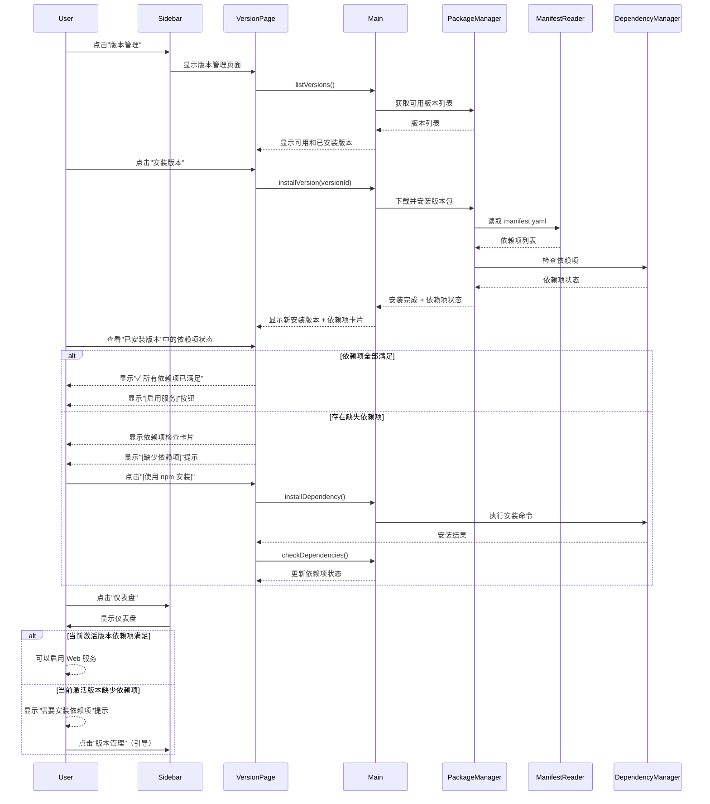
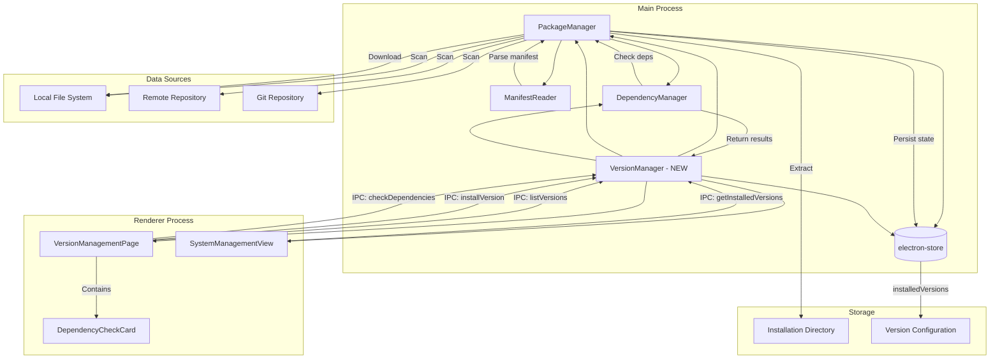
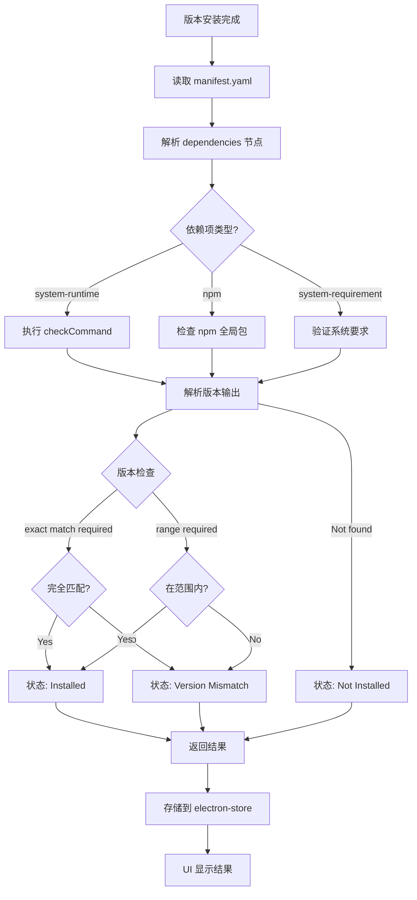
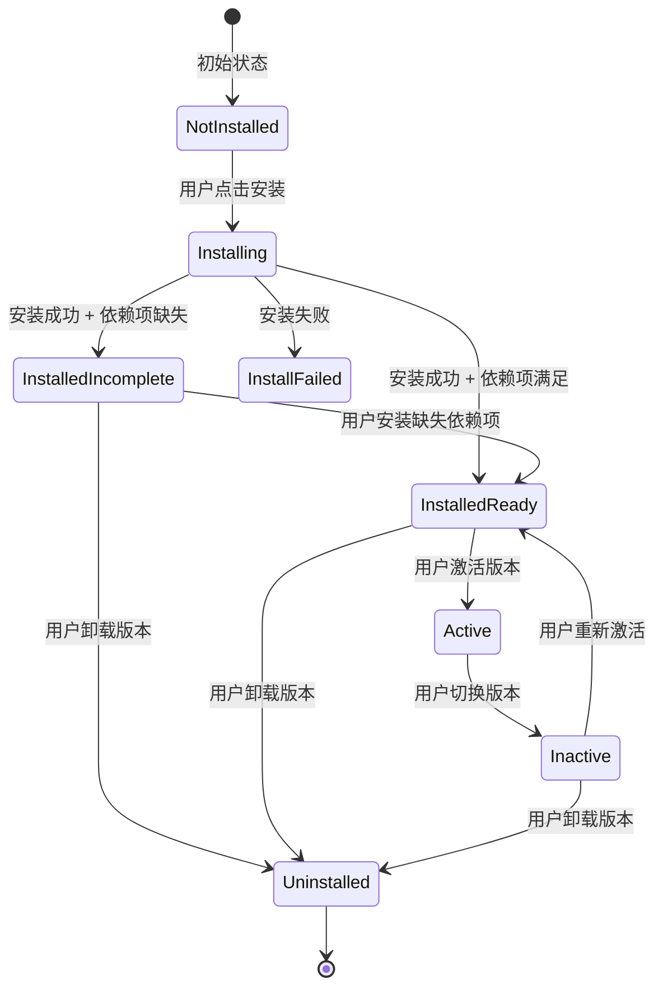
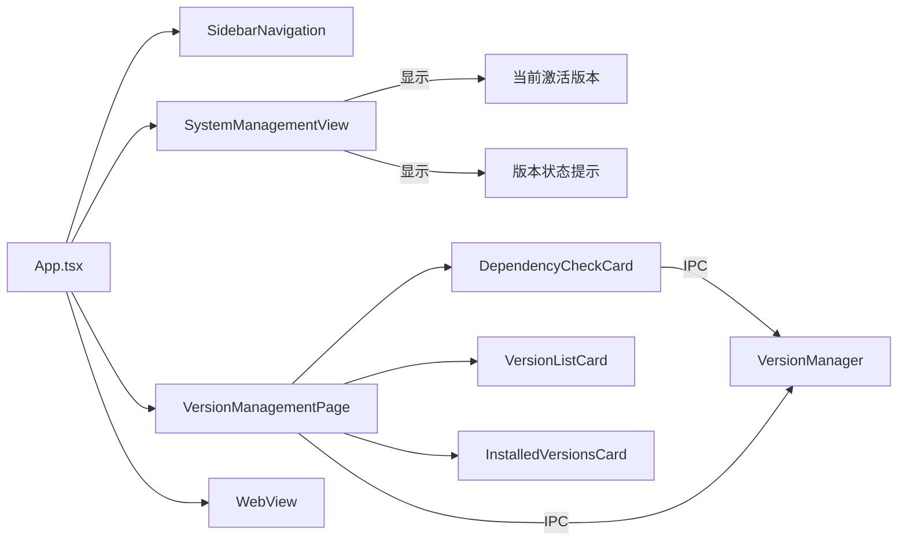

# Change: 整合依赖项到版本管理流程

## Why

当前 Hagicode Desktop 应用在架构上存在功能重复和用户体验割裂的问题：

1. **一级菜单冗余**：依赖项管理作为独立的一级菜单项存在，但实际上依赖项检查是版本安装流程的自然组成部分，不应独立存在
2. **安装流程割裂**：版本安装和依赖项管理被分为两个独立步骤，用户需要在多个界面间切换，导致体验不连贯
3. **状态管理混乱**：已安装版本的状态（完全可用 vs 缺少依赖项）未在仪表盘中清晰展示，用户无法直观了解服务可用性
4. **版本管理模块未实现**：缺少完整的版本管理功能，包括 YAML Manifest 解析、版本来源扫描、安装状态持久化等核心能力

通过将依赖项管理整合到版本管理流程中，可以：
- 简化导航结构，减少用户认知负担
- 提供流畅的版本安装 → 依赖项检查 → 启用服务的完整闭环
- 清晰展示版本状态，避免启用失败
- 实现完整的版本生命周期管理

## What Changes

- **菜单结构重构**：从侧边栏导航中移除"依赖项管理"独立入口，将其功能整合到版本管理流程中
- **版本管理核心功能实现**：
  - 创建 Manifest Reader 模块（`src/main/manifest-reader.ts`）用于解析 YAML 格式的 Manifest 文件
  - 实现版本提供者扫描机制，支持多个版本来源（本地文件系统、远程仓库等）
  - 实现版本安装流程，包括下载、解压、执行安装后脚本
  - 依赖项自动检查和结果持久化
- **依赖项可视化与用户引导**：
  - 创建 `DependencyCheckCard` 组件，在版本管理界面中内嵌依赖项检查和展示
  - 创建完整的 `VersionManagementPage` 页面，包含可用版本列表、安装操作、已安装版本管理
- **仪表盘集成**：
  - 在 `SystemManagementView` 中显示当前激活版本和可用版本列表
  - 启用条件校验：仅当版本状态为 `installed-ready` 时允许启用服务
  - 服务状态与版本状态关联
- **IPC 通信接口扩展**：新增版本管理相关的 IPC handlers 和 preload API
- **国际化支持**：添加版本管理相关的翻译键

**重要说明**：本提案中的"依赖项管理整合"是指将独立的"依赖项管理"一级菜单项移除，将其核心功能（检查系统运行时依赖如 .NET、Node.js）整合到版本管理页面中，使其在版本安装后自然显示，而不是作为独立的导航入口。

## UI Design Changes

### 新侧边栏导航结构

移除"依赖项管理"导航项后的侧边栏：

```
┌────────────────────────────┐
│                            │
│  [H] Hagicode Desktop        │  Logo 区域
│                            │
│  ┌──────────────────┐      │
│  │ ⚙ 仪表盘         │      │  保留
│  └──────────────────┘      │
│                            │
│  ┌──────────────────┐      │
│  │ 🌐 Web 服务      │      │  保留
│  └──────────────────┘      │
│                            │
│  ┌──────────────────┐      │
│  │ 📋 版本管理      │      │  保留（功能扩展）
│  └──────────────────┘      │
│                            │
│  ◀ 收起                    │  切换按钮
│                            │
└────────────────────────────┘
```

### 版本管理页面设计

```
┌──────────────────────────────────────────────────────────────────┐
│  版本管理                                                        │
│                                                                  │
│  ┌──────────────────────────────────────────────────────────┐  │
│  │ 可用版本                                                  │  │
│  │                                                           │  │
│  │  ┌─────────────────────────────────────────────────┐    │  │
│  │  │ 📦 Hagicode Server v1.2.3                        │    │  │
│  │  │    发布于: 2026-01-15  | 大小: 125MB          │    │  │
│  │  │    [安装版本]                                 │    │  │
│  │  └─────────────────────────────────────────────────┘    │  │
│  │                                                           │  │
│  │  ┌─────────────────────────────────────────────────┐    │  │
│  │  │ 📦 Hagicode Server v1.2.2                        │    │  │
│  │  │    发布于: 2026-01-10  | 大小: 120MB          │    │  │
│  │  │    [安装版本]                                 │    │  │
│  │  └─────────────────────────────────────────────────┘    │  │
│  └──────────────────────────────────────────────────────────┘  │
│                                                                  │
│  ┌──────────────────────────────────────────────────────────┐  │
│  │ 已安装版本                                                │  │
│  │                                                           │  │
│  │  ┌─────────────────────────────────────────────────┐    │  │
│  │  │ ✓ Hagicode Server v1.2.1  [当前激活]           │    │  │
│  │  │    安装于: 2026-01-05  |  依赖项: 已满足      │    │  │
│  │  │    [卸载]  [切换]                              │    │  │
│  │  └─────────────────────────────────────────────────┘    │  │
│  │                                                           │  │
│  │  ┌─────────────────────────────────────────────────┐    │  │
│  │  │ ⚠ Hagicode Server v1.2.0                        │    │  │
│  │  │    安装于: 2026-01-02  |  依赖项: 缺少 .NET   │    │  │
│  │  │    [查看依赖项]  [卸载]                        │    │  │
│  │  └─────────────────────────────────────────────────┘    │  │
│  └──────────────────────────────────────────────────────────┘  │
└──────────────────────────────────────────────────────────────────┘
```

### 依赖项检查卡片（嵌入版本管理页面）

```
┌──────────────────────────────────────────────────────────────────┐
│  依赖项检查 - Hagicode Server v1.2.0                              │
│                                                                  │
│  ┌──────────────────────────────────────────────────────────┐  │
│  │ ✓ .NET 10 Runtime                                       │  │
│  │   版本: 10.0.0  |  要求: 10.0.0+                       │  │
│  └──────────────────────────────────────────────────────────┘  │
│                                                                  │
│  ┌──────────────────────────────────────────────────────────┐  │
│  │ ✓ Node.js                                                 │  │
│  │   版本: 24.12.0  |  要求: 20.11.0+                      │  │
│  └──────────────────────────────────────────────────────────┘  │
│                                                                  │
│  ┌──────────────────────────────────────────────────────────┐  │
│  │ ✗ Claude Code                                            │  │
│  │   要求: 0.1.0-alpha.9  |  当前: 未安装                   │  │
│  │   [使用 npm 安装]  [访问官网下载]                        │  │
│  └──────────────────────────────────────────────────────────┘  │
│                                                                  │
│  [刷新依赖项]                                                   │
└──────────────────────────────────────────────────────────────────┘
```

### 用户交互流程



## Code Flow Changes

### 版本管理架构



### 依赖项检查流程



### 版本状态管理



### 组件关系



## Impact

### Affected specs

- **dependency-management** - 修改现有规范，将依赖项检查从独立功能整合为版本管理的子功能
- **electron-app** - 修改应用导航结构和视图切换逻辑

### Affected code

**Main Process**:
- `src/main/manifest-reader.ts` - **新建** - YAML Manifest 文件解析模块
- `src/main/package-manager.ts` - 扩展支持版本来源扫描、安装流程、依赖项检查集成
- `src/main/dependency-manager.ts` - 扩展支持基于 Manifest 的依赖项检查
- `src/main/main.ts` - 添加版本管理相关的 IPC handlers

**Renderer Process**:
- `src/renderer/components/SidebarNavigation.tsx` - 移除"依赖项管理"导航项
- `src/renderer/components/VersionManagementPage.tsx` - **重写** - 完整实现版本管理页面
- `src/renderer/components/DependencyCheckCard.tsx` - 修改以适配版本管理页面集成
- `src/renderer/components/SystemManagementView.tsx` - 集成版本状态展示和启用条件校验
- `src/renderer/store/slices/viewSlice.ts` - 可能需要更新视图类型定义

**IPC/Preload**:
- `src/preload/index.ts` - 添加版本管理相关的 IPC 暴露

**i18n**:
- `src/renderer/i18n/locales/zh-CN/pages.json` - 添加版本管理相关翻译
- `src/renderer/i18n/locales/en-US/pages.json` - 添加版本管理相关翻译
- `src/renderer/i18n/locales/zh-CN/common.json` - 移除侧边栏"依赖项管理"翻译
- `src/renderer/i18n/locales/en-US/common.json` - 移除侧边栏"依赖项管理"翻译

### Breaking changes

**UI 导航结构变更**：
- 移除侧边栏中的"依赖项管理"导航项
- 依赖项检查功能将仅在版本管理页面中可用

**向后兼容性**：
- 现有的嵌入式 Web 服务管理和远程服务器管理功能不受影响
- 依赖项检查的核心功能保留，只是访问位置变更

### Migration requirements

**数据迁移**：
- 需要扩展 electron-store 配置结构，新增 `installedVersions` 字段
- 处理可能存在的旧版本配置数据（如有）

**用户引导**：
- 在首次升级后，通过应用内通知提示用户"依赖项管理"已整合到"版本管理"中
- 在版本管理页面顶部显示引导提示（可关闭）

### Testing requirements

**单元测试**：
- Manifest Reader 模块的 YAML 解析功能
- Version Provider 扫描机制
- 版本安装流程的各个步骤
- 依赖项检查逻辑

**集成测试**：
- 完整的版本安装流程（下载 → 解压 → 检查依赖项）
- 版本状态持久化和读取
- 依赖项状态更新和 UI 刷新

**UI 测试**：
- 版本管理页面交互
- 依赖项卡片显示
- 仪表盘版本状态展示
- 启用条件校验

**跨平台测试**：
- Windows、macOS、Linux 平台上的依赖项检查
- 不同平台的安装命令执行

### Performance considerations

- 版本扫描可能涉及文件 I/O 和网络请求，需要实现缓存机制
- 依赖项检查可能执行多个系统命令，需要优化检查速度（如并行检查）
- electron-store 持久化操作需要考虑数据量增长

### Security considerations

- 下载版本包时验证文件完整性（checksum）
- 执行安装后脚本时需要沙箱隔离或权限控制
- 执行依赖项安装命令时需要权限检查和用户确认
- 从远程仓库获取版本列表时验证 HTTPS 证书

### Documentation updates

- 更新用户手册，说明版本管理功能的使用方法
- 更新开发者文档，说明版本管理模块的架构和扩展方法
- 更新 manifest.yaml 格式规范文档
