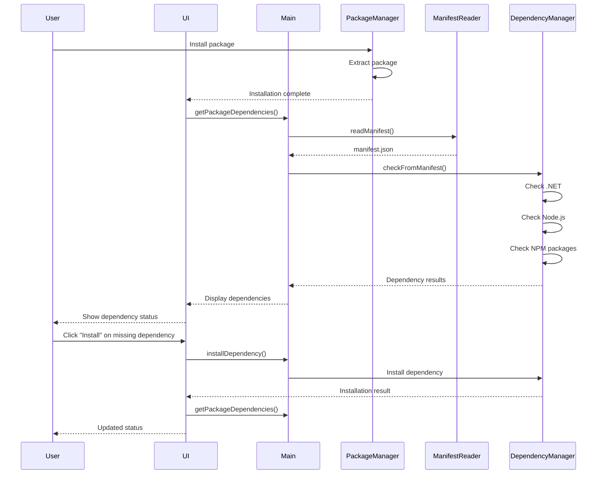
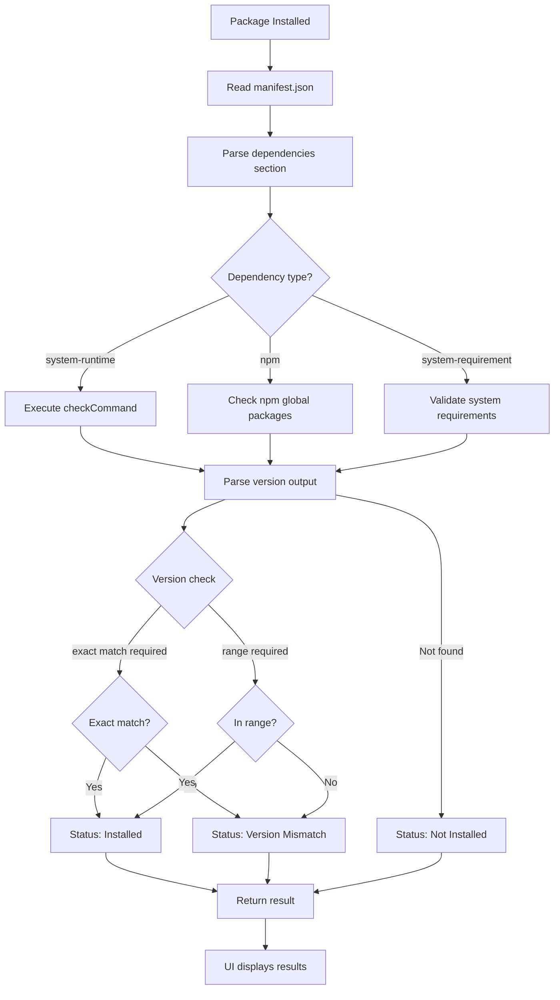
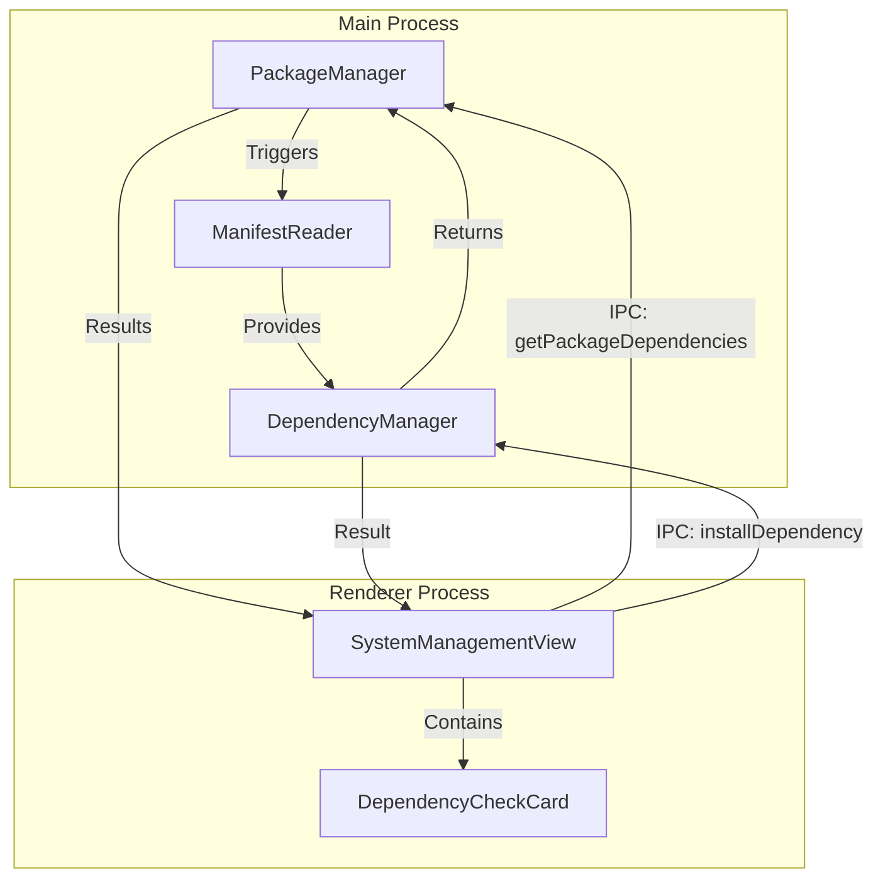

# Change: 软件包依赖项检查与可视化展示

## Why

当前 Hagicode Desktop 应用在软件包安装后没有主动检查依赖项状态，而是在启动 Web 服务时才进行验证。这导致用户无法提前了解软件包的依赖关系和缺失的依赖项，影响用户体验。

通过在安装后读取 Manifest 文件并展示依赖项状态，用户可以：
1. 提前了解软件包所需的依赖项
2. 在启动服务前发现并解决依赖问题
3. 获得更好的依赖项管理体验

## What Changes

- **添加 Manifest 解析功能**：在主进程中读取和解析 `manifest.json` 文件，提取依赖项列表
- **实现基于 Manifest 的依赖项检查**：根据 Manifest 中定义的依赖项进行系统检测
- **创建依赖项展示 UI 组件**：在系统管理视图中添加依赖项列表展示
- **集成到包管理流程**：在软件包安装后自动触发依赖项检查
- **增强 IPC 通信**：添加获取依赖项状态的 IPC 通道

## UI Design Changes

### 新增依赖项卡片组件

在 `SystemManagementView` 中添加 `DependencyCheckCard` 组件，显示软件包依赖项状态。

```
+---------------------------------------------------------------+
|  Dependencies Check                                           |
|                                                               |
|  +---------------------------------------------------------+  |
|  |  .NET 10 Runtime                          [Installed]   |  |
|  |  Version: 10.0.0                           |            |  |
|  |  Description: .NET 10 runtime and SDK     v 10.0.0     |  |
|  +---------------------------------------------------------+  |
|                                                               |
|  +---------------------------------------------------------+  |
|  |  Node.js                                  [Installed]   |  |
|  |  Version: 24.12.0                          |            |  |
|  |  Required: 20.11.0+                       v 24.12.0     |  |
|  +---------------------------------------------------------+  |
|                                                               |
|  +---------------------------------------------------------+  |
|  |  Claude Code                              [Not Found]   |  |
|  |  Required: 0.1.0-alpha.9                  | [Install]   |  |
|  |  Install: npm install @anthropic-ai/...   | [Download]  |  |
|  +---------------------------------------------------------+  |
|                                                               |
|  +---------------------------------------------------------+  |
|  |  OpenSpec                                  [Installed]   |  |
|  |  Version: 0.23.0                           |            |  |
|  |  Required: exactly 0.23.0                 v 0.23.0      |  |
|  +---------------------------------------------------------+  |
|                                                               |
|  [Refresh Dependencies]                                       |
+---------------------------------------------------------------+
```

### 用户交互流程



## Code Flow Changes

### 依赖项检查流程



### 架构组件关系



## Impact

### Affected specs
- `dependency-management` - 扩展现有规范，添加基于 Manifest 的依赖项检查

### Affected code
- **Main Process**:
  - `src/main/package-manager.ts` - 添加安装后检查触发
  - `src/main/manifest-reader.ts` - **新建** - Manifest 文件解析模块
  - `src/main/dependency-manager.ts` - 扩展支持基于 Manifest 的检查

- **Renderer Process**:
  - `src/renderer/components/SystemManagementView.tsx` - 集成依赖项展示
  - `src/renderer/components/DependencyCheckCard.tsx` - **新建** - 依赖项展示组件

- **IPC/Preload**:
  - `src/preload/index.ts` - 添加依赖项相关的 IPC 暴露

### Breaking changes
无破坏性变更。新功能为增量添加。

### Migration requirements
无需数据迁移。现有软件包安装不受影响。
