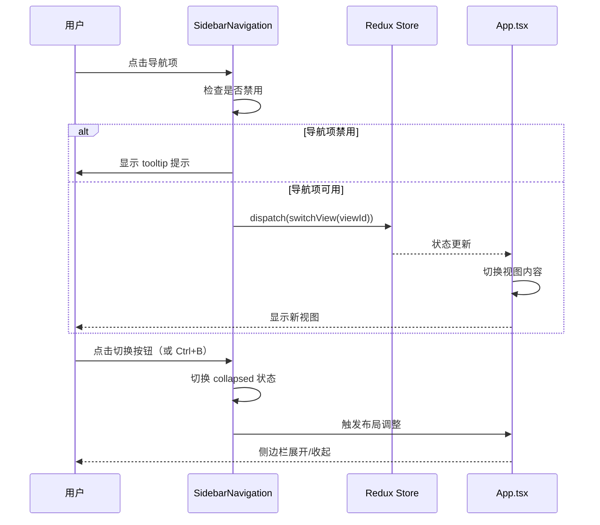
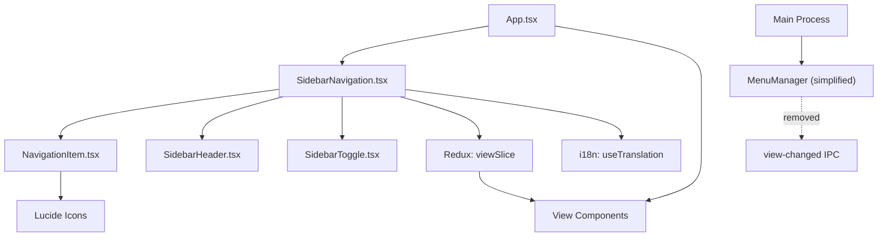
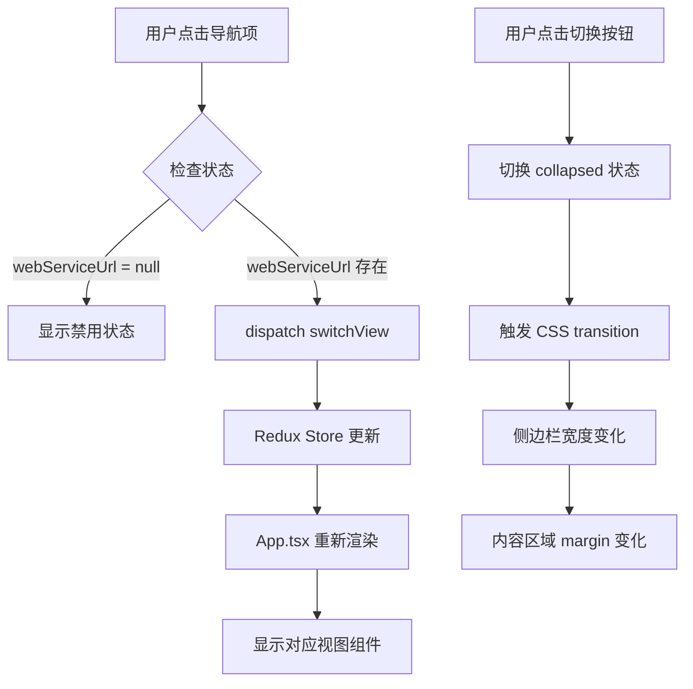

# Design: 侧边栏导航组件设计文档

**Change ID:** `sidebar-navigation-layout-refactor`
**Created:** 2026-02-05

---

## 概述 (Overview)

本文档详细描述侧边栏导航组件的技术设计，包括 UI/UX 设计、组件架构、数据流和实现细节。

---

## UI/UX Design

### 界面设计

#### 展开状态侧边栏

```
┌────────────────────────────┐
│                            │
│  ┌──────────────────┐      │
│  │                  │      │
│  │  [H] Hagicode      │      │  Logo 区域
│  │      Desktop     │      │
│  │                  │      │
│  └──────────────────┘      │
│                            │
│  ┌──────────────────┐      │
│  │ ⚙ 仪表盘         │      │  导航项（激活）
│  │   ▌              │      │  左侧蓝色指示条
│  └──────────────────┘      │
│                            │
│  ┌──────────────────┐      │
│  │ 🌐 Web 服务      │      │  导航项
│  └──────────────────┘      │
│                            │
│  ┌──────────────────┐      │
│  │ 📦 依赖管理      │      │  导航项
│  └──────────────────┘      │
│                            │
│  ┌──────────────────┐      │
│  │ 📋 版本管理      │      │  导航项
│  └──────────────────┘      │
│                            │
│  ═══════════════════       │  分隔线
│                            │
│  ◀ 收起                    │  切换按钮
│                            │
└────────────────────────────┘
  width: 16rem (256px)
```

#### 折叠状态侧边栏

```
┌──────┐
│      │
│ ┌──┐ │  Logo 区域（仅图标）
│ │H │ │
│ └──┘ │
│      │
│ ┌──┐ │  导航项（激活）
│ │⚙ │ │  左侧蓝色指示条
│ │▌ │ │
│ └──┘ │
│      │
│ ┌──┐ │  导航项
│ │🌐 │ │
│ └──┘ │
│      │
│ ┌──┐ │  导航项
│ │📦 │ │
│ └──┘ │
│      │
│ ┌──┐ │  导航项
│ │📋 │ │
│ └──┘ │
│      │
│ ════ │  分隔线
│      │
│ ◀    │  切换按钮（旋转 180°）
│      │
└──────┘
  width: 4rem (64px)
```

#### 导航项状态设计

**正常状态**：
```
┌──────────────────┐
│ ⚙ 仪表盘         │
└──────────────────┘
- 背景: transparent
- 文字: text-gray-300
- 图标: text-gray-400
- 悬停: bg-gray-700/50
```

**激活状态**：
```
┌──────────────────┐
│ ⚙ 仪表盘         │
│ ▌                │  ← 2px 蓝色指示条
└──────────────────┘
- 背景: bg-blue-600
- 文字: text-white
- 图标: text-white
- 左侧: border-l-4 border-blue-400
```

**禁用状态**（Web 服务未运行）：
```
┌──────────────────┐
│ 🌐 Web 服务      │
└──────────────────┘
- 背景: transparent
- 文字: text-gray-500
- 图标: text-gray-600
- 悬停: 无效果
- 光标: cursor-not-allowed
```

### 交互流程



---

## 技术设计

### 组件架构



### 数据流



### Redux 状态管理

#### viewSlice（现有，无变更）

```typescript
// src/renderer/store/slices/viewSlice.ts
export interface ViewState {
  currentView: ViewType;
  isViewSwitching: boolean;
  webServiceUrl: string | null;
  previousView: ViewType | null;
}

export const switchView = (view: ViewType) => ({
  type: 'view/switchView',
  payload: view,
});
```

#### 可选: sidebarSlice（新增）

```typescript
// src/renderer/store/slices/sidebarSlice.ts (可选)
export interface SidebarState {
  collapsed: boolean;
  width: number; // 展开时 256, 折叠时 64
}

export const toggleSidebar = () => ({
  type: 'sidebar/toggle',
});
```

**实现选择**：
- **方案 A**（推荐）：使用组件级 `useState` 管理折叠状态
- **方案 B**：创建 Redux `sidebarSlice`（如需要在多个组件间共享状态）

---

## 组件设计

### SidebarNavigation 主组件

```typescript
// src/renderer/components/SidebarNavigation.tsx

import { useState, useEffect } from 'react';
import { useSelector, useDispatch } from 'react-redux';
import { useTranslation } from 'react-i18next';
import { switchView } from '../store/slices/viewSlice';
import type { RootState } from '../store';
import type { ViewType } from '../store/slices/viewSlice';

// Lucide 图标
import { Settings, Globe, Package, FileText, ChevronLeft, ChevronRight } from 'lucide-react';

interface NavigationItem {
  id: ViewType;
  labelKey: string;
  icon: React.ComponentType<{ className?: string }>;
}

const navigationItems: NavigationItem[] = [
  { id: 'system', labelKey: 'sidebar.dashboard', icon: Settings },
  { id: 'web', labelKey: 'sidebar.webService', icon: Globe },
  { id: 'dependency', labelKey: 'sidebar.dependencyManagement', icon: Package },
  { id: 'version', labelKey: 'sidebar.versionManagement', icon: FileText },
];

export default function SidebarNavigation() {
  const { t } = useTranslation('common');
  const dispatch = useDispatch();
  const currentView = useSelector((state: RootState) => state.view.currentView);
  const webServiceUrl = useSelector((state: RootState) => state.view.webServiceUrl);

  // 侧边栏折叠状态
  const [collapsed, setCollapsed] = useState(false);

  // 键盘快捷键监听
  useEffect(() => {
    const handleKeyPress = (e: KeyboardEvent) => {
      if ((e.ctrlKey || e.metaKey) && e.key === 'b') {
        e.preventDefault();
        setCollapsed(prev => !prev);
      }
    };

    window.addEventListener('keydown', handleKeyPress);
    return () => window.removeEventListener('keydown', handleKeyPress);
  }, []);

  const handleNavClick = (viewId: ViewType) => {
    const isDisabled = viewId === 'web' && !webServiceUrl;
    if (!isDisabled) {
      dispatch(switchView(viewId));
    }
  };

  const isNavDisabled = (viewId: ViewType) => {
    return viewId === 'web' && !webServiceUrl;
  };

  const isNavActive = (viewId: ViewType) => {
    return currentView === viewId;
  };

  return (
    <aside
      className={`
        fixed left-0 top-0 h-screen bg-gradient-to-b from-gray-900 to-gray-800
        border-r border-gray-700 transition-all duration-300 ease-in-out z-40
        ${collapsed ? 'w-16' : 'w-64'}
      `}
    >
      {/* Logo 区域 */}
      <div className="flex items-center justify-center h-16 border-b border-gray-700">
        {!collapsed ? (
          <div className="flex items-center gap-3">
            <div className="w-10 h-10 bg-gradient-to-br from-blue-500 to-purple-600 rounded-xl flex items-center justify-center shadow-lg">
              <span className="text-xl font-bold text-white">H</span>
            </div>
            <div>
              <h1 className="text-lg font-bold text-white">Hagico</h1>
              <p className="text-xs text-gray-400">Desktop</p>
            </div>
          </div>
        ) : (
          <div className="w-10 h-10 bg-gradient-to-br from-blue-500 to-purple-600 rounded-xl flex items-center justify-center shadow-lg">
            <span className="text-xl font-bold text-white">H</span>
          </div>
        )}
      </div>

      {/* 导航项列表 */}
      <nav className="flex-1 py-4 space-y-1 px-2">
        {navigationItems.map((item) => {
          const Icon = item.icon;
          const isActive = isNavActive(item.id);
          const isDisabled = isNavDisabled(item.id);

          return (
            <button
              key={item.id}
              onClick={() => handleNavClick(item.id)}
              disabled={isDisabled}
              title={isDisabled ? t('navigation.webServiceNotRunning') : undefined}
              className={`
                w-full flex items-center gap-3 px-3 py-2.5 rounded-lg
                transition-all duration-200 group relative
                ${isActive
                  ? 'bg-blue-600 text-white shadow-lg shadow-blue-500/30'
                  : isDisabled
                    ? 'text-gray-500 cursor-not-allowed'
                    : 'text-gray-300 hover:bg-gray-700/50 hover:text-white'
                }
              `}
            >
              {/* 左侧激活指示条 */}
              {isActive && (
                <div className="absolute left-0 top-1/2 -translate-y-1/2 w-1 h-6 bg-blue-400 rounded-r-full" />
              )}

              <Icon className={`w-5 h-5 flex-shrink-0 ${isActive ? 'text-white' : isDisabled ? 'text-gray-600' : 'text-gray-400 group-hover:text-gray-300'}`} />

              {!collapsed && (
                <span className="font-medium text-sm whitespace-nowrap">
                  {t(item.labelKey)}
                </span>
              )}
            </button>
          );
        })}
      </nav>

      {/* 底部切换按钮 */}
      <div className="absolute bottom-0 left-0 right-0 p-3 border-t border-gray-700">
        <button
          onClick={() => setCollapsed(!collapsed)}
          className={`
            w-full flex items-center justify-center gap-2 px-3 py-2
            rounded-lg text-gray-400 hover:text-white hover:bg-gray-700/50
            transition-all duration-200
          `}
          title={collapsed ? t('sidebar.expand') : t('sidebar.collapse')}
        >
          {collapsed ? (
            <ChevronRight className="w-5 h-5" />
          ) : (
            <>
              <ChevronLeft className="w-5 h-5" />
              <span className="text-sm font-medium">{t('sidebar.collapse')}</span>
            </>
          )}
        </button>
      </div>
    </aside>
  );
}
```

### App.tsx 布局调整

```typescript
// src/renderer/App.tsx

function App() {
  const { t } = useTranslation('common');
  const dispatch = useDispatch();
  const currentView = useSelector((state: RootState) => state.view.currentView);
  const webServiceUrl = useSelector((state: RootState) => state.view.webServiceUrl);

  // 移除 onViewChange 监听器（如不再需要）

  return (
    <div className="min-h-screen bg-gradient-to-br from-gray-900 via-gray-800 to-gray-900 text-white">
      {/* 侧边栏导航 */}
      <SidebarNavigation />

      {/* 主内容区域 */}
      <div className="ml-64 transition-all duration-300 ease-in-out">
        <div className="container mx-auto px-4 py-8">
          {currentView === 'system' && <SystemManagementView />}
          {currentView === 'web' && <WebView src={webServiceUrl || 'http://localhost:36556'} />}
          {currentView === 'dependency' && <DependencyManagementPage />}
          {currentView === 'version' && <VersionManagementPage />}
        </div>
      </div>
    </div>
  );
}
```

**优化**：如果需要动态响应侧边栏折叠状态：

```typescript
// 方案 A: 通过 Redux 状态同步
const sidebarCollapsed = useSelector((state: RootState) => state.sidebar.collapsed);
const contentMargin = sidebarCollapsed ? 'ml-16' : 'ml-64';

// 方案 B: 使用 Context 共享状态
const { collapsed } = useSidebarContext();
const contentMargin = collapsed ? 'ml-16' : 'ml-64';
```

---

## 详细代码变更

### 文件变更清单

| 文件路径 | 变更类型 | 变更原因 | 影响范围 |
|---------|---------|---------|---------|
| `src/renderer/components/SidebarNavigation.tsx` | 新增 | 实现侧边栏导航组件 | 导航 UI |
| `src/renderer/App.tsx` | 修改 | 集成侧边栏，移除 TopNavigation | 主布局 |
| `src/renderer/components/TopNavigation.tsx` | 删除 | 被侧边栏替代 | - |
| `src/main/main.ts` | 修改 | 添加 `autoHideMenuBar: true` | 窗口配置 |
| `src/main/menu-manager.ts` | 修改 | 移除视图切换相关代码 | 主进程 |
| `src/renderer/i18n/locales/zh-CN/common.json` | 修改 | 添加侧边栏翻译，移除菜单翻译 | 国际化 |
| `src/renderer/i18n/locales/en-US/common.json` | 修改 | 添加侧边栏翻译，移除菜单翻译 | 国际化 |

### 详细变更 - App.tsx

| 组件/方法 | 变更前 | 变更后 | 变更原因 |
|----------|-------|-------|---------|
| 导入语句 | `import TopNavigation from './components/TopNavigation';` | `import SidebarNavigation from './components/SidebarNavigation';` | 替换导航组件 |
| 布局结构 | `<div className="min-h-screen...">\n  <TopNavigation />\n  <div className="container...">` | `<div className="min-h-screen...">\n  <SidebarNavigation />\n  <div className="ml-64">` | 适配侧边栏布局 |
| useEffect | 监听 `onViewChange` 事件 | 移除监听器 | 不再需要菜单栏触发 |

### 详细变更 - main.ts

| 配置项 | 变更前 | 变更后 | 变更原因 |
|-------|-------|-------|---------|
| autoHideMenuBar | 未设置（默认 false） | `autoHideMenuBar: true` | 隐藏原生菜单栏 |

### 详细变更 - menu-manager.ts

| 方法/属性 | 变更类型 | 具体变更 | 变更原因 |
|----------|---------|---------|---------|
| getMenuTemplate | 修改 | 移除 `viewMenu` 中的视图切换菜单项 | 侧边栏负责视图切换 |
| switchView | 删除 | 删除整个方法 | 不再需要通过菜单切换视图 |
| MenuTranslations | 修改 | 移除视图相关翻译字段 | 清理未使用代码 |

### 详细变更 - i18n 翻译文件

#### zh-CN/common.json 新增

```json
{
  "sidebar": {
    "dashboard": "仪表盘",
    "webService": "Web 服务",
    "dependencyManagement": "依赖项管理",
    "versionManagement": "版本管理",
    "toggle": "切换侧边栏",
    "collapse": "收起",
    "expand": "展开"
  }
}
```

#### zh-CN/common.json 删除

```json
{
  "menu": {  // 删除整个 menu 对象
    "systemManagement": "系统管理",
    // ... 其他菜单相关字段
  }
}
```

---

## 样式规范

### 侧边栏样式规范

| 元素 | 展开状态 | 折叠状态 |
|------|---------|---------|
| 宽度 | `w-64` (256px) | `w-16` (64px) |
| 过渡 | `transition-all duration-300 ease-in-out` | 同左 |
| 背景 | `bg-gradient-to-b from-gray-900 to-gray-800` | 同左 |
| 边框 | `border-r border-gray-700` | 同左 |

### 导航项样式规范

| 状态 | 背景 | 文字颜色 | 图标颜色 | 特殊样式 |
|------|------|---------|---------|---------|
| 正常 | `transparent` | `text-gray-300` | `text-gray-400` | - |
| 悬停 | `bg-gray-700/50` | `hover:text-white` | `group-hover:text-gray-300` | - |
| 激活 | `bg-blue-600` | `text-white` | `text-white` | 左侧蓝色指示条 |
| 禁用 | `transparent` | `text-gray-500` | `text-gray-600` | `cursor-not-allowed` |

### Logo 区域样式规范

| 元素 | 展开状态 | 折叠状态 |
|------|---------|---------|
| 布局 | 水平布局（图标 + 文字） | 垂直居中（仅图标） |
| 高度 | `h-16` | `h-16` |
| 底部边框 | `border-b border-gray-700` | 同左 |
| 图标尺寸 | `w-10 h-10` | `w-10 h-10` |

---

## 测试策略

### 单元测试

- [ ] 测试导航项点击触发正确的 `switchView` action
- [ ] 测试禁用状态下导航项不触发切换
- [ ] 测试折叠状态切换逻辑
- [ ] 测试键盘快捷键监听器

### 集成测试

- [ ] 测试侧边栏与 Redux store 的集成
- [ ] 测试侧边栏与主内容区域的布局同步
- [ ] 测试跨平台兼容性（Windows/macOS/Linux）

### UI 测试

- [ ] 测试展开/折叠动画流畅性
- [ ] 测试不同窗口尺寸下的布局表现
- [ ] 测试响应式设计（侧边栏 + 内容区域）

### 回归测试

- [ ] 测试所有现有功能正常工作
- [ ] 测试视图切换无破坏性变更
- [ ] 测试国际化支持完整

---

## 实现细节

### 关键代码片段

#### 1. Lucide 图标使用

```typescript
import { Settings, Globe, Package, FileText } from 'lucide-react';

// 使用示例
<Settings className="w-5 h-5" />
```

#### 2. 禁用状态检查

```typescript
const isNavDisabled = (viewId: ViewType) => {
  return viewId === 'web' && !webServiceUrl;
};
```

#### 3. 键盘快捷键监听

```typescript
useEffect(() => {
  const handleKeyPress = (e: KeyboardEvent) => {
    if ((e.ctrlKey || e.metaKey) && e.key === 'b') {
      e.preventDefault();
      setCollapsed(prev => !prev);
    }
  };

  window.addEventListener('keydown', handleKeyPress);
  return () => window.removeEventListener('keydown', handleKeyPress);
}, []);
```

#### 4. 激活状态样式

```typescript
className={`
  ${isActive
    ? 'bg-blue-600 text-white shadow-lg shadow-blue-500/30'
    : 'text-gray-300 hover:bg-gray-700/50'
  }
`}
```

### 配置变更

#### shadcn/ui 组件依赖

如果项目中未安装以下组件，需要添加：

```bash
# Collapsible 组件（可选，用于折叠/展开功能）
npx shadcn@latest add collapsible

# Tooltip 组件（可选，用于禁用状态提示）
npx shadcn@latest add tooltip
```

#### Lucide React 依赖

```bash
npm install lucide-react
```

---

## 常见问题 (FAQ)

### Q1: 为什么选择组件级状态而非 Redux 管理侧边栏折叠状态？

**A**: 侧边栏折叠状态仅在 `SidebarNavigation` 组件内部使用，无需跨组件共享。使用 `useState` 更简单直接。如果未来需要在其他组件中访问折叠状态（如在 `App.tsx` 中动态调整内容区域），再考虑迁移到 Redux。

### Q2: 如何确保侧边栏和内容区域的布局同步？

**A**: 有两种方案：
1. **推荐**：侧边栏使用 `fixed` 定位，内容区域使用固定的 `margin-left`（`ml-64`），无需状态同步
2. **高级**：使用 Context 或 Redux 共享折叠状态，动态调整内容区域 `margin-left`

### Q3: 为什么移除原生菜单栏而非保留？

**A**:
- 管理后台应用通常不需要原生菜单栏
- 当前应用所有功能都可通过侧边栏访问
- 保留必要的系统菜单（macOS 应用菜单、帮助菜单）在 MenuManager 中

### Q4: 如何处理 Web 视图的导航控制（后退、前进、刷新）？

**A**: 保留 Web 视图内部的导航控制（在 `WebView` 组件中），MenuManager 中也保留 Web 视图导航菜单。

---

## 变更历史

| 日期 | 变更说明 |
|------|----------|
| 2026-02-05 | 初始设计文档 |
