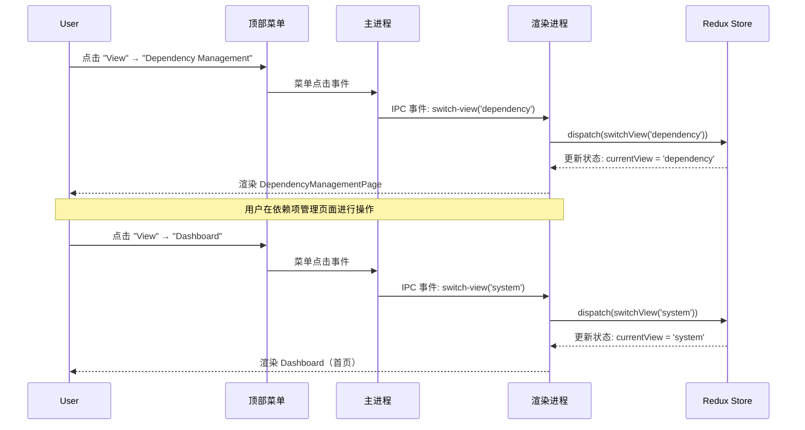
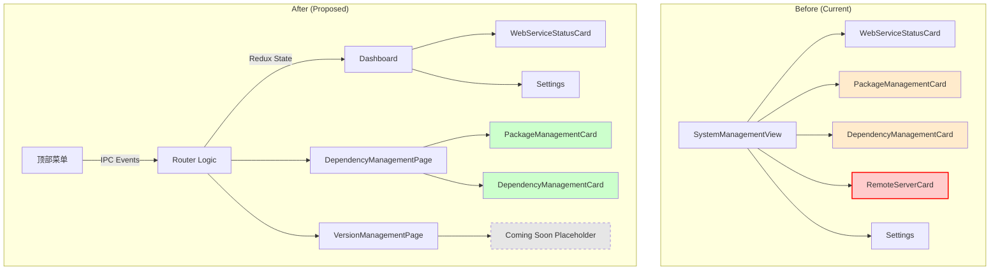
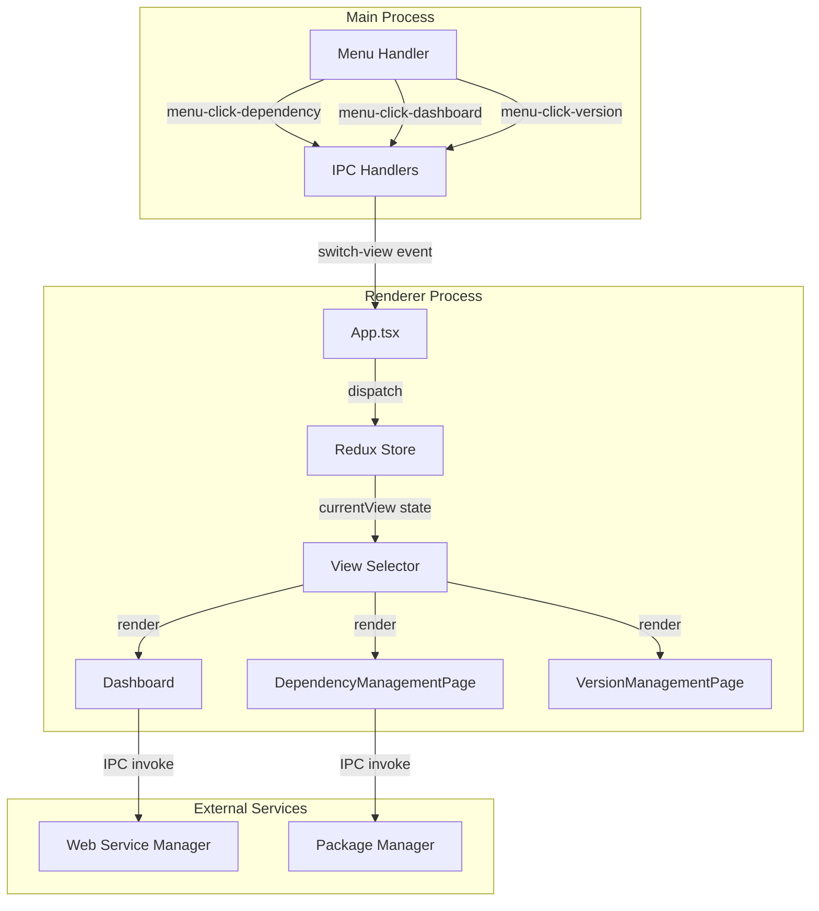
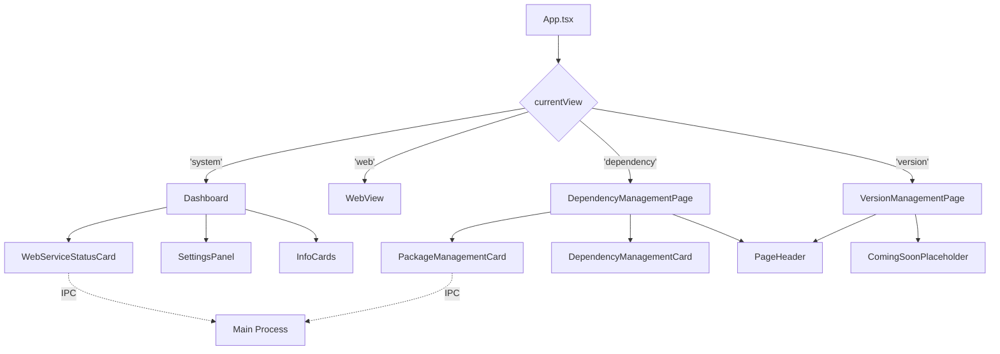

## Context

Hagicode Desktop 当前首页（SystemManagementView）承担了过多职责，包括：
1. 嵌入式 Web 服务状态显示和控制
2. 包管理（PackageManagementCard）
3. 依赖项管理（DependencyManagementCard）
4. Remote 服务器状态和控制
5. 设置面板

这种设计导致：
- **信息过载**：用户首次进入应用时看到过多信息
- **职责不清**：首页混合了展示和管理功能
- **导航冗余**：已有顶部菜单系统，首页无需重复提供管理入口
- **开发优先级**：Remote 功能暂不实现，但代码仍在首页占用空间

应用已经实现了完整的 Electron 顶部菜单导航系统（从之前的变更提案中），为页面路由提供了基础设施。

## Goals / Non-Goals

### Goals
- 简化首页，聚焦于 Web 服务核心状态和控制
- 将包管理和依赖项管理移至独立页面
- 完全移除 Remote 功能相关代码
- 建立清晰的页面路由架构
- 利用顶部菜单作为主要导航方式

### Non-Goals
- 重新设计整体 UI 视觉风格（保持现有设计）
- 实现版本管理页面的完整功能（仅预留架构）
- 实现用户配置持久化（如记住上次访问的页面）
- 修改 Web 服务核心逻辑

## Decisions

### Decision 1: 简化首页为纯展示页面

**选择**: 首页（Dashboard）仅保留：
- 应用 Logo 和版本信息
- WebServiceStatusCard（嵌入式 Web 服务状态和控制）
- 设置面板（语言、端口）
- 信息卡片（Quick Start、Secure）

**替代方案**:
1. **完全空白首页**：仅显示导航卡片 - 过于空洞，用户无法快速查看服务状态
2. **保留所有管理功能**：维持现状 - 无法解决信息过载问题

**理由**:
- 首页是用户入口，应聚焦于"服务是否运行"这一核心问题
- 启动/停止控制是高频操作，应放在首页
- 包管理和依赖检测是低频管理操作，适合独立页面

### Decision 2: 移除 Remote 功能

**选择**: 完全移除 Remote 服务器相关所有代码和 UI。

**替代方案**:
1. **保留代码但隐藏 UI** - 增加维护负担，违反 YAGNI 原则
2. **使用功能开关（Feature Flag）** - 增加复杂度，暂不需要

**理由**:
- Remote 功能未正式发布，无用户依赖
- 简化代码库，降低维护成本
- 未来可通过独立变更提案重新实现

### Decision 3: 创建"依赖项管理"聚合页面

**选择**: 创建 DependencyManagementPage，同时包含 PackageManagementCard 和 DependencyManagementCard。

**替代方案**:
1. **两个独立页面**（包管理页面、依赖检测页面）- 增加导航复杂度，两个功能紧密相关
2. **保留在首页** - 无法解决信息过载问题

**理由**:
- 包管理和依赖检测功能紧密相关（都涉及依赖安装）
- 聚合页面提供一站式管理体验
- 符合"功能内聚"设计原则

### Decision 4: 预留版本管理页面架构

**选择**: 创建 VersionManagementPage 组件框架，但不实现完整功能。

**替代方案**:
1. **不创建页面** - 未来需要时重新架构，增加工作量
2. **实现完整版本管理功能** - 超出本变更范围

**理由**:
- 用户明确提到"版本更新和切换功能"需要移至独立页面
- 预留架构降低未来实现成本
- 空页面提供"即将推出"提示，管理用户期望

### Decision 5: 基于顶部菜单的路由系统

**选择**: 扩展现有 viewSlice，使用 Redux 管理路由状态，通过 IPC 事件响应菜单点击。

**技术实现**:
```typescript
// viewSlice.ts
export enum ViewType {
  SYSTEM = 'system',        // 首页
  WEB = 'web',             // Web 视图
  DEPENDENCY = 'dependency', // 依赖项管理
  VERSION = 'version'       // 版本管理（预留）
}
```

**替代方案**:
1. **使用 React Router** - 引入新依赖，Electron 应用不需要浏览器路由
2. **使用 URL Hash 路由** - 不符合 Electron 应用习惯

**理由**:
- 现有 viewSlice 已提供路由基础
- IPC 事件是 Electron 标准通信模式
- Redux 状态支持时间旅行调试和持久化

## UI/UX Design

### 简化后的首页布局

```
┌───────────────────────────────────────────────────────────────┐
│                                                               │
│                    [Hagicode Desktop Logo]                      │
│                                                               │
│                     Hagicode Desktop                            │
│                    version 0.1.0 - Running successfully       │
│                                                               │
└───────────────────────────────────────────────────────────────┘

┌───────────────────────────────────────────────────────────────┐
│  ┌────────────────────────────────────────────────────────┐  │
│  │  Embedded Web Service Status                           │  │
│  │                                                         │  │
│  │  Current Version: 0.1.0-alpha.8                        │  │
│  │  Status: ● Running                                     │  │
│  │  Port: 36556                                           │  │
│  │                                                         │  │
│  │  [Start Server] [Stop Server]                          │  │
│  └────────────────────────────────────────────────────────┘  │
└───────────────────────────────────────────────────────────────┘

┌───────────────────────────────────────────────────────────────┐
│  [Quick Start]                         [Secure]              │
│  Getting started with Hagicode Desktop   Your data is safe...  │
└───────────────────────────────────────────────────────────────┘

┌───────────────────────────────────────────────────────────────┐
│  Settings                                                    │
│  ┌────────────────────────────────────────────────────────┐  │
│  │ Language:           [中文 ▼]                          │  │
│  │ Embedded Web Port:   36556                             │  │
│  └────────────────────────────────────────────────────────┘  │
│                                         More settings coming...│
└───────────────────────────────────────────────────────────────┘
```

### 依赖项管理页面布局

```
┌───────────────────────────────────────────────────────────────┐
│  [← Back]  Dependency Management              [Language ▼]  │
├───────────────────────────────────────────────────────────────┤
│                                                               │
│  ┌────────────────────────────────────────────────────────┐  │
│  │  Package Management                                    │  │
│  │  Install and manage embedded web service packages     │  │
│  │                                                        │  │
│  │  Platform: [Linux]                                     │  │
│  │  Installation Status: [Installed]                      │  │
│  │  Installed Version: 0.1.0-alpha.8                     │  │
│  │                                                        │  │
│  │  Select Version: [0.1.0-alpha.8 ▼]                    │  │
│  │  [Download] [Refresh]                                  │  │
│  └────────────────────────────────────────────────────────┘  │
│                                                               │
│  ┌────────────────────────────────────────────────────────┐  │
│  │  System Dependencies                                   │  │
│  │  Check and install runtime dependencies               │  │
│  │                                                        │  │
│  │  [.NET Runtime 8.0]        [Installed v8.0.11]         │  │
│  │  [Node.js 20.x]             [Not Installed]            │  │
│  │                                      [Install via brew]│  │
│  └────────────────────────────────────────────────────────┘  │
│                                                               │
└───────────────────────────────────────────────────────────────┘
```

### 用户交互流程（菜单导航）



### 页面切换状态机

```mermaid
stateDiagram-v2
    [*] --> Dashboard

    Dashboard --> DependencyMgmt: 菜单选择<br/>"Dependency Management"
    Dashboard --> VersionMgmt: 菜单选择<br/>"Version Management"
    Dashboard -> WebServiceView: 菜单选择<br/>"Open Web Service"

    DependencyMgmt --> Dashboard: 菜单选择<br/>"Dashboard"
    DependencyMgmt --> VersionMgmt: 菜单选择<br/>"Version Management"

    VersionMgmt --> Dashboard: 菜单选择<br/>"Dashboard"
    VersionMgmt --> DependencyMgmt: 菜单选择<br/>"Dependency Management"

    WebServiceView --> Dashboard: 菜单选择<br/>"Dashboard"

    note right of Dashboard
        首页（简化后）
        - Web 服务状态
        - 启动/停止控制
        - 设置面板
        - 信息卡片
    end note

    note right of DependencyMgmt
        依赖项管理页面
        - 包管理卡片
        - 系统依赖检测卡片
    end note

    note right of VersionMgmt
        版本管理页面（预留）
        - 占位内容
        - "即将推出"提示
    end note
```

### 错误状态和加载状态 UI

#### 加载状态
```
┌───────────────────────────────────────────────────────────────┐
│  Dependency Management                                        │
├───────────────────────────────────────────────────────────────┤
│                                                               │
│  [Spinner] Loading package information...                    │
│                                                               │
└───────────────────────────────────────────────────────────────┘
```

#### 错误状态
```
┌───────────────────────────────────────────────────────────────┐
│  Dependency Management                                        │
├───────────────────────────────────────────────────────────────┤
│                                                               │
│  [⚠️] Failed to load package information                     │
│                                                               │
│  [Retry] [Go Back]                                            │
│                                                               │
└───────────────────────────────────────────────────────────────┘
```

## Technical Design

### 架构变更概览



### 数据流设计



### 组件层次结构



### Redux 状态管理

#### viewSlice 状态扩展

```typescript
// src/renderer/store/slices/viewSlice.ts

export enum ViewType {
  SYSTEM = 'system',        // 首页仪表盘
  WEB = 'web',             // Web 视图
  DEPENDENCY = 'dependency', // 依赖项管理页面
  VERSION = 'version'       // 版本管理页面（预留）
}

interface ViewState {
  currentView: ViewType;
  webServiceUrl: string | null;
  // 移除 remoteServerConfig 和 remoteServerStatus
}
```

#### webServiceSlice 清理

```typescript
// src/renderer/store/slices/webServiceSlice.ts

interface WebServiceState {
  version: string;
  status: 'running' | 'stopped' | 'error';
  packageInfo: PackageInfo | null;
  installProgress: InstallProgress | null;
  isInstalling: boolean;
  availableVersions: string[];
  platform: string;
  // 移除 remoteServer 相关状态（如有）
}
```

### IPC 通信设计

#### 移除的 IPC 通道

```typescript
// 从 preload/index.ts 和 main/main.ts 中移除
- onRemoteServerStatusChange
- connectRemoteServer
- disconnectRemoteServer
- getRemoteServerStatus
```

#### 保留的 IPC 通道

```typescript
// Web Service 控制
- startServer()
- stopServer()
- getServerStatus()
- onServerStatusChange

// 包管理
- checkPackageInstallation()
- installWebServicePackage(version)
- onPackageInstallProgress
- fetchAvailableVersions()

// 依赖检测
- checkSystemDependencies()
- installDependency(dependencyName, method)

// 应用控制
- switchView(view: ViewType)
- onViewChange(callback)
```

### 组件实现要点

#### Dashboard 组件

```typescript
// src/renderer/components/Dashboard.tsx

export default function Dashboard() {
  const { t } = useTranslation('common');
  const [version, setVersion] = useState<string>('');
  const [serverStatus, setServerStatus] = useState<ServerStatus>('stopped');

  // 移除 PackageManagementCard 和 DependencyManagementCard 引用
  // 保留 WebServiceStatusCard 和 Settings

  return (
    <div className="container mx-auto px-4 py-8 max-w-4xl">
      <Header version={version} />
      <WebServiceStatusCard />
      <InfoCards />
      <SettingsPanel />
    </div>
  );
}
```

#### DependencyManagementPage 组件

```typescript
// src/renderer/components/DependencyManagementPage.tsx

export default function DependencyManagementPage() {
  const { t } = useTranslation('pages');
  const navigateBack = () => {
    // 触发路由切换回首页
    window.electronAPI.switchView('system');
  };

  return (
    <div className="container mx-auto px-4 py-8 max-w-4xl">
      <PageHeader
        title={t('dependencyManagement.title')}
        onBack={navigateBack}
      />
      <PackageManagementCard />
      <DependencyManagementCard />
    </div>
  );
}
```

### 菜单配置更新

```typescript
// src/main/menu.ts

export function buildMenu(): MenuItemConstructorOptions[] {
  return [
    {
      label: 'View',
      submenu: [
        {
          label: 'Dashboard',
          accelerator: 'CmdOrCtrl+D',
          click: () => switchView('system'),
        },
        {
          label: 'Dependency Management',
          accelerator: 'CmdOrCtrl+Shift+D',
          click: () => switchView('dependency'),
        },
        {
          label: 'Version Management',
          accelerator: 'CmdOrCtrl+Shift+V',
          click: () => switchView('version'),
        },
        { type: 'separator' },
        {
          label: 'Open Web Service',
          accelerator: 'CmdOrCtrl+W',
          click: () => openWebService(),
        },
      ],
    },
    // ... 其他菜单项
  ];
}
```

### 国际化键设计

#### common.json（首页相关）

```json
{
  "header": {
    "runningSuccessfully": "Running successfully"
  },
  "quickStart": {
    "title": "Quick Start",
    "description": "Getting started with Hagicode Desktop"
  },
  "secure": {
    "title": "Secure",
    "description": "Your data is protected with enterprise-grade encryption"
  }
}
```

#### pages.json（新增）

```json
{
  "dependencyManagement": {
    "title": "Dependency Management",
    "backToDashboard": "Back to Dashboard"
  },
  "versionManagement": {
    "title": "Version Management",
    "backToDashboard": "Back to Dashboard",
    "comingSoon": "Version management feature is coming soon!"
  }
}
```

#### 移除的翻译键

```json
{
  "remoteServer": {
    // 删除整个 remoteServer 对象
  }
}
```

## Risks / Trade-offs

### Risk 1: 用户习惯变更

**风险**: 现有用户（如果有）习惯于在首页看到包管理功能。

**缓解措施**:
- 应用仍处于早期开发阶段，用户基数小
- 通过顶部菜单提供清晰的导航
- 首页保留核心服务控制功能，降低操作成本

### Risk 2: 导航层级增加

**风险**: 用户需要多一次点击才能访问包管理功能。

**缓解措施**:
- 包管理是低频操作，不适用于首页
- 提供快捷键支持（CmdOrCtrl+Shift+D）
- 未来可考虑首页添加"快速操作"入口

### Risk 3: 代码重构引入 Bug

**风险**: 大规模代码移除和重构可能引入意外问题。

**缓解措施**:
- 分阶段实施，每阶段进行测试
- 保留 Web 服务控制核心功能不变
- 完整的回归测试覆盖

### Trade-off 1: 简洁 vs 功能可见性

**权衡**: 首页更简洁，但包管理功能可见性降低。

**决策**: 优先选择简洁性，通过菜单导航提供功能访问。

### Trade-off 2: 架构预留 vs YAGNI

**权衡**: 版本管理页面预留架构 vs 可能永远不需要。

**决策**: 用户明确提到版本管理需求，预留架构成本低，值得投资。

## Migration Plan

### 实施步骤

1. **准备阶段**（Phase 1）
   - 分析 Remote 功能相关代码位置
   - 创建功能分支

2. **代码清理**（Phase 1-2）
   - 移除 Remote Server Card（SystemManagementView.tsx:118-176）
   - 移除 remoteServer 翻译键
   - 简化首页，移除 PackageManagementCard 和 DependencyManagementCard

3. **新页面创建**（Phase 3）
   - 创建 DependencyManagementPage.tsx
   - 创建 VersionManagementPage.tsx（占位）

4. **路由和菜单**（Phase 4）
   - 更新 viewSlice 添加新路由类型
   - 更新 App.tsx 添加路由渲染逻辑
   - 更新菜单配置

5. **清理和验证**（Phase 5-7）
   - 清理 Redux 状态和 IPC 通道
   - 更新国际化文件
   - 全面测试

6. **文档和收尾**（Phase 8）
   - 更新文档
   - 提交 Pull Request

### 回滚计划

如果实施后出现重大问题：
1. 回滚 Git 分支到变更前状态
2. 删除新创建的组件和路由
3. 恢复 SystemManagementView.tsx 到原始状态
4. 恢复国际化文件中的 remoteServer 翻译键（如果需要）

**注意**: Remote 功能移除是破坏性变更，回滚后需重新评估是否保留。

### 数据迁移

**无需数据迁移**:
- Remote 功能未发布，无用户数据
- 包管理功能仅移至新页面，不涉及数据迁移
- Redux 状态结构变更通过状态初始化处理

### 测试计划

#### 单元测试
- [ ] Dashboard 组件渲染和功能
- [ ] DependencyManagementPage 组件渲染和功能
- [ ] VersionManagementPage 组件渲染
- [ ] viewSlice 状态更新逻辑

#### 集成测试
- [ ] 菜单导航到所有页面
- [ ] Web 服务启动/停止功能
- [ ] 包管理功能在独立页面正常工作
- [ ] 依赖检测功能正常工作

#### 回归测试
- [ ] 应用启动和加载
- [ ] 语言切换
- [ ] 跨平台兼容性（Windows、macOS、Linux）

## Open Questions

1. **是否需要面包屑导航？**
   - 当前设计仅使用顶部菜单导航
   - 未来可考虑添加面包屑（如 "Home > Dependency Management"）

2. **是否需要持久化路由状态？**
   - 用户关闭应用后重新打开，是否恢复到上次访问的页面
   - 当前不实现，可作为未来增强

3. **版本管理页面优先级？**
   - 用户提到"版本更新和切换"，但未明确需求细节
   - 当前仅预留架构，实现优先级待定

4. **是否需要首页"快速操作"入口？**
   - 在首页添加"打开依赖项管理"的快捷按钮
   - 当前不添加，保持首页简洁

## Success Criteria

1. ✅ 首页仅显示 Web 服务状态、控制和设置
2. ✅ 包管理和依赖检测功能在独立页面正常工作
3. ✅ Remote 功能完全移除（UI、代码、IPC、翻译）
4. ✅ 顶部菜单可以导航到所有页面
5. ✅ 无 TypeScript 类型错误
6. ✅ 无控制台错误或警告
7. ✅ 所有平台（Windows、macOS、Linux）功能正常
