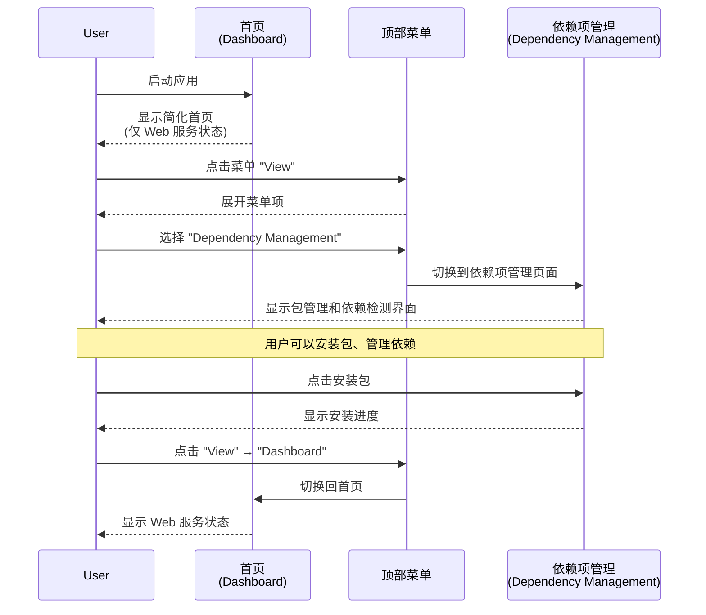
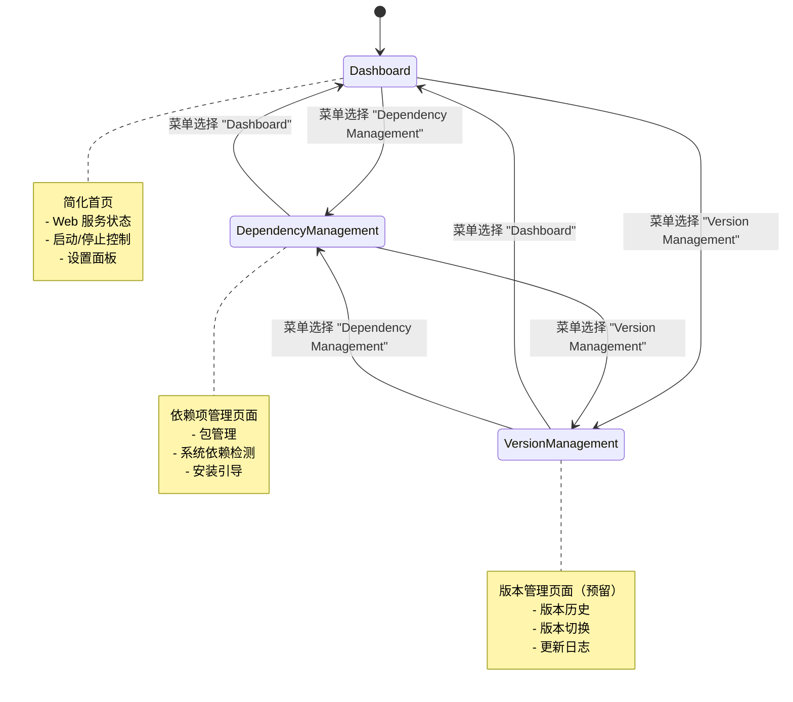
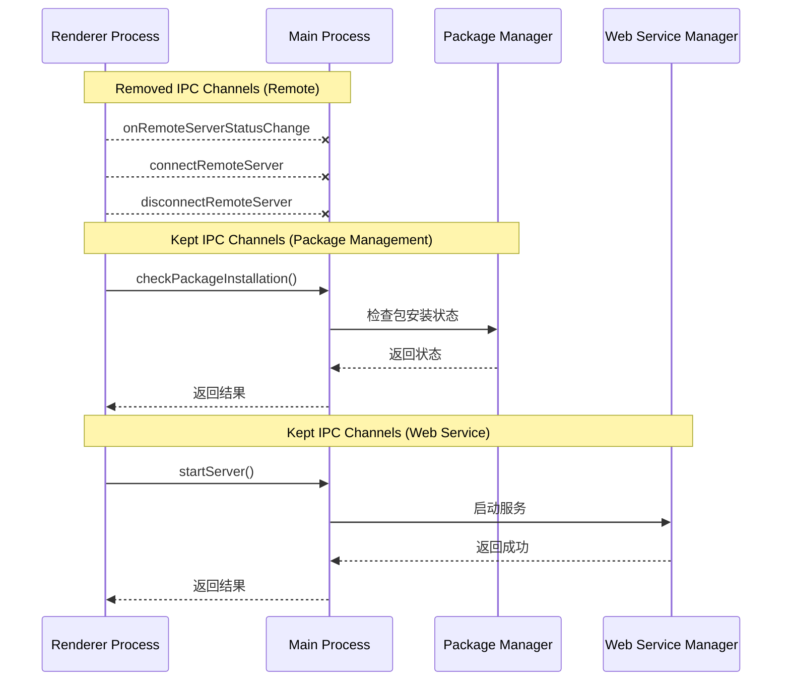

# Change: 简化首页功能，优化应用架构

## Why

当前首页（Dashboard/SystemManagementView）承载了过多功能模块，包括嵌入式 Web 服务状态、依赖项管理、包管理版本切换和 Remote 服务器功能。这导致信息过载、职责不清，与已有的顶部菜单导航系统冗余。Remote 功能在本版本中暂不实现，需要完全移除相关代码。

## What Changes

- **BREAKING**: 重构首页（SystemManagementView），仅保留嵌入式 Web 服务核心功能
- **BREAKING**: 移除 PackageManagementCard 组件从首页，迁移到独立的"依赖项管理"页面
- **BREAKING**: 移除 Remote 服务器相关所有功能和代码
- 创建独立的"依赖项管理"页面，包含包安装、更新、版本切换功能
- 创建独立的"版本管理"页面（预留架构）
- 利用现有 Electron 顶部菜单系统，添加"依赖项管理"和"版本管理"菜单项
- 清理未使用的组件、Redux 状态、IPC 通道和国际化翻译

## UI Design Changes

### 简化后的首页布局

```
┌─────────────────────────────────────────────────────────────┐
│                                                             │
│                    [Hagicode Desktop Logo]                    │
│                                                             │
│                     Hagicode Desktop                          │
│                    version 0.1.0 - Running successfully     │
│                                                             │
└─────────────────────────────────────────────────────────────┘
┌─────────────────────────────────────────────────────────────┐
│  ┌──────────────────────────────────────────────────────┐  │
│  │  [Embedded Web Service Status Card]                   │  │
│  │  Current Version: 0.1.0-alpha.8                       │  │
│  │  Status: [● Running]                                  │  │
│  │  Port: 36556                                          │  │
│  │  [Start Server] [Stop Server]                         │  │
│  └──────────────────────────────────────────────────────┘  │
└─────────────────────────────────────────────────────────────┘
┌─────────────────────────────────────────────────────────────┐
│  [Quick Start]              [Secure]                       │
│  Getting started with...   Your data is protected...       │
└─────────────────────────────────────────────────────────────┘
┌─────────────────────────────────────────────────────────────┐
│  Settings                                                  │
│  ┌─────────────────────────────────────────────────────┐   │
│  │ Language: [中文 ▼]                                  │   │
│  │ Embedded Web Service Port: 36556                    │   │
│  └─────────────────────────────────────────────────────┘   │
└─────────────────────────────────────────────────────────────┘
```

### 新增：依赖项管理页面

```
┌─────────────────────────────────────────────────────────────┐
│  [← Back]            依赖项管理                    [Language]│
├─────────────────────────────────────────────────────────────┤
│                                                             │
│  ┌──────────────────────────────────────────────────────┐  │
│  │  Package Management                                   │  │
│  │  Install and manage embedded web service packages    │  │
│  │                                                       │  │
│  │  Platform: [Linux]                                    │  │
│  │                                                       │  │
│  │  Installation Status: [Installed]                     │  │
│  │  Installed Version: 0.1.0-alpha.8                    │  │
│  │                                                       │  │
│  │  [Download Version ▼]                                 │  │
│  │  [Download] [Refresh]                                 │  │
│  └──────────────────────────────────────────────────────┘  │
│                                                             │
│  ┌──────────────────────────────────────────────────────┐  │
│  │  System Dependencies                                  │  │
│  │  Check and install runtime dependencies              │  │
│  │                                                       │  │
│  │  [.NET Runtime 8.0]      [Installed v8.0.11]          │  │
│  │  [Node.js 20.x]           [Not Installed]             │  │
│  │                                    [Install via brew] │  │
│  └──────────────────────────────────────────────────────┘  │
│                                                             │
└─────────────────────────────────────────────────────────────┘
```

### 顶部菜单导航结构（更新后）

```
File
├── Settings
└── Exit

View
├── Dashboard          (首页，仅 Web 服务状态)
├── Dependency Management  (NEW: 依赖项管理)
└── Version Management     (NEW: 版本管理，预留)

Tools
└── Open Web Service

Help
├── Documentation
├── Report Issue
└── About
```

### 用户交互流程（首页到依赖项管理）



### 页面切换状态机



## Code Flow Changes

### 当前架构 vs 简化后架构

```mermaid
graph TB
    subgraph "Current Architecture (Before)"
        A[SystemManagementView<br/>首页] --> B[WebServiceStatusCard]
        A --> C[PackageManagementCard]
        A --> D[DependencyManagementCard]
        A --> E[Remote Server Card]
        A --> F[Settings]

        C --> G[Redux: webServiceSlice]
        C --> H[IPC: Package Manager]
    end

    subgraph "Simplified Architecture (After)"
        A1[Dashboard<br/>简化首页] --> B1[WebServiceStatusCard]
        A1 --> F1[Settings]

        M[顶部菜单] --> D1[DependencyManagementPage]
        M --> V[VersionManagementPage (Reserved)]

        D1 --> C1[PackageManagementCard]
        D1 --> D2[DependencyManagementCard]
        C1 --> G1[Redux: webServiceSlice]
        C1 --> H1[IPC: Package Manager]
    end

    style E fill:#ffcccc,stroke:#ff0000,stroke-width:2px
    style E2 fill:#ffcccc,stroke:#ff0000,stroke-width:2px,stroke-dasharray: 5 5
```

### Redux 状态管理变更

```mermaid
graph LR
    subgraph "Redux Store (After)"
        WS[webServiceSlice]
        VS[viewSlice]
        L[languageSlice]
    end

    subgraph "Removed States"
        R1[remoteServerConfig]
        R2[remoteServerStatus]
    end

    WS -.-> PackageInfo
    VS -.-> ViewRoutes<br/>(system, web, dependency, version)
    R1 ~~Removed~~
    R2 ~~Removed~~
```

### IPC 通信变更



### 组件层次结构变更

```mermaid
graph TD
    subgraph "Before"
        A[SystemManagementView] --> B[WebServiceStatusCard]
        A --> C[PackageManagementCard]
        A --> D[DependencyManagementCard]
        A --> E[RemoteServerCard]
        A --> F[Settings]
    end

    subgraph "After"
        A1[Dashboard] --> B1[WebServiceStatusCard]
        A1 --> F1[Settings]

        D1[DependencyManagementPage] --> C1[PackageManagementCard]
        D1 --> D2[DependencyManagementCard]

        V1[VersionManagementPage] --> V2[VersionHistoryCard<br/>(Reserved)]
    end

    style E fill:#ffcccc
    style C fill:#ffebcc
    style D fill:#ffebcc

    style C1 fill:#ccffcc
    style D2 fill:#ccffcc
    style V1 fill:#e6e6e6
    style V2 fill:#e6e6e6,stroke-dasharray: 5 5
```

## Impact

### Affected specs
- `electron-app`: 修改首页定义，移除 Remote 功能，添加页面路由需求
- `dependency-management`: 迁移到独立页面，与首页解耦

### Affected code
- **Components**:
  - `src/renderer/components/SystemManagementView.tsx` (重构为 Dashboard)
  - `src/renderer/components/PackageManagementCard.tsx` (迁移到新页面)
  - `src/renderer/components/DependencyManagementCard.tsx` (迁移到新页面)
  - 删除 Remote 相关服务器状态卡片代码（从 SystemManagementView 中移除）

- **Redux**:
  - `src/renderer/store/slices/webServiceSlice.ts` (可能需要清理 Remote 状态)
  - `src/renderer/store/slices/viewSlice.ts` (添加新路由类型)

- **Main Process**:
  - `src/main/main.ts` (移除 Remote 相关 IPC 处理器)
  - `src/main/server.ts` (如果仅用于 Remote，考虑删除)

- **Menu**:
  - `src/main/menu.ts` (添加"依赖项管理"和"版本管理"菜单项)

- **i18n**:
  - `src/renderer/i18n/locales/*/common.json` (移除 remoteServer 相关翻译)
  - 添加新页面的翻译键

- **Routing**:
  - `src/renderer/App.tsx` (添加新路由处理)

### Migration Notes
- 用户首次更新后，Remote 功能完全移除，无数据迁移路径（功能未正式实现）
- 包管理功能从首页移至独立页面，用户需通过菜单访问
- 顶部菜单成为主要导航方式，降低首页复杂度
