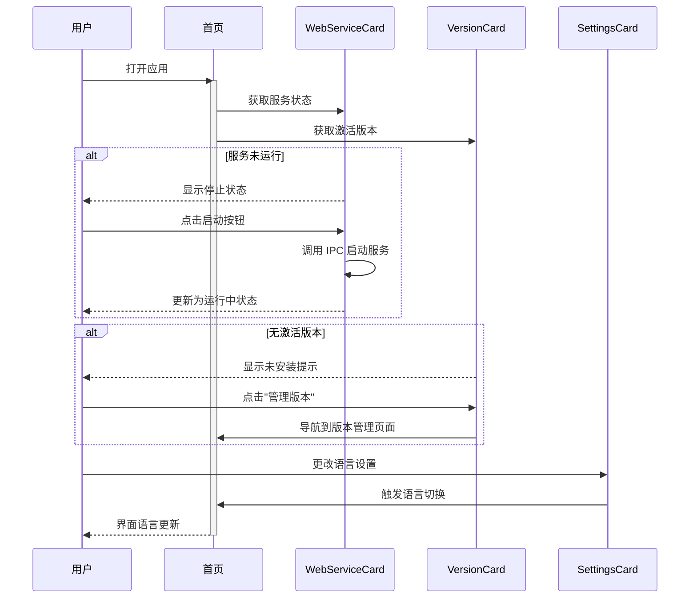
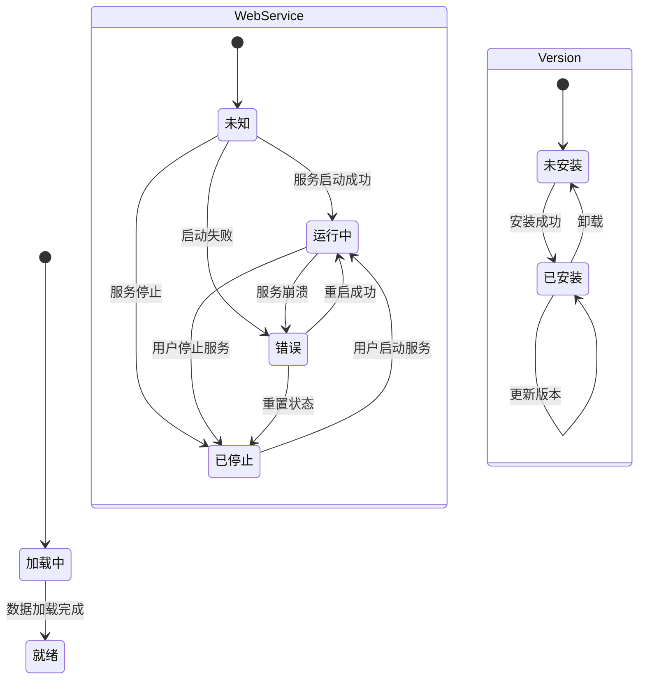
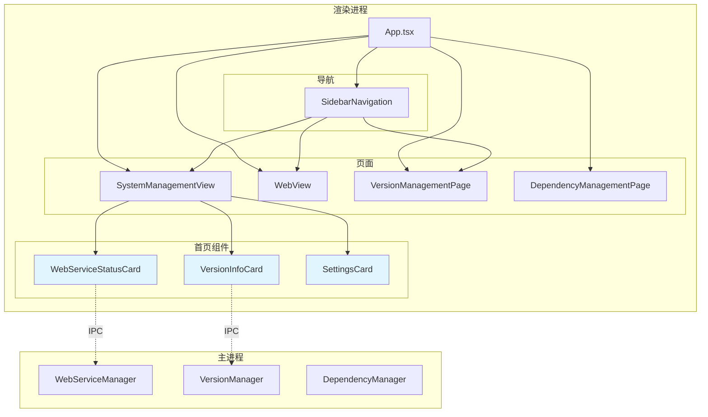
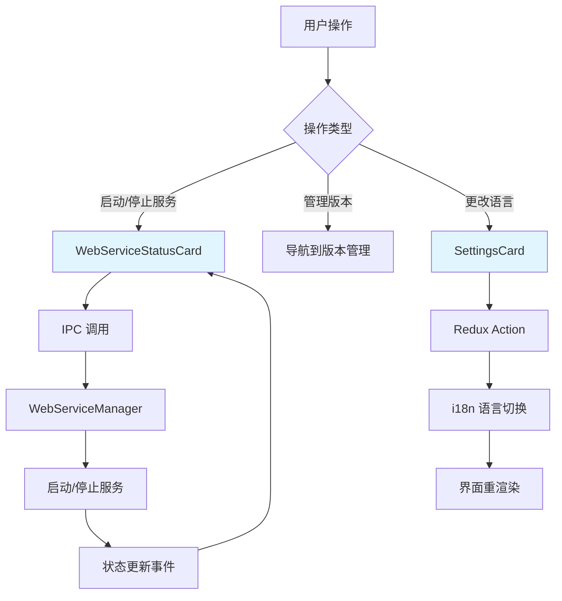
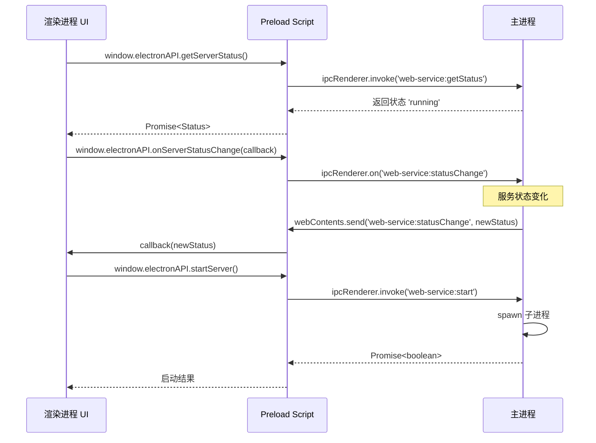

# Design: 首页重构聚焦Web管理功能

## 概述

本设计文档描述了如何重构 Hagicode Desktop 首页，聚焦于 Web 管理核心功能。重构的主要目标是简化首页内容，突出 Web 服务管理和版本管理这两个核心功能，移除非核心的信息展示卡片和依赖项检查功能（依赖项在版本安装后自动满足）。

## 设计目标 / 非目标

### 目标

- 简化首页布局，聚焦于 Web 管理核心功能
- 优化视觉层次，使核心功能更加突出
- 保持现有功能不变，仅调整展示方式
- 为后续功能重新设计预留空间

### 非目标

- 不修改主进程的任何功能和服务
- 不改变 Redux 状态管理架构
- 不改变 IPC 通信模式
- 不修改侧边栏导航结构

## 决策

### 决策 1: 移除信息卡片而非重新设计

**决策**：移除快速开始和安全提示信息卡片，而非重新设计它们的内容和位置。

**原因**：
- 这些卡片的内容更适合放在帮助文档或首次使用引导中
- 简化首页，让用户直接关注核心功能
- 为后续重新设计预留空间

**替代方案**：
- 将这些内容移到单独的"帮助"或"关于"页面
- 在首次启动时显示一次性引导界面

### 决策 2: 保持组件结构不变

**决策**：保持现有的组件结构和导入关系，仅修改 `SystemManagementView.tsx` 的内容。

**原因**：
- 最小化变更范围，降低风险
- 保持代码的可维护性
- 不影响其他功能模块

### 决策 3: 移除首页依赖项检查功能

**决策**：从首页移除依赖项检查卡片，因为依赖项在版本安装后自动满足。

**原因**：
- 版本安装成功后，依赖项已自动满足，无需额外检查
- 简化首页，减少用户认知负担
- 如果后续需要，可以在版本管理页面中提供依赖检查入口

## UI/UX 设计

### 界面设计

#### 当前首页布局

```
┌─────────────────────────────────────────────────────────────────┐
│ [侧边栏]                                                          │
│ ├─ 仪表盘 (当前)                                                  │
│ ├─ Web 服务                                                       │
│ └─ 版本管理                                                       │
├─────────────────────────────────────────────────────────────────┤
│                                                                  │
│                      [Hagicode Logo]                               │
│                   Version X.X.X - 运行成功                         │
│                                                                  │
│  ┌─────────────────────────────────────────────────────────┐    │
│  │  Web 服务状态卡片                                         │    │
│  │  [状态: 运行中]  [启动] [停止] [在浏览器中打开]              │    │
│  └─────────────────────────────────────────────────────────┘    │
│                                                                  │
│  ┌─────────────────────────────────────────────────────────┐    │
│  │  当前激活版本                                              │    │
│  │  版本: 0.1.0-alpha.8                                       │    │
│  │  平台: linux-x64                                          │    │
│  │  [管理版本]                                                │    │
│  └─────────────────────────────────────────────────────────┘    │
│                                                                  │
│  ┌─────────────────────────────────────────────────────────┐    │
│  │  依赖项检查卡片                                            │    │
│  │  [检查依赖]  [自动修复]                                    │    │
│  └─────────────────────────────────────────────────────────┘    │
│                                                                  │
│  ┌────────────┐  ┌────────────┐                                 │
│  │  快速开始   │  │   安全      │  <-- 移除                      │
│  │  安装...    │  │  数据...    │                              │
│  └────────────┘  └────────────┘                                 │
│                                                                  │
│  ┌─────────────────────────────────────────────────────────┐    │
│  │  设置                                                     │    │
│  │  语言选择 [中文 ▼]                                        │    │
│  │  嵌入式 Web 服务端口: 5000                                │    │
│  │  更多设置即将推出...                                       │    │
│  └─────────────────────────────────────────────────────────┘    │
│                                                                  │
│  © 2025 Hagicode Desktop. Built with ❤️                            │
│  测试应用程序 - 开发版本                                           │
│                                                                  │
└─────────────────────────────────────────────────────────────────┘
```

#### 重构后首页布局

```
┌─────────────────────────────────────────────────────────────────┐
│ [侧边栏]                                                          │
│ ├─ 仪表盘 (当前)                                                  │
│ ├─ Web 服务                                                       │
│ └─ 版本管理                                                       │
├─────────────────────────────────────────────────────────────────┤
│                                                                  │
│                      [Hagicode Logo]                               │
│              ●  Version X.X.X - 运行成功                          │
│                                                                  │
│  ┌─────────────────────────────────────────────────────────┐    │
│  │  🌐 Web 服务管理                           [更多 →]        │    │
│  ├─────────────────────────────────────────────────────────┤    │
│  │                                                          │    │
│  │  ● 运行中                                                 │    │
│  │  http://localhost:5000                                    │    │
│  │                                                          │    │
│  │  [停止服务]                     [在浏览器中打开 🌐]         │    │
│  │                                                          │    │
│  │  进程 ID: 12345  运行时间: 2h 15m                         │    │
│  └─────────────────────────────────────────────────────────┘    │
│                                                                  │
│  ┌─────────────────────────────────────────────────────────┐    │
│  │  📦 当前激活版本                                          │    │
│  ├─────────────────────────────────────────────────────────┤    │
│  │                                                          │    │
│  │  版本    0.1.0-alpha.8                                   │    │
│  │  平台    linux-x64                                       │    │
│  │  安装于  2025年2月6日                                     │    │
│  │  状态    ✅ 就绪                                          │    │
│  │                     [管理版本 →]                          │    │
│  └─────────────────────────────────────────────────────────┘    │
│                                                                  │
│  ┌─────────────────────────────────────────────────────────┐    │
│  │  ⚙️ 设置                                                 │    │
│  ├─────────────────────────────────────────────────────────┤    │
│  │                                                          │    │
│  │  语言    [中文 ▼]                                        │    │
│  │  端口    5000                                            │    │
│  │                                                          │    │
│  └─────────────────────────────────────────────────────────┘    │
│                                                                  │
└─────────────────────────────────────────────────────────────────┘
```

### 交互流程



### 状态转换图



## 技术设计

### 组件架构



### 数据流



### IPC 交互序列



## 详细代码变更

### SystemManagementView.tsx

| 组件/方法 | 变更类型 | 具体变更 | 变更原因 |
|----------|---------|---------|---------|
| InfoCards 区块 | 删除 | 移除快速开始和安全提示卡片的渲染代码 | 简化首页内容，聚焦核心功能 |
| DependencyCheckCard | 删除 | 移除依赖项检查卡片的渲染代码 | 依赖项在版本安装后自动满足 |
| 布局容器 | 优化 | 调整主容器的 max-width 和 padding | 优化视觉效果 |
| SettingsCard | 优化 | 移除"更多设置即将推出"提示 | 清理冗余信息 |

### 国际化文件

#### en-US/common.json

| 键路径 | 变更类型 | 变更原因 |
|-------|---------|---------|
| `quickStart` | 删除 | 不再显示快速开始卡片 |
| `secure` | 删除 | 不再显示安全提示卡片 |
| `dependency` | 删除 | 不再显示依赖项检查卡片 |
| `settings.moreSettingsComing` | 删除 | 移除该提示文本 |

#### zh-CN/common.json

| 键路径 | 变更类型 | 变更原因 |
|-------|---------|---------|
| `quickStart` | 删除 | 不再显示快速开始卡片 |
| `secure` | 删除 | 不再显示安全提示卡片 |
| `dependency` | 删除 | 不再显示依赖项检查卡片 |
| `settings.moreSettingsComing` | 删除 | 移除该提示文本 |

## 风险 / 权衡

| 风险 | 影响 | 缓解措施 |
|------|------|---------|
| 用户找不到帮助信息 | 低 | 后续可以添加帮助菜单或文档链接 |
| 信息卡片内容丢失 | 低 | 内容可以移到文档或其他位置 |
| 布局调整影响用户体验 | 低 | 保持核心功能位置不变 |
| 依赖项问题无法及时发现 | 低 | 版本安装成功后依赖项已满足，如有问题会在服务启动时暴露 |

## 迁移计划

1. 备份当前的 `SystemManagementView.tsx` 文件
2. 按照任务清单逐步进行修改
3. 每完成一个步骤进行测试验证
4. 如有问题可随时回滚到备份版本

## 未决问题

- 是否需要将移除的信息卡片内容整合到帮助文档中？（待定）
- 后续是否需要添加"帮助"菜单项？（待定）
- 如果用户需要检查依赖项，应该从哪里访问？（建议：版本管理页面）
