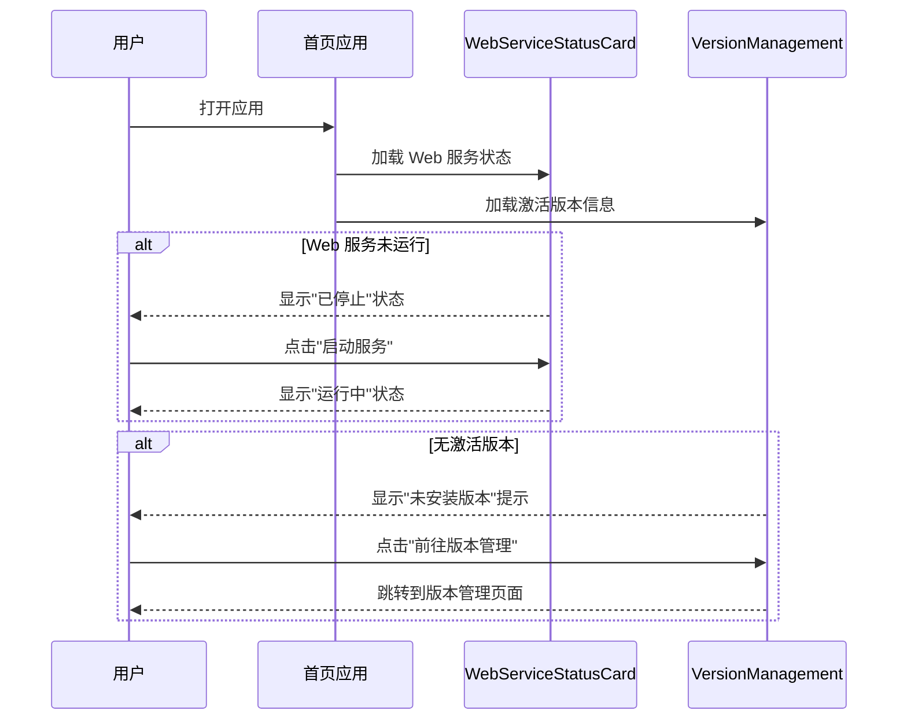
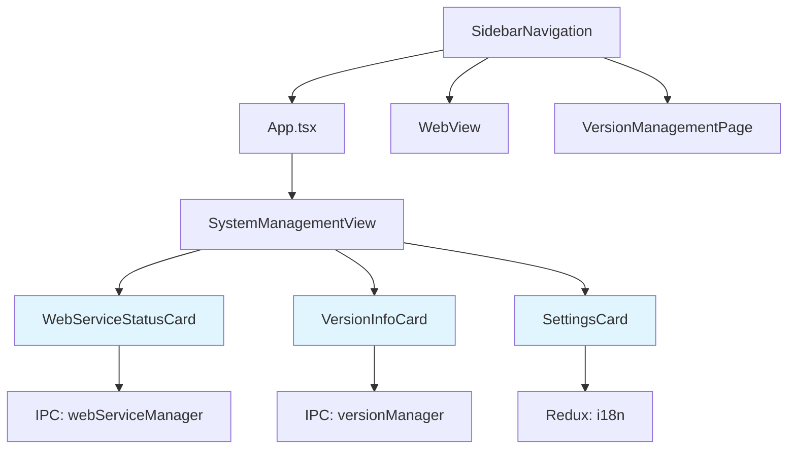

# Change: 首页重构聚焦Web管理功能

## Why

当前 Hagicode Desktop 首页包含了所有功能模块的入口和展示，导致功能焦点不清晰。用户打开应用后，优先级不明确，难以快速定位到 Web 管理功能（嵌入式 Web 服务管理和包管理）。此外，部分功能模块（如远程服务器管理）后续将进行重新设计和架构调整，需要为后续工作预留空间。

## What Changes

- 简化首页内容，聚焦于 Web 管理核心功能
- 移除首页中非核心功能模块的展示（如快速开始、安全提示等信息卡片）
- 移除首页中的依赖项检查功能（依赖项在版本安装后自动满足）
- 保留 Web 服务状态卡片、包管理功能、版本管理功能
- 优化首页布局，突出 Web 管理功能的视觉层次
- 更新相关的国际化文件

## UI 设计变更

### 当前首页布局

```
┌─────────────────────────────────────────────────────────────────┐
│ [侧边栏]                                                          │
│ ├─ 仪表盘 (当前)                                                  │
│ ├─ Web 服务                                                       │
│ └─ 版本管理                                                       │
├─────────────────────────────────────────────────────────────────┤
│                                                                  │
│                      [Hagicode Logo]                               │
│                   Version X.X.X - 运行成功                         │
│                                                                  │
│  ┌─────────────────────────────────────────────────────────┐    │
│  │  Web 服务状态卡片                                         │    │
│  │  [状态: 运行中]  [启动] [停止] [在浏览器中打开]              │    │
│  └─────────────────────────────────────────────────────────┘    │
│                                                                  │
│  ┌─────────────────────────────────────────────────────────┐    │
│  │  当前激活版本                                              │    │
│  │  版本: 0.1.0-alpha.8                                       │    │
│  │  平台: linux-x64                                          │    │
│  │  [管理版本]                                                │    │
│  └─────────────────────────────────────────────────────────┘    │
│                                                                  │
│  ┌─────────────────────────────────────────────────────────┐    │
│  │  依赖项检查卡片                                            │    │
│  │  [检查依赖]  [自动修复]                                    │    │
│  └─────────────────────────────────────────────────────────┘    │
│                                                                  │
│  ┌────────────┐  ┌────────────┐                                 │
│  │  快速开始   │  │   安全      │  <-- 移除                      │
│  └────────────┘  └────────────┘                                 │
│                                                                  │
│  ┌─────────────────────────────────────────────────────────┐    │
│  │  设置                                                     │    │
│  │  语言选择 [中文 ▼]                                        │    │
│  │  嵌入式 Web 服务端口: 5000                                │    │
│  └─────────────────────────────────────────────────────────┘    │
│                                                                  │
│  © 2025 Hagicode Desktop. Built with ❤️                            │
│                                                                  │
└─────────────────────────────────────────────────────────────────┘
```

### 重构后首页布局

```
┌─────────────────────────────────────────────────────────────────┐
│ [侧边栏]                                                          │
│ ├─ 仪表盘 (当前)                                                  │
│ ├─ Web 服务                                                       │
│ └─ 版本管理                                                       │
├─────────────────────────────────────────────────────────────────┤
│                                                                  │
│                      [Hagicode Logo]                               │
│                   Version X.X.X - 运行成功                         │
│                                                                  │
│  ┌─────────────────────────────────────────────────────────┐    │
│  │  🌐 Web 服务管理                                         │    │
│  ├─────────────────────────────────────────────────────────┤    │
│  │                                                          │    │
│  │  状态: ● 运行中                                          │    │
│  │  URL: http://localhost:5000                              │    │
│  │                                                          │    │
│  │  [停止服务]           [在浏览器中打开]                     │    │
│  │                                                          │    │
│  └─────────────────────────────────────────────────────────┘    │
│                                                                  │
│  ┌─────────────────────────────────────────────────────────┐    │
│  │  📦 当前激活版本                                          │    │
│  ├─────────────────────────────────────────────────────────┤    │
│  │                                                          │    │
│  │  版本    0.1.0-alpha.8                                   │    │
│  │  平台    linux-x64                                       │    │
│  │  安装于  2025-02-06                                       │    │
│  │  状态    ✅ 就绪                                          │    │
│  │                     [管理版本 →]                          │    │
│  └─────────────────────────────────────────────────────────┘    │
│                                                                  │
│  ┌─────────────────────────────────────────────────────────┐    │
│  │  ⚙️ 设置                                                 │    │
│  ├─────────────────────────────────────────────────────────┤    │
│  │                                                          │    │
│  │  语言    [中文 ▼]                                        │    │
│  │  端口    5000                                            │    │
│  │                                                          │    │
│  └─────────────────────────────────────────────────────────┘    │
│                                                                  │
└─────────────────────────────────────────────────────────────────┘
```

### 用户交互流程



## 代码流程变更

### 组件关系图



### 代码变更清单

| 文件路径 | 变更类型 | 变更原因 | 影响范围 |
|---------|---------|---------|---------|
| `src/renderer/App.tsx` | 保持不变 | 主应用组件结构无需调整 | 无 |
| `src/renderer/components/SystemManagementView.tsx` | 修改 | 移除快速开始/安全信息卡片、移除依赖项检查卡片 | UI 显示 |
| `src/renderer/components/SidebarNavigation.tsx` | 保持不变 | 导航结构无需调整 | 无 |
| `src/renderer/i18n/locales/en-US/common.json` | 修改 | 移除不再使用的翻译键 | 国际化 |
| `src/renderer/i18n/locales/zh-CN/common.json` | 修改 | 移除不再使用的翻译键 | 国际化 |

## Impact

### 用户体验影响

**正面影响**:
- 首页更加简洁，用户可以快速访问核心 Web 管理功能
- 减少认知负担，功能优先级更清晰
- 为后续重新设计其他功能模块预留空间
- 依赖项在版本安装后自动满足，无需手动检查

**潜在影响**:
- 信息卡片（快速开始、安全）的内容需要通过其他方式提供给用户（如帮助文档）

### 技术影响

- 修改 `SystemManagementView.tsx` 组件
- 更新国际化文件（移除不再使用的键）
- 不影响主进程的现有功能和服务
- 不影响 Redux 状态管理和 IPC 通信

### 后续工作

此次简化为后续的功能重新设计奠定基础：
- 可以将移除的信息卡片内容整合到帮助文档中
- 远程服务器管理功能将重新设计架构和交互
- 其他管理功能可能需要重新评估优先级和实现方式
