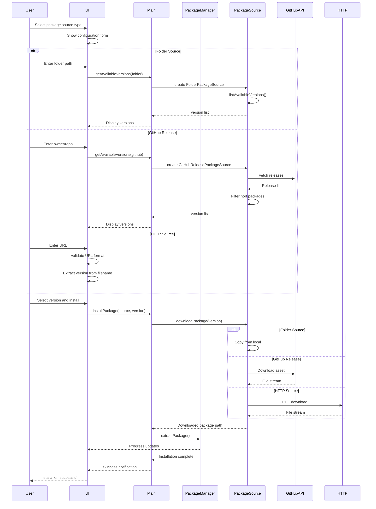
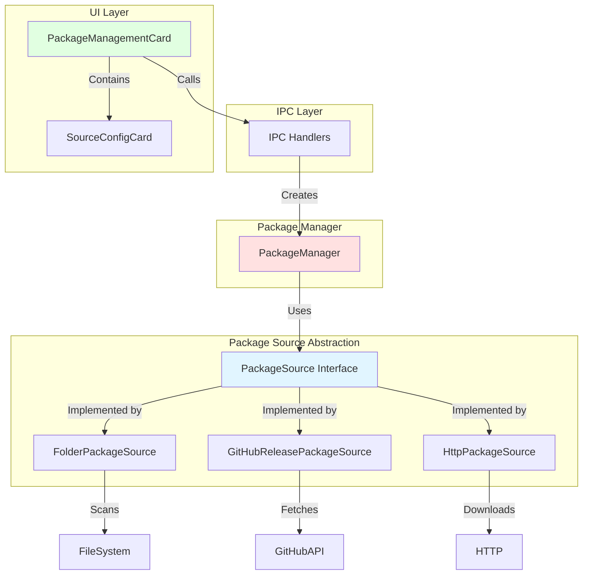
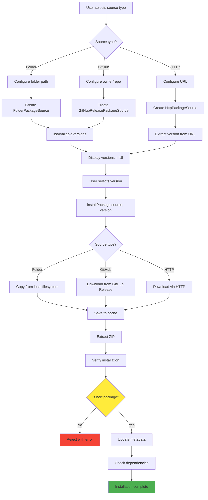
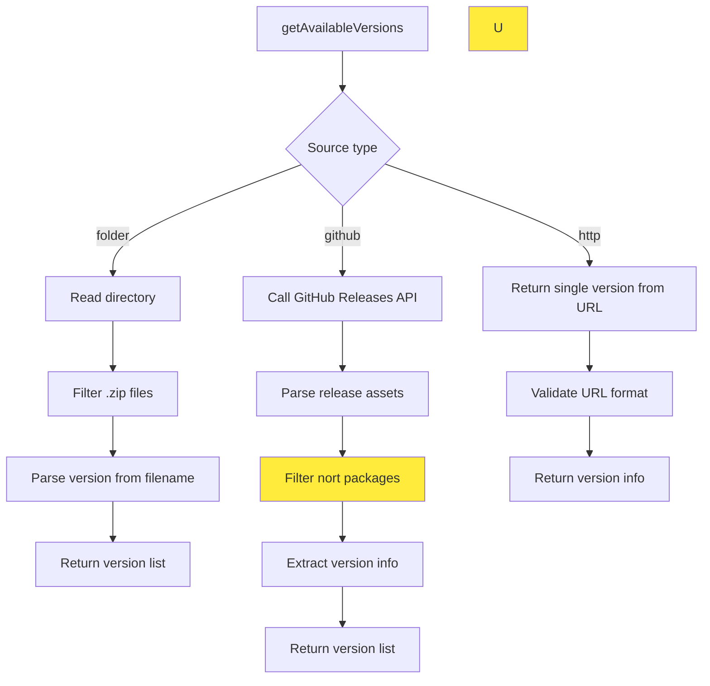

# Change: 重构包管理器以支持多源安装nort包

## Why

当前 Hagicode Desktop 的包管理器仅支持从本地文件系统安装软件包，且包源逻辑与文件系统路径紧耦合。随着 hagicode 源变更为仅提供 nort 软件包，需要：

1. **适配单一可信源约束**：hagicode 现在只提供 nort 类型的软件包，包管理器需要适配此约束
2. **支持多种包获取方式**：用户需要从本地文件夹、GitHub Release、HTTP URL 等多种渠道获取 nort 包
3. **提升架构可扩展性**：当前代码缺乏包源抽象接口，不便于未来添加新的包源类型
4. **改善用户体验**：统一的包源配置界面，降低配置错误风险，提供更灵活的安装方式

## What Changes

- **新增包源抽象接口**：定义 `PackageSource` 接口，支持文件夹、GitHub Release、HTTP 三种包源类型
- **约束为 nort 包支持**：包管理器仅处理和验证 nort 类型软件包
- **实现多源支持**：
  - `FolderPackageSource`：保持现有文件夹扫描逻辑
  - `GitHubReleasePackageSource`：支持从 GitHub Release 下载包
  - `HttpPackageSource`：支持从 HTTP(S) URL 直接下载
- **重构包管理器架构**：依赖注入 `PackageSource` 接口，解耦包源逻辑
- **扩展 IPC 通信**：添加包源配置和安装的 IPC 通道
- **更新 UI 交互**：添加包源选择下拉框和配置界面
- **新增国际化支持**：添加包源类型、nort 包提示相关的翻译键

## UI Design Changes

### 新增包源配置界面

在 `PackageManagementCard` 中添加包源选择和配置区域。

```
+---------------------------------------------------------------+
|  Package Management                                           |
|                                                               |
|  +---------------------------------------------------------+  |
|  |  Package Source                              [v]         |  |
|  +---------------------------------------------------------+  |
|                                                               |
|  +---------------------------------------------------------+  |
|  |  Source Type: [Folder ▼]                                 |  |
|  |                                                         |  |
|  |  [Folder Source Configuration]                          |  |
|  |  Path: [/home/user/packages]        [Browse...]         |  |
|  |                                                         |  |
|  |  [Scan Available Versions]                              |  |
|  +---------------------------------------------------------+  |
|                                                               |
|  or when GitHub Release is selected:                         |
|                                                               |
|  +---------------------------------------------------------+  |
|  |  Source Type: [GitHub Release ▼]                         |  |
|  |                                                         |  |
|  |  [GitHub Release Configuration]                         |  |
|  |  Owner: [newbe36524            ]                        |  |
|  |  Repository: [hagicode          ]                        |  |
|  |  Token: (optional) [                ]                    |  |
|  |                                                         |  |
|  |  [Fetch Releases from GitHub]                          |  |
|  +---------------------------------------------------------+  |
|                                                               |
|  or when HTTP is selected:                                   |
|                                                               |
|  +---------------------------------------------------------+  |
|  |  Source Type: [HTTP ▼]                                   |  |
|  |                                                         |  |
|  |  [HTTP Source Configuration]                            |  |
|  |  URL: [https://example.com/hagicode-0.1.0-linux-x64.zip] |  |
|  |                                                         |  |
|  |  [Download Package]                                     |  |
|  +---------------------------------------------------------+  |
|                                                               |
|  ⚠️ Notice: Only nort packages are supported                  |
|                                                               |
|  +---------------------------------------------------------+  |
|  |  Available Versions: 3 found                             |  |
|  |  Version: [hagicode-0.1.0-alpha.8-linux-x64.zip ▼]      |  |
|  |                                                         |  |
|  |  [Install Package]                                      |  |
|  +---------------------------------------------------------+  |
+---------------------------------------------------------------+
```

### 用户交互流程



## Code Flow Changes

### 包源抽象架构



### 包安装流程



### 多源版本获取流程



## Impact

### Affected specs
- `package-management` - **新建** - 定义包管理和多源安装规范
- `electron-app` - 修改 - 添加包源配置和安装 UI 相关需求

### Affected code
- **Main Process**:
  - `src/main/package-manager.ts` - 重构为使用 `PackageSource` 接口
  - `src/main/package-source.ts` - **新建** - 包源接口和实现类
  - `src/main/main.ts` - 添加包源相关的 IPC 通道

- **Renderer Process**:
  - `src/renderer/components/PackageManagementCard.tsx` - 添加包源选择和配置界面
  - `src/renderer/components/PackageSourceConfig.tsx` - **新建** - 包源配置组件
  - `src/renderer/store/sagas/viewSaga.ts` - 添加包源相关的异步操作
  - `src/renderer/store/slices/viewSlice.ts` - 添加包源状态管理

- **IPC/Preload**:
  - `src/preload/index.ts` - 暴露包源相关的 API

- **Internationalization**:
  - `src/renderer/i18n/locales/en-US/pages.json` - 添加英文翻译
  - `src/renderer/i18n/locales/zh-CN/pages.json` - 添加中文翻译

### Breaking changes
- `package-manager.ts` 的内部 API 将发生变化，但对外 IPC 接口保持向后兼容
- 现有的文件夹源功能完全保留

### Migration requirements
无需数据迁移。现有软件包安装不受影响。用户配置的包源设置使用 electron-store 持久化。

### Dependencies
- `axios` - 已安装，用于 HTTP 请求和 GitHub API 调用
- `adm-zip` - 已安装，用于 ZIP 文件解压
- `semver` - 已安装，用于版本号比较和验证
- `electron-log` - 已安装，用于日志记录

无需新增外部依赖。
