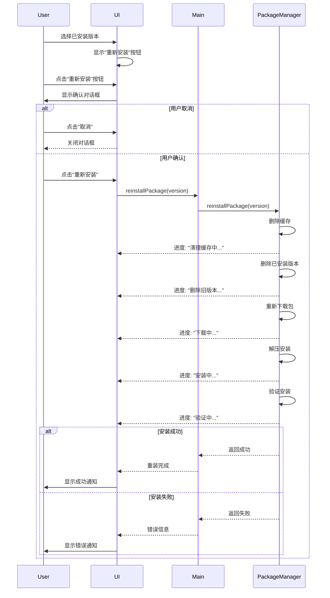
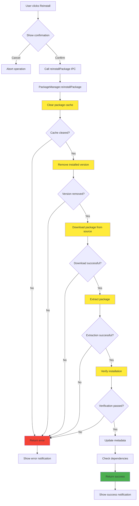

# Change: 包管理已安装版本重装功能

## Why

当前 Hagicode Desktop 的包管理功能在用户已安装某个版本的 Web 服务包后，存在以下问题：

1. **缺少重装选项**：当版本号相同时，用户无法触发重新安装操作来修复可能损坏的安装
2. **缓存残留问题**：旧的软件包缓存可能保留在系统中，导致潜在的版本不一致或文件损坏问题
3. **完整清理缺失**：需要重装时无法确保旧缓存和已安装版本被完全删除，可能导致重装后仍存在旧文件

这导致用户在遇到包损坏、文件丢失或需要刷新安装时，必须手动删除文件和缓存，用户体验较差。

## What Changes

- **新增重装功能**：在包管理界面为已安装版本添加"重新安装"按钮
- **实现重装流程**：执行完整的清理和重装操作（删除缓存 → 删除已安装版本 → 重新下载 → 安装）
- **重装状态反馈**：提供清晰的重装进度反馈和状态通知
- **确认对话框**：防止用户误操作，添加重装前的确认步骤

## UI Design Changes

### 包管理界面重装按钮

在 `PackageManagementCard` 组件中，当用户选择已安装的版本时，显示"重新安装"按钮替代或补充"安装"按钮。

```
+---------------------------------------------------------------+
|  Package Management                                           |
|                                                               |
|  Platform: linux                                              |
|  Status: Installed                                           |
|  Version: 0.1.0-alpha.8                                       |
|                                                               |
|  +---------------------------------------------------------+  |
|  |  Available Versions                                      |  |
|  |  Version: [0.1.0-alpha.8 ▼]  (已安装)                    |  |
|  |                                                         |  |
|  |  [+ 重新安装]  [+ 刷新]                                  |  |
|  +---------------------------------------------------------+  |
+---------------------------------------------------------------+
```

### 重装确认对话框

用户点击"重新安装"按钮时，显示确认对话框防止误操作：

```
+---------------------------------------------------------------+
|  ⚠️ 确认重新安装                                              |
|                                                               |
|  您即将重新安装版本 0.1.0-alpha.8                             |
|                                                               |
|  此操作将：                                                    |
|  • 删除缓存中的旧软件包                                       |
|  • 删除当前已安装的版本                                       |
|  • 重新下载并安装软件包                                       |
|                                                               |
|  [取消]  [重新安装]                                           |
+---------------------------------------------------------------+
```

### 重装进度显示

重装过程中显示各阶段进度：

```
+---------------------------------------------------------------+
|  正在重新安装...                                              |
|                                                               |
|  清理缓存中... 25%                                            |
|  ████████░░░░░░░░░░░░░░                                      |
|                                                               |
|  正在删除旧版本文件...                                        |
+---------------------------------------------------------------+
```

### 用户交互流程



## Code Flow Changes

### 重装流程数据流



### 代码变更清单

| 文件路径 | 变更类型 | 变更原因 | 影响范围 |
|---------|---------|---------|---------|
| `src/main/package-manager.ts` | 新增方法 | 添加 `reinstallPackage()` 方法处理重装逻辑 | 包管理核心 |
| `src/main/main.ts` | 新增 IPC 通道 | 添加 `package:reinstall` IPC 通道处理重装请求 | 主进程 IPC |
| `src/preload/index.ts` | 新增 API | 暴露 `reinstallPackage()` 方法给渲染进程 | IPC 桥接 |
| `src/renderer/components/PackageManagementCard.tsx` | UI 修改 | 添加重装按钮和确认对话框逻辑 | 用户界面 |
| `src/renderer/store/sagas/packageSourceSaga.ts` | 新增 action | 添加 `reinstallPackageAction` 异步操作 | 状态管理 |
| `src/renderer/store/slices/packageSourceSlice.ts` | 新增状态 | 添加重装状态管理 | Redux 状态 |
| `src/renderer/i18n/locales/en-US/components.json` | 新增翻译 | 添加重装相关英文翻译 | 国际化 |
| `src/renderer/i18n/locales/zh-CN/components.json` | 新增翻译 | 添加重装相关中文翻译 | 国际化 |

## Impact

### Affected specs
- `package-management` - **修改** - 添加重装功能需求

### Affected code
- **Main Process**:
  - `src/main/package-manager.ts` - 添加 `reinstallPackage()` 方法
  - `src/main/main.ts` - 添加 `package:reinstall` IPC 处理器

- **Renderer Process**:
  - `src/renderer/components/PackageManagementCard.tsx` - 添加重装按钮和确认对话框
  - `src/renderer/store/sagas/packageSourceSaga.ts` - 添加重装异步操作
  - `src/renderer/store/slices/packageSourceSlice.ts` - 添加重装状态

- **IPC/Preload**:
  - `src/preload/index.ts` - 暴露重装相关 API

- **Internationalization**:
  - `src/renderer/i18n/locales/en-US/components.json` - 添加翻译
  - `src/renderer/i18n/locales/zh-CN/components.json` - 添加翻译

### Breaking changes
无破坏性变更。新功能是现有安装功能的补充。

### Migration requirements
无需数据迁移。现有软件包安装不受影响。

### Dependencies
无新增外部依赖。使用现有的：
- `adm-zip` - ZIP 文件处理
- `electron-log` - 日志记录
- 现有的 IPC 通信机制

## Status
**ExecutionCompleted** - All tasks have been implemented successfully.
