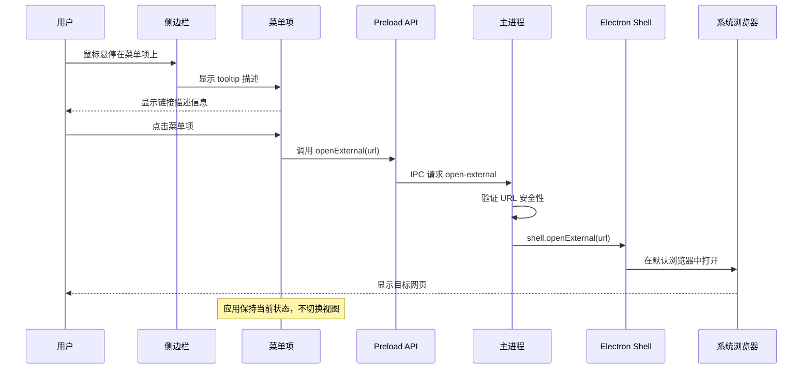
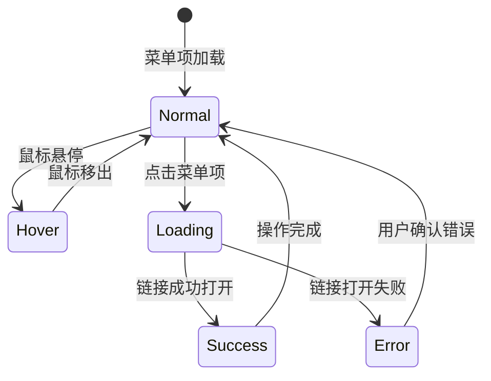
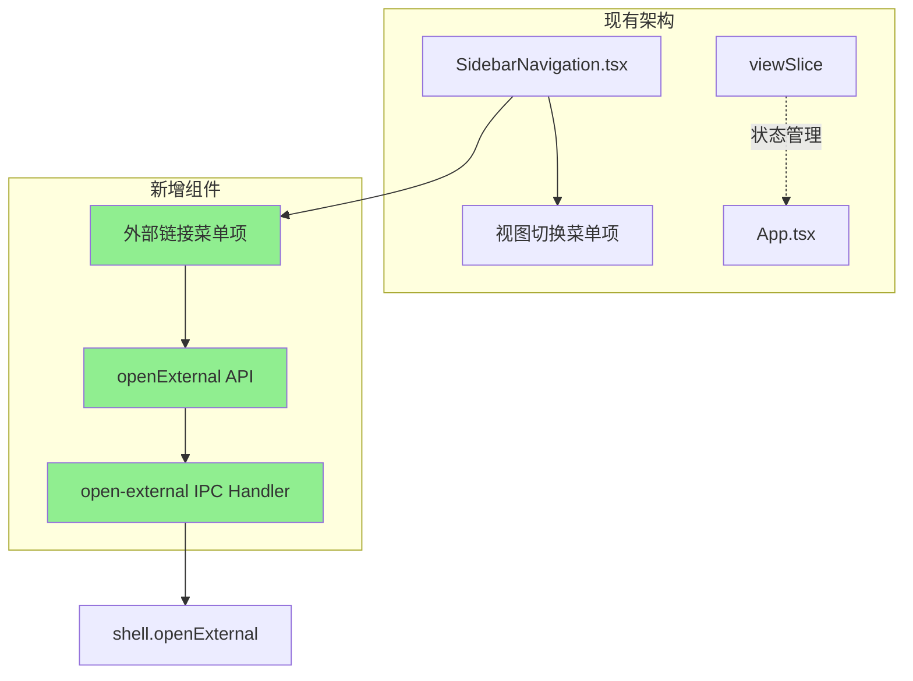
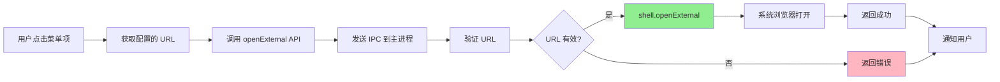
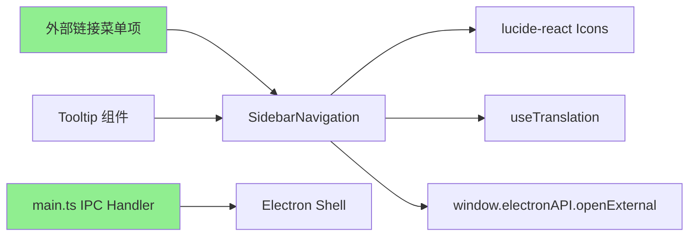

# 关于与支持菜单技术设计文档

## Context

Hagicode Desktop 是一款基于 Electron 的跨平台桌面应用程序，当前应用已实现基础的 Web 服务管理、包管理和远程服务器控制功能。用户需要一种便捷的方式来获取官方支持、参与社区互动和了解项目信息。

### Stakeholders

- **最终用户**：需要快速访问官方资源和获取技术支持
- **开发者**：希望提高社区参与度和项目曝光率
- **项目维护者**：希望建立更好的用户与开发者联系渠道

### Constraints

- 必须使用现有的 shadcn/ui 组件库保持 UI 一致性
- 必须支持现有的国际化系统（简体中文、英文）
- 链接必须在系统默认浏览器中打开（不能在 Electron 内部打开）
- 点击菜单项后不应切换应用视图，保持当前状态
- 菜单项直接展示在侧边栏一级菜单上

## Goals / Non-Goals

### Goals

- 在侧边栏提供清晰的外部链接菜单项
- 点击菜单项直接在系统默认浏览器中打开对应链接
- 使用现有图标库保持视觉一致性
- 支持中英文双语
- 提供良好的用户体验（悬停提示、点击反馈）

### Non-Goals

- 不创建独立的关于与支持页面组件
- 不实现用户反馈收集功能（留待后续扩展）
- 不实现版本信息展示（留待后续扩展）
- 不实现更新日志展示（留待后续扩展）
- 不实现社交媒体链接（留待后续扩展）
- 不修改现有的视图状态管理系统

## Decisions

### Decision 1: 使用侧边栏菜单项而非独立页面

**选择**：在侧边栏添加外部链接菜单项，点击后直接打开外部链接

**理由**：
- 简化用户交互流程，减少点击次数
- 无需切换视图，保持当前应用状态
- 符合用户在桌面应用中快速访问外部资源的习惯
- 代码实现更简单，维护成本更低
- 不影响现有的视图状态管理架构

**替代方案**：
- 创建独立的关于与支持页面
  - 优点：可以展示更多信息（版本号、更新日志等）
  - 缺点：增加用户操作步骤，需要额外的视图切换

### Decision 2: 使用标准图标标识菜单类型

**选择**：
- 官方网站：使用 `Globe` 图标
- 技术支持群：使用 `Users` 图标
- GitHub 项目：使用 `Star` 图标

**理由**：
- 图标语义清晰，用户易于理解
- 与 lucide-react 图标库一致
- 通用性强，符合用户心理模型

**替代方案**：
- 使用 `ExternalLink` 图标统一表示
  - 优点：一致性强
  - 缺点：无法区分不同类型的链接

### Decision 3: 链接点击处理方式

**选择**：使用 Electron 的 `shell.openExternal()` API

**理由**：
- 官方推荐的最佳实践
- 在系统默认浏览器中打开链接
- 提供更好的用户体验
- 避免在 Electron 内部打开网页的安全风险

**实现方式**：
- 在渲染进程中通过 preload API 调用主进程的 `shell.openExternal()` 方法
- 在主进程中实现 URL 安全验证
- 添加错误处理和用户反馈

### Decision 4: 菜单项视觉区分

**选择**：为外部链接菜单项添加视觉提示

**理由**：
- 帮助用户区分视图切换菜单项和外部链接菜单项
- 提供更好的可访问性
- 符合 UI 设计最佳实践

**实现方式**：
- 添加悬停时显示链接描述
- 可选：添加小图标表示外部链接（如 ↗ 符号）
- 保持与现有菜单项的视觉一致性

## UI/UX Design

### 侧边栏菜单结构

```
┌─────────────────────────────────────────────────────────────────┐
│  [Sidebar]                                                      │
│  ┌──────┐                                                      │
│  │ Hagi │                                                      │
│  │ co   │                                                      │
│  └──────┘                                                      │
│                                                                 │
│  📊 [仪表盘]                                                    │
│  🌐 [Web服务]                                                   │
│  📦 [版本管理]                                                  │
│  ────────────────────────────────────────────────────────────  │
│  🌍 [官方网站] → 点击打开 hagicode.com                         │
│  👥 [技术支持群] → 点击打开 QQ 加群页面                        │
│  ⭐ [GitHub项目] → 点击打开 GitHub 仓库                        │
│                                                                 │
└─────────────────────────────────────────────────────────────────┘
```

### 菜单项详细设计

#### 官方网站菜单项
- **图标**：Globe
- **标签**：官方网站 / Official Website
- **描述**：访问 Hagicode 官方网站获取最新资讯和文档 / Visit Hagicode official website for latest news and documentation
- **URL**：https://hagicode.com/
- **交互**：点击后在默认浏览器中打开

#### 技术支持群菜单项
- **图标**：Users
- **标签**：技术支持群 / Technical Support
- **描述**：加入 QQ 技术交流群获取帮助（群号：610394020）/ Join our QQ group for technical support (Group: 610394020)
- **URL**：https://qm.qq.com/q/FoalgKjYOI
- **交互**：点击后在默认浏览器中打开

#### GitHub 项目菜单项
- **图标**：Star
- **标签**：GitHub 项目 / GitHub Project
- **描述**：在 GitHub 上查看源码并给我们 Star / View source code and star us on GitHub
- **URL**：https://github.com/HagiCode-org/site
- **交互**：点击后在默认浏览器中打开

### 用户交互流程



### 视觉状态



## Technical Design

### 架构更新



### 数据流



### 组件间依赖关系



### 代码结构

```
src/
├── renderer/
│   └── components/
│       └── SidebarNavigation.tsx         # 修改：添加外部链接菜单项
├── preload/
│   └── index.ts                         # 修改：添加 openExternal API
├── main/
│   └── main.ts                          # 修改：添加 open-external IPC 处理器
└── renderer/i18n/
    └── locales/
        ├── en-US/
        │   └── common.json              # 修改：添加菜单翻译
        └── zh-CN/
            └── common.json              # 修改：添加菜单翻译
```

### API 设计

#### Preload API 扩展

```typescript
// src/preload/index.ts

interface ElectronAPI {
  // 现有 API...
  switchView: (view: 'system' | 'web' | 'version') => Promise<{...}>;

  // 新增：打开外部链接 API
  openExternal: (url: string) => Promise<{
    success: boolean;
    error?: string;
  }>;
}
```

#### Main Process IPC Handler

```typescript
// src/main/main.ts

import { shell } from 'electron';

ipcMain.handle('open-external', async (event, url: string) => {
  try {
    // URL 安全验证
    const parsedUrl = new URL(url);

    // 仅允许 http 和 https 协议
    if (!['http:', 'https:'].includes(parsedUrl.protocol)) {
      return {
        success: false,
        error: 'Invalid URL protocol'
      };
    }

    // 可选：URL 白名单验证
    const allowedDomains = [
      'hagicode.com',
      'qq.com',
      'github.com',
      'qm.qq.com'
    ];

    const isAllowed = allowedDomains.some(domain =>
      parsedUrl.hostname === domain ||
      parsedUrl.hostname.endsWith('.' + domain)
    );

    if (!isAllowed) {
      return {
        success: false,
        error: 'Domain not allowed'
      };
    }

    // 打开外部链接
    await shell.openExternal(url);

    return {
      success: true
    };
  } catch (error) {
    log.error('Failed to open external URL:', error);
    return {
      success: false,
      error: error.message
    };
  }
});
```

#### 菜单项配置结构

```typescript
// src/renderer/components/SidebarNavigation.tsx

interface ExternalLinkMenuItem {
  type: 'external-link';
  id: string;
  icon: LucideIcon;
  label: string;
  url: string;
  description?: string;
}

interface ViewMenuItem {
  type: 'view';
  id: string;
  icon: LucideIcon;
  label: string;
  view: ViewType;
}

type MenuItem = ExternalLinkMenuItem | ViewMenuItem;

const navigationItems: MenuItem[] = [
  // 现有视图菜单项...
  {
    type: 'view',
    id: 'system',
    icon: LayoutDashboard,
    label: t('navigation.dashboard'),
    view: 'system'
  },
  // ... 其他视图菜单项

  // 分隔线

  // 外部链接菜单项
  {
    type: 'external-link',
    id: 'official-website',
    icon: Globe,
    label: t('navigation.officialWebsite'),
    url: 'https://hagicode.com/',
    description: t('navigation.officialWebsiteDesc')
  },
  {
    type: 'external-link',
    id: 'tech-support',
    icon: Users,
    label: t('navigation.techSupport'),
    url: 'https://qm.qq.com/q/FoalgKjYOI',
    description: t('navigation.techSupportDesc')
  },
  {
    type: 'external-link',
    id: 'github-project',
    icon: Star,
    label: t('navigation.githubProject'),
    url: 'https://github.com/HagiCode-org/site',
    description: t('navigation.githubProjectDesc')
  }
];
```

#### 点击处理逻辑

```typescript
// src/renderer/components/SidebarNavigation.tsx

const handleMenuItemClick = async (item: MenuItem) => {
  if (item.type === 'view') {
    // 现有视图切换逻辑
    dispatch(switchView(item.view));
  } else if (item.type === 'external-link') {
    // 新增：外部链接处理逻辑
    try {
      const result = await window.electronAPI.openExternal(item.url);

      if (!result.success) {
        // 显示错误提示
        console.error('Failed to open external link:', result.error);
        // 可选：显示 toast 通知用户
      }
    } catch (error) {
      console.error('Failed to open external link:', error);
      // 可选：显示 toast 通知用户
    }
  }
};
```

### 技术栈

- **React 19.0.0**：UI 框架
- **TypeScript 5.7.3**：类型安全
- **Electron Shell API**：外部链接处理
- **lucide-react**：图标库
- **i18next**：国际化

## Risks / Trade-offs

### Risks

| 风险 | 影响 | 缓解措施 |
|------|------|----------|
| 链接 URL 变更 | 链接失效 | 将 URL 配置化，便于后续更新；添加错误处理 |
| 用户默认浏览器设置异常 | 链接无法打开 | 添加错误处理和用户提示；记录错误日志 |
| 国际化翻译错误 | 显示错误文本 | 审查翻译内容，必要时请专业翻译校对 |
| 恶意 URL 注入 | 安全风险 | 实现 URL 安全验证；使用白名单机制 |
| 用户不理解菜单项行为 | 体验问题 | 添加清晰的 tooltip 描述；保持视觉一致性 |

### Trade-offs

| 决策 | 优势 | 劣势 | 选择 |
|------|------|------|------|
| 菜单项 vs 独立页面 | 简化交互，无需视图切换 | 无法展示详细信息 | 菜单项 |
| URL 白名单验证 | 提高安全性 | 需要维护白名单 | 实现（推荐） |
| 错误提示方式 | 用户体验好 | 增加实现复杂度 | Console 日志 + 可选 Toast |

## Migration Plan

### 实施步骤

1. **后端 IPC 处理器**：在 `main.ts` 中添加 `open-external` IPC 处理器
2. **Preload API**：在 `preload/index.ts` 中添加 `openExternal` API
3. **国际化翻译**：更新中英文翻译文件，添加菜单项翻译
4. **侧边栏更新**：在 `SidebarNavigation.tsx` 中添加外部链接菜单项
5. **图标导入**：从 lucide-react 导入所需图标
6. **点击处理**：实现外部链接的点击处理逻辑
7. **样式优化**：添加悬停效果和可选的 tooltip
8. **测试验证**：全面测试所有功能和边界情况

### 回滚计划

- 如果出现问题，可以通过 Git 回滚到变更前的版本
- 变更独立且不影响现有功能，回滚风险低
- 外部链接菜单项可以单独禁用而不影响其他功能

## Open Questions

1. **URL 管理方式**：是否需要将链接 URL 配置化以便后续更新？
   - **建议**：当前阶段硬编码在菜单项配置中即可，后续如有需要再配置化

2. **错误提示方式**：链接打开失败时如何通知用户？
   - **建议**：使用 Console 日志记录错误，可选实现 Toast 通知

3. **URL 白名单**：是否需要实现严格的 URL 白名单验证？
   - **建议**：实现基本的协议验证（http/https），可选实现域名白名单

4. **菜单项分组**：是否需要添加分隔线将外部链接分组？
   - **建议**：添加分隔线以提高可读性

5. **点击统计**：是否需要统计外部链接的点击次数？
   - **建议**：当前阶段不需要，后续可通过分析工具实现

## Design Constraints

- 必须保持与现有侧边栏菜单项的视觉一致性
- 必须支持中英文双语切换
- 必须在所有支持的操作系统上正常工作
- 不应影响现有的视图切换功能
- 不应增加显著的性能开销
- 应遵循可访问性最佳实践（keyboard navigation、screen reader support）
