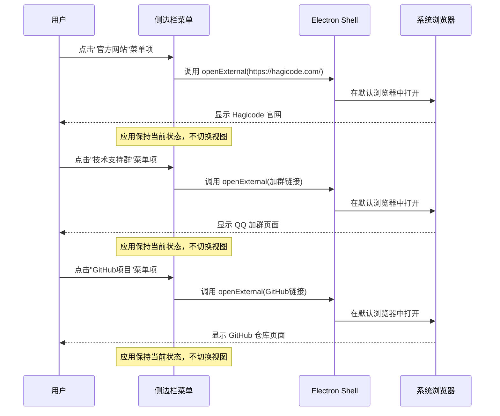
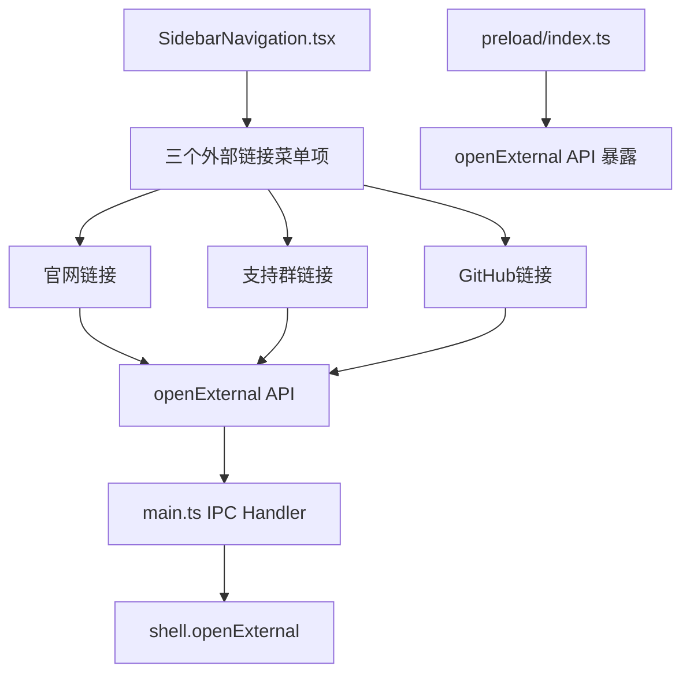

# Change: 添加关于与支持菜单

## Why

当前 Hagicode Desktop 应用缺少与用户建立联系的渠道，用户无法在应用内直接访问官方网站、技术支持或参与社区互动。这导致用户获取支持困难，社交参与度低，品牌曝光不足。

## What Changes

- 在侧边栏导航区域添加多个独立的链接菜单项（官方网站、技术支持群、GitHub 项目）
- 点击菜单项后直接在系统默认浏览器中打开对应链接
- 添加相应的国际化翻译（简体中文、英文）
- 使用 Electron 的 `shell.openExternal()` API 在外部浏览器中打开链接
- 每个链接作为独立的菜单项展示，点击后立即跳转，无需创建独立页面

### 具体变更内容

1. **新增导航菜单项**
   - 在 `SidebarNavigation.tsx` 的 `navigationItems` 数组中添加三个独立的链接菜单项
   - 官方网站菜单项（使用 Globe 图标）
   - 技术支持群菜单项（使用 Users 或 MessageCircle 图标）
   - GitHub 项目菜单项（使用 GitHub 或 Star 图标）
   - 每个菜单项点击后直接打开外部链接，不切换应用视图

2. **链接目标配置**
   - 官方网站: https://hagicode.com/
   - 技术支持群: QQ 群号 610394020，加群链接 https://qm.qq.com/q/FoalgKjYOI
   - GitHub 项目: https://github.com/HagiCode-org/site

3. **点击行为处理**
   - 点击菜单项时，调用 Electron 的 `shell.openExternal()` API
   - 在系统默认浏览器中打开链接
   - 应用保持当前状态，不进行视图切换

4. **国际化翻译**
   - 更新 `src/renderer/i18n/locales/en-US/common.json` 和 `zh-CN/common.json`
   - 添加三个菜单项的翻译键（`navigation.officialWebsite`、`navigation.techSupport`、`navigation.githubProject`）
   - 添加菜单描述和提示文本的翻译

5. **IPC 通信更新**
   - 在 `src/preload/index.ts` 中添加 `openExternal` API
   - 在 `src/main/main.ts` 中添加 `open-external` IPC 处理器
   - 确保安全地处理外部 URL 打开请求

## UI Design Changes

### 侧边栏菜单结构更新

```
┌─────────────────────────────────────────────────────────────────┐
│  [Sidebar]                                                      │
│  ┌──────┐                                                      │
│  │ Hagi │                                                      │
│  │ co   │                                                      │
│  └──────┘                                                      │
│                                                                 │
│  📊 [仪表盘]                                                    │
│  🌐 [Web服务]                                                   │
│  📦 [版本管理]                                                  │
│  ────────────────────────────────────────────────────────────  │
│  🌍 [官方网站] → 点击打开 hagicode.com                         │
│  👥 [技术支持群] → 点击打开 QQ 加群页面                        │
│  ⭐ [GitHub项目] → 点击打开 GitHub 仓库                        │
│                                                                 │
└─────────────────────────────────────────────────────────────────┘
```

### 用户交互流程



## Code Flow Changes

### 组件架构更新



### 数据流更新

```mermaid
flowchart TD
    Start[用户点击菜单项] --> ClickEvent[触发点击事件]
    ClickEvent --> OpenExternal[调用 openExternal API]
    OpenExternal --> IPCRequest[发送 IPC 请求到主进程]
    IPCRequest --> MainProcess[主进程处理]
    MainProcess --> ValidateURL[验证 URL 安全性]
    ValidateURL --> OpenBrowser[调用 shell.openExternal]
    OpenBrowser --> SystemBrowser[系统默认浏览器打开]

    Note over Start: 应用不切换视图
    Note over SystemBrowser: 在外部浏览器中打开链接
```

### 菜单项配置结构

```typescript
// SidebarNavigation.tsx 中的菜单项配置示例
const navigationItems = [
  // 现有菜单项...
  {
    type: 'external-link',
    id: 'official-website',
    icon: Globe,
    label: t('navigation.officialWebsite'),
    url: 'https://hagicode.com/',
    description: t('navigation.officialWebsiteDesc')
  },
  {
    type: 'external-link',
    id: 'tech-support',
    icon: Users,
    label: t('navigation.techSupport'),
    url: 'https://qm.qq.com/q/FoalgKjYOI',
    description: t('navigation.techSupportDesc')
  },
  {
    type: 'external-link',
    id: 'github-project',
    icon: Star,
    label: t('navigation.githubProject'),
    url: 'https://github.com/HagiCode-org/site',
    description: t('navigation.githubProjectDesc')
  }
];
```

## Impact

### 受影响的规范
- `specs/electron-app/spec.md` - 添加外部链接菜单功能

### 受影响的代码文件
- `src/renderer/components/SidebarNavigation.tsx` - 添加外部链接菜单项
- `src/preload/index.ts` - 添加 `openExternal` API
- `src/main/main.ts` - 添加 `open-external` IPC 处理器
- `src/renderer/i18n/locales/en-US/common.json` - 添加英文翻译
- `src/renderer/i18n/locales/zh-CN/common.json` - 添加中文翻译

### 不受影响的代码文件
- `src/renderer/store/slices/viewSlice.ts` - 无需修改（不添加新视图类型）
- `src/renderer/App.tsx` - 无需修改（不添加页面渲染逻辑）
- `src/renderer/components/AboutSupportPage.tsx` - 不创建此文件（改为直接跳转）

### 用户影响
- **正面影响**：
  - 用户可以方便地访问官方网站获取最新资讯
  - 用户可以通过 QQ 群获得技术支持
  - 提高项目在 GitHub 上的曝光度
  - 建立更好的用户与开发者联系渠道
  - 简化的交互流程，无需切换视图即可访问外部资源

- **风险**：
  - 变更规模小，风险低
  - 不影响现有功能
  - 仅添加新菜单项，不修改现有逻辑
  - 外部链接打开失败时的用户体验需要考虑

### 后续扩展可能性
- 可添加更多外部链接菜单项（如文档、博客、社交媒体）
- 可添加链接点击统计功能
- 可配置化外部链接列表，便于后续维护
- 可添加用户反馈收集入口

---

## Status: ExecutionCompleted

本提案已成功实施完成。所有核心任务和主要功能均已实现：
- ✅ 后端 IPC 处理器和 URL 安全验证
- ✅ Preload API 和类型定义
- ✅ 国际化翻译（中英文）
- ✅ 侧边栏导航菜单项
- ✅ 点击处理逻辑和视觉样式
- ✅ 分隔线分组

实施细节请参考 `tasks.md` 文件中的任务清单。
