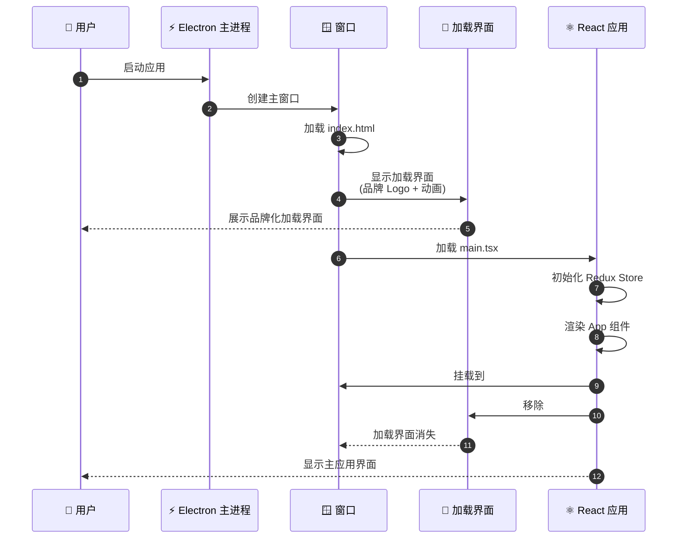
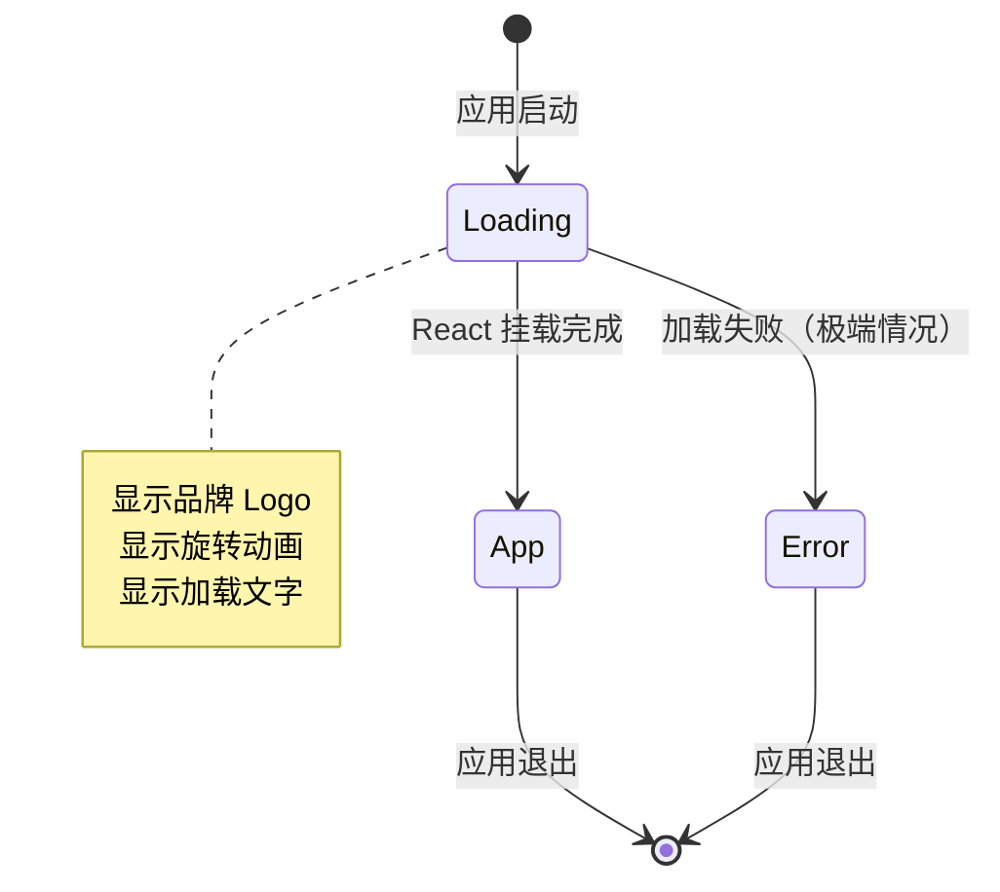
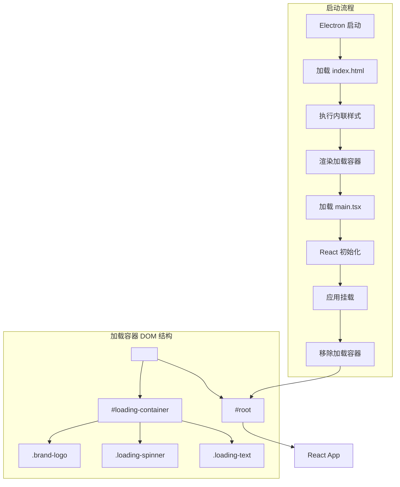
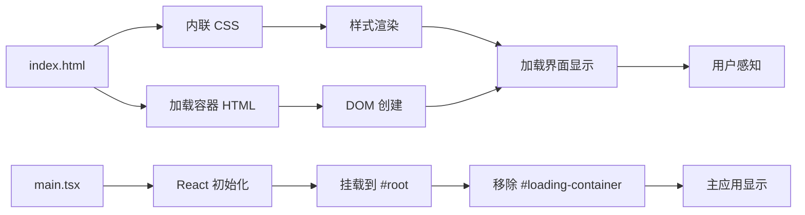

# Change: 改进 Hagicode Desktop 启动加载体验

## Context

Hagicode Desktop 是一款基于 Electron 的跨平台桌面应用程序，使用 React 19 和 Vite 6 构建渲染进程界面。当前应用启动时，index.html 作为入口文件被加载，但缺乏初始的样式和内容定义，导致用户在应用启动初期看到纯白的界面。

**背景约束：**
- 使用 Vite 6 作为前端构建工具
- 采用 Tailwind CSS 4.0.0 作为样式框架
- 需要与 shadcn/ui 主题色系保持一致
- 加载界面必须在 React 应用挂载前显示

**利益相关者：**
- 最终用户：需要清晰的应用启动反馈
- 产品团队：需要保持品牌一致性

## Goals / Non-Goals

**Goals:**
- 消除启动时的视觉空白期
- 提供带有品牌标识的加载界面
- 使用纯 CSS 实现，无需额外依赖
- 与现有 shadcn/ui 主题保持视觉一致性

**Non-Goals:**
- 不实现复杂的加载进度追踪
- 不添加加载动画库（如 Lottie）
- 不修改核心应用架构
- 不影响现有功能

## Decisions

### Decision 1: 使用内联 CSS 而非外部样式文件

**理由：**
- 加载界面必须在 React 应用和外部 CSS 加载前显示
- 内联 CSS 确保样式立即可用，无 FOUC（Flash of Unstyled Content）
- 增加的文件大小可忽略（约 1KB）

**替代方案考虑：**
- 外部 CSS 文件：需要额外的网络请求，会导致样式延迟加载
- Critical CSS 提取：对于简单场景过于复杂

### Decision 2: 使用纯 CSS 动画而非 JavaScript 动画

**理由：**
- CSS 动画性能更好，不阻塞主线程
- 实现简单，无需额外代码
- 与 React 应用加载过程解耦

**替代方案考虑：**
- JavaScript 动画：会增加主线程负担，可能影响 React 初始化
- SVG 动画库：增加不必要的依赖

### Decision 3: 加载容器使用 JavaScript 移除

**理由：**
- 确保 React 应用完全挂载后才移除
- 简单可靠，无需复杂的状态管理

**替代方案考虑：**
- CSS 隐藏：元素仍在 DOM 中，可能影响可访问性
- 使用 loading 状态：需要复杂的状态管理，过度设计

## UI/UX Design

### 启动加载界面 ASCII Mockup

```
┌────────────────────────────────────────────────────────┐
│                                                        │
│                                                        │
│                   Hagicode Desktop                     │
│                                                        │
│                    ╭────────╮                          │
│                   ╱          ╲                         │
│                  │    ●       │                        │
│                   ╲          ╱                         │
│                    ╰────────╯                          │
│                                                        │
│                    正在加载...                          │
│                                                        │
│                                                        │
└────────────────────────────────────────────────────────┘
```

### 设计规格

| 元素 | 样式 | 值 |
|------|------|-----|
| 背景 | 渐变 | linear-gradient(135deg, #0f172a 0%, #1e293b 100%) |
| 品牌 Logo | 字体 | -apple-system, BlinkMacSystemFont, 'Segoe UI', sans-serif |
| 品牌 Logo | 颜色 | #f8fafc |
| 品牌 Logo | 大小 | 24px |
| 品牌 Logo | 字重 | 700 |
| 品牌 Logo | 字间距 | -0.5px |
| 加载动画 | 大小 | 40px × 40px |
| 加载动画 | 边框 | 3px solid rgba(255, 255, 255, 0.1) |
| 加载动画 | 高亮色 | #3b82f6 (顶部边框) |
| 加载文字 | 颜色 | #94a3b8 |
| 加载文字 | 大小 | 14px |
| 加载文字 | 字重 | 500 |
| 加载文字 | 上边距 | 16px |

### 用户交互流程（Mermaid Sequence Diagram）



### 状态转换



### 响应式考虑

- 加载界面居中显示，适用于所有窗口尺寸
- 使用 Flexbox 确保在不同分辨率下正确居中
- 字体使用系统字体栈，确保跨平台一致性

### 错误处理 UI

如果 React 应用加载失败，加载界面将继续显示。这种情况下，用户将看到：
- 品牌标识和加载动画持续显示
- 没有进一步的错误提示（因为 React 未加载）

注：这属于可接受的降级行为，因为加载失败通常表示严重问题，需要开发者介入。

## Technical Design

### 架构概览



### DOM 结构

```
<body>
  ┌─────────────────────────────────┐
  │ #loading-container              │
  │  ┌─────────────────────────────┐ │
  │  │ .brand-logo                 │ │
  │  │   "Hagicode Desktop"        │ │
  │  └─────────────────────────────┘ │
  │  ┌─────────────────────────────┐ │
  │  │ .loading-spinner            │ │
  │  │   (旋转动画)                 │ │
  │  └─────────────────────────────┘ │
  │  ┌─────────────────────────────┐ │
  │  │ .loading-text               │ │
  │  │   "正在加载..."              │ │
  │  └─────────────────────────────┘ │
  └─────────────────────────────────┘
  ┌─────────────────────────────────┐
  │ #root                           │
  │  (React App 挂载点)              │
  └─────────────────────────────────┘
</body>
```

### 数据流



### 关键技术点

1. **CSS 动画实现**：使用 `@keyframes` 定义旋转动画
2. **Flexbox 居中**：确保加载界面在窗口中心
3. **JavaScript 清理**：React 挂载后移除加载容器

## Risks / Trade-offs

### 风险分析

| 风险 | 概率 | 影响 | 缓解措施 |
|------|------|------|----------|
| 内联样式增加 HTML 大小 | 高 | 低 | 仅约 1KB，影响可忽略 |
| 加载界面样式与主题不一致 | 低 | 中 | 使用 shadcn/ui 色系（slate） |
| 加载容器移除时机不当 | 低 | 高 | 在 React 挂载后立即移除 |
| 跨平台字体渲染差异 | 中 | 低 | 使用系统字体栈 |

### 权衡

1. **简单性 vs 功能性**：选择简单实现，不添加复杂的加载进度追踪
2. **性能 vs 视觉效果**：使用轻量级 CSS 动画，避免重型动画库
3. **品牌展示 vs 加载速度**：添加品牌元素但不影响加载速度

## Migration Plan

**实施步骤**：参见 `tasks.md`

**回滚计划**：
- 移除 index.html 中的内联样式和加载容器
- 移除 main.tsx 中的加载容器移除代码
- 恢复原始 index.html 结构

## Open Questions

无。此提案设计明确，实施路径清晰。
