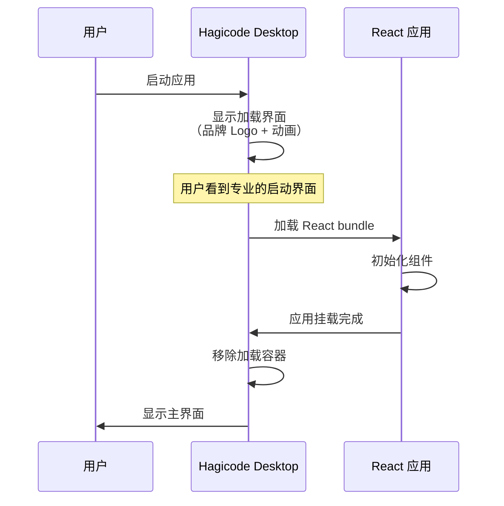
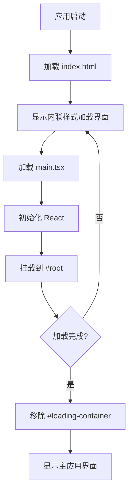
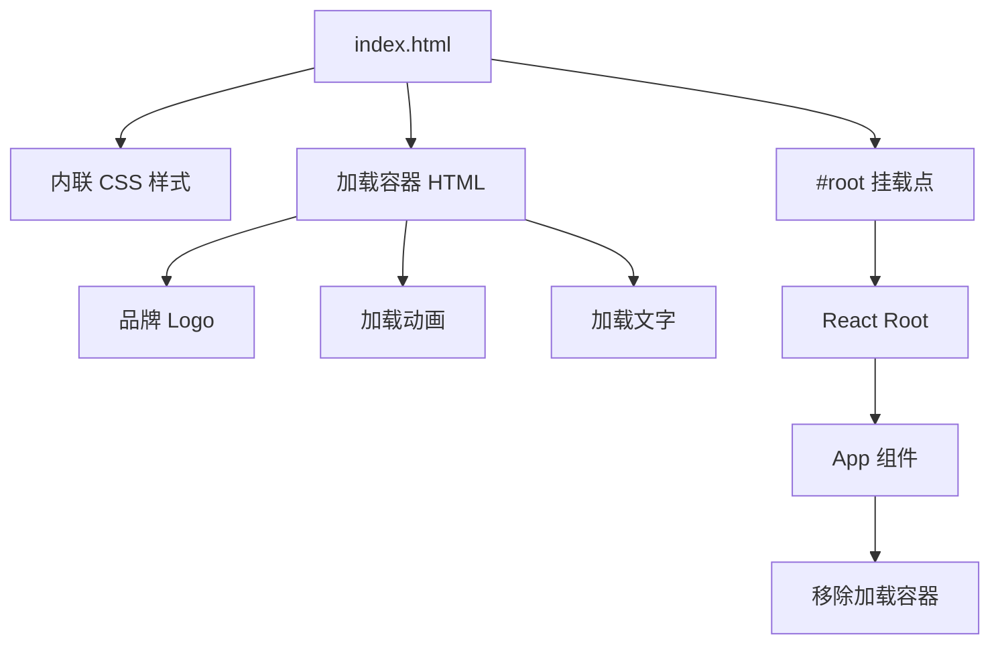

# Change: 改进 Hagicode Desktop 启动加载体验

## Why

当前应用启动时，在 React 应用完全加载和渲染之前，用户会看到纯白色的空白界面，这给用户造成应用卡顿或未响应的错觉，同时无法体现 Hagicode Desktop 的品牌特色。

## What Changes

- 在 index.html 中添加内联 CSS 样式定义启动加载界面样式
- 在 index.html 的 body 中添加加载状态的 HTML 内容（品牌标识、加载动画、加载文字）
- 在 src/renderer/main.tsx 中添加代码，在 React 应用挂载后移除加载容器

## UI Design Changes

### 启动加载界面设计

```
+------------------------------------------+
|                                          |
|                                          |
|             Hagicode Desktop             |
|              (品牌 Logo)                  |
|                                          |
|              ╭────────╮                  |
│             ╱          ╲                 |
│            │    ●       │                |
│             ╲          ╱                 |
│              ╰────────╯                  |
|           (旋转加载动画)                   |
|                                          |
|            正在加载...                    |
|            (加载文字)                     |
|                                          |
|                                          |
+------------------------------------------+
```

**设计元素说明：**
- **背景**：深色渐变背景（#0f172a → #1e293b），与 shadcn/ui 主题色系一致
- **品牌标识**：Hagicode Desktop 文字，白色（#f8fafc），24px，700 字重
- **加载动画**：旋转的圆形边框动画，3px 边框，蓝色高亮（#3b82f6）
- **加载文字**：灰色文字（#94a3b8），14px，显示"正在加载..."

### 用户交互流程



### 状态转换

```
┌─────────────┐     加载成功     ┌─────────────┐
│  加载界面    │ ──────────────> │  主应用界面   │
│ (Loading)   │                  │   (App)     │
└─────────────┘                  └─────────────┘
     │                                    │
     │  加载失败（极端情况）               │
     v                                    v
┌─────────────┐                  ┌─────────────┐
│  错误界面    │                  │  正常运行    │
│ (Error)     │                  │             │
└─────────────┘                  └─────────────┘
```

## Code Flow Changes



### 组件关系



## Impact

- Affected specs: `specs/electron-app/spec.md`
- Affected code: `src/renderer/index.html`, `src/renderer/main.tsx`
- Performance: HTML 文件增加约 1KB（内嵌 CSS 和 HTML），影响可忽略不计
- Risk level: 低风险，仅涉及静态内容添加，不影响核心功能
- Testing required: 在 Windows、macOS、Linux 上验证启动效果
