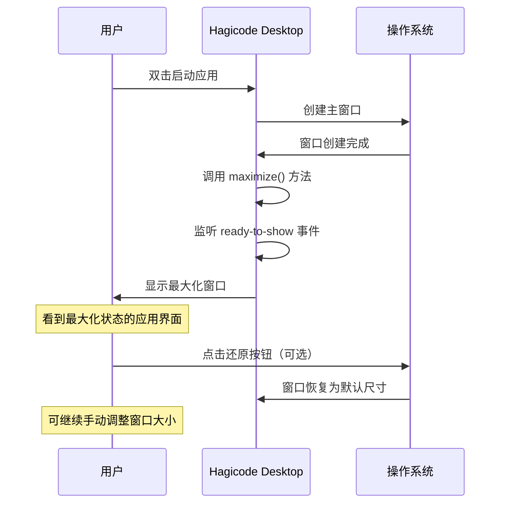
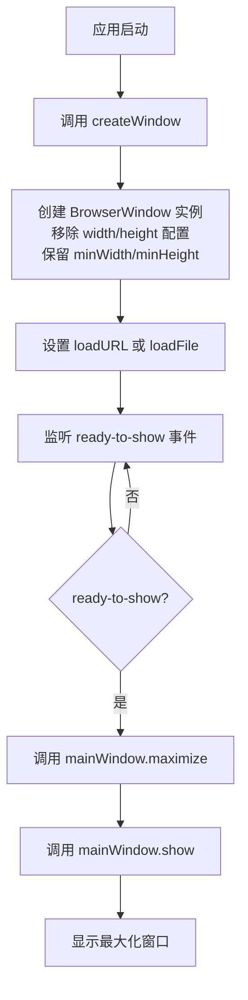
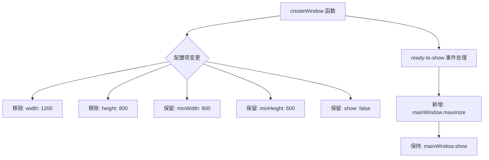

# Change: Electron应用启动默认最大化窗口

## Why

用户反馈 Hagicode Desktop 应用启动时窗口尺寸过小，当前默认窗口尺寸为 1200x800 像素，无法充分利用现代显示器的工作区域，用户需要手动调整窗口大小才能获得良好的使用体验，影响了应用的专业性和用户体验。

## What Changes

- 修改 `src/main/main.ts` 中 `createWindow()` 函数的 `BrowserWindow` 创建配置
- 移除固定窗口尺寸配置（width/height），保留最小窗口尺寸约束（minWidth/minHeight）
- 在窗口显示时调用 `maximize()` 方法使窗口默认以最大化状态启动
- 保持用户后续可自由调整窗口大小的灵活性

## UI Design Changes

### 窗口启动状态对比

**当前状态（Before）：**
```
+------------------------------------------+
|                                          |
|              1200x800                    |
|                                          |
|                                          |
|                                          |
+------------------------------------------+
     ↓ 启动后需要手动拖拽调整
```

**改进后状态（After）：**
```
+----------------------------------------------------------+
|                                                          |
|                                                          |
|                   全屏最大化显示                          |
|                   （充分利用屏幕）                         |
|                                                          |
|                                                          |
|                                                          |
+----------------------------------------------------------+
     ↓ 启动即最大化，用户可选择还原
```

### 用户交互流程



### 状态转换

```
┌─────────────┐      启动应用      ┌─────────────┐
│  应用启动    │ ─────────────────> │  窗口创建    │
│   (Start)    │                    │  (Created)  │
└─────────────┘                     └─────────────┘
                                          │
                                          │ 调用 maximize()
                                          v
                                    ┌─────────────┐
                                    │  最大化显示  │ ──────┐
                                    │ (Maximized)  │       │ 用户点击还原按钮
                                    └─────────────┘       │
                                          │               │
                                          ▼               ▼
                                    ┌─────────────┐ <─────────────┐
                                    │  正常窗口    │                │
                                    │  (Normal)    │ <──────────────┘
                                    └─────────────┘
                                          │
                                          │ 用户再次最大化
                                          v
                                    ┌─────────────┐
                                    │  最大化显示  │
                                    │ (Maximized)  │
                                    └─────────────┘
```

## Code Flow Changes



### 技术实现要点



## Impact

- Affected specs: `specs/electron-app/spec.md`
- Affected code: `src/main/main.ts` (createWindow 函数，约 10 行代码修改)
- Platform coverage: Windows、macOS、Linux 统一体验
- Breaking changes: 无，仅改变默认启动行为
- Backward compatibility: 用户仍可手动调整窗口尺寸，最小尺寸约束保持不变
- Risk level: 低风险，修改范围小且影响明确的启动行为
- Testing required: 在 Windows、macOS、Linux 上验证窗口启动状态
