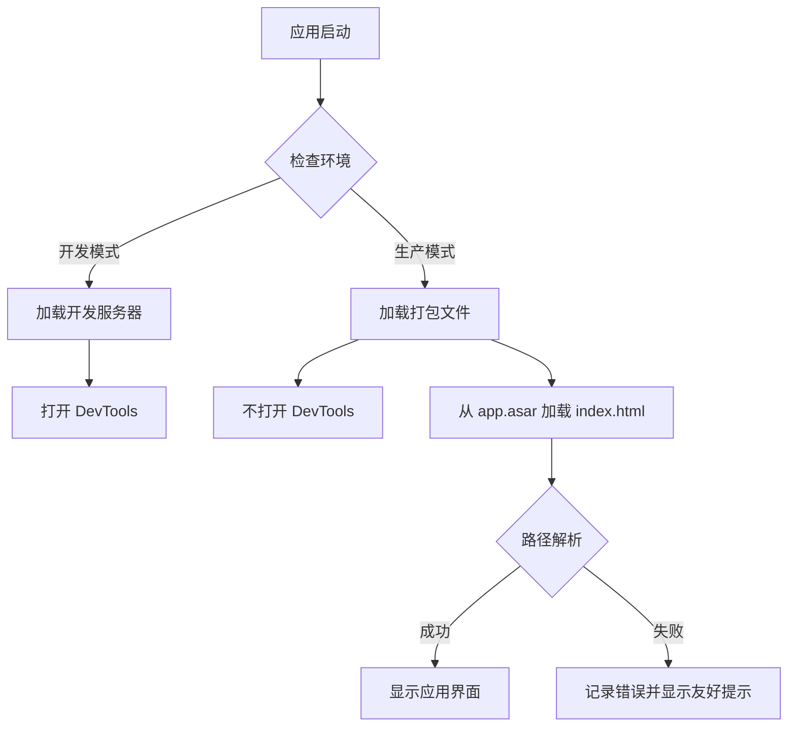

# Change: 修复Electron应用打包后启动问题

## Why

打包后的 Hagicode Desktop 应用启动时存在两个关键问题：

1. **开发控制台自动弹出**：在生产环境中，`mainWindow.webContents.openDevTools()` 被无条件调用，导致 DevTools 在打包版本中自动打开，严重影响用户体验。

2. **本地资源加载失败**：应用尝试从 `app.asar` 归档文件中直接加载 `renderer/index.html`，但 Electron 的安全策略阻止了这种访问方式，导致 "Not allowed to load local resource" 错误，应用无法正常显示界面。

这两个问题阻止了应用在生产环境中的正常使用，必须在发布前修复。

## What Changes

### 主进程窗口配置修改 (src/main/main.ts)

- 移除生产环境中的 `openDevTools()` 调用，仅在开发模式下启用
- 确保 `webPreferences` 配置符合 Electron 安全最佳实践

### 渲染进程加载路径修复

- 验证生产环境下的 `loadFile` 路径解析逻辑
- 确保 Vite 构建产物的正确路径
- 添加路径解析的日志记录以便调试

### electron-builder 配置验证

- 确认 `files` 配置正确包含所有必要文件
- 验证 `asar` 打包设置不会阻止资源访问
- 确认渲染进程构建输出在正确位置

## Impact

- **Affected specs**: `specs/electron-app/spec.md`
- **Affected code**:
  - `src/main/main.ts:56-62` - 窗口创建和 DevTools 配置
  - `electron-builder.yml` - 打包配置

## Code Flow Changes

## Success Criteria

1. 打包后的应用启动时不显示开发控制台
2. 打包后的应用能正确加载渲染进程界面
3. 开发模式下 DevTools 仍然可用
4. 所有平台（Windows、macOS、Linux）的打包版本都能正常启动
