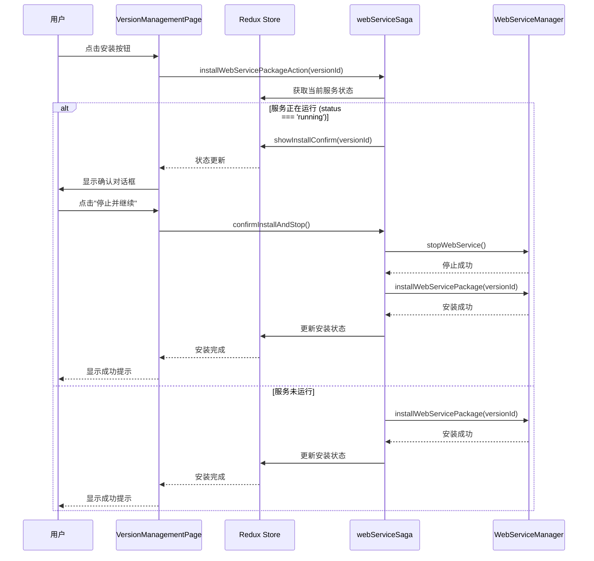
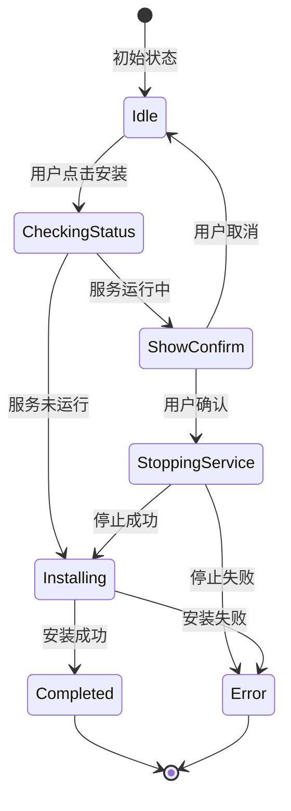

## Context

Hagicode Desktop 是一款基于 Electron 的跨平台桌面应用，提供嵌入式 Web 服务管理功能。当前应用支持**包管理**操作，包括**安装**和**重新安装** NORT 包。这些操作通过 `WebServiceManager` 进行管理，涉及进程启动、停止和状态监控。

### 问题背景

当前在执行**安装**或**重新安装**操作时存在以下问题：

1. **服务未停止**：如果嵌入式 Web 服务正在运行，安装/重装操作不会自动停止服务
2. **缺少确认机制**：没有向用户提供二次确认提示，用户可能意外中断正在运行的服务
3. **潜在冲突**：在服务运行状态下进行安装操作可能导致文件冲突或状态不一致

### 相关系统

- **WebServiceManager**：主进程中的服务管理器，负责启动、停止、重启 Web 服务
- **webServiceSaga**：渲染进程中的 Redux Saga，处理服务相关的异步操作
- **VersionManagementPage**：版本管理页面，包含安装和重装按钮
- **webServiceSlice**：Redux slice，管理服务状态和相关 UI 状态

## Goals / Non-Goals

### Goals

- 在安装/重装操作前检查服务运行状态
- 当服务运行时显示确认对话框，提示用户需要停止服务
- 用户确认后自动停止服务并继续安装流程
- 支持中英文国际化

### Non-Goals

- 不修改服务的启动/停止核心逻辑
- 不改变安装/重装的核心实现
- 不添加服务自动重启功能（用户需手动重启）

## Decisions

### Decision 1: 使用 Redux 管理确认对话框状态

**选择**：在 `webServiceSlice` 中添加确认对话框状态。

**原因**：
- 确认对话框状态与 Web 服务状态紧密相关
- 便于在 saga 中协调停止服务和安装操作
- 与现有状态管理模式一致

**替代方案**：
- 使用 React 组件本地状态：不利于跨组件通信和 saga 协调
- 使用单独的 slice：增加复杂度，状态关联性强

### Decision 2: 使用 shadcn/ui Dialog 组件

**选择**：使用项目已有的 shadcn/ui Dialog 组件。

**原因**：
- 项目已集成 shadcn/ui，无需额外依赖
- 与现有 UI 风格一致
- 组件功能完整，支持无障碍访问

**替代方案**：
- 使用原生 confirm/alert：用户体验差，不符合现代 UI 标准
- 自定义对话框：增加开发成本

### Decision 3: 在 Saga 中实现状态检查和流程协调

**选择**：在 `installWebServicePackageSaga` 中添加状态检查逻辑。

**原因**：
- Saga 已处理安装相关的异步操作
- 便于协调停止服务和安装操作的时序
- 可以轻松处理错误和重试逻辑

**替代方案**：
- 在组件中处理：增加组件复杂度，不利于状态同步
- 使用 thunks：Saga 已有完整的事件处理机制

## UI/UX Design

### 确认对话框 UI

```
┌──────────────────────────────────────────────────────────────────────────┐
│  ⚠️ 停止服务确认                                                          │
├──────────────────────────────────────────────────────────────────────────┤
│                                                                          │
│  Hagicode 服务正在运行中。                                                │
│                                                                          │
│  安装或重装操作需要停止服务。继续操作将：                                 │
│                                                                          │
│  • 停止当前正在运行的 Hagicode 服务                                       │
│  • 中断所有正在进行的请求                                                 │
│  • 执行安装/重装操作                                                      │
│                                                                          │
│  安装完成后，您需要手动重新启动服务。                                      │
│                                                                          │
│  是否继续？                                                               │
│                                                                          │
├──────────────────────────────────────────────────────────────────────────┤
│                                    [取消]  [停止并继续]                  │
└──────────────────────────────────────────────────────────────────────────┘
```

### 用户交互流程



### 状态转换



## Technical Design

### Redux 状态结构

```typescript
// webServiceSlice.ts 新增状态
interface WebServiceState {
  // ... 现有状态

  // 新增：确认对话框状态
  showInstallConfirm: boolean;      // 是否显示确认对话框
  pendingInstallVersion: string | null;  // 待安装的版本 ID
}
```

### Redux Actions

```typescript
// 新增 actions
showInstallConfirm: (state, action: PayloadAction<string>) => {
  state.showInstallConfirm = true;
  state.pendingInstallVersion = action.payload;
},

hideInstallConfirm: (state) => {
  state.showInstallConfirm = false;
  state.pendingInstallVersion = null;
},
```

### Saga 流程

```typescript
// 修改后的安装 saga
function* installWebServicePackageSaga(action: { type: string; payload: string }) {
  const version = action.payload;

  try {
    // 1. 检查服务状态
    const currentStatus = yield select(selectWebServiceStatus);

    // 2. 如果服务正在运行，显示确认对话框
    if (currentStatus === 'running') {
      yield put(showInstallConfirm(version));
      return;  // 等待用户确认
    }

    // 3. 服务未运行，直接安装
    yield call(doInstallPackage, version);
  } catch (error) {
    // 错误处理
  }
}

// 新增：确认后安装 saga
function* installAfterStopSaga() {
  try {
    const version = yield select(selectPendingInstallVersion);

    if (!version) {
      return;
    }

    // 1. 停止服务
    yield put(stopWebServiceAction());

    // 2. 等待服务停止完成
    yield take((action: any) =>
      action.type === 'webService/setStatus' &&
      action.payload === 'stopped'
    );

    // 3. 执行安装
    yield call(doInstallPackage, version);

    // 4. 隐藏确认对话框
    yield put(hideInstallConfirm());
  } catch (error) {
    // 错误处理
    yield put(hideInstallConfirm());
  }
}

// 辅助函数：执行安装
function* doInstallPackage(version: string) {
  yield put(setInstallProgress({ stage: 'verifying', progress: 0, message: 'Starting installation...' }));

  const success = yield call(window.electronAPI.installWebServicePackage, version);

  if (success) {
    yield put(setInstallProgress({ stage: 'completed', progress: 100, message: 'Installation completed' }));
    yield put(checkPackageInstallationAction());
    yield put(fetchWebServiceVersionAction());
  } else {
    yield put(setInstallProgress({ stage: 'error', progress: 0, message: 'Installation failed' }));
    yield put(setError('Failed to install package'));
  }
}
```

### 组件集成

```typescript
// VersionManagementPage.tsx
const showInstallConfirm = useSelector(selectShowInstallConfirm);
const pendingVersion = useSelector(selectPendingInstallVersion);
const dispatch = useDispatch();

// 确认对话框
<Dialog open={showInstallConfirm} onOpenChange={(open) => {
  if (!open) dispatch(hideInstallConfirm());
}}>
  <DialogContent>
    <DialogHeader>
      <DialogTitle>{t('installConfirm.title')}</DialogTitle>
      <DialogDescription>
        {t('installConfirm.description')}
      </DialogDescription>
    </DialogHeader>
    <DialogFooter>
      <Button
        variant="outline"
        onClick={() => dispatch(hideInstallConfirm())}
      >
        {t('installConfirm.cancel')}
      </Button>
      <Button
        onClick={() => dispatch(confirmInstallAndStop())}
      >
        {t('installConfirm.confirm')}
      </Button>
    </DialogFooter>
  </DialogContent>
</Dialog>
```

### 文件变更清单

| 文件路径 | 变更类型 | 说明 |
|---------|---------|------|
| `src/renderer/store/slices/webServiceSlice.ts` | 修改 | 添加确认对话框状态和 actions |
| `src/renderer/store/sagas/webServiceSaga.ts` | 修改 | 添加状态检查和确认后安装逻辑 |
| `src/renderer/components/VersionManagementPage.tsx` | 修改 | 集成确认对话框组件 |
| `src/renderer/components/InstallConfirmDialog.tsx` | 新增 | 确认对话框组件 |
| `src/renderer/i18n/locales/zh-CN/components.json` | 修改 | 添加中文翻译 |
| `src/renderer/i18n/locales/en-US/components.json` | 修改 | 添加英文翻译 |

### 国际化键值

```json
{
  "installConfirm": {
    "title": "停止服务确认",
    "description": "Hagicode 服务正在运行中。安装或重装操作需要停止服务。",
    "warnings": {
      "stopService": "停止当前正在运行的 Hagicode 服务",
      "interruptRequests": "中断所有正在进行的请求",
      "manualRestart": "安装完成后，您需要手动重新启动服务"
    },
    "cancel": "取消",
    "confirm": "停止并继续"
  }
}
```

## Risks / Trade-offs

### 风险

| 风险 | 影响 | 缓解措施 |
|------|------|----------|
| 服务停止失败 | 用户无法完成安装 | 提供清晰的错误提示，允许重试 |
| 状态同步问题 | 对话框状态与服务状态不一致 | 使用 Redux 统一管理状态，确保单一数据源 |
| 并发操作 | 用户连续点击多个按钮 | 在操作进行中禁用按钮，防止并发操作 |

### 权衡

| 决策 | 优点 | 缺点 | 选择 |
|------|------|------|------|
| 确认后自动安装 | 流程自动化，减少用户操作 | 用户可能期望手动启动安装 | ✅ 选择：自动化流程更流畅 |
| 安装后不自动启动 | 避免意外启动服务 | 用户需要额外步骤 | ✅ 选择：安全优先 |

## Migration Plan

### 实施步骤

1. **阶段 1：状态管理**（1-2 小时）
   - 在 `webServiceSlice.ts` 中添加确认对话框状态
   - 添加相关的 actions 和 selectors

2. **阶段 2：Saga 逻辑**（2-3 小时）
   - 修改 `installWebServicePackageSaga` 添加状态检查
   - 实现 `installAfterStopSaga` 协调停止和安装
   - 添加错误处理逻辑

3. **阶段 3：UI 组件**（1-2 小时）
   - 创建 `InstallConfirmDialog.tsx` 组件
   - 集成到 `VersionManagementPage.tsx`

4. **阶段 4：国际化**（30 分钟）
   - 添加中英文翻译

5. **阶段 5：测试**（1-2 小时）
   - 手动测试各种场景
   - 边界情况测试

### 回滚计划

如果实现出现问题，可以通过以下方式回滚：

1. 移除新增的状态字段和 actions
2. 恢复原有的 `installWebServicePackageSaga` 实现
3. 移除确认对话框组件
4. 清理国际化键值

## Open Questions

无
