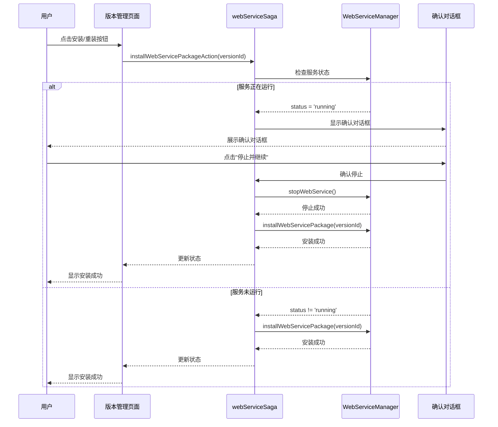
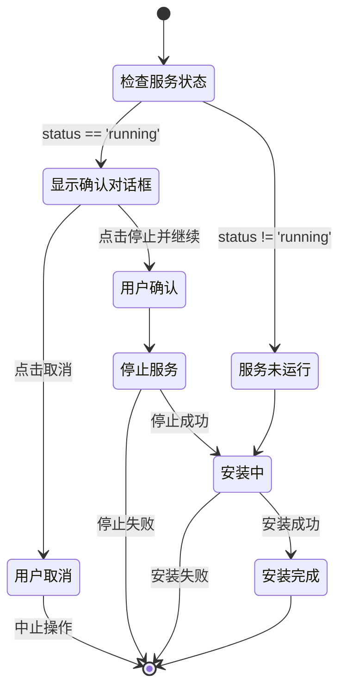
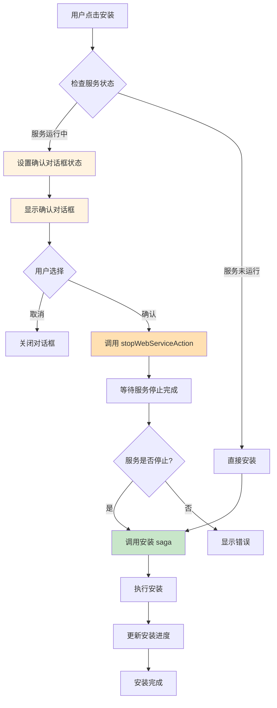

# Change: 安装/重装前停止服务确认对话框

## Why

当前在执行安装或重新安装 NORT 包时，如果嵌入式 Web 服务正在运行，存在以下问题：

1. **服务未自动停止**：安装/重装操作不会自动停止正在运行的服务
2. **缺少确认机制**：用户可能意外中断正在运行的服务，造成数据丢失或状态不一致
3. **潜在冲突风险**：在服务运行状态下进行安装操作可能导致文件冲突或配置错误

这违反了用户的操作预期，用户期望在执行可能影响服务运行的操作时得到明确提示和确认。

## What Changes

- **服务状态前置检查**：在安装/重装操作前检查 Web 服务运行状态
- **二次确认对话框**：当服务正在运行时，向用户展示确认对话框
- **自动停止服务**：用户确认后自动停止服务，然后继续安装流程
- **国际化支持**：添加中英文确认对话框文案

## UI Design Changes

### 确认对话框 UI

```
┌──────────────────────────────────────────────────────────────────────────┐
│  ⚠️ 停止服务确认                                                          │
├──────────────────────────────────────────────────────────────────────────┤
│                                                                          │
│  Hagicode 服务正在运行中。                                                │
│                                                                          │
│  安装或重装操作需要停止服务。继续操作将：                                 │
│                                                                          │
│  • 停止当前正在运行的 Hagicode 服务                                       │
│  • 中断所有正在进行的请求                                                 │
│  • 执行安装/重装操作                                                      │
│                                                                          │
│  安装完成后，您需要手动重新启动服务。                                      │
│                                                                          │
│  是否继续？                                                               │
│                                                                          │
├──────────────────────────────────────────────────────────────────────────┤
│                                    [取消]  [停止并继续]                  │
└──────────────────────────────────────────────────────────────────────────┘
```

### 用户交互流程



## Code Flow Changes

### 安装/重装流程状态机



### Redux 状态管理流程



## Impact

### Affected specs
- `specs/electron-app/spec.md` - 添加服务操作确认相关需求

### Affected code
- `src/renderer/store/sagas/webServiceSaga.ts` - 添加服务状态检查和确认逻辑
- `src/renderer/components/VersionManagementPage.tsx` - 集成确认对话框组件
- `src/renderer/store/slices/webServiceSlice.ts` - 添加确认对话框状态管理
- `src/renderer/i18n/locales/en-US/components.json` - 添加英文翻译
- `src/renderer/i18n/locales/zh-CN/components.json` - 添加中文翻译

### User impact

**正面影响**：
- 防止用户意外中断正在运行的服务
- 提供清晰的操作反馈和确认机制
- 减少因状态不一致导致的用户困惑
- 符合用户对关键操作确认的预期

**无负面影响**：
- 不影响现有安装流程的正常执行
- 对已停止的服务无任何额外操作

### Risk assessment
- **低风险**：变更主要涉及用户交互流程，不改变核心安装逻辑
- **向后兼容**：不影响现有 API 接口
- **可测试性**：确认对话框功能易于手动测试

### Breaking changes
无破坏性变更，所有现有功能保持兼容。

## Status: ExecutionCompleted

### Implementation Summary

已成功实现安装/重装前停止服务确认对话框功能，具体包括：

1. **Redux 状态管理** (`src/renderer/store/slices/webServiceSlice.ts`):
   - 添加了 `showInstallConfirm` 和 `pendingInstallVersion` 状态字段
   - 添加了 `showInstallConfirm` 和 `hideInstallConfirm` actions
   - 添加了相应的 selectors

2. **Saga 逻辑更新** (`src/renderer/store/sagas/webServiceSaga.ts`):
   - 修改了 `installWebServicePackageSaga`，在安装前检查服务状态
   - 新增了 `confirmInstallAndStopSaga`，处理用户确认后的停止和安装流程
   - 新增了 `doInstallPackage` 辅助函数，执行实际安装逻辑
   - 添加了 `CONFIRM_INSTALL_AND_STOP` action type 和 creator

3. **UI 组件** (`src/renderer/components/InstallConfirmDialog.tsx`):
   - 创建了确认对话框组件，使用 shadcn/ui Dialog
   - 集成了 Redux 状态管理和 actions
   - 在 `App.tsx` 中全局添加了对话框组件

4. **国际化支持**:
   - 在 `en-US/components.json` 中添加了英文翻译
   - 在 `zh-CN/components.json` 中添加了中文翻译

5. **主进程 IPC 处理器** (`src/main/main.ts`):
   - 添加了 `install-web-service-package` IPC 处理器
   - 添加了 `check-package-installation` IPC 处理器
   - 添加了 `get-available-versions` 和 `get-platform` IPC 处理器

### 测试状态
- 构建测试通过 (TypeScript 编译无错误)
- 所有任务已完成
