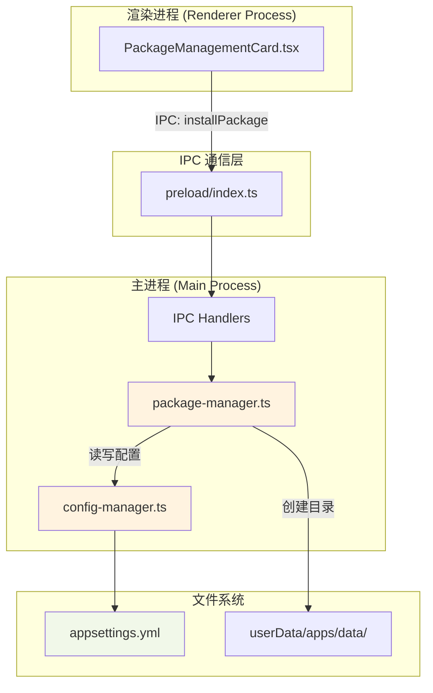
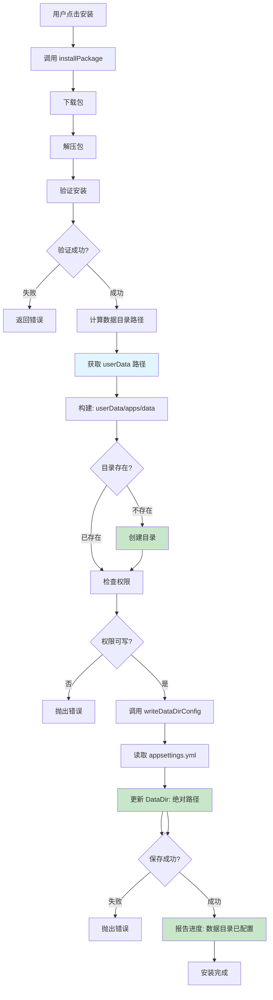

# Design: 安装向导数据目录配置

## Context

Hagicode Desktop 当前未在安装时配置数据存储目录位置。`appsettings.yml` 中的 `DataDir` 配置项需要手动设置，这导致数据存储位置不明确，不利于数据管理和迁移。

### Stakeholders
- **最终用户**：需要明确知道数据存储位置，便于数据备份和迁移
- **技术支持**：需要统一的配置方式，降低支持成本
- **开发者**：需要清晰的配置管理代码，便于维护

### Constraints
- 必须保持与现有安装方式的向后兼容
- 必须支持跨平台（Windows/macOS/Linux）
- 必须支持国际化（中英文）- 用于进度提示
- 数据目录路径固定为 `<userData>/apps/data`，不需要用户手动选择

## Goals / Non-Goals

### Goals
1. 在安装流程中自动配置数据目录
2. 使用固定的路径 `<userData>/apps/data`（userData 为 Electron 的用户数据目录）
3. 自动创建目录并设置正确权限
4. 自动更新 `appsettings.yml` 配置（写入绝对路径）
5. 在安装进度中显示数据目录配置状态
6. 提供清晰的错误处理和用户反馈
7. 支持跨平台路径处理
8. 中英文国际化支持（用于进度提示）

### Non-Goals
- **不支持用户手动选择数据目录** - 路径固定为 `<userData>/apps/data`
- 不支持多数据目录配置
- 不支持数据目录迁移（仅初始配置）
- 不修改已安装包的数据目录位置
- 不提供数据目录的高级配置（如权限、配额等）
- **不需要安装向导 UI** - 配置自动进行

## Decisions

### Decision 1: 使用 userData 目录而非安装目录

**选择**：使用 Electron 的 `userData` 目录，路径为 `<userData>/apps/data`，在安装时自动配置。

**原因**：
- `userData` 是 Electron 应用存储用户数据的标准位置
- 与应用安装分离，便于应用更新和迁移
- 路径固定且可预测，便于支持和维护
- 自动化配置，无需用户干预

**替代方案**：使用安装目录下的 `apps/data`
- **优点**：数据和程序在一起
- **缺点**：可能受安装目录权限限制，不利于应用更新

**替代方案**：提供安装向导让用户选择数据目录
- **优点**：用户可自定义位置
- **缺点**：增加复杂度，用户可能选择不当路径

### Decision 2: 在安装流程中自动配置而非单独步骤

**选择**：在 `installPackage()` 方法中，安装验证成功后自动配置数据目录。

**原因**：
- 不增加安装步骤或 UI 组件
- 对用户透明，无需额外操作
- 配置与安装流程紧密关联，逻辑清晰

**替代方案**：添加独立的安装向导步骤
- **优点**：用户可了解配置过程
- **缺点**：增加安装复杂度和时间

### Decision 3: 使用绝对路径而非相对路径

**选择**：在 `appsettings.yml` 中写入绝对路径（`<userData>/apps/data` 的完整路径）。

**原因**：
- `userData` 路径由 Electron 管理，使用绝对路径更明确
- 避免相对路径解析的歧义
- 便于调试和日志记录
- Web 服务可以直接使用配置中的路径

**替代方案**：写入相对路径
- **优点**：配置文件更简洁
- **缺点**：需要定义相对路径的基准目录，增加复杂度

### Decision 4: 配置管理使用专用辅助类

**选择**：创建 `ConfigManager` 类处理 YAML 配置读写。

**原因**：
- 分离配置管理逻辑，提高可测试性
- 便于复用和扩展
- 集中处理 YAML 格式和错误

**替代方案**：在包管理器中直接处理
- **优点**：代码集中
- **缺点**：职责混杂，难以测试

## Technical Design

### 架构设计



### 数据流设计



### API 设计

#### package-manager.ts API

```typescript
class PCodePackageManager {
  // ... 现有方法

  /**
   * 确保数据目录存在
   * @returns 数据目录绝对路径
   */
  private async ensureDataDirExists(): Promise<string>;

  /**
   * 写入数据目录配置到 appsettings.yml
   * @param installPath 安装路径（用于定位 appsettings.yml）
   * @param dataDir 数据目录绝对路径
   */
  private async writeDataDirConfig(installPath: string, dataDir: string): Promise<void>;
}
```

#### config-manager.ts API

```typescript
interface AppConfig {
  DataDir?: string;
  [key: string]: any;
}

class ConfigManager {
  /**
   * 读取 appsettings.yml
   * @param configPath 配置文件路径
   * @returns 配置对象
   */
  async readConfig(configPath: string): Promise<AppConfig>;

  /**
   * 写入 appsettings.yml
   * @param configPath 配置文件路径
   * @param config 配置对象
   */
  async writeConfig(configPath: string, config: AppConfig): Promise<void>;

  /**
   * 更新 DataDir 配置
   * @param installPath 安装路径（用于定位 appsettings.yml）
   * @param dataDir 数据目录绝对路径
   */
  async updateDataDir(installPath: string, dataDir: string): Promise<void>;
}
```

### 实现细节

#### installPackage 方法变更

```typescript
async installPackage(
  packageFilename: string,
  onProgress?: (progress: InstallProgress) => void
): Promise<boolean> {
  // ... 现有的下载、解压、验证逻辑 ...

  // 新增：自动配置数据目录
  try {
    onProgress?.({
      stage: 'configuring',
      progress: 95,
      message: '配置数据目录...'
    });

    // 确保数据目录存在（使用 userData 路径）
    const dataDir = await this.ensureDataDirExists();

    // 获取安装路径（用于定位 appsettings.yml）
    const paths = this.getPaths();
    const installPath = path.join(paths.installed, targetPlatform);

    // 更新配置文件（传入绝对路径）
    await this.writeDataDirConfig(installPath, dataDir);

    onProgress?.({
      stage: 'configuring',
      progress: 100,
      message: `数据目录已配置：${dataDir}`
    });
  } catch (error) {
    log.error('[PackageManager] Failed to configure data directory:', error);
    // 配置失败不影响安装成功，但记录错误
  }

  // ... 继续现有流程 ...
}
```

#### ensureDataDirExists 实现

```typescript
private async ensureDataDirExists(): Promise<string> {
  // 使用 Electron 的 userData 目录
  const userDataDir = app.getPath('userData');
  const dataDir = path.join(userDataDir, 'apps', 'data');

  try {
    // 检查目录是否存在
    await fs.access(dataDir);
  } catch {
    // 目录不存在，创建它
    await fs.mkdir(dataDir, { recursive: true });
    log.info('[PackageManager] Created data directory:', dataDir);
  }

  return dataDir;
}
```

#### writeDataDirConfig 实现

```typescript
private async writeDataDirConfig(
  installPath: string,
  dataDir: string
): Promise<void> {
  const configManager = new ConfigManager();
  await configManager.updateDataDir(installPath, dataDir);
  log.info('[PackageManager] DataDir configured:', dataDir);
}
```

#### ConfigManager 实现

```typescript
import yaml from 'js-yaml';
import fs from 'fs/promises';
import path from 'node:path';

class ConfigManager {
  async readConfig(configPath: string): Promise<any> {
    const content = await fs.readFile(configPath, 'utf-8');
    return yaml.load(content);
  }

  async writeConfig(configPath: string, config: any): Promise<void> {
    const content = yaml.dump(config, {
      indent: 2,
      lineWidth: -1,
      sortKeys: false
    });
    await fs.writeFile(configPath, content, 'utf-8');
  }

  async updateDataDir(installPath: string, dataDir: string): Promise<void> {
    const configPath = path.join(installPath, 'appsettings.yml');
    const config = await this.readConfig(configPath);
    config.DataDir = dataDir;
    await this.writeConfig(configPath, config);
  }
}
```

### 配置文件格式

#### appsettings.yml 示例

```yaml
# appsettings.yml
DataDir: /absolute/path/to/userData/apps/data

# 其他现有配置...
```

**注意**：使用绝对路径（`<userData>/apps/data` 的完整路径）。

## UI 变更

### 安装进度显示

由于配置自动进行，主要 UI 变更是在安装进度中显示数据目录配置状态：

```
┌──────────────────────────────────────────────────────────────────────────┐
│  安装 Web 服务包                                                         │
├──────────────────────────────────────────────────────────────────────────┤
│  正在安装...                                                              │
│                                                                          │
│  ✓ 下载完成                                                              │
│  ✓ 解压完成                                                              │
│  ✓ 验证完成                                                              │
│  → 正在配置数据目录...                                                   │
│                                                                          │
│  数据目录将创建于：<用户数据目录>/apps/data                                 │
│                                                                          │
├──────────────────────────────────────────────────────────────────────────┤
│                                    [取消]                                │
└──────────────────────────────────────────────────────────────────────────┘
```

### 错误提示 UI

**配置失败提示**：

```
┌──────────────────────────────────────────────────────────────────────────┐
│  ⚠ 安装警告                                                              │
├──────────────────────────────────────────────────────────────────────────┤
│                                                                          │
│  包已成功安装，但数据目录配置失败。                                       │
│                                                                          │
│  错误：无法写入配置文件                                                  │
│                                                                          │
│  您可以手动编辑 appsettings.yml 添加以下配置：                           │
│  DataDir: <userData>/apps/data                                           │
│                                                                          │
├──────────────────────────────────────────────────────────────────────────┤
│                                           [确定]                        │
└──────────────────────────────────────────────────────────────────────────┘
```

## Risks / Trade-offs

### Risk 1: 跨平台路径兼容性

**风险**：不同操作系统的路径格式差异可能导致配置问题。

**缓解措施**：
- 使用 Node.js 的 `path` 模块处理所有路径操作
- 使用 `path.join()` 而非字符串拼接
- 在配置文件中使用相对路径，避免平台特定路径

### Risk 2: userData 目录权限问题

**风险**：userData 目录可能没有创建子目录的权限。

**缓解措施**：
- Electron 的 userData 目录通常有足够权限
- 在安装前验证目录权限
- 提供清晰的错误提示
- 配置失败不影响安装成功（仅记录警告）

### Risk 3: YAML 配置文件损坏

**风险**：写入配置时可能失败，导致配置文件损坏。

**缓解措施**：
- 写入前验证 YAML 格式
- 捕获写入错误，不影响安装流程
- 提供手动配置指引

### Trade-off 1: 简化实现 vs 灵活性

**权衡**：固定路径简化实现，但失去用户自定义能力。

**决策**：
- 选择简化实现，因为：
  - 大多数用户不需要自定义数据目录
  - 固定路径便于支持和维护
  - 可以通过高级配置（未来）支持自定义

### Trade-off 2: 自动配置 vs 透明度

**权衡**：自动配置减少用户操作，但用户可能不清楚配置内容。

**决策**：
- 选择自动配置，但在安装进度中显示配置信息
- 提供清晰的文档说明数据目录位置

## Migration Plan

### 现有安装兼容处理

1. **检测现有配置**
   - 检查 `appsettings.yml` 是否存在 `DataDir` 配置
   - 如果不存在，自动添加默认路径

2. **自动修复**
   - 在包管理器初始化时检查已安装包的配置
   - 如果缺少 `DataDir`，自动写入默认值（`<userData>/apps/data` 的绝对路径）
   - 记录修复日志

3. **渐进式升级**
   - 不强制现有用户重新安装
   - 下次安装时自动应用新配置

### 回滚计划

1. **配置回滚**
   - 如果新配置导致问题，可以移除 `DataDir` 配置项
   - 应用回退到原有行为

2. **代码回滚**
   - 移除 `ensureDataDirExists` 和 `writeDataDirConfig` 调用
   - 保留辅助类以便将来使用

## Open Questions

1. **是否需要支持自定义数据目录？**
   - 当前不支持，路径固定为 `<userData>/apps/data`
   - 如果需要，可以在未来添加高级配置选项

2. **配置失败是否应该阻止安装？**
   - 当前决定不阻止安装，仅记录警告
   - 用户可以手动配置或重新安装

3. **是否需要数据目录迁移功能？**
   - 当前不支持迁移已有数据
   - 如果需要，可以作为后续功能添加

4. **userData 路径在不同平台上的位置？**
   - Windows: `%APPDATA%/hagicode-desktop`
   - macOS: `~/Library/Application Support/hagicode-desktop`
   - Linux: `~/.config/hagicode-desktop`
   - 数据目录完整路径为上述路径下的 `apps/data`
