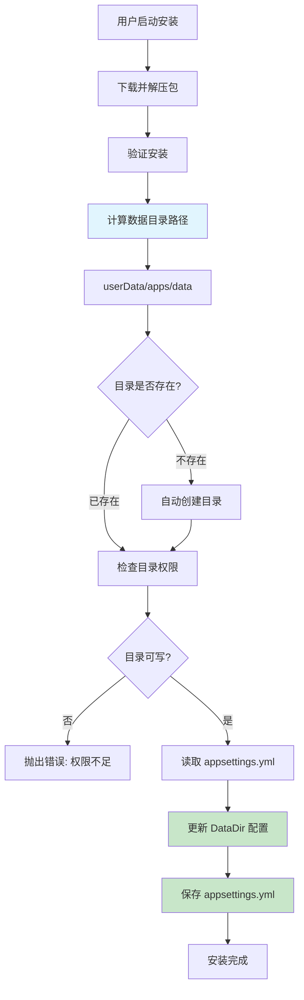
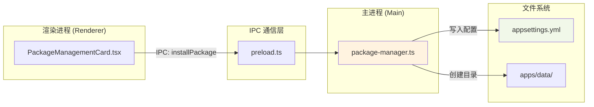

# Change: 安装向导增加数据目录配置步骤

## Why

当前 Hagicode Desktop 的 Web 服务包安装流程未配置数据存储目录位置。这导致：
- 数据文件存储位置不明确，不利于统一管理
- 用户不知道数据存储在哪里
- 不利于数据备份和迁移

## What Changes

- **自动配置数据目录**：在安装时自动设置固定的数据目录路径 `<userData>/apps/data`
- **自动创建目录**：如数据目录不存在，自动创建
- **跨平台路径处理**：使用 `path.join()` 确保跨平台路径兼容性
- **更新 appsettings.yml**：自动写入 `DataDir` 配置项（值为绝对路径）
- **国际化支持**：添加中英文翻译文本（用于安装进度提示）

## 设计原则

### 简化原则
- **无需用户干预**：数据目录路径固定为 `<userData>/apps/data`，不需要用户手动选择或输入
- **透明化**：在安装进度中显示数据目录位置信息，让用户了解数据存储位置
- **自动化**：自动创建目录和配置，减少用户操作步骤

### 实现方式
- 在 `package-manager.ts` 的 `installPackage()` 方法中自动处理数据目录配置
- 使用 `app.getPath('userData')` 获取用户数据目录
- 数据目录路径为 `<userData>/apps/data`（绝对路径）
- 在安装完成后将 `DataDir` 写入 `appsettings.yml`

## 代码流程变更

### 简化的数据流



### 组件交互图



### 代码变更清单

| 文件路径 | 变更类型 | 变更原因 | 影响范围 |
|---------|---------|---------|---------|
| `src/main/package-manager.ts` | 修改 | 在安装流程中自动配置数据目录 | 包管理逻辑 |
| `src/renderer/i18n/locales/zh-CN/components.json` | 修改 | 添加数据目录相关的中文翻译（用于提示信息） | 国际化 |
| `src/renderer/i18n/locales/en-US/components.json` | 修改 | 添加数据目录相关的英文翻译（用于提示信息） | 国际化 |

### 详细变更 - package-manager.ts

| 方法/属性 | 变更类型 | 具体变更 | 变更原因 |
|----------|---------|---------|---------|
| installPackage | 修改 | 在安装完成后自动配置数据目录 | 自动化数据目录设置 |
| writeDataDirConfig | 新增方法 | `writeDataDirConfig(installPath: string): Promise<void>` | 更新 appsettings.yml |

**核心实现逻辑**：

```typescript
// 在 installPackage 方法中，安装验证成功后：
async installPackage(packageFilename: string, onProgress?: ...): Promise<boolean> {
  // ... 现有的下载、解压、验证逻辑 ...

  // 新增：自动配置数据目录
  // 使用 userData 路径而非安装目录路径
  const userDataDir = app.getPath('userData');
  const dataDir = path.join(userDataDir, 'apps', 'data');

  // 创建数据目录
  await fs.mkdir(dataDir, { recursive: true });

  // 获取安装路径（用于更新 appsettings.yml）
  const paths = this.getPaths();
  const installPath = path.join(paths.installed, targetPlatform);

  // 更新 appsettings.yml（写入绝对路径）
  await this.writeDataDirConfig(installPath, dataDir);

  // ... 继续现有流程 ...
}
```

### 详细变更 - 国际化文件

由于无需用户手动配置，国际化内容仅用于安装进度提示和错误消息。

#### zh-CN 新增翻译键

```json
{
  "packageManagement": {
    "dataDirectory": {
      "configuring": "正在配置数据目录...",
      "configured": "数据目录已配置：{{path}}",
      "error": {
        "creationFailed": "无法创建数据目录：{{path}}",
        "permissionDenied": "无权限访问数据目录",
        "configWriteFailed": "无法写入配置文件"
      }
    }
  }
}
```

#### en-US 新增翻译键

```json
{
  "packageManagement": {
    "dataDirectory": {
      "configuring": "Configuring data directory...",
      "configured": "Data directory configured: {{path}}",
      "error": {
        "creationFailed": "Failed to create data directory: {{path}}",
        "permissionDenied": "Permission denied accessing data directory",
        "configWriteFailed": "Failed to write configuration file"
      }
    }
  }
}
```

## UI 变更说明

由于数据目录自动配置，**不需要添加新的 UI 组件**。

安装向导保持现有流程，仅在安装进度中显示数据目录配置状态：

```
┌──────────────────────────────────────────────────────────────────────────┐
│  安装 Web 服务包                                                         │
├──────────────────────────────────────────────────────────────────────────┤
│  正在安装...                                                              │
│                                                                          │
│  ✓ 下载完成                                                              │
│  ✓ 解压完成                                                              │
│  ✓ 验证完成                                                              │
│  → 正在配置数据目录...                                                   │
│                                                                          │
│  数据目录将创建于：<用户数据目录>/apps/data                                 │
│                                                                          │
├──────────────────────────────────────────────────────────────────────────┤
│                                    [取消]                                │
└──────────────────────────────────────────────────────────────────────────┘
```

## Impact

### Affected specs
- `specs/package-management/spec.md` - 添加数据目录自动配置相关需求

### Affected code
- `src/main/package-manager.ts` - 包安装流程，添加自动配置逻辑
- `src/renderer/i18n/locales/` - 国际化翻译文件（仅提示信息）

### User impact
- **正面影响**：
  - 数据目录位置透明明确
  - 自动创建和配置，无需用户干预
  - 便于数据备份和迁移（位置固定且已知）
  - 安装流程更流畅，无额外步骤

- **无负面影响**：
  - 不增加安装步骤或复杂度
  - 不需要用户理解额外配置概念

### Migration considerations
- 对于已有安装，需要保持向后兼容：
  - 如果 `appsettings.yml` 中不存在 `DataDir` 配置，首次启动时自动写入默认路径
  - 不强制现有用户重新配置数据目录
