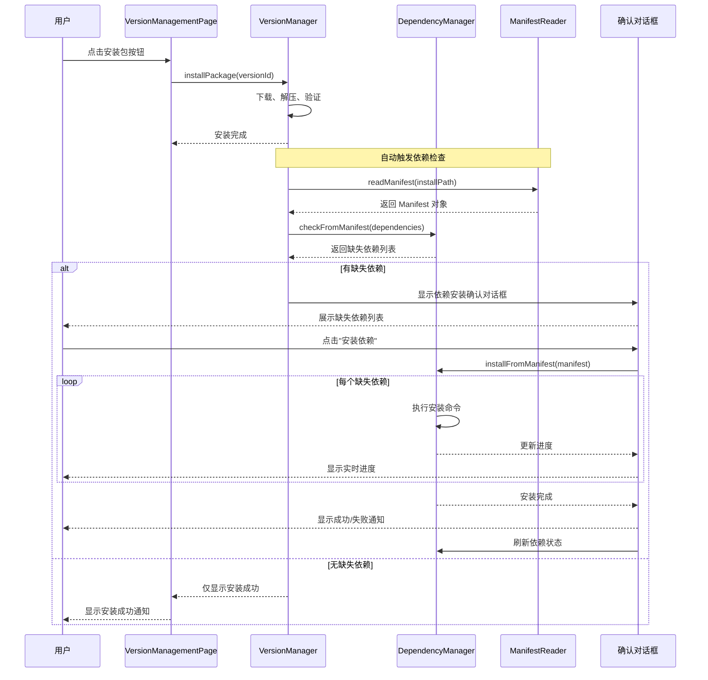
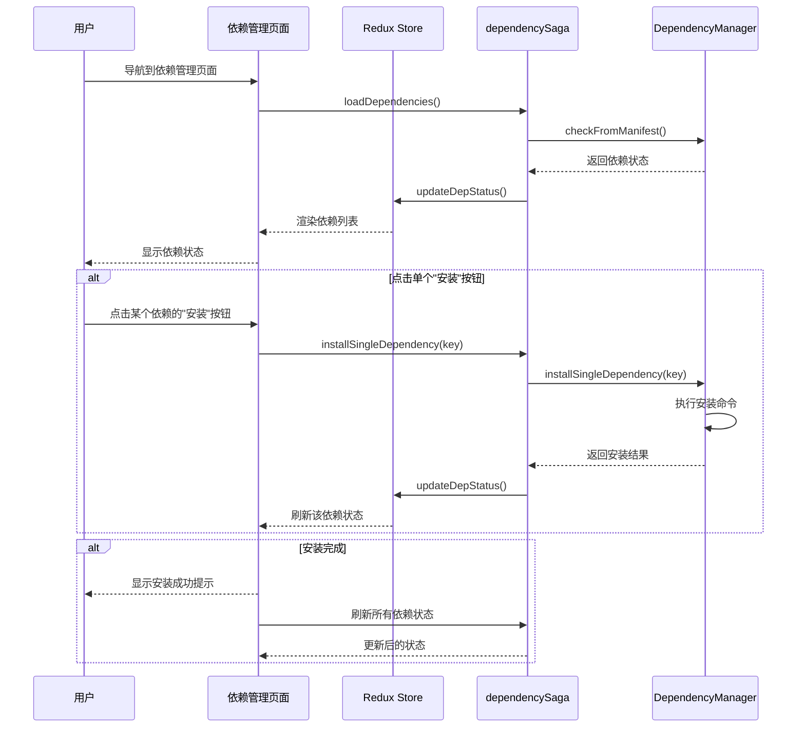
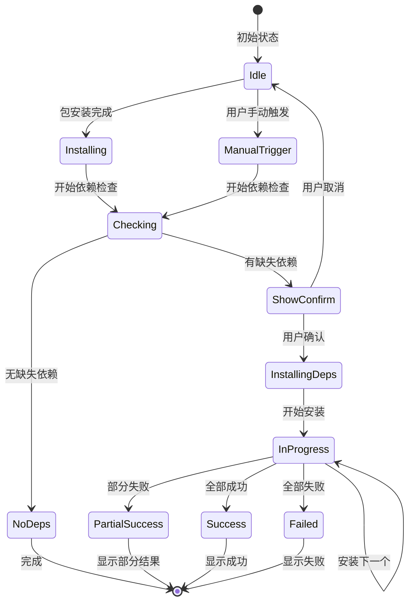
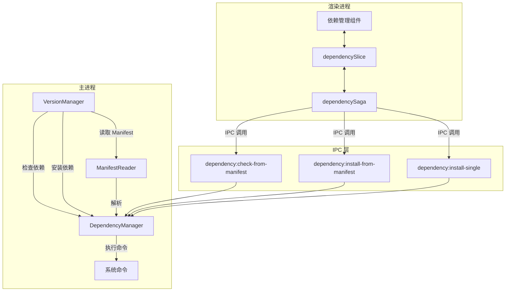
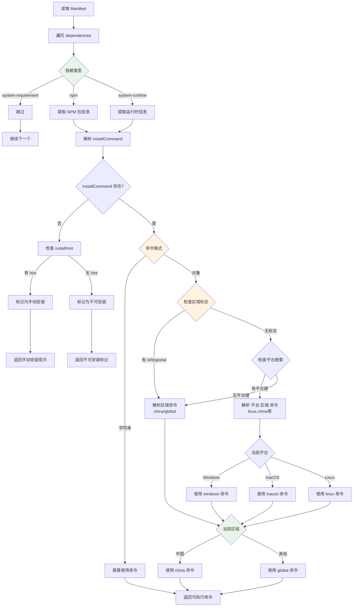

## Context

Hagicode Desktop 是一款基于 Electron 的跨平台桌面应用，提供嵌入式 Web 服务管理功能。应用已具备基础的依赖检查能力，通过 `dependency-manager.ts` 模块检测系统依赖状态，并通过 `manifest-reader.ts` 解析 NORT 包的 Manifest 文件。

### 问题背景

当前依赖管理系统存在以下限制：

1. **被动检查**：依赖检查仅在用户主动查看时执行，未与包安装工作流深度集成
2. **手动操作**：用户需要手动识别和安装缺失的依赖
3. **代码分散**：安装逻辑分散在多处，未统一利用 Manifest 中的结构化安装规则
4. **用户体验**：缺少安装后自动检查和引导式依赖安装的流程

虽然 Manifest 文件中已包含结构化的 `InstallCommand` 字段，用于描述不同平台下的依赖安装命令，但当前系统未能充分利用这些信息实现自动化依赖安装。

### 相关系统

- **DependencyManager**：主进程中的依赖管理器，负责检测系统依赖状态和执行安装命令
- **ManifestReader**：Manifest 文件解析器，读取 NORT 包的依赖声明
- **VersionManager**：版本管理器，负责包的安装、重装和卸载
- **dependencySlice / dependencySaga**：渲染进程中的依赖状态管理
- **VersionManagementPage**：版本管理页面，包安装的 UI 入口

## Goals / Non-Goals

### Goals

- 在包安装完成后自动触发依赖检查
- 利用 Manifest 中的 `InstallCommand` 字段实现统一的依赖安装
- 提供双路径依赖安装流程（安装后自动 + 手动管理）
- 显示安装进度和详细的状态反馈
- 支持中英文国际化

### Non-Goals

- 不修改 Manifest 文件格式
- 不改变现有的依赖检测逻辑
- 不实现依赖的自动更新（仅安装）
- 不修改现有包安装的核心流程

## Decisions

### Decision 1: 在包安装后自动检查依赖

**选择**：在 `VersionManager.installWebServicePackage()` 完成后自动调用依赖检查。

**原因**：
- 确保用户及时了解依赖状态
- 减少用户手动操作步骤
- 降低因依赖缺失导致的服务启动失败

**替代方案**：
- 仅在用户访问依赖管理页面时检查：用户可能不知道需要检查依赖
- 在服务启动时检查：延迟太晚，用户已经完成安装流程

### Decision 2: 使用确认对话框而非静默安装

**选择**：检测到缺失依赖时显示确认对话框，用户确认后才执行安装。

**原因**：
- 依赖安装可能需要管理员权限
- 某些用户可能希望手动安装依赖
- 避免未经用户同意执行系统命令

**替代方案**：
- 静默自动安装：安全和隐私风险较高
- 仅显示提示不提供安装：用户体验较差

### Decision 3: 统一使用 Manifest 的 InstallCommand 字段

**选择**：所有依赖安装命令都从 Manifest 文件读取，避免硬编码。

**原因**：
- 单一数据源，易于维护
- 新包通过 Manifest 定义自动获得依赖管理能力
- 减少代码中的平台判断逻辑

**替代方案**：
- 硬编码安装命令：难以维护，无法支持新依赖类型
- 混合使用 Manifest 和硬编码：增加复杂度，容易出错

### Decision 4: 支持 NPM 镜像配置

**选择**：在执行 NPM 包安装时使用现有的 NpmMirrorHelper 配置。

**原因**：
- 项目已有完整的镜像配置功能
- 国内用户需要镜像加速
- 保持安装体验一致性

**替代方案**：
- 忽略镜像配置：国内用户安装可能失败或很慢
- 每次询问用户：增加操作步骤

### Decision 5: 在 dependencySlice 中管理安装状态

**选择**：在现有的 `dependencySlice.ts` 中添加安装相关状态。

**原因**：
- 安装状态与依赖状态紧密相关
- 便于在组件中统一访问依赖信息
- 避免创建额外的 slice

**替代方案**：
- 创建新的 installSlice：增加状态管理复杂度
- 使用组件本地状态：不利于跨组件通信

## UI/UX Design

### 依赖安装确认对话框

```
┌──────────────────────────────────────────────────────────────────────────┐
│  📦 安装缺失依赖                                                          │
├──────────────────────────────────────────────────────────────────────────┤
│                                                                          │
│  检测到以下缺失的依赖项：                                                 │
│                                                                          │
│  ❌ .NET Runtime 8.0+                                                    │
│     描述：Web 服务需要 .NET 8.0 Runtime 运行                             │
│     安装命令：winget install Microsoft.DotNet.Runtime.8                  │
│                                                                          │
│  ❌ Claude Code                                                          │
│     描述：AI-powered development assistant                               │
│     安装命令：npm install -g @anthropic-ai/claude-code                   │
│                                                                          │
│  ⚠️ 安装这些依赖可能需要管理员权限。                                      │
│                                                                          │
│  是否继续安装？                                                           │
│                                                                          │
├──────────────────────────────────────────────────────────────────────────┤
│                                    [取消]  [安装依赖]                    │
└──────────────────────────────────────────────────────────────────────────┘
```

### 依赖安装进行中状态

```
┌──────────────────────────────────────────────────────────────────────────┐
│  📦 正在安装依赖                                                          │
├──────────────────────────────────────────────────────────────────────────┤
│                                                                          │
│  正在安装 3 个依赖项...                                                   │
│                                                                          │
│  ✅ .NET Runtime 8.0+                                                    │
│     ✓ 安装成功                                                           │
│                                                                          │
│  🔄 Claude Code (45%)                                                    │
│     正在下载... 15.2 MB / 33.8 MB                                        │
│                                                                          │
│  ⏳ OpenSpec                                                             │
│     等待安装...                                                           │
│                                                                          │
│  ━━━━━━━━━━━━━━━━━━━━━━━━━━━━━━━━━━━━━━━━ 45%                            │
│                                                                          │
│  [后台运行]                                                              │
│                                                                          │
└──────────────────────────────────────────────────────────────────────────┘
```

### 依赖管理页面 - 带安装按钮

```
┌──────────────────────────────────────────────────────────────────────────┐
│  依赖管理                                              [刷新]             │
├──────────────────────────────────────────────────────────────────────────┤
│                                                                          │
│  状态   │ 名称              │ 版本要求     │ 操作                       │
│  ──────┼──────────────────┼─────────────┼──────────────────────────    │
│  ✅     │ .NET Runtime      │ 8.0+        │ -                           │
│        │ 已安装 8.0.11      │             │                             │
│  ──────┼──────────────────┼─────────────┼──────────────────────────    │
│  ❌     │ Claude Code       │ any         │ [安装] [访问官网]           │
│        │ 未安装            │             │                             │
│  ──────┼──────────────────┼─────────────┼──────────────────────────    │
│  ⚠️    │ OpenSpec          │ 0.23.0      │ [安装] [访问官网]           │
│        │ 版本不匹配        │             │ 当前: 0.22.0               │
│                                                                          │
└──────────────────────────────────────────────────────────────────────────┘
```

### 用户交互流程（安装后自动路径）



### 用户交互流程（手动管理路径）



### 状态转换图



## Technical Design

### 主进程架构



## Manifest 命令解析流程



### Manifest 结构说明

实际的 Manifest 文件使用以下结构：

```json
{
  "dependencies": {
    "claudeCode": {
      "installCommand": {
        "china": "npm install ... --registry=https://registry.npmmirror.com",
        "global": "npm install ...",
        "isRegional": true
      }
    },
    "dotnet": {
      "installCommand": {
        "linux": {
          "china": "wget ...",
          "global": "wget ..."
        },
        "windows": {
          "china": "winget install ... --source https://nuget.cdn.azure.cn",
          "global": "winget install ..."
        },
        "macos": {
          "china": "brew install ...",
          "global": "brew install ..."
        }
      }
    },
    "system": {
      "installHint": "Install from https://example.com",
      "type": "system-requirement"
    }
  }
}
```

### 区域检测逻辑

系统需要检测用户所在的区域以选择正确的安装命令：

```typescript
// 伪代码：区域检测逻辑
function detectRegion(): 'china' | 'global' {
  // 方法 1: 使用系统 locale
  const locale = Intl.DateTimeFormat().resolvedOptions().locale;
  if (locale.startsWith('zh-CN')) {
    return 'china';
  }

  // 方法 2: 使用时区
  const timezone = Intl.DateTimeFormat().resolvedOptions().timeZone;
  if (timezone === 'Asia/Shanghai' || timezone === 'Asia/Hong_Kong') {
    return 'china';
  }

  // 方法 3: 检测网络连接速度（可选）
  // 通过测试访问 registry.npmmirror.com 和 registry.npmjs.org 的速度

  return 'global';
}
```

### Redux 状态结构

```typescript
// dependencySlice.ts 扩展状态
interface DependencyState {
  // ... 现有状态

  // 新增：安装确认对话框
  installConfirm: {
    show: boolean;
    dependencies: ParsedDependency[];
    manifestPath: string;
  };

  // 新增：安装进度
  installProgress: {
    installing: boolean;
    current: number;
    total: number;
    currentDependency: string;
    status: 'pending' | 'installing' | 'success' | 'error';
    errors: Array<{
      dependency: string;
      error: string;
    }>;
  };
}
```

### Manifest 类型定义扩展

```typescript
// manifest-reader.ts 类型扩展

/**
 * 区域安装命令（简单结构）
 */
interface RegionalInstallCommand {
  china: string;
  global: string;
  isRegional: true;
}

/**
 * 平台区域安装命令（嵌套结构）
 */
interface PlatformRegionalInstallCommand {
  windows?: {
    china: string;
    global: string;
  };
  macos?: {
    china: string;
    global: string;
  };
  linux?: {
    china: string;
    global: string;
  };
}

/**
 * 安装命令类型（联合类型）
 */
type InstallCommand =
  | string
  | RegionalInstallCommand
  | PlatformRegionalInstallCommand;

/**
 * 扩展的 Dependency 接口
 */
interface Dependency {
  version: DependencyVersion | DependencyVersionWithRuntime;
  installCommand?: InstallCommand;
  installHint?: string;
  checkCommand: string;
  type: DependencyTypeName;
  description: string;
}

/**
 * 解析后的安装命令
 */
interface ParsedInstallCommand {
  command: string | null;  // 可执行的命令，null 表示不可自动安装
  type: 'auto' | 'manual' | 'not-available';
  hint?: string;  // 手动安装提示
}

/**
 * 区域类型
 */
type Region = 'china' | 'global';

/**
 * 平台类型
 */
type Platform = 'windows' | 'macos' | 'linux';
```

### Redux Actions

```typescript
// 新增 actions
showInstallConfirm: (state, action: PayloadAction<{
  dependencies: ParsedDependency[];
  manifestPath: string;
}>) => {
  state.installConfirm.show = true;
  state.installConfirm.dependencies = action.payload.dependencies;
  state.installConfirm.manifestPath = action.payload.manifestPath;
},

hideInstallConfirm: (state) => {
  state.installConfirm.show = false;
  state.installConfirm.dependencies = [];
  state.installConfirm.manifestPath = '';
},

startInstall: (state, action: PayloadAction<number>) => {
  state.installProgress.installing = true;
  state.installProgress.total = action.payload;
  state.installProgress.current = 0;
  state.installProgress.status = 'installing';
  state.installProgress.errors = [];
},

updateInstallProgress: (state, action: PayloadAction<{
  current: number;
  dependency: string;
}>) => {
  state.installProgress.current = action.payload.current;
  state.installProgress.currentDependency = action.payload.dependency;
},

completeInstall: (state, action: PayloadAction<{
  status: 'success' | 'error';
  errors?: Array<{ dependency: string; error: string }>;
}>) => {
  state.installProgress.installing = false;
  state.installProgress.status = action.payload.status;
  if (action.payload.errors) {
    state.installProgress.errors = action.payload.errors;
  }
},
```

### DependencyManager 新增方法

```typescript
// dependency-manager.ts

/**
 * Install dependencies from manifest
 * @param manifest - Parsed manifest object
 * @param onProgress - Progress callback
 * @returns Installation result
 */
async installFromManifest(
  manifest: Manifest,
  onProgress?: (progress: InstallProgress) => void
): Promise<InstallResult> {
  const results: InstallResult = {
    success: [],
    failed: [],
  };

  const dependencies = this.manifestReader.parseDependencies(manifest);

  for (let i = 0; i < dependencies.length; i++) {
    const dep = dependencies[i];

    onProgress?.({
      current: i + 1,
      total: dependencies.length,
      dependency: dep.name,
      status: 'installing',
    });

    try {
      await this.installSingleDependency(dep);
      results.success.push(dep.name);

      onProgress?.({
        current: i + 1,
        total: dependencies.length,
        dependency: dep.name,
        status: 'success',
      });
    } catch (error) {
      results.failed.push({
        dependency: dep.name,
        error: error instanceof Error ? error.message : String(error),
      });

      onProgress?.({
        current: i + 1,
        total: dependencies.length,
        dependency: dep.name,
        status: 'error',
      });
    }
  }

  return results;
}

/**
 * Install a single dependency
 * @param dep - Parsed dependency
 * @returns Installation success
 */
private async installSingleDependency(
  dep: ParsedDependency
): Promise<boolean> {
  if (!dep.installCommand) {
    throw new Error(`No install command for ${dep.name}`);
  }

  // Parse install command (support object and string formats)
  const command = this.parseInstallCommand(dep.installCommand);

  // Execute with appropriate context
  if (dep.type === 'npm') {
    return await this.installNpmPackage(dep.key);
  } else {
    return await this.executeSystemCommand(command);
  }
}

/**
 * Parse install command from manifest
 * @param installCommand - Install command from manifest
 * @param region - User region ('china' or 'global')
 * @returns Parsed command string or null if not installable
 */
private parseInstallCommand(
  installCommand: string | Record<string, unknown>,
  region: 'china' | 'global' = 'global'
): string | null {
  // String format - use directly
  if (typeof installCommand === 'string') {
    return installCommand;
  }

  // Object format - check for different structures

  // Structure 1: { china: "...", global: "...", isRegional: true }
  if ('china' in installCommand && 'global' in installCommand) {
    return installCommand[region] as string || installCommand.global as string;
  }

  // Structure 2: { platform: { china: "...", global: "..." } }
  const platform = this.getPlatformKey(); // 'windows', 'macos', or 'linux'
  if (platform in installCommand) {
    const platformCommands = installCommand[platform] as Record<string, string>;
    if (region in platformCommands) {
      return platformCommands[region];
    }
    return platformCommands.global || Object.values(platformCommands)[0];
  }

  // Structure 3: { platform: "command" } (fallback)
  if (platform in installCommand) {
    return installCommand[platform] as string;
  }

  // No matching command found
  return null;
}

/**
 * Get platform key for manifest
 * @returns Platform key ('windows', 'macos', 'linux')
 */
private getPlatformKey(): string {
  switch (process.platform) {
    case 'win32':
      return 'windows';
    case 'darwin':
      return 'macos';
    case 'linux':
      return 'linux';
    default:
      return 'linux'; // Default fallback
  }
}

/**
 * Detect user region
 * @returns 'china' or 'global'
 */
private detectRegion(): 'china' | 'global' {
  // Method 1: Check locale
  const locale = Intl?.DateTimeFormat()?.resolvedOptions()?.locale;
  if (locale && (locale === 'zh-CN' || locale.startsWith('zh-'))) {
    return 'china';
  }

  // Method 2: Check timezone
  const timezone = Intl?.DateTimeFormat()?.resolvedOptions()?.timeZone;
  if (timezone && (timezone === 'Asia/Shanghai' ||
                   timezone === 'Asia/Hong_Kong' ||
                   timezone === 'Asia/Taipei')) {
    return 'china';
  }

  // Default to global
  return 'global';
}
```

### Saga 实现

```typescript
// dependencySaga.ts

/**
 * Watch for package installation completion
 */
function* watchPackageInstallCompletion(): Generator {
  while (true) {
    // 监听包安装完成事件
    const action = yield take([
      'webService/setInstallProgress',
    ]);

    const progress = action.payload;
    if (progress.stage === 'completed') {
      // 触发依赖检查
      yield put(checkDependenciesAfterInstallAction());
    }
  }
}

/**
 * Check dependencies after package installation
 */
function* checkDependenciesAfterInstallSaga(): Generator {
  try {
    // 获取当前安装的包信息
    const packageInfo = yield select(selectInstalledPackageInfo);

    // 通过 IPC 调用主进程检查依赖
    const dependencies: DependencyCheckResult[] = yield call(
      window.electronAPI.checkDependenciesFromManifest,
      packageInfo.installPath
    );

    // 检查是否有缺失依赖
    const missingDeps = dependencies.filter(dep => !dep.installed);

    if (missingDeps.length > 0) {
      // 显示安装确认对话框
      yield put(showInstallConfirmAction({
        dependencies: missingDeps,
        manifestPath: packageInfo.installPath,
      }));
    } else {
      // 显示提示：所有依赖已满足
      yield call(showSuccessToast, '所有依赖已满足');
    }
  } catch (error) {
    console.error('Failed to check dependencies:', error);
  }
}

/**
 * Install dependencies from manifest
 */
function* installFromManifestSaga(
  action: { type: string; payload: { manifestPath: string } }
): Generator {
  try {
    // 获取待安装的依赖列表
    const pendingDeps = yield select(selectPendingDependencies);

    // 开始安装
    yield put(startInstallAction(pendingDeps.length));

    // 通过 IPC 调用主进程安装
    const result: InstallResult = yield call(
      window.electronAPI.installFromManifest,
      action.payload.manifestPath,
      (progress) => {
        // 更新进度
        store.dispatch(updateInstallProgressAction(progress));
      }
    );

    // 完成安装
    yield put(completeInstallAction({
      status: result.failed.length === 0 ? 'success' : 'error',
      errors: result.failed,
    }));

    // 刷新依赖状态
    yield put(loadDependenciesAction());

    // 显示结果
    if (result.failed.length === 0) {
      yield call(showSuccessToast, '所有依赖安装成功');
    } else {
      yield call(showWarningToast,
        `${result.success.length} 个依赖安装成功，${result.failed.length} 个失败`
      );
    }
  } catch (error) {
    yield put(completeInstallAction({
      status: 'error',
      errors: [{ dependency: 'unknown', error: String(error) }],
    }));
    yield call(showErrorToast, '依赖安装失败');
  }
}
```

### 组件集成

```typescript
// DependencyInstallConfirmDialog.tsx

export function DependencyInstallConfirmDialog(): JSX.Element {
  const dispatch = useDispatch();
  const { t } = useTranslation('components');

  const show = useSelector(selectShowInstallConfirm);
  const dependencies = useSelector(selectPendingDependencies);
  const installProgress = useSelector(selectInstallProgress);

  const handleConfirm = () => {
    const manifestPath = useSelector(selectInstallConfirmManifestPath);
    dispatch(installFromManifestAction({ manifestPath }));
  };

  const handleCancel = () => {
    dispatch(hideInstallConfirmAction());
  };

  return (
    <Dialog open={show} onOpenChange={(open) => !open && handleCancel()}>
      <DialogContent className="max-w-2xl">
        <DialogHeader>
          <DialogTitle className="flex items-center gap-2">
            <Package className="h-5 w-5" />
            {t('depInstallConfirm.title')}
          </DialogTitle>
        </DialogHeader>

        <div className="py-4">
          {installProgress.installing ? (
            // 安装进度视图
            <div className="space-y-4">
              <Progress value={installProgress.current} max={installProgress.total} />
              <div className="text-sm text-muted-foreground">
                {t('depInstallConfirm.installing', {
                  current: installProgress.current,
                  total: installProgress.total,
                })}
              </div>
            </div>
          ) : (
            // 依赖列表视图
            <div className="space-y-3">
              <p className="text-sm text-muted-foreground">
                {t('depInstallConfirm.description', { count: dependencies.length })}
              </p>

              {dependencies.map((dep) => (
                <div key={dep.key} className="border rounded-lg p-3">
                  <div className="flex items-start gap-2">
                    <XCircle className="h-5 w-5 text-destructive flex-shrink-0 mt-0.5" />
                    <div className="flex-1 min-w-0">
                      <div className="font-medium">{dep.name}</div>
                      <div className="text-sm text-muted-foreground">
                        {dep.description}
                      </div>
                      {dep.installCommand && (
                        <code className="text-xs bg-muted px-1 rounded">
                          {dep.installCommand}
                        </code>
                      )}
                    </div>
                  </div>
                </div>
              ))}

              <Alert variant="warning">
                <AlertCircle className="h-4 w-4" />
                <AlertDescription>
                  {t('depInstallConfirm.permissionWarning')}
                </AlertDescription>
              </Alert>
            </div>
          )}
        </div>

        <DialogFooter>
          <Button
            variant="outline"
            onClick={handleCancel}
            disabled={installProgress.installing}
          >
            {t('depInstallConfirm.cancel')}
          </Button>
          <Button
            onClick={handleConfirm}
            disabled={installProgress.installing}
          >
            {installProgress.installing
              ? t('depInstallConfirm.installing')
              : t('depInstallConfirm.confirm')
            }
          </Button>
        </DialogFooter>
      </DialogContent>
    </Dialog>
  );
}
```

### IPC 处理器

```typescript
// main.ts

// 安装依赖清单中的所有依赖
ipcMain.handle('dependency:install-from-manifest', async (event, manifestPath: string) => {
  const result = {
    success: [] as string[],
    failed: [] as Array<{ dependency: string; error: string }>,
  };

  try {
    // 读取 manifest
    const manifest = await manifestReader.readManifest(manifestPath);
    if (!manifest) {
      throw new Error('Failed to read manifest');
    }

    // 解析依赖
    const dependencies = manifestReader.parseDependencies(manifest);

    // 过滤出缺失的依赖
    const missingDeps = [];
    for (const dep of dependencies) {
      const checkResult = await dependencyManager.checkSingleDependency(dep);
      if (!checkResult.installed) {
        missingDeps.push(dep);
      }
    }

    // 安装缺失的依赖
    for (const dep of missingDeps) {
      try {
        await dependencyManager.installSingleDependency(dep);
        result.success.push(dep.name);

        // 通知渲染进程进度
        event.sender.send('dependency:install-progress', {
          dependency: dep.name,
          status: 'success',
        });
      } catch (error) {
        result.failed.push({
          dependency: dep.name,
          error: error instanceof Error ? error.message : String(error),
        });

        event.sender.send('dependency:install-progress', {
          dependency: dep.name,
          status: 'error',
          error: String(error),
        });
      }
    }
  } catch (error) {
    console.error('Failed to install from manifest:', error);
    throw error;
  }

  return result;
});

// 安装单个依赖
ipcMain.handle('dependency:install-single', async (event, dependencyKey: string, manifestPath: string) => {
  try {
    const manifest = await manifestReader.readManifest(manifestPath);
    if (!manifest) {
      throw new Error('Failed to read manifest');
    }

    const dependencies = manifestReader.parseDependencies(manifest);
    const dep = dependencies.find(d => d.key === dependencyKey);

    if (!dep) {
      throw new Error(`Dependency ${dependencyKey} not found in manifest`);
    }

    await dependencyManager.installSingleDependency(dep);

    return { success: true };
  } catch (error) {
    console.error('Failed to install single dependency:', error);
    throw error;
  }
});
```

### 文件变更清单

| 文件路径 | 变更类型 | 说明 |
|---------|---------|------|
| `src/main/dependency-manager.ts` | 修改 | 添加 `installFromManifest()` 和 `installSingleDependency()` 方法 |
| `src/main/manifest-reader.ts` | 修改 | 添加 `parseInstallCommands()` 方法 |
| `src/main/version-manager.ts` | 修改 | 集成安装后依赖检查 |
| `src/main/main.ts` | 修改 | 添加新的 IPC 处理器 |
| `src/preload/index.ts` | 修改 | 添加新的 API 类型定义 |
| `src/renderer/components/DependencyInstallConfirmDialog.tsx` | 新增 | 依赖安装确认对话框组件 |
| `src/renderer/components/DependencyWarningBanner.tsx` | 新增 | 依赖警告横幅组件（如不存在） |
| `src/renderer/components/VersionManagementPage.tsx` | 修改 | 集成依赖检查触发 |
| `src/renderer/components/DependencyManagementPanel.tsx` | 修改 | 添加安装按钮 |
| `src/renderer/store/sagas/dependencySaga.ts` | 修改 | 添加安装相关 sagas |
| `src/renderer/store/slices/dependencySlice.ts` | 修改 | 添加安装相关状态和 actions |
| `src/renderer/i18n/locales/en-US/components.json` | 修改 | 添加英文翻译 |
| `src/renderer/i18n/locales/en-US/pages.json` | 修改 | 添加英文翻译 |
| `src/renderer/i18n/locales/zh-CN/components.json` | 修改 | 添加中文翻译 |
| `src/renderer/i18n/locales/zh-CN/pages.json` | 修改 | 添加中文翻译 |

### 国际化键值

```json
{
  "depInstallConfirm": {
    "title": "安装缺失依赖",
    "description": "检测到 {{count}} 个缺失的依赖项",
    "permissionWarning": "安装这些依赖可能需要管理员权限。",
    "cancel": "取消",
    "confirm": "安装依赖",
    "installing": "正在安装...",
    "success": "所有依赖安装成功",
    "partialSuccess": "{{success}} 个依赖安装成功，{{failed}} 个失败",
    "error": "依赖安装失败"
  },
  "depWarningBanner": {
    "title": "缺失必需依赖",
    "message": "检测到 {{count}} 个缺失的依赖项，可能会影响 Web 服务运行。",
    "installNow": "立即安装",
    "dismiss": "关闭"
  },
  "depManagement": {
    "installButton": "安装",
    "installingButton": "安装中...",
    "retryButton": "重试",
    "visitOfficial": "访问官网"
  }
}
```

## Risks / Trade-offs

### 风险

| 风险 | 影响 | 缓解措施 |
|------|------|----------|
| 系统命令执行失败 | 依赖安装失败 | 提供详细的错误信息和重试选项 |
| 权限不足 | 无法执行某些安装命令 | 提示用户以管理员身份运行或手动安装 |
| 平台兼容性问题 | 某些平台的命令无法执行 | 充分测试三大平台，提供平台特定回退 |
| 网络依赖 | NPM 包安装需要网络 | 检测网络状态，提供离线安装指引 |
| 安装时间过长 | 用户可能中断操作 | 显示进度，支持后台运行 |
| Manifest 格式变更 | 解析失败 | 版本检查，向后兼容处理 |

### 权衡

| 决策 | 优点 | 缺点 | 选择 |
|------|------|------|------|
| 安装后自动检查 | 及时提醒用户 | 可能打断安装流程 | ✅ 选择：重要性优先 |
| 确认后安装 | 安全可控 | 增加操作步骤 | ✅ 选择：安全性优先 |
| 使用 Manifest 命令 | 统一数据源 | 依赖 Manifest 质量 | ✅ 选择：可维护性优先 |
| 支持镜像配置 | 国内用户友好 | 增加复杂度 | ✅ 选择：用户体验优先 |

## Migration Plan

### 实施步骤

1. **阶段 1：主进程扩展**（2-3 小时）
   - 增强 `manifest-reader.ts` 的命令解析
   - 实现 `dependency-manager.ts` 的安装方法
   - 在 `version-manager.ts` 中集成依赖检查

2. **阶段 2：IPC 通信**（1 小时）
   - 添加新的 IPC 处理器
   - 更新 preload API

3. **阶段 3：状态管理**（1-2 小时）
   - 扩展 `dependencySlice` 状态
   - 实现相关 sagas

4. **阶段 4：UI 组件**（2-3 小时）
   - 创建确认对话框组件
   - 创建警告横幅组件
   - 集成到现有页面

5. **阶段 5：国际化**（30 分钟）
   - 添加中英文翻译

6. **阶段 6：测试**（2-3 小时）
   - 功能测试
   - 平台兼容性测试
   - 边界情况测试

### 回滚计划

如果实现出现问题，可以通过以下方式回滚：

1. 移除新增的 IPC 处理器和 preload API
2. 恢复 `dependency-manager.ts` 的原始实现
3. 移除 `dependencySlice` 中的新增状态和 actions
4. 删除新增的 UI 组件
5. 清理国际化键值
6. 移除 `version-manager.ts` 中的依赖检查集成

### 兼容性

- 现有依赖检测功能保持不变
- 不影响现有包安装流程
- 用户可选择性安装依赖
- 向后兼容旧版本 Manifest 文件

## Open Questions

1. **Manifest 中的 InstallCommand 格式是否需要标准化？**
   - 当前：支持字符串和对象格式
   - 建议：标准化为对象格式，支持平台特定命令

2. **是否需要支持依赖安装的取消操作？**
   - 考虑：正在执行的命令难以取消
   - 建议：支持队列级别的取消，跳过未执行的依赖

3. **是否需要记录依赖安装历史？**
   - 考虑：便于故障排查
   - 建议：使用 electron-log 记录，不持久化到数据库

4. **网络不可用时如何处理 NPM 包安装？**
   - 考虑：部分用户离线环境
   - 建议：检测网络状态，提供离线安装指引
