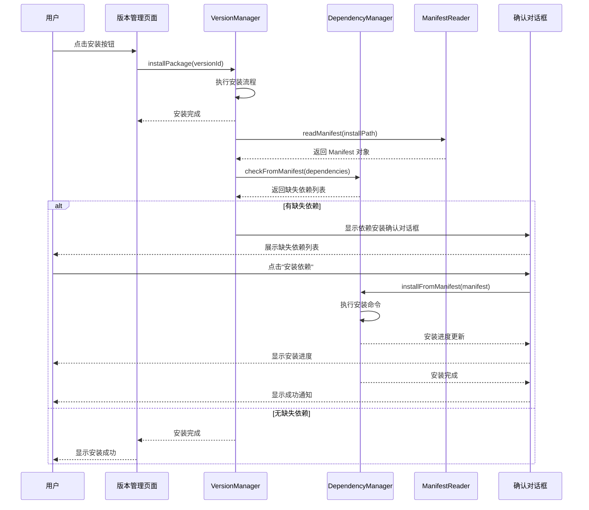
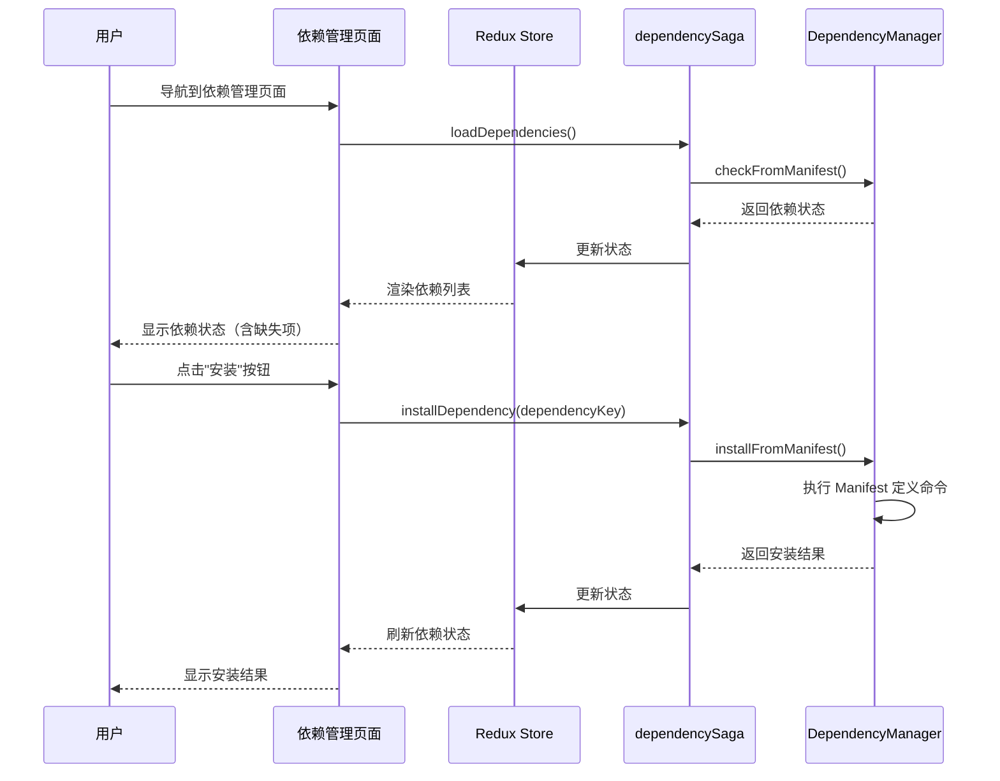
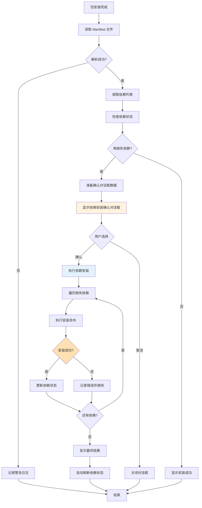
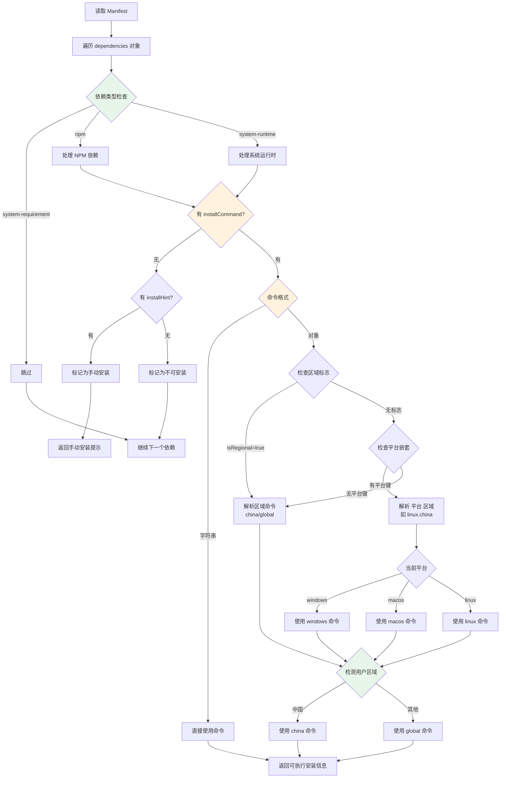
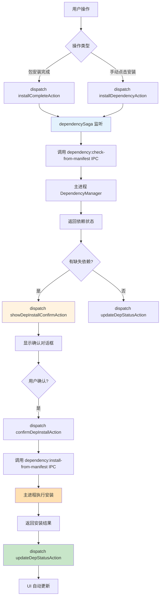

# Change: 基于 Manifest 的依赖自动安装集成

## Why

当前 Hagicode Desktop 的依赖管理系统存在以下问题：

1. **被动检查**：依赖检查仅在用户主动查看时执行，未与包安装工作流深度集成
2. **手动操作**：用户需要手动识别和安装缺失的依赖，增加了使用门槛
3. **代码分散**：安装逻辑分散在多处，未统一利用 Manifest 中的结构化安装规则
4. **用户体验**：缺少安装后自动检查和引导式依赖安装的流程

虽然 NORT 包的 Manifest 文件已包含结构化的 `InstallCommand` 字段，描述不同平台下的依赖安装命令，但当前系统未能充分利用这些信息实现自动化依赖安装。

## What Changes

- **安装后依赖检查集成**：在版本管理器（`version-manager.ts`）的包安装流程中集成自动依赖检查
- **基于 Manifest 的统一安装命令解析**：利用 `manifest-reader.ts` 读取的 Manifest 结构，解析 `InstallCommand` 字段
- **双路径依赖安装流程**：
  - 路径 A：安装后自动流程（包安装完成 → 自动检查依赖 → 显示确认对话框 → 执行安装）
  - 路径 B：依赖管理页面手动操作（缺失依赖项旁边提供"安装"按钮）
- **新增依赖安装确认对话框**：用户确认后执行 Manifest 定义的安装命令
- **实时状态反馈**：显示安装进度和结果

## UI Design Changes

### 依赖安装确认对话框

```
┌──────────────────────────────────────────────────────────────────────────┐
│  📦 安装缺失依赖                                                          │
├──────────────────────────────────────────────────────────────────────────┤
│                                                                          │
│  检测到以下缺失的依赖项：                                                 │
│                                                                          │
│  ❌ .NET Runtime 8.0+                                                    │
│     描述：Web 服务需要 .NET 8.0 Runtime 运行                             │
│     安装命令：winget install Microsoft.DotNet.Runtime.8                  │
│                                                                          │
│  ❌ Claude Code                                                          │
│     描述：AI-powered development assistant                               │
│     安装命令：npm install -g @anthropic-ai/claude-code                   │
│                                                                          │
│  安装这些依赖可能需要管理员权限。                                         │
│                                                                          │
│  是否继续安装？                                                           │
│                                                                          │
├──────────────────────────────────────────────────────────────────────────┤
│                                    [取消]  [安装依赖]                    │
└──────────────────────────────────────────────────────────────────────────┘
```

### 依赖管理页面 - 带安装按钮

```
┌──────────────────────────────────────────────────────────────────────────┐
│  依赖管理                                              [刷新]             │
├──────────────────────────────────────────────────────────────────────────┤
│                                                                          │
│  状态   │ 名称              │ 版本要求     │ 操作                       │
│  ──────┼──────────────────┼─────────────┼──────────────────────────    │
│  ✅     │ .NET Runtime      │ 8.0+        │ -                           │
│        │ 已安装 8.0.11      │             │                             │
│  ──────┼──────────────────┼─────────────┼──────────────────────────    │
│  ❌     │ Claude Code       │ any         │ [安装] [访问官网]           │
│        │ 未安装            │             │                             │
│  ──────┼──────────────────┼─────────────┼──────────────────────────    │
│  ⚠️    │ OpenSpec          │ 0.23.0      │ [安装] [访问官网]           │
│        │ 版本不匹配        │             │ 当前: 0.22.0               │
│                                                                          │
└──────────────────────────────────────────────────────────────────────────┘
```

### 用户交互流程（安装后自动路径）



### 用户交互流程（手动管理路径）



## Code Flow Changes

### 包安装后依赖检查流程



### Manifest 依赖安装命令解析流程



**区域检测说明**：
- 系统根据用户 locale（如 `zh-CN`）和时区（如 `Asia/Shanghai`）自动检测区域
- 中国用户使用 `china` 命令（通常使用国内镜像源）
- 其他地区用户使用 `global` 命令（使用官方源）

### Redux 状态管理流程



## Impact

### Affected specs
- `specs/dependency-management/spec.md` - 添加基于 Manifest 的依赖安装相关需求
- `specs/package-management/spec.md` - 添加安装后依赖检查集成需求

### Affected code
- **主进程变更**：
  - `src/main/dependency-manager.ts` - 添加 `installFromManifest()` 方法
  - `src/main/manifest-reader.ts` - 增强安装命令解析逻辑
  - `src/main/version-manager.ts` - 集成安装后依赖检查
  - `src/main/main.ts` - 新增 IPC 处理器：`dependency:install-from-manifest`

- **渲染进程变更**：
  - `src/renderer/components/DependencyInstallConfirmDialog.tsx` - 新增确认对话框组件
  - `src/renderer/components/DependencyWarningBanner.tsx` - 新增警告横幅组件（已在项目中）
  - `src/renderer/components/VersionManagementPage.tsx` - 集成依赖检查触发
  - `src/renderer/store/sagas/dependencySaga.ts` - 处理 Manifest 安装命令
  - `src/renderer/store/slices/dependencySlice.ts` - 新增 `installFromManifest` action

- **国际化文件更新**：
  - `src/renderer/i18n/locales/en-US/components.json` - 添加新组件翻译键
  - `src/renderer/i18n/locales/en-US/pages.json` - 添加依赖安装流程文本
  - `src/renderer/i18n/locales/zh-CN/components.json` - 添加新组件翻译键
  - `src/renderer/i18n/locales/zh-CN/pages.json` - 添加依赖安装流程文本

### User impact

**正面影响**：
- 降低依赖安装的认知负担，自动化引导安装流程
- 减少手动操作步骤，提升用户体验
- 提供更清晰的依赖状态反馈
- 统一依赖安装逻辑来源，易于维护

**潜在影响**：
- 安装操作可能需要管理员权限（会提示用户）
- 某些依赖安装可能需要网络连接
- 安装时间可能延长（取决于依赖项数量）

### Risk assessment
- **中等风险**：涉及系统命令执行，需要充分测试不同操作系统
- **权限处理**：依赖安装可能需要管理员权限，需要正确处理权限提升
- **平台差异**：需充分测试 Windows、macOS、Linux 的安装命令执行
- **网络依赖**：某些依赖安装（如 npm 包）需要网络连接，需要处理网络错误

### Breaking changes
无破坏性变更，所有现有功能保持兼容。

### Migration notes
- 现有依赖检测逻辑保持不变，仅添加安装功能
- Manifest 格式无需修改，利用现有 `InstallCommand` 字段
- 用户可选择性安装依赖，不影响现有工作流
