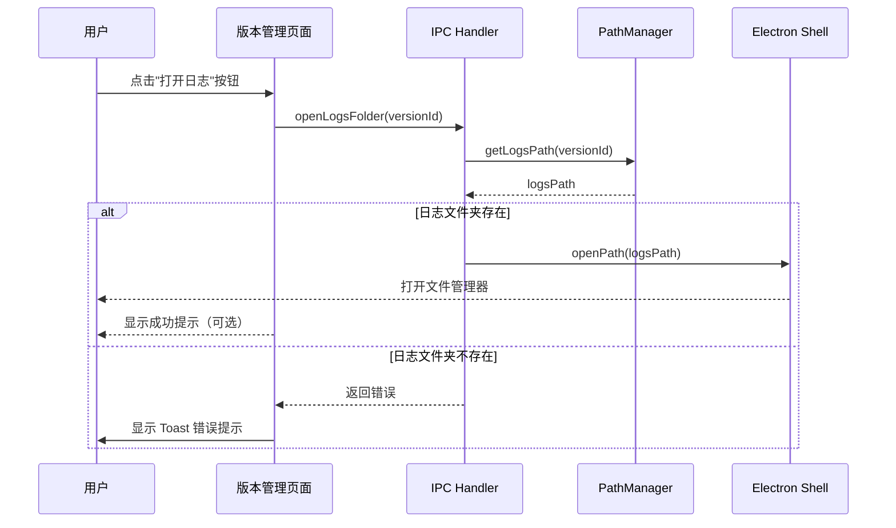
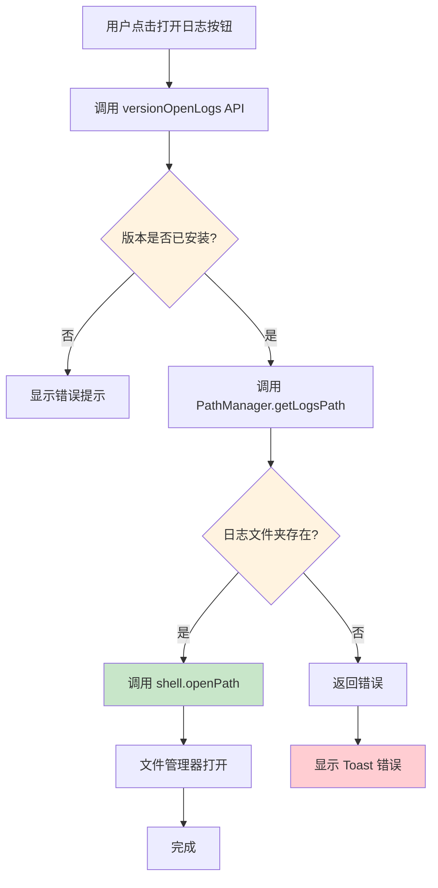

# Change: 版本管理页面添加打开日志文件夹功能

## Why

当前在版本管理页面查看已安装版本时，用户需要查看日志文件来排查问题或监控服务运行状态，存在以下痛点：

1. **手动导航繁琐**：用户需要手动在文件系统中导航至深层目录结构（`~/.config/Hagicode Desktop/apps/installed/<version>/lib/logs/`）
2. **路径不明确**：不同操作系统的日志存储路径不同，用户可能不清楚具体位置
3. **调试效率低**：排查问题时无法快速打开日志文件夹，影响问题诊断效率
4. **跨平台差异**：Windows、macOS、Linux 的路径结构不同，增加用户认知负担

这违反了用户对快速问题排查和监控的预期，用户期望能够一键打开日志文件夹进行调试。

## What Changes

- **UI 入口**：
  - 在版本管理页面为每个已安装版本添加"打开日志"按钮
  - 在首页（WebServiceStatusCard）添加"打开日志"按钮
- **IPC 通信**：添加 `open-logs-folder` IPC handler 处理打开日志文件夹请求
- **路径管理**：在 `PathManager` 中添加 `getLogsPath(versionId)` 方法
- **文件夹打开**：使用 Electron 的 `shell.openPath()` API 打开日志文件夹
- **错误处理**：日志文件夹不存在时显示 Toast 通知提示用户

## UI Design Changes

### 版本管理页面 UI 更新

在已安装版本的操作按钮区域添加"打开日志"按钮：

```
┌────────────────────────────────────────────────────────────────────────────────────┐
│  [Package Icon]  hagicode-0.1.0-alpha.9-linux-x64-nort.zip    [Active] [Ready]    │
│                                                                              │
│  Linux • Installed at: 2025-01-15                                               │
│                                                                              │
│  [收起依赖项] [重新安装] [切换] [打开日志] [卸载]                                 │
│                                                                              │
└────────────────────────────────────────────────────────────────────────────────────┘
```

### 用户交互流程



## Code Flow Changes

### 打开日志文件夹流程



### 日志路径结构

日志文件夹路径结构为：
```
<userData>/apps/installed/<versionId>/lib/logs/
```

示例路径：
- Linux: `~/.config/Hagicode Desktop/apps/installed/hagicode-0.1.0-alpha.9-linux-x64-nort/lib/logs/`
- Windows: `%APPDATA%/Hagicode Desktop/apps/installed/hagicode-0.1.0-alpha.9-win-x64-nort/lib/logs/`
- macOS: `~/Library/Application Support/Hagicode Desktop/apps/installed/hagicode-0.1.0-alpha.9-osx-x64-nort/lib/logs/`

## Impact

### Affected specs
- 无相关 spec 需要更新

### Affected code
- `src/main/main.ts` - 添加 `open-logs-folder` IPC handler
- `src/main/path-manager.ts` - 添加 `getLogsPath(versionId)` 方法
- `src/preload/index.ts` - 添加 `versionOpenLogs` API 声明
- `src/renderer/components/VersionManagementPage.tsx` - 添加"打开日志"按钮和处理逻辑
- `src/renderer/components/WebServiceStatusCard.tsx` - 添加"打开日志"按钮和处理逻辑
- `src/renderer/i18n/locales/en-US/pages.json` - 添加英文翻译
- `src/renderer/i18n/locales/zh-CN/pages.json` - 添加中文翻译

### User impact

**正面影响**：
- 一键打开日志文件夹，减少手动导航时间
- 无需记忆或查找复杂的文件系统路径
- 跨平台一致的操作方式，隐藏平台差异
- 提高问题排查和调试效率

**无负面影响**：
- 不影响现有功能，纯增量开发
- 仅打开系统文件夹，不涉及文件读写操作

### Risk assessment
- **低风险**：功能独立，不影响核心服务管理逻辑
- **向后兼容**：不影响现有 API 接口
- **可测试性**：功能易于手动测试，可在三大平台验证

### Breaking changes
无破坏性变更，所有现有功能保持兼容。

## Status: Proposed

### Implementation Summary

功能待实现，需要完成以下任务：

1. **后端实现**：
   - 在 `PathManager` 中添加 `getLogsPath(versionId)` 方法
   - 在 `main.ts` 中添加 `open-logs-folder` IPC handler
   - 在 `preload/index.ts` 中添加 `versionOpenLogs` API

2. **前端实现**：
   - 在 `VersionManagementPage.tsx` 中添加"打开日志"按钮
   - 在 `WebServiceStatusCard.tsx` 中添加"打开日志"按钮
   - 添加打开日志的处理函数和错误处理
   - 添加 Toast 通知显示操作结果

3. **国际化支持**：
   - 在 `en-US/pages.json` 中添加英文翻译
   - 在 `zh-CN/pages.json` 中添加中文翻译

### 测试状态
- 待实施和测试
