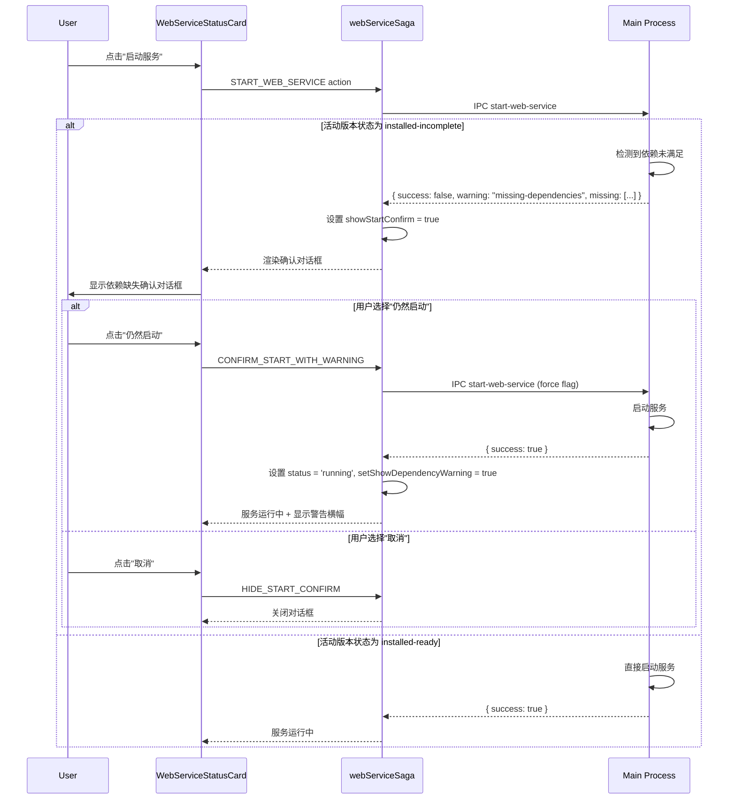

# 宽松依赖管理模式 - 技术设计

## Context

Hagicode Desktop 当前实现了严格的依赖检查机制，在启动服务或切换版本时，如果依赖不满足条件会完全阻止操作。这种设计虽然保证了服务稳定性，但限制了高级用户和开发者的灵活性。

### 当前问题

1. **启动流程阻塞**：`main.ts:226-235` 中硬性检查版本状态必须为 `installed-ready`
2. **版本切换限制**：`version-manager.ts:370-373` 中版本切换需要状态为 `installed-ready`
3. **缺乏灵活性**：无法支持用户希望承担风险继续操作的场景

### 相关代码位置

- 主进程启动检查：`src/main/main.ts:226-235`
- 版本切换检查：`src/main/version-manager.ts:370-373`
- Web Service Saga：`src/renderer/store/sagas/webServiceSaga.ts:101-137`
- Web Service Slice：`src/renderer/store/slices/webServiceSlice.ts`

## Goals / Non-Goals

### Goals

- 允许用户在依赖不满足时启动服务（需确认）
- 允许用户切换到任何已安装版本
- 提供清晰的警告信息和风险说明
- 保持服务启动流程的稳定性
- 记录用户的决策用于审计

### Non-Goals

- 不改变依赖检测逻辑
- 不修改依赖安装流程
- 不影响依赖满足时的正常流程
- 不实现自动依赖修复（已有其他提案处理）

## Decisions

### Decision 1: 使用确认对话框而非直接允许启动

**选择**：在启动前显示确认对话框，列出缺失依赖和潜在风险

**原因**：
- 确保用户了解风险
- 符合用户对"阻断操作"的预期
- 提供最后一次 reconsider 的机会

**替代方案**：
- 直接启动并显示警告：用户可能不知情
- 阻止启动：当前行为，过于严格

### Decision 2: Redux 状态管理警告横幅显示

**选择**：新增状态字段 `dependencyWarningDismissed` 和 `showDependencyWarning`

**原因**：
- 与现有 Redux 架构一致
- 便于跨组件状态共享
- 支持服务重启后重新显示警告

**替代方案**：
- 使用 localStorage：与现有架构不一致
- 组件本地状态：难以在多个组件间共享

### Decision 3: 主进程返回警告而非错误

**选择**：`start-web-service` IPC 处理器返回 `warning` 字段而非 `error`

**原因**：
- 区分警告和错误
- 允许服务启动成功
- 前端可以区分处理

### Decision 4: 版本切换不进行依赖检查

**选择**：移除 `version-manager.ts` 中的版本状态检查

**原因**：
- 版本切换和启动服务是两个独立操作
- 用户可能只是想切换版本但不立即启动
- 简化版本切换流程

## Technical Design

### 架构变更

```
┌─────────────────────────────────────────────────────────────┐
│                        渲染进程                               │
├─────────────────────────────────────────────────────────────┤
│                                                             │
│  ┌──────────────────┐    ┌──────────────────┐              │
│  │ WebServiceStatus │    │ DependencyStart  │              │
│  │      Card        │◄───┤ ConfirmDialog    │              │
│  └────────┬─────────┘    └──────────────────┘              │
│           │                                                   │
│           ▼                                                   │
│  ┌──────────────────┐                                       │
│  │   Dependency     │                                       │
│  │  WarningBanner   │                                       │
│  └──────────────────┘                                       │
│                             ▲                                │
│                             │                                │
│  ┌─────────────────────────┴──────────────────┐            │
│  │           webServiceSlice                  │            │
│  │  - showStartConfirm: boolean               │            │
│  │  - dependencyWarningDismissed: boolean     │            │
│  │  - missingDependenciesList: DependencyItem[]│           │
│  └─────────────────────────────────────────────┘            │
└─────────────────────────────────────────────────────────────┘
                            │ IPC
                            ▼
┌─────────────────────────────────────────────────────────────┐
│                        主进程                                 │
├─────────────────────────────────────────────────────────────┤
│                                                             │
│  ┌─────────────────────────────────────────────┐           │
│  │        start-web-service IPC Handler        │           │
│  │                                             │           │
│  │  1. 获取活动版本                             │           │
│  │  2. 检查版本状态 (非阻断)                   │           │
│  │  3. 记录依赖状态到日志                       │           │
│  │  4. 尝试启动服务                             │           │
│  │  5. 返回 { success, warning? }              │           │
│  └─────────────────────────────────────────────┘           │
│                          │                                  │
│                          ▼                                  │
│  ┌─────────────────────────────────────────────┐           │
│  │         PCodeWebServiceManager              │           │
│  └─────────────────────────────────────────────┘           │
└─────────────────────────────────────────────────────────────┘
```

### 数据流设计



### Redux 状态扩展

```typescript
// webServiceSlice.ts 新增状态

interface WebServiceState {
  // ... 现有状态

  // 启动确认对话框
  showStartConfirm: boolean;
  missingDependenciesList: DependencyItem[];

  // 警告横幅
  showDependencyWarning: boolean;
  dependencyWarningDismissed: boolean;
}

// 新增 Actions
interface ShowStartConfirmAction {
  type: 'webService/showStartConfirm';
  payload: DependencyItem[];
}

interface HideStartConfirmAction {
  type: 'webService/hideStartConfirm';
}

interface ConfirmStartWithWarningAction {
  type: 'webService/confirmStartWithWarning';
}

interface SetShowDependencyWarningAction {
  type: 'webService/setShowDependencyWarning';
  payload: boolean;
}

interface DismissDependencyWarningAction {
  type: 'webService/dismissDependencyWarning';
}
```

### IPC 接口变更

```typescript
// 主进程返回值变更

// 之前
interface StartWebServiceResult {
  success: boolean;
  error?: {
    type: string;
    details: string;
  };
}

// 之后
interface StartWebServiceResult {
  success: boolean;
  warning?: {
    type: 'missing-dependencies';
    missing: DependencyCheckResult[];
  };
  error?: {
    type: string;
    details: string;
  };
}
```

## UI/UX Design

### 启动确认对话框 UI

```tsx
<Dialog open={showStartConfirm}>
  <DialogContent>
    <DialogHeader>
      <DialogTitle>⚠️ 启动服务确认</DialogTitle>
    </DialogHeader>
    <DialogDescription>
      <p>当前版本缺少以下必需的依赖项：</p>
      <DependencyList items={missingDependenciesList} />
      <Alert variant="warning">
        <AlertDescription>
          在缺少这些依赖项的情况下启动服务可能导致：
          <ul>
            <li>服务无法正常启动</li>
            <li>某些功能不可用</li>
            <li>运行时错误</li>
          </ul>
        </AlertDescription>
      </Alert>
      <p>是否仍然启动服务？</p>
    </DialogDescription>
    <DialogFooter>
      <Button variant="outline" onClick={handleCancel}>
        取消
      </Button>
      <Button onClick={handleConfirm}>
        仍然启动
      </Button>
    </DialogFooter>
  </DialogContent>
</Dialog>
```

### 警告横幅 UI

```tsx
{showDependencyWarning && !dependencyWarningDismissed && (
  <Alert variant="warning" className="relative">
    <AlertTitle>⚠️ 警告：服务依赖项未完全满足</AlertTitle>
    <AlertDescription>
      当前缺少 {missingDependenciesList.length} 个必需的依赖项。
      部分功能可能无法正常工作。
    </AlertDescription>
    <div className="flex gap-2 mt-2">
      <Button size="sm" onClick={handleViewDetails}>
        查看详情
      </Button>
      <Button size="sm" variant="outline" onClick={handleDismiss}>
        稍后修复
      </Button>
      <button
        className="absolute right-4 top-4"
        onClick={handleClose}
      >
        ×
      </button>
    </div>
  </Alert>
)}
```

## Risks / Trade-offs

### 风险

1. **用户误操作**：用户可能不理解风险而选择"仍然启动"
   - **缓解**：确认对话框中明确列出风险，要求用户主动确认

2. **服务启动失败**：依赖缺失可能导致服务启动失败
   - **缓解**：捕获启动失败并显示错误信息，引导用户安装依赖

3. **功能不可用**：服务启动但某些功能因依赖缺失而不可用
   - **缓解**：警告横幅明确告知可能的影响范围

### 权衡

1. **灵活性 vs 安全性**：牺牲了一定的安全性换取用户灵活性
   - **决策**：通过多次确认确保用户了解风险

2. **代码复杂度**：新增确认流程和警告状态增加了代码复杂度
   - **决策**：保持现有架构模式，复用现有组件和状态管理

## Migration Plan

### 迁移步骤

1. **第一阶段**：主进程修改
   - 修改 IPC 返回值
   - 移除硬性检查
   - 添加日志记录

2. **第二阶段**：状态管理修改
   - 扩展 Redux 状态
   - 修改 Saga 处理逻辑

3. **第三阶段**：UI 组件添加
   - 创建确认对话框组件
   - 创建警告横幅组件
   - 集成到现有页面

4. **第四阶段**：国际化
   - 添加翻译文本
   - 测试语言切换

### 回滚计划

如果新功能出现问题，可以通过以下方式回滚：

1. 恢复 `main.ts` 中的硬性版本状态检查
2. 恢复 `version-manager.ts` 中的版本切换检查
3. 移除新增的 UI 组件和状态
4. 移除新增的国际化文本

## Open Questions

1. **是否需要记录用户决策的持久化**？
   - 当前设计只在内存中记录，应用重启后重置
   - 可能需要考虑是否持久化用户偏好（如"始终忽略此警告"）

2. **是否需要支持"稍后修复"的提醒功能**？
   - 当用户选择"稍后修复"后，是否在一定时间后再次提醒

3. **是否需要在托盘菜单中显示依赖状态**？
   - 当服务运行但依赖不满足时，是否在托盘中显示警告图标
