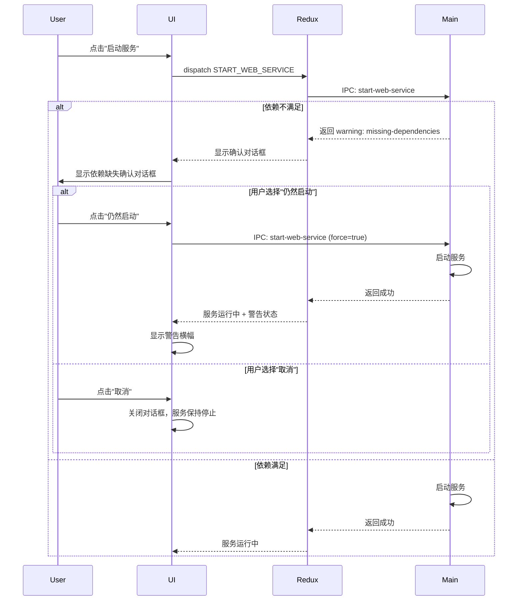
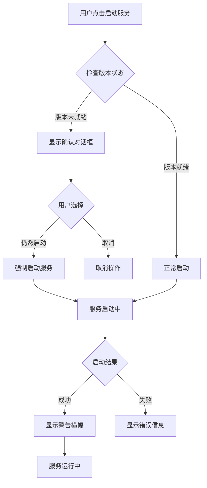
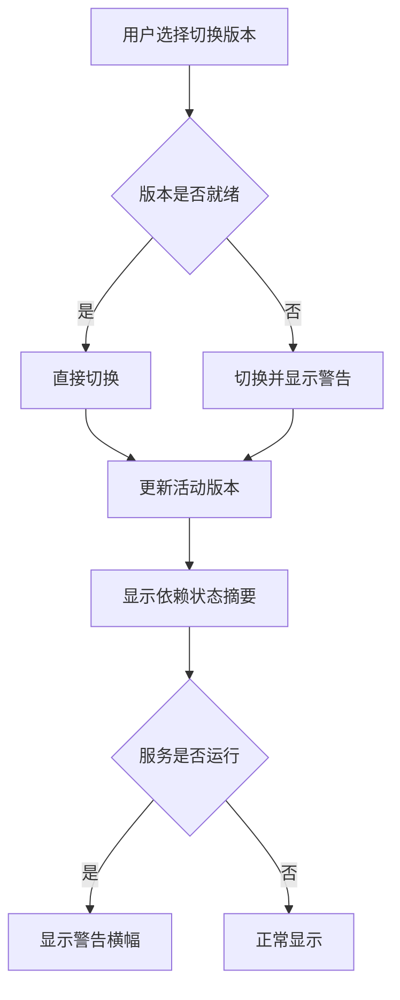

# Change: Relaxed Dependency Management Mode

## Status
**ExecutionCompleted** - All tasks have been implemented successfully.

## Why

当前依赖管理策略过于严格，当系统依赖不满足条件时完全阻止服务启动和版本切换，导致用户无法继续使用应用。这种严格的检查机制限制了高级用户和开发者的使用场景，例如在开发环境中手动管理依赖、处理可选依赖项，或在解决依赖问题前先启动服务进行其他操作。

## What Changes

- 允许在依赖不满足时切换版本（仅警告，不阻断）
- 允许在依赖不满足时启动服务（显示确认对话框，不直接阻止）
- 服务启动后显示持久化的警告提示
- 新增 Redux 状态 `dependencyWarningDismissed` 用于管理警告显示
- 修改主进程 `start-web-service` IPC 处理器，移除版本状态硬性检查
- 更新国际化文件，添加警告和确认对话框文本

## UI Design Changes

### 1. 启动确认对话框

```
┌─────────────────────────────────────────────────────────────┐
│  ⚠️  启动服务确认                                           │
├─────────────────────────────────────────────────────────────┤
│                                                             │
│  当前版本缺少以下必需的依赖项：                             │
│                                                             │
│  ❌ .NET Runtime 8.0+          [使用包管理器安装]           │
│  ❌ Node.js 18.0+               [访问官网下载]              │
│                                                             │
│  ────────────────────────────────────────────────────────  │
│                                                             │
│  在缺少这些依赖项的情况下启动服务可能导致：                  │
│  • 服务无法正常启动                                         │
│  • 某些功能不可用                                           │
│  • 运行时错误                                               │
│                                                             │
│  ────────────────────────────────────────────────────────  │
│                                                             │
│  是否仍然启动服务？                                         │
│                                                             │
│                    [取消]        [仍然启动]                 │
└─────────────────────────────────────────────────────────────┘
```

### 2. 启动后警告横幅

```
┌──────────────────────────────────────────────────────────────────────┐
│  ⚠️  警告：服务依赖项未完全满足                                    │
│                                                                     │
│  当前缺少 2 个必需的依赖项。部分功能可能无法正常工作。              │
│                                                                     │
│  [查看详情]  [稍后修复]  [× 忽略]                                   │
└──────────────────────────────────────────────────────────────────────┘
```

### 3. 用户交互流程



## Code Flow Changes

### 1. 启动流程变更



### 2. 版本切换流程变更



## Impact

### Affected specs
- `dependency-management` - 修改依赖检查的阻断行为
- `package-management` - 修改版本切换的依赖检查行为

### Affected code
- `src/main/main.ts` - 移除 `start-web-service` 中的硬性版本状态检查
- `src/main/version-manager.ts` - 修改 `switchVersion` 允许切换到未就绪版本
- `src/renderer/store/sagas/webServiceSaga.ts` - 添加依赖确认对话框逻辑
- `src/renderer/store/slices/webServiceSlice.ts` - 新增警告状态管理
- `src/renderer/components/` - 新建依赖警告组件
- `src/renderer/i18n/locales/*/components.json` - 添加警告和确认文本
