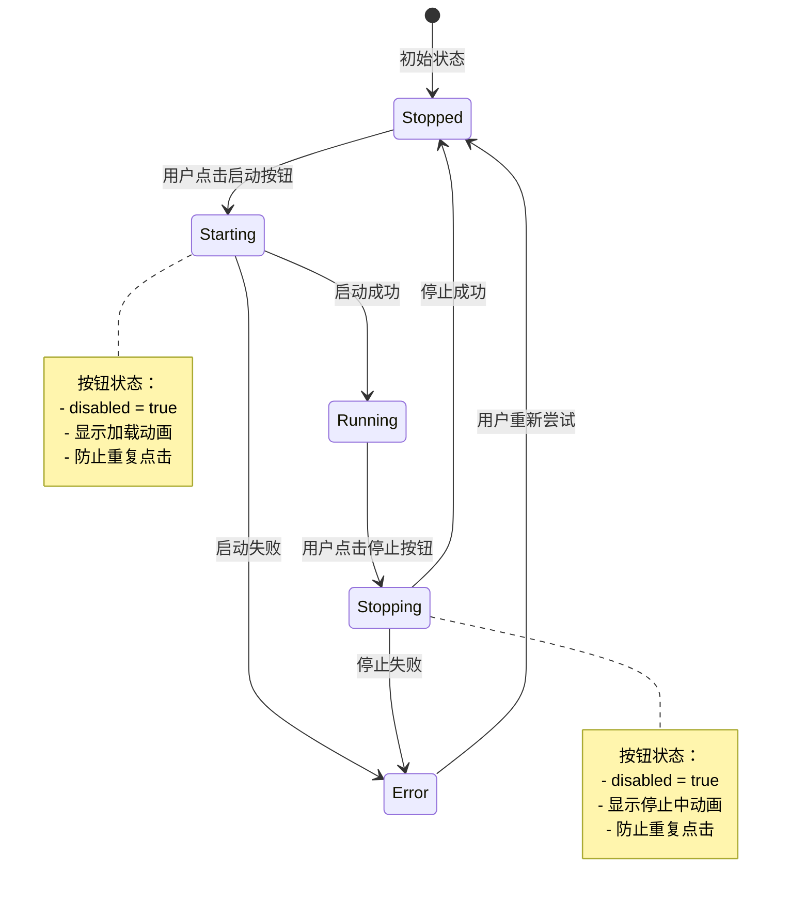
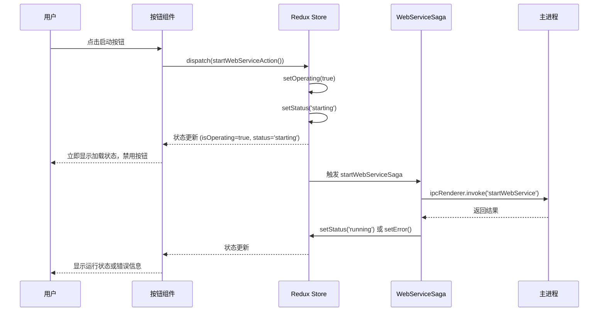
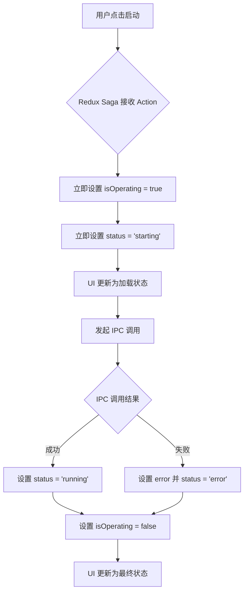
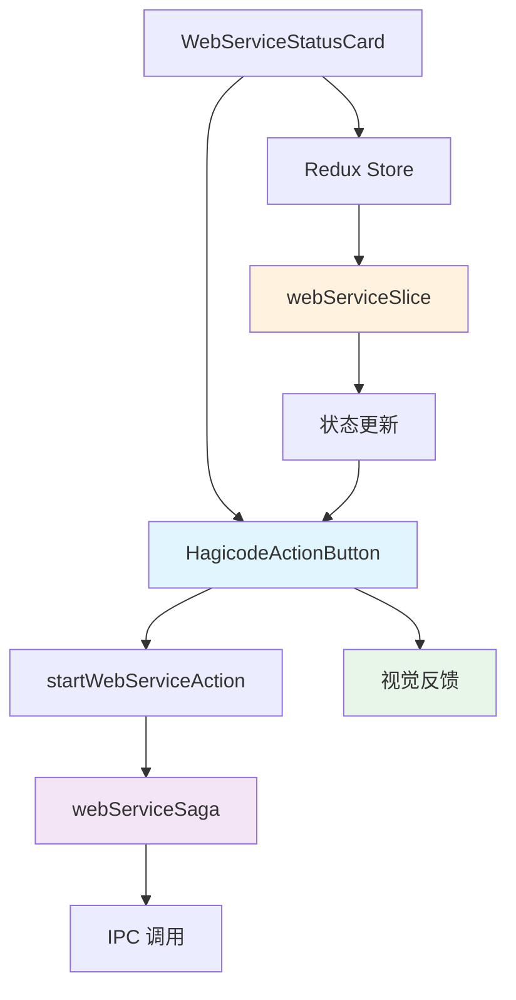

# Change: Web服务启动按钮即时反馈优化

## Why

当前 Hagicode Desktop 应用的 Web 服务启动按钮存在用户体验问题：用户点击启动按钮后，UI 不会立即显示加载状态，导致用户无法确认操作已被接收。同时，由于缺少即时视觉反馈和按钮禁用逻辑，用户可能多次点击启动按钮，触发重复的启动请求和不必要的 IPC 通信开销。

## What Changes

- **立即加载状态**：点击启动按钮后立即更新 Redux 状态为 `starting`，确保 UI 立即响应
- **按钮禁用逻辑**：当服务状态为 `starting` 或 `stopping` 时，禁用启动/停止按钮
- **视觉反馈增强**：使用 shadcn/ui 的 `Button` 组件的 `loading` 状态显示加载动画
- **Saga 处理优化**：在发起 IPC 调用前先更新状态，确保状态转换的即时性

## UI Design Changes

### 启动按钮状态转换流程



### 用户交互时序图



### 启动按钮视觉效果

**当前状态（已停止）：**
```
┌─────────────────────────────────────────────┐
│  [▶] 启动 Hagicode                         │
│  渐变背景，可点击                            │
└─────────────────────────────────────────────┘
```

**点击后（立即显示启动中）：**
```
┌─────────────────────────────────────────────┐
│  [⟳] 正在启动...                            │
│  加载动画，按钮禁用 (opacity: 0.5)           │
└─────────────────────────────────────────────┘
```

**运行状态：**
```
┌─────────────────────────────────────────────┐
│  [✓] 运行中 | [打开应用] [浏览器打开]        │
└─────────────────────────────────────────────┘
```

## Code Flow Changes

### Redux 状态转换流程



### 组件交互关系



## Impact

- **Affected specs**: `specs/electron-app/spec.md` (Server Control requirement)
- **Affected code**:
  - `src/renderer/components/WebServiceStatusCard.tsx` - UI 组件状态判断逻辑
  - `src/renderer/components/HagicodeActionButton.tsx` - 按钮禁用和加载状态显示
  - `src/renderer/store/slices/webServiceSlice.ts` - Redux 状态管理
  - `src/renderer/store/sagas/webServiceSaga.ts` - Saga 异步处理流程
- **Risk Level**: 低风险 - 主要是 UI 层和状态层的改进
- **Breaking Changes**: 无
- **Backward Compatibility**: 完全兼容，不改变现有 API 接口
