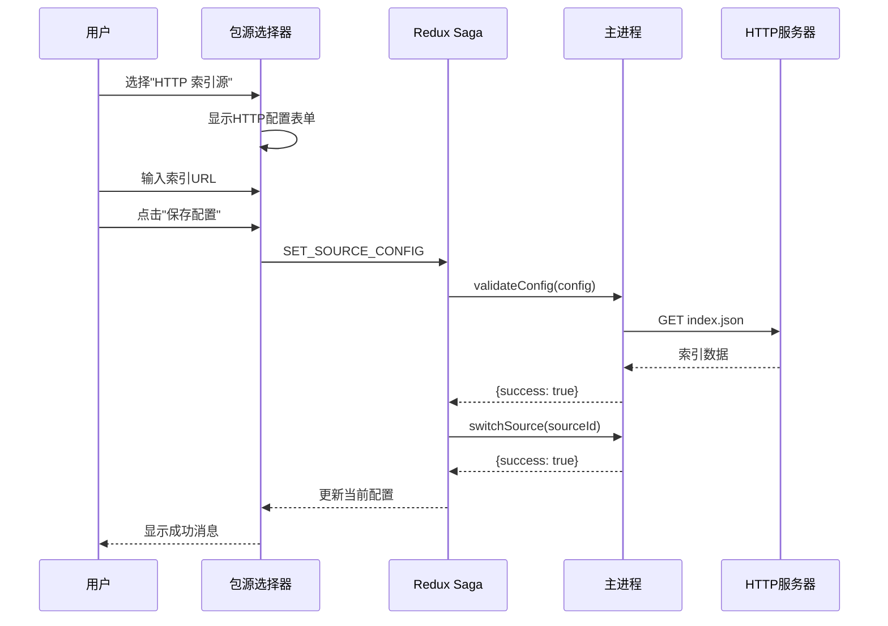
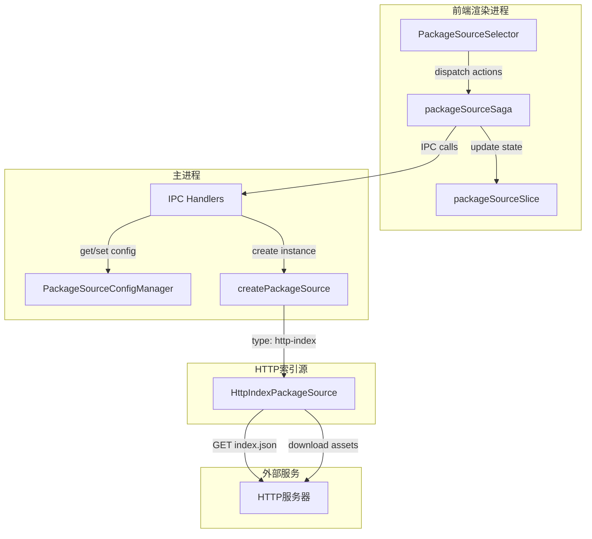
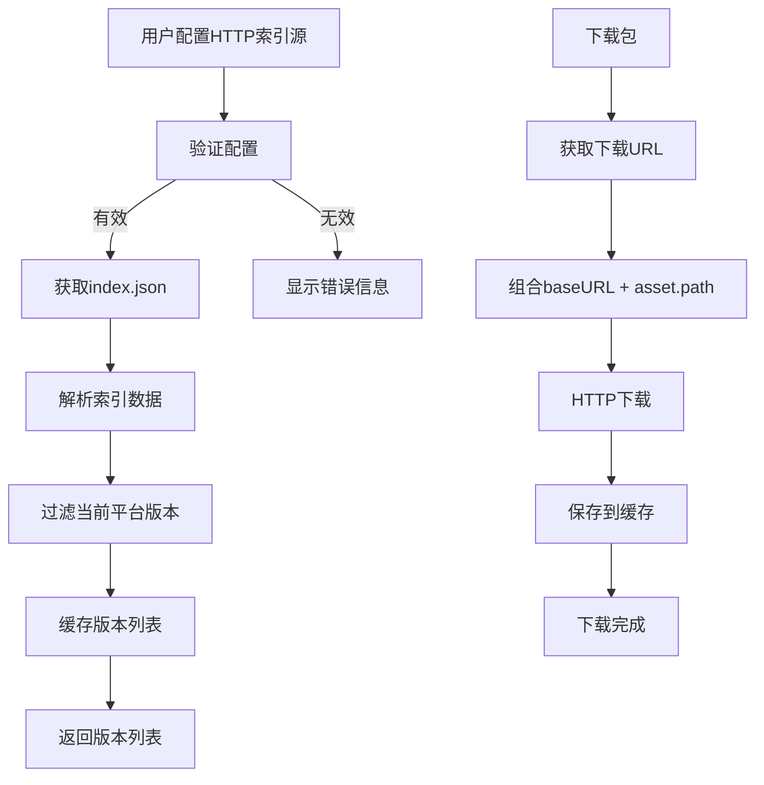
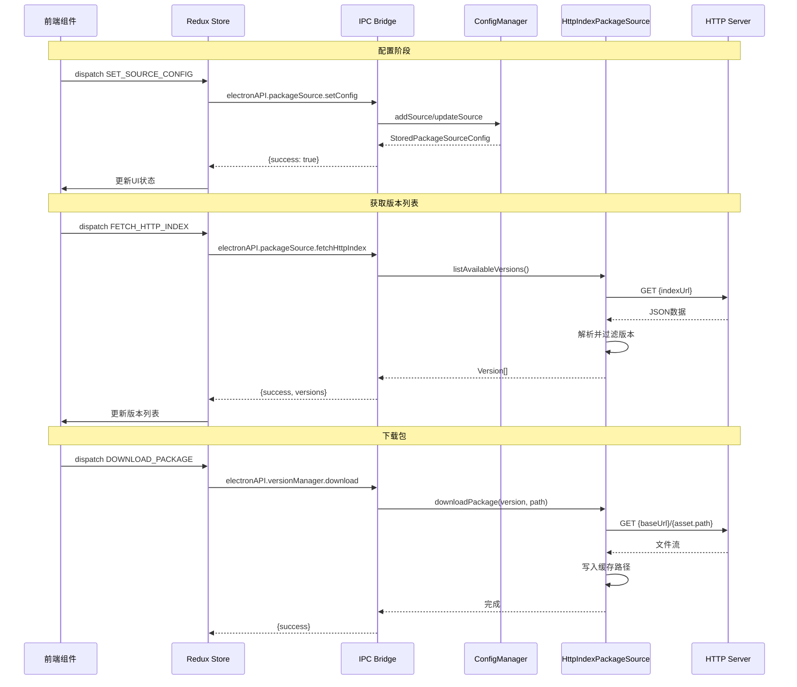

# Change: 添加自定义HTTP索引包源支持

## Why

当前系统仅支持本地文件夹和GitHub Releases两种包源类型。为了扩展包源的灵活性，需要支持从自定义HTTP服务器获取包索引和下载包文件的能力。这允许用户配置自己的CDN或文件服务器作为包源，提供更好的部署灵活性和自定义选项。

## What Changes

- **新增包源类型**: 添加 `http-index` 类型的包源配置
- **后端实现**: 创建 `HttpIndexPackageSource` 类实现 `PackageSource` 接口
- **前端UI**: 在包源选择器中添加HTTP索引源的配置表单
- **状态管理**: 扩展Redux store和saga以支持新包源类型
- **配置持久化**: 更新配置管理器以支持新类型的存储

## UI Design Changes

### 包源选择器UI扩展

```
┌─────────────────────────────────────────────────────────┐
│ 📦 包源管理                                    │
├─────────────────────────────────────────────────────────┤
│                                                           │
│ 选择源类型:                                              │
│ ┌───────────────────────────────────────────────────┐  │
│ │ 📁 本地文件夹                                      │  │
│ │ 🐙 GitHub Releases                                 │  │
│ │ 🌐 HTTP 索引源 [新增]                              │  │
│ └───────────────────────────────────────────────────┘  │
│                                                           │
│ 当选择 "HTTP 索引源" 时显示:                            │
│ ┌───────────────────────────────────────────────────┐  │
│ │ 索引URL *                                          │  │
│ │ ┌─────────────────────────────────────────────────┐│  │
│ │ │ https://server.dl.hagicode.com/index.json       ││  │
│ │ └─────────────────────────────────────────────────┘│  │
│ │                                                    │  │
│ │ 下载URL前缀 (可选)                                  │  │
│ │ ┌─────────────────────────────────────────────────┐│  │
│ │ │ https://server.dl.hagicode.com/                 ││  │
│ │ └─────────────────────────────────────────────────┘│  │
│ │                                                    │  │
│ │ 认证令牌 (可选)                                     │  │
│ │ ┌─────────────────────────────────────────────────┐│  │
│ │ │ ••••••••••••••••                                ││  │
│ │ └─────────────────────────────────────────────────┘│  │
│ │                                                    │  │
│ │ ℹ️ 索引文件必须包含versions数组和每个版本的assets    │  │
│ └───────────────────────────────────────────────────┘  │
│                                                           │
│              [ 保存配置 ]                                │
└─────────────────────────────────────────────────────────┘
```

### 用户交互流程



### 错误处理UI状态

```
┌─────────────────────────────────────────────────────────┐
│ ❌ 配置验证失败                                          │
├─────────────────────────────────────────────────────────┤
│                                                           │
│ 无法获取索引文件:                                         │
│ • 索引URL返回404错误                                      │
│ • 请检查URL是否正确并可访问                               │
│                                                           │
│              [ 重试 ]  [ 返回 ]                          │
└─────────────────────────────────────────────────────────┘
```

## Code Flow Changes

### 架构概览



### HTTP索引源数据流



### 组件交互序列



## Impact

### Affected specs
- `package-source-management` - 添加新的包源类型支持

### Affected code
**后端 (主进程)**:
- `src/main/package-source-config-manager.ts` - 扩展类型定义支持 `http-index`
- `src/main/package-sources/package-source.ts` - 添加新类型和接口
- `src/main/package-sources/index.ts` - 注册新的包源工厂
- `src/main/package-sources/http-index-source.ts` - 新增HTTP索引源实现
- `src/main/main.ts` - 注册新的IPC处理器

**前端 (渲染进程)**:
- `src/renderer/components/PackageSourceSelector.tsx` - 添加HTTP索引配置UI
- `src/renderer/store/slices/packageSourceSlice.ts` - 添加HTTP索引表单状态
- `src/renderer/store/sagas/packageSourceSaga.ts` - 添加HTTP索引相关saga

**类型定义**:
- `src/preload/index.ts` - 扩展electronAPI类型

**国际化**:
- `src/renderer/i18n/locales/*/components.json` - 添加HTTP索引相关翻译

### Breaking Changes
无破坏性变更。新功能为纯添加，不影响现有功能。

### Dependencies
- 现有依赖: `axios` (已使用于GitHub源)
- 无新增外部依赖

### Migration
无需数据迁移。新配置类型向后兼容。
