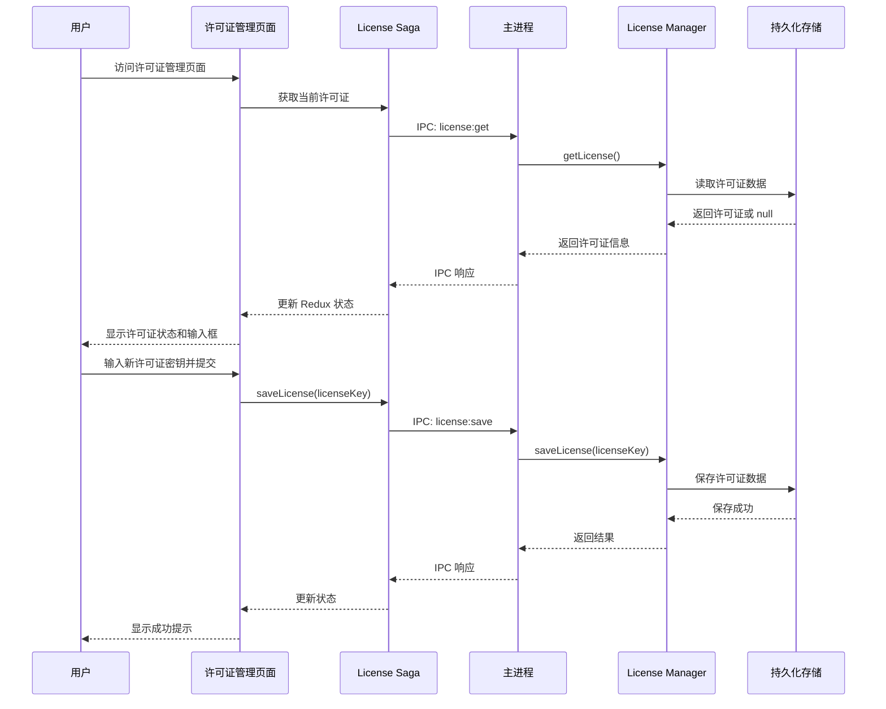
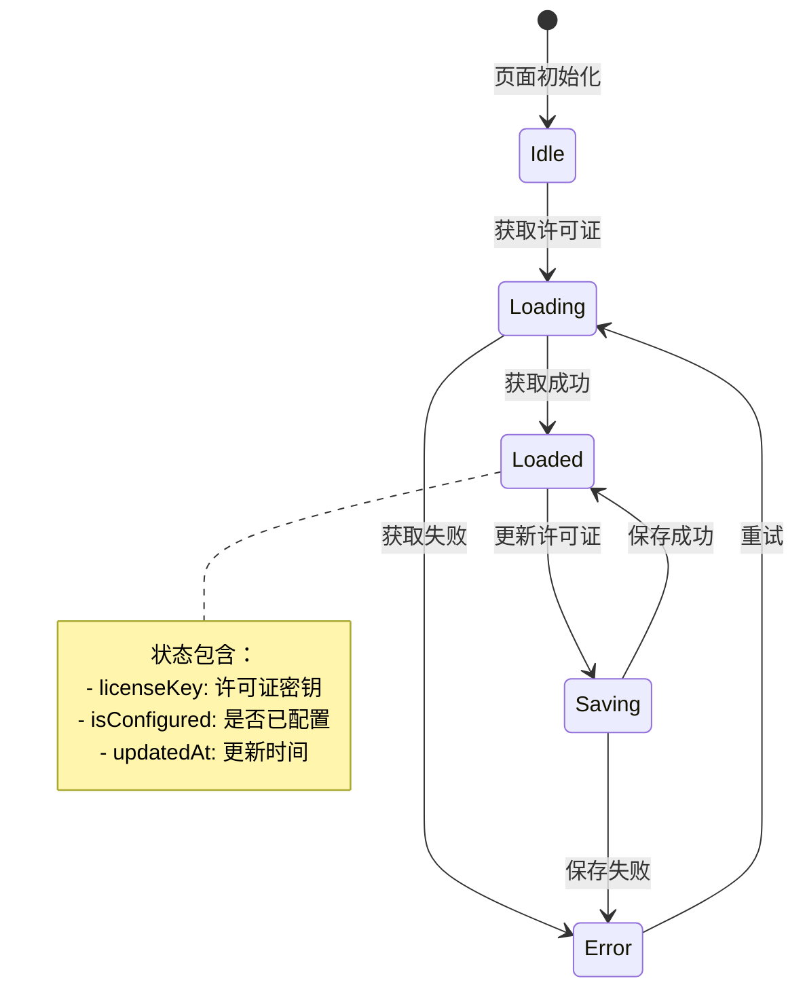
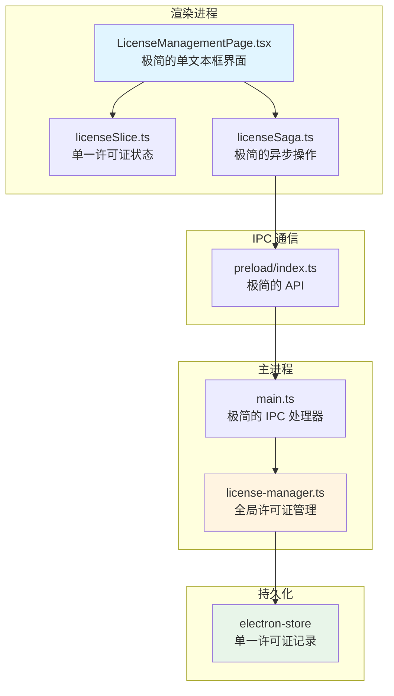
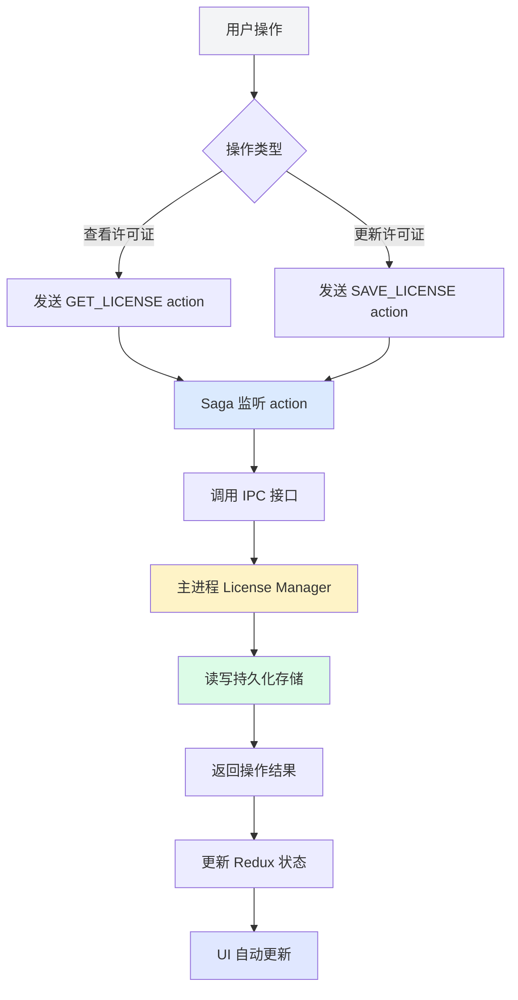
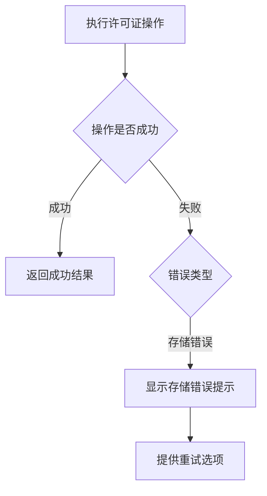
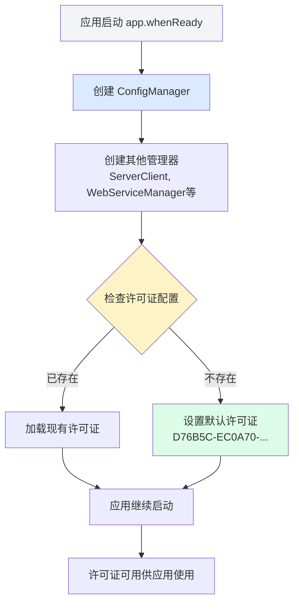

# Change: 许可证管理功能添加

## Why

Hagicode Desktop 当前缺少统一的许可证管理功能，导致以下问题：

1. **许可证存储分散**：公测许可证没有统一的存储和管理位置
2. **配置流程不完整**：用户无法便捷地配置全局许可证信息

通过添加极简的全局许可证管理功能，用户可以通过单一文本框配置所有版本共用的许可证，提升应用功能的完整性和专业性。

## What Changes

- 添加「许可证管理」一级菜单项到侧边栏导航
- 创建 `LicenseManagementPage.tsx` 组件作为许可证管理主界面（极简的单文本框设计）
- 创建主进程 `license-manager.ts` 管理器（单例模式）负责全局许可证存储和检索
- 配置默认公测许可证密钥
- 通过 IPC 暴露许可证管理 API 给渲染进程
- 创建 Redux slice 和 saga 用于许可证状态管理
- 添加中英文国际化翻译文件
- 使用 electron-store 持久化单一全局许可证数据

**极简原则**：许可证是全局的，所有版本共用一个许可证配置。界面仅显示当前许可证状态和更新输入框，不涉及许可证类型识别或分类。

## UI Design Changes

### 侧边栏导航更新

```
┌─────────────────────────────────────────┐
│ Hagico                                  │
│ Desktop                        [语言][主题]│
├─────────────────────────────────────────┤
│ [⚙️] 系统管理                            │
│ [📄] 版本管理                            │
│ [🔑] 许可证管理       ← 新增菜单项        │
├─────────────────────────────────────────┤
│ [🌐] 官方网站                            │
│ [👥] 技术支持                            │
│ [⭐] GitHub 项目                         │
├─────────────────────────────────────────┤
│ [ℹ️] v0.1.0                [折叠菜单 >]  │
└─────────────────────────────────────────┘
```

### 许可证管理页面（极简版）

```
┌─────────────────────────────────────────────────────────┐
│ 许可证管理                                       [刷新]   │
├─────────────────────────────────────────────────────────┤
│                                                         │
│ 当前许可证状态                                           │
│ ┌───────────────────────────────────────────────────┐ │
│ │                                                   │ │
│ │  状态：  ● 已配置                                  │ │
│ │                                                   │ │
│ │  许可证：D76B5C-***-***-***-***-V3                │ │
│ │                                                   │ │
│ │  该许可证适用于所有已安装的软件版本。               │ │
│ │                                                   │ │
│ └───────────────────────────────────────────────────┘ │
│                                                         │
│ 更新许可证                                             │
│ ┌───────────────────────────────────────────────────┐ │
│ │ 许可证密钥 *                                       │ │
│ │ ┌───────────────────────────────────────────────┐ ││
│ │ │ D76B5C-EC0A70-AEA453-BC9414-0A198D-V3        │ ││
│ │ └───────────────────────────────────────────────┘ ││
│ │                                                   │ │
│ │             [取消]  [更新许可证]                   │ │
│ └───────────────────────────────────────────────────┘ │
└─────────────────────────────────────────────────────────┘
```

### 用户交互流程（极简版）



### 状态管理（极简版）



## Code Flow Changes

### 系统架构（极简版）



### 数据流（极简版）



### 代码变更清单

| 文件路径 | 变更类型 | 变更原因 | 影响范围 |
|---------|---------|---------|---------|
| `src/main/license-manager.ts` | 新增 | 创建极简的全局许可证管理器 | 主进程 |
| `src/main/config.ts` | 修改 | 在 AppConfig 中添加 license 字段，添加许可证相关方法 | 配置管理 |
| `src/main/main.ts` | 修改 | 1. 注册极简的许可证 IPC 处理器<br>2. 在应用启动时初始化默认许可证 | IPC 通信 + 应用启动 |
| `src/preload/index.ts` | 修改 | 暴露极简的许可证 API | preload 脚本 |
| `src/renderer/components/LicenseManagementPage.tsx` | 新增 | 创建极简的单文本框许可证管理页面 | 渲染进程 |
| `src/renderer/components/SidebarNavigation.tsx` | 修改 | 添加「许可证管理」导航项 | 导航 |
| `src/renderer/store/slices/licenseSlice.ts` | 新增 | 创建极简的 Redux slice（单一许可证） | 状态管理 |
| `src/renderer/store/sagas/licenseSaga.ts` | 新增 | 创建极简的 Redux saga | 副作用处理 |
| `src/renderer/store/slices/viewSlice.ts` | 修改 | 添加 'license' 视图类型 | 视图管理 |
| `src/renderer/store/index.ts` | 修改 | 注册许可证 reducer 和 saga | Redux 配置 |
| `src/renderer/i18n/locales/zh-CN/components.json` | 修改 | 添加中文翻译 | 国际化 |
| `src/renderer/i18n/locales/en-US/components.json` | 修改 | 添加英文翻译 | 国际化 |
| `src/types/license.ts` | 新增 | 定义极简的许可证类型 | 类型定义 |

### IPC 接口设计（极简版）

```typescript
// preload/index.ts 新增接口
license: {
  get: () => ipcRenderer.invoke('license:get'),
  save: (licenseKey: string) => ipcRenderer.invoke('license:save', licenseKey),
}
```

### 数据结构（极简版）

```typescript
// 全局许可证数据结构（极简）
interface LicenseData {
  licenseKey: string;      // 许可证密钥
  isConfigured: boolean;   // 是否已配置
  updatedAt: string;       // 更新时间
}

// 默认公测许可证配置
const DEFAULT_LICENSE_KEY = 'D76B5C-EC0A70-AEA453-BC9414-0A198D-V3';
```

### 错误处理流程（极简版）



### 应用启动时的许可证初始化



### 配置管理器集成

许可证配置将集成到现有的 `ConfigManager` 中，与其他应用配置（如 `server`、`settings`）统一管理：

```typescript
// src/main/config.ts 扩展
export interface LicenseConfig {
  licenseKey: string;
  isConfigured: boolean;
  updatedAt: string;
}

export interface AppConfig {
  server: ServerConfig;
  license: LicenseConfig;  // 新增
  startOnStartup: boolean;
  minimizeToTray: boolean;
  checkForUpdates: boolean;
  settings: AppSettings;
}

export class ConfigManager {
  // 新增方法
  getLicense(): LicenseConfig | null;
  setLicense(licenseKey: string): void;
}
```

### 许可证在应用中的应用场景

当前阶段许可证主要用于配置和存储，未来可在以下场景中应用：

1. **Web 服务启动**：验证许可证后允许启动服务
2. **版本管理**：检查许可证状态后允许版本切换
3. **依赖安装**：验证许可证后允许安装依赖

**注意**：当前阶段不实施许可证验证逻辑，仅提供配置和存储功能。

## Impact

### 用户体验影响
- 用户通过极简的单一文本框配置全局许可证
- 所有版本共用一个许可证配置，极简管理
- 提升应用功能的完整性和专业性

### 技术影响
- 新增极简的许可证管理器模块
- 最小化的 Redux 状态管理（单一许可证）
- 极简的 IPC 通信接口
- 需要更新国际化资源

### 兼容性
- 向后兼容：不影响现有功能
- 数据迁移：首次使用时可设置默认许可证
