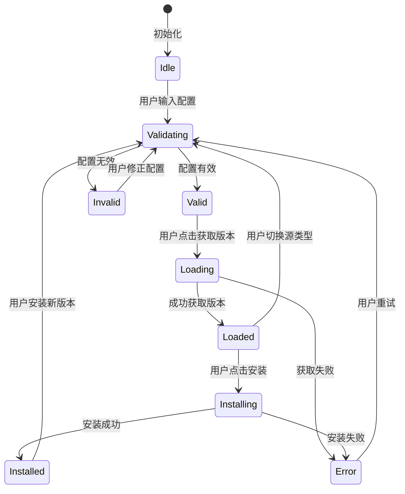
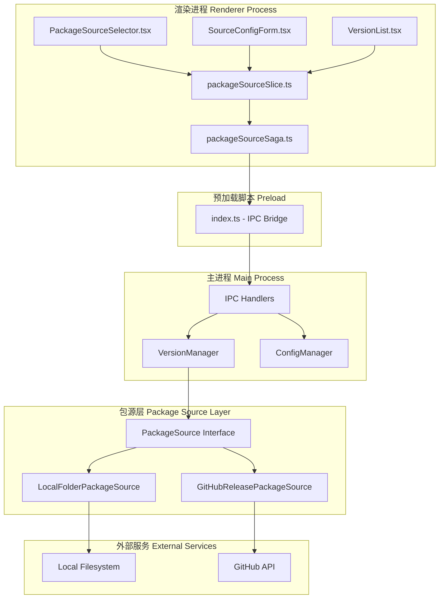
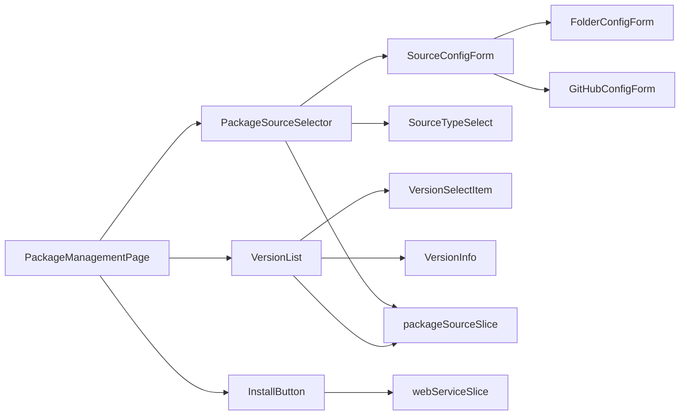
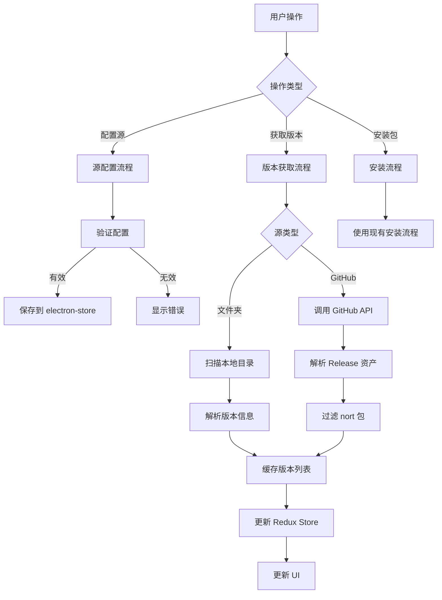
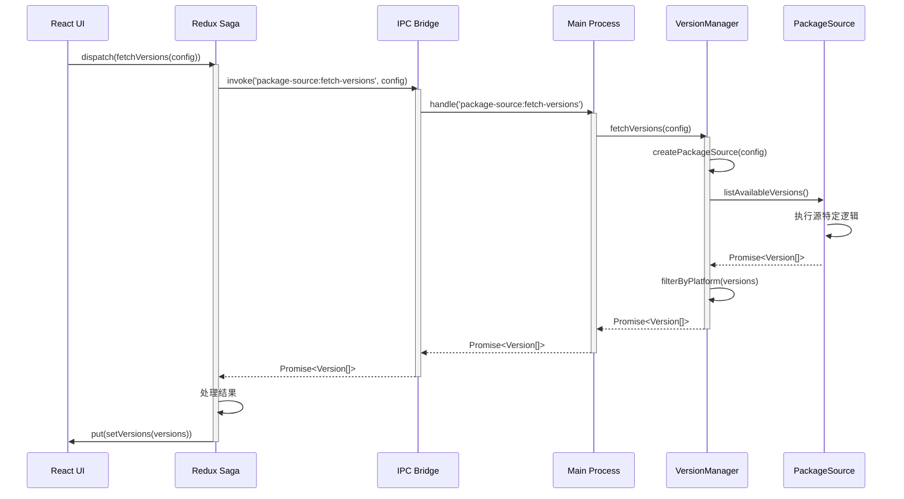

# Design: 多包源管理系统增强

## Context

Hagicode Desktop 当前使用硬编码的本地文件夹路径作为软件包源（`version-manager.ts:68`）。这种设计存在以下问题：

1. **开发与生产环境切换困难**：需要手动修改代码来更改包源路径
2. **缺乏灵活性**：无法支持其他包源类型（如 GitHub Releases）
3. **用户体验不佳**：缺少直观的源配置界面

本项目已经使用 shadcn/ui 组件库，并实现了基于 Redux + Redux Saga 的状态管理架构。我们需要在此基础上扩展包源管理能力。

## Constraints

- **技术栈**：Electron + React + TypeScript + Redux Toolkit + Redux Saga
- **UI 组件库**：shadcn/ui（基于 Radix UI）
- **配置存储**：electron-store
- **HTTP 客户端**：axios（已安装）
- **向后兼容**：必须保持现有 IPC 接口和行为不变
- **国际化**：必须支持中英文界面

## Goals / Non-Goals

### Goals

- 实现灵活的包源配置系统
- 支持本地文件夹和 GitHub Releases 两种源类型
- 提供用户友好的源配置界面
- 保持现有功能完全兼容
- 实现包源抽象接口，便于未来扩展

### Non-Goals

- 不支持第三方包源注册表
- 不实现包源的自动发现功能
- 不修改现有的安装逻辑（仅扩展数据源）
- 不实现包的数字签名验证

## Decisions

### Decision 1: 使用抽象接口模式实现多源支持

**选择理由**：
- 清晰的接口定义便于理解和维护
- 新增源类型只需实现接口，不影响现有代码
- 符合开闭原则（对扩展开放，对修改关闭）

**接口定义**：
```typescript
interface PackageSource {
  type: 'local-folder' | 'github-release' | 'http';
  listAvailableVersions(): Promise<Version[]>;
  downloadPackage(version: Version): Promise<string>;
  fetchPackage(version: Version): Promise<Buffer>;
}
```

**Alternatives considered**：
- **策略模式**：与抽象接口类似，但更复杂
- **配置驱动**：灵活性较低，难以处理复杂逻辑

### Decision 2: 使用 Redux 管理包源配置状态

**选择理由**：
- 与现有架构一致（项目已使用 Redux Toolkit）
- 支持复杂的状态管理和副作用处理
- 便于实现状态持久化和恢复

**Alternatives considered**：
- **Context API**：适合简单状态，但项目已有 Redux 架构
- **localStorage**：不适合复杂数据结构，且主进程无法访问

### Decision 3: 使用 electron-store 持久化包源配置

**选择理由**：
- 项目已在其他地方使用 electron-store
- 提供跨平台的持久化存储
- 支持 JSON 格式，易于读写

**安全考虑**：
- GitHub Token 将使用加密存储
- 敏感信息不记录到日志

### Decision 4: 实现版本缓存机制

**选择理由**：
- 减少 GitHub API 调用次数
- 提升用户体验（快速加载）
- 避免触及 API 速率限制

**缓存策略**：
- 缓存键：`{sourceType}:{sourceIdentifier}`
- 缓存时长：1 小时
- 失效策略：手动刷新或过期自动刷新

### Decision 5: 默认使用本地文件夹源

**选择理由**：
- 向后兼容现有行为
- 离线可用，无网络依赖
- 适合开发环境快速迭代

**默认配置**：
```typescript
const defaultConfig: PackageSourceConfig = {
  type: 'local-folder',
  localFolderPath: process.env.NODE_ENV === 'development'
    ? '/home/newbe36524/repos/newbe36524/pcode/Release/release-packages/'
    : path.join(app.getPath('userData'), 'packages')
};
```

## UI/UX Design

### 包源选择器界面

#### 1. 默认状态（本地文件夹源）

```
┌──────────────────────────────────────────────────────────────────┐
│  Package Installation                                     [×]     │
├──────────────────────────────────────────────────────────────────┤
│                                                                   │
│  Package Source                                    ⓘ            │
│  ┌────────────────────────────────────────────────────────────┐ │
│  │ Local Folder                                        ▼      │ │
│  │ • Local Folder                                         │ │
│  │ • GitHub Releases                                      │ │
│  └────────────────────────────────────────────────────────────┘ │
│                                                                   │
│  Folder Path                                              ━━━    │
│  ┌────────────────────────────────────────────────────────────┐ │
│  │ /home/user/packages                         [Browse...]    │ │
│  └────────────────────────────────────────────────────────────┘ │
│                                                                   │
│  ┌────────────────────────────────────────────────────────────┐ │
│  │              [Scan Available Versions]                     │ │
│  └────────────────────────────────────────────────────────────┘ │
│                                                                   │
│  Available Versions (3 found, filtered by platform: linux)       │
│  ┌────────────────────────────────────────────────────────────┐ │
│  │ hagicode-0.1.0-alpha.10-linux-x64                  ▼      │ │
│  │ hagicode-0.1.0-alpha.9-linux-x64                           │ │
│  │ hagicode-0.1.0-alpha.8-linux-x64                           │ │
│  └────────────────────────────────────────────────────────────┘ │
│                                                                   │
│  ┌────────────────────────────────────────────────────────────┐ │
│  │                   [Install Package]                        │ │
│  └────────────────────────────────────────────────────────────┘ │
│                                                                   │
└──────────────────────────────────────────────────────────────────┘
```

#### 2. GitHub Releases 源状态

```
┌──────────────────────────────────────────────────────────────────┐
│  Package Installation                                     [×]     │
├──────────────────────────────────────────────────────────────────┤
│                                                                   │
│  Package Source                                    ⓘ            │
│  ┌────────────────────────────────────────────────────────────┐ │
│  │ GitHub Releases                                     ▼      │ │
│  │ • Local Folder                                         │ │
│  │ • GitHub Releases                                      │ │
│  └────────────────────────────────────────────────────────────┘ │
│                                                                   │
│  Repository Owner                                       ━━━     │
│  ┌────────────────────────────────────────────────────────────┐ │
│  │ HagiCode-org                                               │ │
│  └────────────────────────────────────────────────────────────┘ │
│                                                                   │
│  Repository Name                                       ━━━     │
│  ┌────────────────────────────────────────────────────────────┐ │
│  │ releases                                                   │ │
│  └────────────────────────────────────────────────────────────┘ │
│                                                                   │
│  Auth Token (Optional)                                [Show]  ━━ │
│  ┌────────────────────────────────────────────────────────────┐ │
│  │ ••••••••••••••••••••••••••••••                    [Clear]   │ │
│  └────────────────────────────────────────────────────────────┘ │
│  ⓘ Increases API rate limit to 5000 requests/hour             │
│                                                                   │
│  ┌────────────────────────────────────────────────────────────┐ │
│  │              [Fetch from GitHub]                          │ │
│  └────────────────────────────────────────────────────────────┘ │
│                                                                   │
│  Available Versions (3 found, filtered by platform: linux)       │
│  ┌────────────────────────────────────────────────────────────┐ │
│  │ v0.1.0-alpha.10 (2025-01-15)                       ▼      │ │
│  │ v0.1.0-alpha.9 (2025-01-10)                                │ │
│  │ v0.1.0-alpha.8 (2025-01-05)                                │ │
│  └────────────────────────────────────────────────────────────┘ │
│                                                                   │
│  ┌────────────────────────────────────────────────────────────┐ │
│  │                   [Install Package]                        │ │
│  └────────────────────────────────────────────────────────────┘ │
│                                                                   │
└──────────────────────────────────────────────────────────────────┘
```

### 用户交互流程


### 状态转换图



### 错误处理 UX

#### 文件夹源错误

```
┌──────────────────────────────────────────────────────────────────┐
│  Folder Path                                              ━━━    │
│  ┌────────────────────────────────────────────────────────────┐ │
│  │ /invalid/path                                               │ │
│  └────────────────────────────────────────────────────────────┘ │
│  ⚠ This path does not exist or is not accessible                │
│  ┌────────────────────────────────────────────────────────────┐ │
│  │              [Browse...]  [Clear]                           │ │
│  └────────────────────────────────────────────────────────────┘ │
└──────────────────────────────────────────────────────────────────┘
```

#### GitHub API 速率限制

```
┌──────────────────────────────────────────────────────────────────┐
│  ⚠ GitHub API Rate Limit Exceeded                               │
│  ┌────────────────────────────────────────────────────────────┐ │
│  │ You have exceeded the GitHub API rate limit (60/hour).     │ │
│  │ Please provide an auth token to increase the limit to      │ │
│  │ 5000 requests/hour, or wait 15 minutes before retrying.    │ │
│  │                                                            │ │
│  │ [Learn more about GitHub tokens]                           │ │
│  └────────────────────────────────────────────────────────────┘ │
│  ┌────────────────────────────────────────────────────────────┐ │
│  │                    [Retry]  [Close]                        │ │
│  └────────────────────────────────────────────────────────────┘ │
└──────────────────────────────────────────────────────────────────┘
```

#### 网络错误

```
┌──────────────────────────────────────────────────────────────────┐
│  ⚠ Network Error                                                │
│  ┌────────────────────────────────────────────────────────────┐ │
│  │ Failed to connect to GitHub. Please check your internet    │ │
│  │ connection and try again.                                   │ │
│  │                                                            │ │
│  │ Error: ETIMEDOUT                                           │ │
│  └────────────────────────────────────────────────────────────┘ │
│  ┌────────────────────────────────────────────────────────────┐ │
│  │                    [Retry]  [Cancel]                       │ │
│  └────────────────────────────────────────────────────────────┘ │
└──────────────────────────────────────────────────────────────────┘
```

## Technical Design

### 架构概览



### 组件关系图



### 数据流图



### API 时序图



### 详细代码变更

#### 主进程变更

| 文件路径 | 变更类型 | 变更说明 | 影响模块 |
|---------|---------|---------|---------|
| `src/main/version-manager.ts` | 修改 | 移除硬编码路径，添加包源工厂方法 | 核心管理器 |
| `src/main/package-sources/package-source.ts` | 新增 | 定义 PackageSource 接口和类型 | 包源抽象 |
| `src/main/package-sources/local-folder-source.ts` | 新增 | 实现本地文件夹源 | 文件夹源 |
| `src/main/package-sources/github-release-source.ts` | 新增 | 实现 GitHub Releases 源 | GitHub 源 |
| `src/main/package-sources/index.ts` | 新增 | 导出所有包源类和工厂函数 | 包源层 |
| `src/main/config-manager.ts` | 修改 | 添加包源配置读写方法 | 配置管理 |

#### 渲染进程变更

| 文件路径 | 变更类型 | 变更说明 | 影响组件 |
|---------|---------|---------|---------|
| `src/renderer/store/index.ts` | 修改 | 注册 packageSourceSlice 和 saga | Store 配置 |
| `src/renderer/store/slices/packageSourceSlice.ts` | 新增 | 包源状态管理 | 状态管理 |
| `src/renderer/store/sagas/packageSourceSaga.ts` | 新增 | 包源异步操作处理 | 副作用管理 |
| `src/renderer/components/PackageSourceSelector.tsx` | 新增 | 源选择器主组件 | UI 组件 |
| `src/renderer/components/SourceConfigForm.tsx` | 新增 | 源配置表单组件 | UI 组件 |
| `src/renderer/components/FolderConfigForm.tsx` | 新增 | 文件夹配置表单 | UI 组件 |
| `src/renderer/components/GitHubConfigForm.tsx` | 新增 | GitHub 配置表单 | UI 组件 |
| `src/renderer/i18n/locales/zh-CN/components.json` | 修改 | 添加包源相关翻译 | 国际化 |
| `src/renderer/i18n/locales/en-US/components.json` | 修改 | 添加包源相关翻译 | 国际化 |

#### 预加载脚本变更

| 文件路径 | 变更类型 | 变更说明 | 影响范围 |
|---------|---------|---------|---------|
| `src/preload/index.ts` | 修改 | 添加 packageSource 命名空间和方法 | IPC 桥接 |

### 关键接口定义

```typescript
// 包源配置类型
interface PackageSourceConfig {
  type: 'local-folder' | 'github-release';
  localFolderPath?: string;
  githubRepository?: {
    owner: string;
    repo: string;
  };
  githubToken?: string;
}

// 版本信息（扩展现有接口）
interface Version {
  id: string;
  version: string;
  platform: string;
  packageFilename: string;
  releasedAt?: string;
  size?: number;
  downloadUrl?: string;  // 新增
  releaseNotes?: string; // 新增
}

// 包源接口
interface PackageSource {
  readonly type: string;
  listAvailableVersions(): Promise<Version[]>;
  downloadPackage(version: Version, onProgress?: (progress: number) => void): Promise<string>;
  validateConfig?(): Promise<{ valid: boolean; error?: string }>;
}

// Redux 状态
interface PackageSourceState {
  currentConfig: PackageSourceConfig | null;
  availableVersions: Version[];
  loading: boolean;
  error: string | null;
  validationError: string | null;
}
```

## Risks / Trade-offs

### 风险评估

| 风险 | 影响 | 可能性 | 缓解措施 |
|------|------|--------|---------|
| GitHub API 速率限制 | 中 | 高 | 实现缓存、提供 Token 选项、友好错误提示 |
| 网络连接不稳定 | 中 | 中 | 重试机制、离线模式（文件夹源） |
| Token 存储安全 | 高 | 低 | 使用 electron-store 加密功能、不记录日志 |
| 版本缓存失效 | 低 | 低 | 合理的过期时间、手动刷新选项 |
| 向后兼容性破坏 | 高 | 低 | 严格的接口兼容测试、保留旧 IPC 通道 |

### 权衡决策

1. **缓存 vs 实时性**
   - 决定：使用 1 小时缓存
   - 权衡：牺牲实时性换取更好的性能和 API 限制管理

2. **Token 加密 vs 便利性**
   - 决定：使用 electron-store 的加密功能
   - 权衡：轻微的性能开销换取安全性

3. **UI 复杂度 vs 功能完整性**
   - 决定：分步显示配置（根据源类型）
   - 权衡：减少界面复杂度，提升用户体验

## Migration Plan

### 迁移步骤

1. **准备阶段**
   - 备份现有配置
   - 确保现有测试通过

2. **实施阶段**
   - 按照任务清单顺序实施
   - 每完成一个阶段进行测试
   - 保持向后兼容

3. **验证阶段**
   - 手动测试所有源类型
   - 测试源切换功能
   - 验证错误处理

4. **部署阶段**
   - 逐步推出给测试用户
   - 收集反馈
   - 修复发现的问题

### 回滚计划

如果出现严重问题：
1. 回退到上一个稳定版本
2. 恢复备份的配置
3. 分析问题原因
4. 修复后重新部署

### 数据迁移

```typescript
// 迁移逻辑
async function migrateConfig() {
  const oldPath = '/home/newbe36524/repos/newbe36524/pcode/Release/release-packages/';
  const newConfig: PackageSourceConfig = {
    type: 'local-folder',
    localFolderPath: oldPath
  };

  await configManager.setPackageSourceConfig(newConfig);
}
```

## Open Questions

1. **GitHub Token 的最佳存储方式**
   - 是否需要使用系统密钥链（如 macOS Keychain）？
   - 还是 electron-store 的加密足够？

2. **版本缓存的失效策略**
   - 是否应该提供"强制刷新"按钮？
   - 缓存时长是否应该可配置？

3. **离线模式支持**
   - 当网络不可用时，是否应该自动切换到文件夹源？
   - 如何处理文件夹源也配置错误的情况？

4. **多源同时支持**
   - 是否需要支持同时配置多个源？
   - 还是切换源时清空版本列表？

## Implementation Notes

### 关键依赖

- **axios**: 已安装，用于 HTTP 请求
- **electron-store**: 已安装，用于配置持久化
- **adm-zip**: 已安装，用于解压包文件

### 新增依赖

无需新增外部依赖，使用现有技术栈即可实现。

### 性能考虑

- GitHub API 调用结果缓存 1 小时
- 版本列表使用虚拟滚动（如果版本数量很大）
- 文件夹扫描使用异步操作避免阻塞

### 安全考虑

- GitHub Token 不记录到日志
- Token 使用 `***` 部分遮盖显示
- 配置文件权限设置为仅当前用户可读
