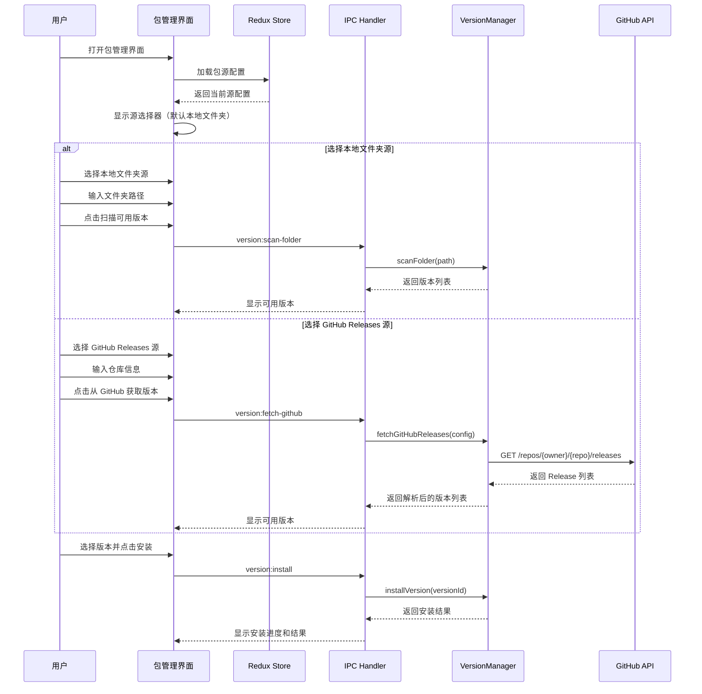
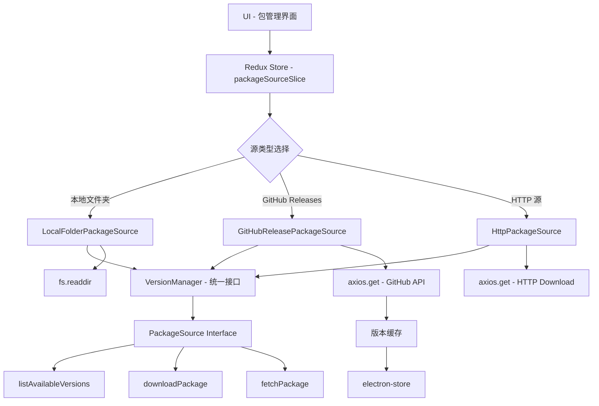
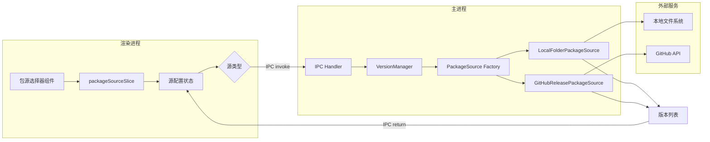

# Change: 多包源管理系统增强

## Why

当前版本管理系统存在以下限制：

1. **单一源配置**：系统仅支持固定的本地文件夹路径（硬编码在 `version-manager.ts:68`），缺乏灵活的源配置能力
2. **文件夹源不够灵活**：用户无法自定义和修改本地文件夹路径
3. **源切换不直观**：缺少用户友好的源选择界面
4. **GitHub Releases 集成不完善**：虽然规范中定义了 GitHub Releases 源，但实际实现存在差距

这些限制导致用户体验不佳，特别是在开发和生产环境之间切换时需要手动修改代码。

## What Changes

### 核心变更

- **添加包源选择器 UI 组件**：使用 shadcn/ui 的 Select 组件实现源选择器，支持在本地文件夹和 GitHub Releases 之间切换

- **增强本地文件夹源**：
  - 允许用户自定义文件夹路径
  - 提供路径验证和错误提示
  - 将配置持久化到 electron-store

- **完善 GitHub Releases 源集成**：
  - 实现完整的 GitHub API 集成
  - 自动检测可用版本和发布说明
  - 支持认证 Token 以提高 API 限制
  - 缓存版本信息以减少 API 调用

- **状态管理增强**：
  - 新增 `packageSourceSlice` 管理源配置状态
  - 扩展 IPC 通道支持源配置操作

### 技术实现要点

- 在 Redux store 中添加 `packageSourceSlice` 管理源配置状态
- 扩展 `version-manager.ts` 支持多种源类型
- 通过 IPC 通信实现主进程与渲染进程的源管理交互
- 使用 axios 调用 GitHub API 获取 Releases 信息
- 添加版本信息缓存机制

## UI Design Changes

### 包源选择器界面

```
┌─────────────────────────────────────────────────────────────┐
│  Web Service Package Installation                    [×]    │
├─────────────────────────────────────────────────────────────┤
│                                                              │
│  Package Source ──────────────────────────────────────      │
│  ┌─────────────────────────────────────────────────────┐   │
│  │ Local Folder                                ▼       │   │
│  └─────────────────────────────────────────────────────┘   │
│                                                              │
│  ┌─────────────────────────────────────────────────────┐   │
│  │ /home/user/packages/                     [Browse...] │   │
│  └─────────────────────────────────────────────────────┘   │
│                                                              │
│  [Scan Available Versions]                                  │
│                                                              │
│  Available Versions ────────────────────────────────────    │
│  ┌─────────────────────────────────────────────────────┐   │
│  │ hagicode-0.1.0-alpha.10-linux-x64            ▼     │   │
│  └─────────────────────────────────────────────────────┘   │
│                                                              │
│  Found 3 versions (filtered by platform: linux)             │
│                                                              │
│                    [Install Package]                        │
│                                                              │
└─────────────────────────────────────────────────────────────┘
```

### GitHub Releases 源界面

```
┌─────────────────────────────────────────────────────────────┐
│  Web Service Package Installation                    [×]    │
├─────────────────────────────────────────────────────────────┤
│                                                              │
│  Package Source ──────────────────────────────────────      │
│  ┌─────────────────────────────────────────────────────┐   │
│  │ GitHub Releases                             ▼       │   │
│  └─────────────────────────────────────────────────────┘   │
│                                                              │
│  Repository ────────────────────────────────────────       │
│  ┌─────────────────┐ ┌─────────────────────────────────┐  │
│  │ HagiCode-org    │ │ /releases                       │  │
│  └─────────────────┘ └─────────────────────────────────┘  │
│                                                              │
│  Auth Token (Optional) ───────────────────────────────      │
│  ┌─────────────────────────────────────────────────────┐   │
│  │ github_pat_...                         [Show/Hide]   │   │
│  └─────────────────────────────────────────────────────┘   │
│                                                              │
│  [Fetch from GitHub]                                        │
│                                                              │
│  Available Versions ────────────────────────────────────    │
│  ┌─────────────────────────────────────────────────────┐   │
│  │ v0.1.0-alpha.10 - 2025-01-15                 ▼     │   │
│  └─────────────────────────────────────────────────────┘   │
│                                                              │
│  Found 3 versions (filtered by platform: linux)             │
│                                                              │
│                    [Install Package]                        │
│                                                              │
└─────────────────────────────────────────────────────────────┘
```

### 用户交互流程



## Code Flow Changes

### 包源架构变更



### 数据流变更



### 代码变更清单

| 文件路径 | 变更类型 | 变更原因 | 影响范围 |
|---------|---------|---------|---------|
| `src/main/version-manager.ts` | 修改 | 扩展支持多源类型，移除硬编码路径 | 核心版本管理逻辑 |
| `src/main/package-sources/` | 新增目录 | 实现包源抽象接口 | 包源架构 |
| `src/main/package-sources/package-source.ts` | 新增文件 | 定义 PackageSource 接口 | 包源抽象层 |
| `src/main/package-sources/local-folder-source.ts` | 新增文件 | 实现本地文件夹源 | 文件夹源支持 |
| `src/main/package-sources/github-release-source.ts` | 新增文件 | 实现 GitHub Releases 源 | GitHub 集成 |
| `src/renderer/store/slices/packageSourceSlice.ts` | 新增文件 | 管理包源配置状态 | 状态管理 |
| `src/renderer/store/sagas/packageSourceSaga.ts` | 新增文件 | 处理包源异步操作 | Redux Saga |
| `src/preload/index.ts` | 修改 | 添加包源相关 IPC 通道 | IPC 通信 |
| `src/renderer/components/PackageSourceSelector.tsx` | 新增文件 | 包源选择器 UI 组件 | UI 组件 |
| `src/renderer/i18n/locales/en-US/components.json` | 修改 | 添加包源相关翻译 | 国际化 |
| `src/renderer/i18n/locales/zh-CN/components.json` | 修改 | 添加包源相关翻译 | 国际化 |

## Impact

### 影响的规范

- `specs/package-management/spec.md` - 包管理规范

### 影响的代码模块

**主进程**：
- `src/main/version-manager.ts` - 核心版本管理器
- `src/main/config-manager.ts` - 配置管理（新增包源配置）
- `src/main/ipc-handlers.ts` - IPC 处理器（或等效的 IPC 注册位置）

**渲染进程**：
- `src/renderer/store/` - Redux 状态管理
- `src/renderer/components/` - UI 组件
- `src/renderer/i18n/locales/` - 国际化文件

**预加载脚本**：
- `src/preload/index.ts` - IPC 桥接

### 兼容性影响

- **向后兼容**：保持现有 IPC 接口不变
- **默认行为**：默认使用本地文件夹源，路径从配置读取或使用默认值
- **已安装包**：不影响已安装包的正常使用
- **迁移路径**：首次启动时自动从旧配置迁移到新配置格式

### 用户体验改进

- 开发环境可以使用本地文件夹路径，方便测试
- 生产环境可以直接从 GitHub Releases 获取最新版本
- 用户可以灵活切换不同的包源
- 提供 GitHub Token 认证选项，提高 API 限制

### 风险评估

- **中等风险**：GitHub API 速率限制可能影响用户体验
- **缓解措施**：
  - 实现版本缓存机制
  - 提供认证 Token 选项
  - 显示友好的速率限制错误消息

## Success Criteria

1. 用户可以在本地文件夹和 GitHub Releases 之间切换
2. 本地文件夹路径可以自定义并持久化
3. GitHub Releases 源可以正确获取版本列表
4. GitHub Token 认证功能正常工作
5. 版本信息缓存机制正常工作
6. 所有源类型的安装流程保持一致
7. 国际化支持完整（中英文）
8. 错误处理和用户提示完善
