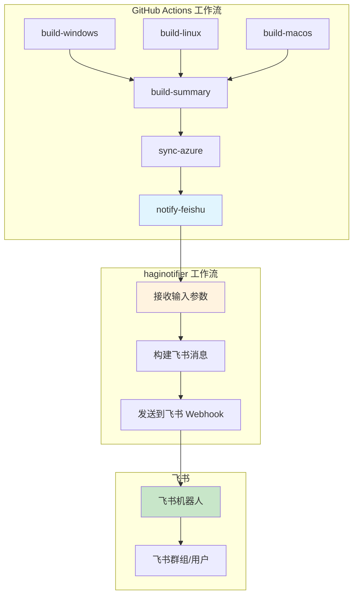
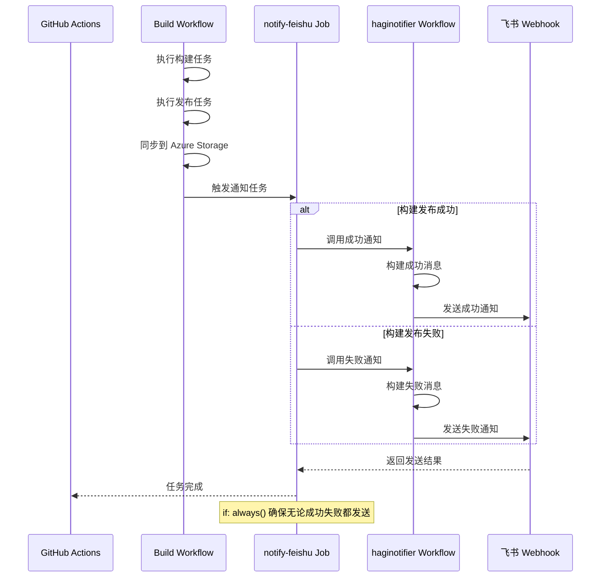

# Change: 集成飞书构建发布通知

**Change ID:** `feishu-build-release-notification`
**Status:** ExecutionCompleted
**Created:** 2026-02-09
**Completed:** 2026-02-09

---

## Why

当前项目的 CI/CD 流程（flow）结束后，缺少自动化的结果通知机制。这导致：

- 团队成员需要手动检查 GitHub Actions 页面来了解构建/发布结果
- 发布成功或失败时无法及时获得通知
- 缺乏统一的发布状态跟踪和汇报机制

为解决这些问题，需要集成 haginotifier 工作流，在构建和发布流程结束后自动向飞书推送执行结果通知。

## What Changes

- **新增飞书通知步骤**：在 build.yml 工作流的最后添加通知任务
- **集成 haginotifier**：调用 HagiCode-org/haginotifier 可复用工作流
- **配置飞书 Webhook**：在项目仓库中添加 FEISHU_WEBHOOK_URL 密钥配置
- **支持多种状态通知**：确保无论构建/发布成功或失败都发送通知
- **包含关键信息**：通知包含执行状态、分支、提交 SHA 等关键信息

## 代码流程变更

### 通知集成架构



### 通知发送流程



### 飞书通知消息格式

#### 成功通知示例

```
┌─────────────────────────────────────────┐
│ ✅ Hagicode Desktop 构建通知            │
├─────────────────────────────────────────┤
│                                         │
│ Flow 执行完成                            │
│ 状态: ✅ 成功                            │
│ 分支: main                              │
│ 提交: abc1234                           │
│                                         │
│ 构建平台: Windows, Linux, macOS         │
│ 发布版本: v1.0.0                        │
│                                         │
│ 查看详情: [GitHub Actions 链接]         │
└─────────────────────────────────────────┘
```

#### 失败通知示例

```
┌─────────────────────────────────────────┐
│ ❌ Hagicode Desktop 构建通知            │
├─────────────────────────────────────────┤
│                                         │
│ Flow 执行完成                            │
│ 状态: ❌ 失败                            │
│ 分支: main                              │
│ 提交: abc1234                           │
│                                         │
│ 失败任务: build-windows                 │
│ 错误信息: [错误摘要]                    │
│                                         │
│ 查看详情: [GitHub Actions 链接]         │
└─────────────────────────────────────────┘
```

### 代码变更清单

| 文件路径 | 变更类型 | 变更原因 | 影响范围 |
|---------|---------|---------|---------|
| `.github/workflows/build.yml` | 修改文件 | 添加飞书通知任务 | CI/CD 工作流 |
| `仓库 Secrets` | 新增配置 | 添加 FEISHU_WEBHOOK_URL 密钥 | GitHub 配置 |

### 详细变更 - build.yml

| 属性/配置 | 变更类型 | 具体变更 | 变更原因 |
|----------|---------|---------|---------|
| jobs.notify-feishu | 新增 job | 添加飞书通知任务 | 发送构建结果通知 |
| notify-feishu.needs | 新增依赖 | 依赖 sync-azure 任务 | 确保在同步完成后通知 |
| notify-feishu.if | 新增条件 | 设置 if: always() | 无论成功失败都通知 |
| notify-feishu.uses | 新增步骤 | 使用 haginotifier 工作流 | 复用现有通知逻辑 |
| notify-feishu.with.message | 新增参数 | 定义通知消息内容 | 发送构建结果信息 |
| notify-feishu.with.msg_type | 新增参数 | 设置为 'post' | 使用富文本消息格式 |
| notify-feishu.with.title | 新增参数 | 设置通知标题 | 标识通知来源 |
| notify-feishu.secrets.FEISHU_WEBHOOK_URL | 新增密钥 | 引用仓库密钥 | 安全传递 Webhook URL |

## Impact

### Affected specs
- `specs/ci-cd/spec.md` - 新增规范，定义 CI/CD 通知功能

### Affected code
- **工作流修改**：
  - `.github/workflows/build.yml` - 添加飞书通知任务

- **仓库配置新增**：
  - `FEISHU_WEBHOOK_URL` 仓库密钥

### User impact
- **正面影响**：
  - 团队成员将自动收到构建/发布结果通知，无需手动检查
  - 发布状态的及时通知有助于快速响应问题
  - 统一的飞书通知机制提供清晰的发布记录
  - 提升团队协作效率

- **潜在风险**：
  - 飞书 Webhook URL 泄露可能导致滥用（通过 GitHub Secrets 机制缓解）
  - haginotifier 服务不可用可能导致通知失败（不影响主流程）
  - 通知频率过高可能造成打扰（仅在关键流程结束时发送）

### Migration considerations
- 无需迁移，此为新功能
- 首次配置需要添加 FEISHU_WEBHOOK_URL 密钥

### Performance considerations
- 通知任务异步执行，不阻塞构建流程
- 通知发送时间通常 < 1 秒，对整体流程影响可忽略
- 使用 if: always() 确保即使前面的任务失败也会发送通知

### Security considerations
- 飞书 Webhook URL 存储在 GitHub Secrets 中，不会暴露在日志中
- 建议定期轮换 Webhook URL
- 通知内容不包含敏感信息（仅包含公开的构建状态信息）
