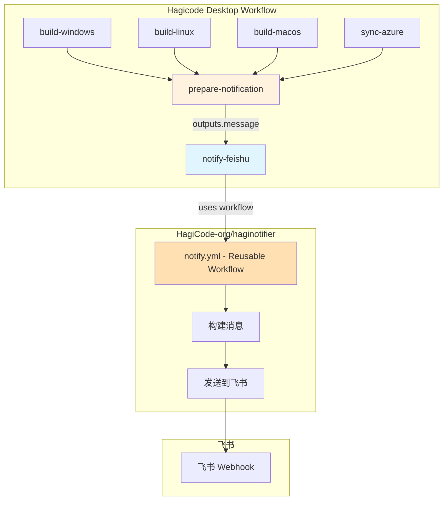
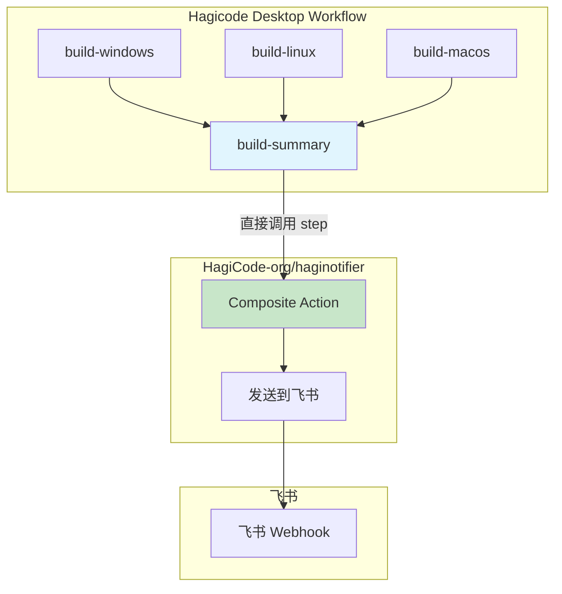
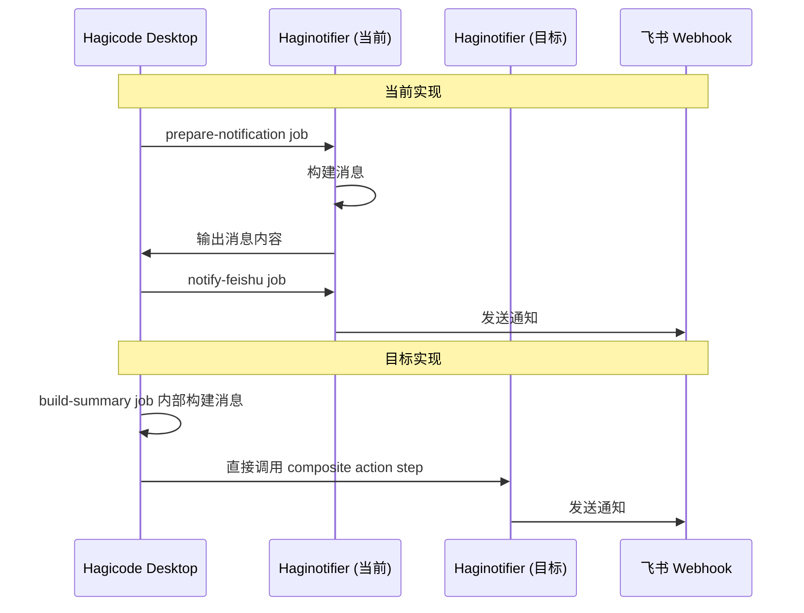

# Change: 重构飞书通知为 Composite Action

**Change ID:** `feishu-notification-composite-action`
**Status:** ExecutionCompleted
**Created:** 2026-02-09

---

## Why

当前项目使用 `haginotifier` 作为 reusable workflow 实现飞书通知，存在以下限制：

- **语法复杂**：Reusable workflow 需要单独的 job 定义，不能直接在现有 job 中添加 step
- **访问不直观**：输出参数通过 `needs.<job-id>.outputs` 访问，增加配置复杂度
- **版本管理受限**：相比 composite action，reusable workflow 的版本控制不够灵活
- **执行效率**：Composite action 预编译 JavaScript，执行速度更快

将通知机制重构为 composite action 可以：
- 简化工作流配置，直接在 job 中添加 step
- 统一 HagiCode 组织的通知机制
- 使用语义化版本标签（@v1、@v1.0.0）进行版本管理
- 提升执行速度和维护性

## What Changes

- **创建 haginotifier composite action**：在 HagiCode-org/haginotifier 仓库中实现 composite action
- **修改 Hagicode Desktop 工作流**：将 reusable workflow 调用改为 composite action step
- **简化通知配置**：移除 prepare-notification job，直接在相关 job 中添加通知 step
- **支持组织级别密钥**：配置 HagiCode 组织级别的 FEISHU_WEBHOOK_URL 密钥（推荐）

### 核心变更

**当前实现（Reusable Workflow）：**

```yaml
jobs:
  prepare-notification:
    name: Prepare Feishu Notification
    needs: [build-windows, build-linux, build-macos, sync-azure]
    if: always()
    runs-on: ubuntu-latest
    outputs:
      notification-message: ${{ steps.build-message.outputs.message }}
      notification-title: ${{ steps.build-message.outputs.title }}
    steps:
      # ... 复杂的消息构建逻辑

  notify-feishu:
    name: Notify Feishu
    needs: prepare-notification
    if: always()
    uses: HagiCode-org/haginotifier/.github/workflows/notify.yml@main
    secrets:
      FEISHU_WEBHOOK_URL: ${{ secrets.FEISHU_WEBHOOK_URL }}
    with:
      message: ${{ needs.prepare-notification.outputs.notification-message }}
      msg_type: 'post'
      title: ${{ needs.prepare-notification.outputs.notification-title }}
```

**目标实现（Composite Action）：**

```yaml
jobs:
  build-summary:
    name: Build Summary
    needs: [build-windows, build-linux, build-macos]
    if: always()
    runs-on: ubuntu-latest

    steps:
      # ... 现有步骤

      - name: Notify Feishu
        uses: HagiCode-org/haginotifier@v1
        with:
          message: |
            **Flow 执行完成**
            状态: ${{ steps.status.outputs.status_icon }} ${{ steps.status.outputs.status_text }}
            分支: ${{ github.ref_name }}
            构建平台: ${{ steps.platforms.outputs.platforms }}
          msg_type: 'post'
          title: 'Hagicode Desktop 构建通知 ${{ steps.status.outputs.status_icon }}'
        env:
          FEISHU_WEBHOOK_URL: ${{ secrets.FEISHU_WEBHOOK_URL }}
```

## 代码流程变更

### 架构对比

**当前架构（Reusable Workflow）：**



**目标架构（Composite Action）：**



### 迁移流程



### 代码变更清单

| 文件路径 | 变更类型 | 变更原因 | 影响范围 |
|---------|---------|---------|---------|
| `.github/workflows/build.yml` | 修改文件 | 简化通知配置 | CI/CD 工作流 |
| **haginotifier 仓库** | 新增 action | 创建 composite action | HagiCode 组织 |

### 详细变更 - build.yml

| 属性/配置 | 变更类型 | 具体变更 | 变更原因 |
|----------|---------|---------|---------|
| jobs.prepare-notification | 删除 job | 移除整个 job | 简化配置 |
| jobs.notify-feishu | 删除 job | 移除整个 job | 改用 composite action |
| jobs.build-summary.steps | 修改步骤 | 添加通知 step | 直接在 job 中发送通知 |
| jobs.build-summary.steps[*].uses | 新增步骤 | 使用 composite action | 简化调用方式 |
| jobs.build-summary.steps[*].with.message | 新增参数 | 直接定义消息 | 内联消息配置 |
| jobs.build-summary.steps[*].with.msg_type | 新增参数 | 设置为 'post' | 富文本格式 |
| jobs.build-summary.steps[*].with.title | 新增参数 | 设置标题 | 标识通知来源 |
| jobs.build-summary.steps[*].env.FEISHU_WEBHOOK_URL | 新增密钥 | 引用仓库密钥 | 安全传递 Webhook URL |

## Impact

### Affected specs
- `specs/ci-cd/spec.md` - 修改规范，从 reusable workflow 改为 composite action

### Affected code
- **工作流修改**：
  - `.github/workflows/build.yml` - 简化通知配置

- **外部依赖**：
  - HagiCode-org/haginotifier - 需要创建 composite action

### User impact
- **正面影响**：
  - 工作流配置更简洁直观
  - 通知机制更易维护
  - 版本管理更灵活（使用 @v1 标签）
  - 执行速度更快（预编译 JavaScript）
  - 整个 HagiCode 组织可复用同一通知 action

- **潜在风险**：
  - 需要在 haginotifier 仓库中创建 composite action（跨仓库协作）
  - 首次配置需要测试 composite action 的兼容性
  - 通知失败不影响主构建流程（保持现有行为）

### Migration considerations
- 需要先在 haginotifier 仓库中创建 composite action
- Hagicode Desktop 项目在 composite action 就绪后进行迁移
- 迁移过程需要验证通知功能正常工作
- 可以先在测试分支验证，确认无误后再合并到 main 分支

### Performance considerations
- Composite action 执行速度比 reusable workflow 更快（预编译）
- 通知发送时间通常 < 1 秒，对整体流程影响可忽略
- 移除 prepare-notification job 减少一次 job 调度开销

### Security considerations
- 飞书 Webhook URL 仍通过 GitHub Secrets 安全传递
- 建议配置组织级别密钥，允许所有仓库使用
- 通知内容不包含敏感信息（仅包含公开的构建状态信息）
- Composite action 的安全性由 GitHub Actions 机制保障
