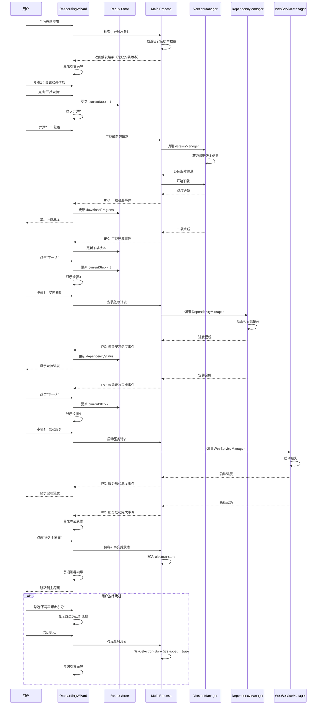
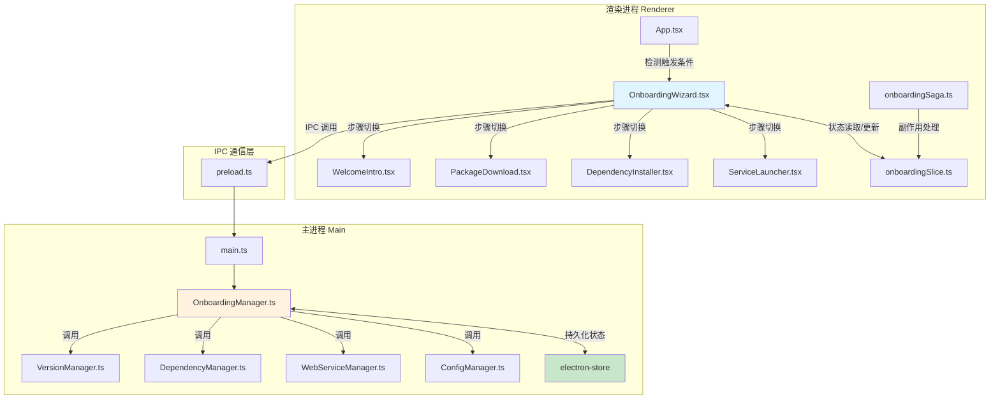
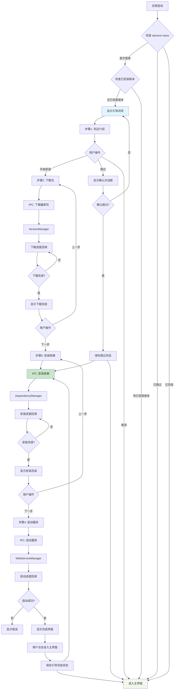

# Change: 新用户首次使用引导流程

**Change ID:** `first-time-user-onboarding-wizard`
**Status:** ExecutionCompleted
**Created:** 2026-02-09

---

## Why

新用户安装 Hagicode Desktop 后，如果首页没有任何已安装的版本，用户需要：
1. 了解 Hagicode Desktop 是什么以及它能做什么
2. 知道需要安装哪些组件才能正常工作
3. 完成下载、安装依赖、启动等一系列操作

当前缺少一个系统化的首次使用引导流程，导致新用户上手门槛较高，可能影响用户留存和满意度。

## What Changes

- **新增引导系统**：创建完整的首次使用引导流程，在检测到无已安装版本时自动触发
- **分步向导 UI**：实现四步向导式引导流程（应用介绍、下载包、安装依赖、启动服务）
- **引导状态管理**：通过 electron-store 持久化引导状态，支持跳过和恢复
- **主进程协调器**：创建 OnboardingManager 协调现有管理器完成引导流程
- **Redux 状态管理**：添加引导流程的状态管理 slice 和 saga
- **IPC 通信接口**：新增引导相关的 IPC 处理器
- **国际化支持**：添加引导流程的多语言翻译文本

## UI 设计变更

### 引导向导主界面

```
┌──────────────────────────────────────────────────────────────────────────────┐
│  Hagicode Desktop 首次使用引导                              [×] [●●●○] 3/4  │
├──────────────────────────────────────────────────────────────────────────────┤
│                                                                              │
│   [◀ 上一步]                                                     [下一步 ▶]  │
│                                                                              │
│                          ┌────────────────────────────────────────┐        │
│                          │                                        │        │
│                          │         当前步骤内容区域                │        │
│                          │                                        │        │
│                          │                                        │        │
│                          │                                        │        │
│                          │                                        │        │
│                          └────────────────────────────────────────┘        │
│                                                                              │
│  ┌──────────────────────────────────────────────────────────────────────┐  │
│  │ ☐ 不再显示此引导                                                        │  │
│  └──────────────────────────────────────────────────────────────────────┘  │
│                                                                              │
└──────────────────────────────────────────────────────────────────────────────┘
```

### 步骤 1：应用介绍

```
┌──────────────────────────────────────────────────────────────────────────────┐
│  欢迎使用 Hagicode Desktop                                      [●○○○] 1/4  │
├──────────────────────────────────────────────────────────────────────────────┤
│                                                                              │
│   ┌─────────────────────────────────────────────────────────────────────┐   │
│   │  欢迎使用 Hagicode Desktop                                            │   │
│   │                                                                     │   │
│   │  Hagicode Desktop 是 Hagicode Server 的本地管理和监控工具。          │   │
│   │  通过本工具，您可以：                                                 │   │
│   │                                                                     │   │
│   │  ✓ 管理 Hagicode Server 的安装和更新                                 │   │
│   │  ✓ 启动、停止和监控服务状态                                          │   │
│   │  ✓ 查看和管理系统依赖项                                              │   │
│   │  ✓ 配置服务器参数和设置                                              │   │
│   │                                                                     │   │
│   │  接下来，我们将帮助您完成首次安装和配置，大约需要 3-5 分钟。          │   │
│   └─────────────────────────────────────────────────────────────────────┘   │
│                                                                              │
│   ┌─────────────────────────────────────────────────────────────────────┐   │
│   │  首次安装流程包括：                                                   │   │
│   │  1. 下载最新的 Hagicode Server 包                                    │   │
│   │  2. 安装所需的系统依赖项                                             │   │
│   │  3. 启动服务并验证运行状态                                           │   │
│   └─────────────────────────────────────────────────────────────────────┘   │
│                                                                              │
│                                          [取消]              [开始安装 ▶]    │
│                                                                              │
└──────────────────────────────────────────────────────────────────────────────┘
```

### 步骤 2：下载包

```
┌──────────────────────────────────────────────────────────────────────────────┐
│  下载 Hagicode Server                                            [●●○○] 2/4  │
├──────────────────────────────────────────────────────────────────────────────┤
│                                                                              │
│   ┌─────────────────────────────────────────────────────────────────────┐   │
│   │  正在下载 Hagicode Server...                                         │   │
│   │                                                                     │   │
│   │  版本：hagicode-0.1.0-alpha.8-linux-x64                             │   │
│   │  来源：hagicode.com 官方发布                                         │   │
│   │                                                                     │   │
│   │  ┌─────────────────────────────────────────────────────────────┐    │   │
│   │  │ 下载进度                                                     │    │   │
│   │  │ ████████████████████████████████░░░░░░░░░░░░░░░░░░░░░░  67%  │    │   │
│   │  └─────────────────────────────────────────────────────────────┘    │   │
│   │                                                                     │   │
│   │  已下载：30.5 MB / 45.8 MB                                          │   │
│   │  速度：2.3 MB/s                                                     │   │
│   │  剩余时间：约 7 秒                                                  │   │
│   └─────────────────────────────────────────────────────────────────────┘   │
│                                                                              │
│   [◀ 上一步]                                              [取消]            │
│                                                                              │
└──────────────────────────────────────────────────────────────────────────────┘
```

### 步骤 2：下载完成状态

```
┌──────────────────────────────────────────────────────────────────────────────┐
│  下载 Hagicode Server                                            [●●○○] 2/4  │
├──────────────────────────────────────────────────────────────────────────────┤
│                                                                              │
│   ┌─────────────────────────────────────────────────────────────────────┐   │
│   │  ✓ 下载完成！                                                        │   │
│   │                                                                     │   │
│   │  hagicode-0.1.0-alpha.8-linux-x64.zip                              │   │
│   │  45.8 MB                                                             │   │
│   │                                                                     │   │
│   │  包文件已验证完整。现在可以继续安装依赖项。                          │   │
│   └─────────────────────────────────────────────────────────────────────┘   │
│                                                                              │
│                                          [◀ 上一步]        [下一步 ▶]      │
│                                                                              │
└──────────────────────────────────────────────────────────────────────────────┘
```

### 步骤 3：安装依赖

```
┌──────────────────────────────────────────────────────────────────────────────┐
│  安装系统依赖项                                                  [●●●○] 3/4  │
├──────────────────────────────────────────────────────────────────────────────┤
│                                                                              │
│   ┌─────────────────────────────────────────────────────────────────────┐   │
│   │  正在检查并安装系统依赖项...                                         │   │
│   │                                                                     │   │
│   │  依赖项状态：                                                        │   │
│   │  ┌─────────────────────────────────────────────────────────────┐    │   │
│   │  │ ✓ .NET Runtime 8.0         [已安装]  版本 8.0.11            │    │   │
│   │  │ ↓ Node.js 22.x              [安装中...]  ████████░░ 80%     │    │   │
│   │  │ ○ Git                       [待安装]                          │    │   │
│   │  │ ○ SQLite                    [待安装]                          │    │   │
│   │  └─────────────────────────────────────────────────────────────┘    │   │
│   │                                                                     │   │
│   │  总体进度：                                                          │   │
│   │  ┌─────────────────────────────────────────────────────────────┐    │   │
│   │  │ ████████████████████░░░░░░░░░░░░░░░░░░░░░░░░░░░░░░░░░░  40%  │    │   │
│   │  └─────────────────────────────────────────────────────────────┘    │   │
│   │                                                                     │   │
│   │  正在安装 Node.js 22.10.5...                                         │   │
│   └─────────────────────────────────────────────────────────────────────┘   │
│                                                                              │
│   [◀ 上一步]                                              [取消]            │
│                                                                              │
└──────────────────────────────────────────────────────────────────────────────┘
```

### 步骤 4：启动服务

```
┌──────────────────────────────────────────────────────────────────────────────┐
│  启动服务                                                        [●●●●] 4/4  │
├──────────────────────────────────────────────────────────────────────────────┤
│                                                                              │
│   ┌─────────────────────────────────────────────────────────────────────┐   │
│   │  正在启动 Hagicode Server...                                         │   │
│   │                                                                     │   │
│   │  ┌─────────────────────────────────────────────────────────────┐    │   │
│   │  │ 服务启动进度                                                 │    │   │
│   │  │ ████████████████████████████████████████░░░░░░░░░░░░░░░░  75%  │    │   │
│   │  └─────────────────────────────────────────────────────────────┘    │   │
│   │                                                                     │   │
│   │  当前状态：正在初始化服务组件...                                    │   │
│   └─────────────────────────────────────────────────────────────────────┘   │
│                                                                              │
│   ┌─────────────────────────────────────────────────────────────────────┐   │
│   │  安装信息：                                                          │   │
│   │  • 安装版本：hagicode-0.1.0-alpha.8                                  │   │
│   │  • 数据目录：~/.hagicode-desktop/apps/data                           │   │
│   │  • 服务端口：5000                                                    │   │
│   └─────────────────────────────────────────────────────────────────────┘   │
│                                                                              │
│   [◀ 上一步]                                              [取消]            │
│                                                                              │
└──────────────────────────────────────────────────────────────────────────────┘
```

### 步骤 4：完成状态

```
┌──────────────────────────────────────────────────────────────────────────────┐
│  安装完成！                                                        [●●●●] 4/4  │
├──────────────────────────────────────────────────────────────────────────────┤
│                                                                              │
│   ┌─────────────────────────────────────────────────────────────────────┐   │
│   │  🎉 恭喜！Hagicode Desktop 已成功安装并启动。                         │   │
│   │                                                                     │   │
│   │  您现在可以：                                                        │   │
│   │  • 通过主界面管理 Hagicode Server                                    │   │
│   │  • 访问 Web 管理界面（http://localhost:5000）                        │   │
│   │  • 查看服务日志和状态                                                │   │
│   │  • 配置服务器参数和设置                                              │   │
│   │                                                                     │   │
│   │  技术支持：                                                          │   │
│   │  • 用户文档：https://hagicode.com/docs                              │   │
│   │  • 问题反馈：https://github.com/hagicode/issues                     │   │
│   └─────────────────────────────────────────────────────────────────────┘   │
│                                                                              │
│                                          [◀ 上一步]        [进入主界面 ▶]  │
│                                                                              │
└──────────────────────────────────────────────────────────────────────────────┘
```

### 引导跳过确认对话框

```
┌──────────────────────────────────────────────────────────────────────────────┐
│  确认跳过引导                                                        [?]      │
├──────────────────────────────────────────────────────────────────────────────┤
│                                                                              │
│   ┌─────────────────────────────────────────────────────────────────────┐   │
│   │  您确定要跳过首次使用引导吗？                                         │   │
│   │                                                                     │   │
│   │  跳过后，您可以：                                                    │   │
│   │  • 通过主界面的"包管理"功能手动安装 Hagicode Server                  │   │
│   │  • 在设置中重新启用引导流程                                          │   │
│   │                                                                     │   │
│   │  如果您是第一次使用 Hagicode Desktop，建议完成引导流程。              │   │
│   └─────────────────────────────────────────────────────────────────────┘   │
│                                                                              │
│                                          [取消]              [跳过引导 ▶]    │
│                                                                              │
└──────────────────────────────────────────────────────────────────────────────┘
```

### 用户交互流程



## 代码流程变更

### 引导系统架构图



### 引导流程数据流



### 代码变更清单

| 文件路径 | 变更类型 | 变更原因 | 影响范围 |
|---------|---------|---------|---------|
| `src/renderer/components/onboarding/OnboardingWizard.tsx` | 新增文件 | 引导向导主组件，管理四步引导流程 | 渲染进程 UI |
| `src/renderer/components/onboarding/steps/WelcomeIntro.tsx` | 新增文件 | 步骤1：应用介绍和说明 | 引导 UI |
| `src/renderer/components/onboarding/steps/PackageDownload.tsx` | 新增文件 | 步骤2：包下载进度显示 | 引导 UI |
| `src/renderer/components/onboarding/steps/DependencyInstaller.tsx` | 新增文件 | 步骤3：依赖安装进度显示 | 引导 UI |
| `src/renderer/components/onboarding/steps/ServiceLauncher.tsx` | 新增文件 | 步骤4：服务启动和完成 | 引导 UI |
| `src/renderer/components/onboarding/OnboardingProgress.tsx` | 新增文件 | 引导进度指示器组件 | 引导 UI |
| `src/renderer/components/onboarding/OnboardingActions.tsx` | 新增文件 | 引导操作按钮组 | 引导 UI |
| `src/renderer/store/slices/onboardingSlice.ts` | 新增文件 | 引导状态 Redux slice | 状态管理 |
| `src/renderer/store/sagas/onboardingSaga.ts` | 新增文件 | 引导副作用 Redux saga | 副作用处理 |
| `src/main/onboarding-manager.ts` | 新增文件 | 主进程引导管理器，协调各管理器 | 主进程逻辑 |
| `src/main/main.ts` | 修改文件 | 注册引导相关 IPC 处理器 | IPC 通信 |
| `src/renderer/App.tsx` | 修改文件 | 集成引导流程入口和触发检测 | 应用入口 |
| `src/renderer/i18n/locales/zh-CN/onboarding.json` | 新增文件 | 引导流程中文翻译 | 国际化 |
| `src/renderer/i18n/locales/en-US/onboarding.json` | 新增文件 | 引导流程英文翻译 | 国际化 |
| `src/renderer/i18n/locales/zh-CN/components.json` | 修改文件 | 添加引导相关翻译键 | 国际化 |
| `src/renderer/i18n/locales/en-US/components.json` | 修改文件 | 添加引导相关翻译键 | 国际化 |
| `src/preload/index.ts` | 修改文件 | 添加引导相关 IPC 接口声明 | Preload 脚本 |

### 详细变更 - onboardingSlice.ts

| 属性/方法 | 变更类型 | 具体变更 | 变更原因 |
|----------|---------|---------|---------|
| initialState | 新增 | 定义引导初始状态 | 状态管理基础 |
| isActive | 新增属性 | boolean：引导是否激活 | 控制引导显示 |
| currentStep | 新增属性 | number：当前步骤（0-3） | 步骤管理 |
| isSkipped | 新增属性 | boolean：是否已跳过 | 跳过状态 |
| isCompleted | 新增属性 | boolean：是否已完成 | 完成状态 |
| downloadProgress | 新增属性 | number：下载进度（0-100） | 下载状态 |
| dependencyStatus | 新增属性 | DependencyStatus：依赖安装状态 | 依赖状态 |
| startOnboarding | 新增 action | 开始引导流程 | 触发引导 |
| nextStep | 新增 action | 进入下一步 | 步骤导航 |
| previousStep | 新增 action | 返回上一步 | 步骤导航 |
| skipOnboarding | 新增 action | 跳过引导流程 | 跳过功能 |
| completeOnboarding | 新增 action | 完成引导流程 | 完成功能 |
| updateDownloadProgress | 新增 action | 更新下载进度 | 下载反馈 |
| updateDependencyStatus | 新增 action | 更新依赖状态 | 依赖反馈 |
| resetOnboarding | 新增 action | 重置引导状态 | 重置功能 |

### 详细变更 - onboardingSaga.ts

| Saga 方法 | 变更类型 | 具体变更 | 变更原因 |
|----------|---------|---------|---------|
| watchStartOnboarding | 新增方法 | 监听 startOnboarding action | 触发引导 |
| watchDownloadPackage | 新增方法 | 监听下载请求，调用 IPC | 下载包 |
| watchInstallDependencies | 新增方法 | 监听依赖安装请求，调用 IPC | 安装依赖 |
| watchStartService | 新增方法 | 监听服务启动请求，调用 IPC | 启动服务 |
| watchSkipOnboarding | 新增方法 | 监听跳过请求，调用 IPC | 跳过引导 |
| watchCompleteOnboarding | 新增方法 | 监听完成请求，调用 IPC | 完成引导 |

### 详细变更 - OnboardingManager.ts

| 方法/属性 | 变更类型 | 具体变更 | 变更原因 |
|----------|---------|---------|---------|
| constructor | 新增方法 | 初始化管理器，注入依赖管理器实例 | 依赖注入 |
| checkTriggerCondition | 新增方法 | 检查是否应触发引导 | 触发逻辑 |
| shouldShowOnboarding | 新增方法 | 判断是否显示引导 | 显示判断 |
| skipOnboarding | 新增方法 | 保存跳过状态到 electron-store | 跳过持久化 |
| downloadLatestPackage | 新增方法 | 调用 VersionManager 下载最新包 | 下载协调 |
| installDependencies | 新增方法 | 调用 DependencyManager 安装依赖 | 依赖协调 |
| startWebService | 新增方法 | 调用 WebServiceManager 启动服务 | 启动协调 |
| getOnboardingState | 新增方法 | 从 electron-store 读取引导状态 | 状态读取 |
| setOnboardingState | 新增方法 | 向 electron-store 写入引导状态 | 状态写入 |

### IPC 接口变更

| IPC 通道 | 方向 | 参数 | 返回值 | 用途 |
|---------|------|------|--------|------|
| `onboarding:check-trigger` | Renderer → Main | - | `{ shouldShow: boolean }` | 检查触发条件 |
| `onboarding:get-state` | Renderer → Main | - | `OnboardingState` | 获取引导状态 |
| `onboarding:skip` | Renderer → Main | - | `void` | 跳过引导 |
| `onboarding:download-package` | Renderer → Main | - | `Promise<string>` (version) | 下载最新包 |
| `onboarding:install-dependencies` | Renderer → Main | `version: string` | `Promise<void>` | 安装依赖 |
| `onboarding:start-service` | Renderer → Main | `version: string` | `Promise<void>` | 启动服务 |
| `onboarding:complete` | Renderer → Main | - | `Promise<void>` | 完成引导 |
| `onboarding:download-progress` | Main → Renderer | `{ progress: number }` | - | 下载进度事件 |
| `onboarding:dependency-progress` | Main → Renderer | `{ status: DependencyStatus }` | - | 依赖进度事件 |
| `onboarding:service-progress` | Main → Renderer | `{ status: ServiceStatus }` | - | 服务启动进度事件 |

## Impact

### Affected specs
- `specs/user-onboarding/spec.md` - 新增规范，定义用户引导流程

### Affected code
- **渲染进程新增**：
  - `src/renderer/components/onboarding/*` - 引导 UI 组件目录
  - `src/renderer/store/slices/onboardingSlice.ts` - 引导状态管理
  - `src/renderer/store/sagas/onboardingSaga.ts` - 引导副作用处理

- **主进程新增**：
  - `src/main/onboarding-manager.ts` - 引导管理器

- **渲染进程修改**：
  - `src/renderer/App.tsx` - 添加引导流程入口和触发逻辑

- **主进程修改**：
  - `src/main/main.ts` - 注册引导相关 IPC 处理器

- **国际化新增**：
  - `src/renderer/i18n/locales/*/onboarding.json` - 引导流程翻译

- **国际化修改**：
  - `src/renderer/i18n/locales/*/components.json` - 添加引导相关翻译键

- **Preload 修改**：
  - `src/preload/index.ts` - 添加引导 IPC 接口声明

### User impact
- **正面影响**：
  - 新用户可通过系统化引导快速完成首次配置
  - 降低学习曲线和使用门槛
  - 提升用户满意度和留存率
  - 减少支持成本

- **潜在风险**：
  - 引导流程可能对有经验的用户造成干扰（通过跳过选项缓解）
  - 网络问题可能影响下载体验（通过重试机制缓解）

### Migration considerations
- 对于现有用户：
  - 如果已有安装版本，不触发引导流程
  - 可通过设置重新启用引导流程
  - electron-store 中新增引导状态字段，向后兼容（默认值为未完成）

### Performance considerations
- 引导流程仅在首次使用时触发，不影响后续使用性能
- 下载和安装操作异步执行，不阻塞主界面
- 引导组件按需加载，减少初始包体积
