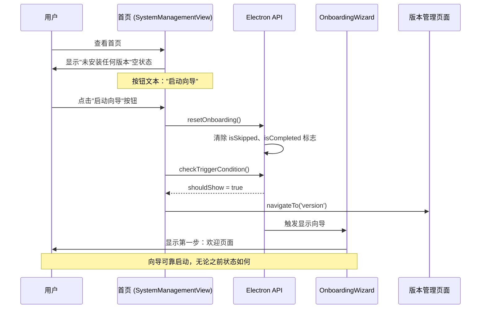

# Change: 改进首页空状态按钮文案明确性和行为可靠性

## Why

当前首页（系统管理视图）空状态按钮存在两个问题：

1. **文案不明确**：按钮显示"前往版本管理"，但点击后会启动完整的首次使用向导（Onboarding Wizard）流程，文案与实际行为不符
2. **行为不可靠**：按钮仅调用 `navigateTo('version')` 导航到版本管理页面，依赖版本管理页面自动检测并启动向导。如果用户之前跳过了向导或选择了"不再显示向导"，自动检测可能不会触发，导致向导无法启动

用户应该能够通过首页的"启动向导"按钮**可靠地**启动向导，无论之前的向导状态如何（已跳过、已完成或不再显示）。

## What Changes

- **文案更新**：将按钮文本从"前往版本管理"改为"启动向导"，明确标识将启动向导流程
- **行为增强**：按钮点击后不仅导航到版本管理页面，还应**确保向导能够可靠启动**
  - 调用 `resetOnboarding()` 重置向导状态（清除"已跳过"标志）
  - 调用 `checkTriggerCondition()` 触发向导显示
  - 然后导航到版本管理页面（向导会自动覆盖显示）

### 核心逻辑

```
用户点击"启动向导"按钮
    ↓
1. 重置向导状态 (resetOnboarding)
    ↓
2. 检查触发条件 (checkTriggerCondition) → shouldShow = true
    ↓
3. 导航到版本管理页面
    ↓
4. 向导自动显示 (覆盖版本管理页面)
```

## UI Design Changes

### 当前状态

```
┌─────────────────────────────────────────────────┐
│                                                 │
│                  [包裹图标]                       │
│                                                 │
│            未安装任何版本                         │
│                                                 │
│       请前往版本管理页面安装版本                   │
│                                                 │
│         [前往版本管理]                           │
│                                                 │
└─────────────────────────────────────────────────┘
```

### 改进后状态

```
┌─────────────────────────────────────────────────┐
│                                                 │
│                  [包裹图标]                       │
│                                                 │
│            未安装任何版本                         │
│                                                 │
│       开始使用 Hagicode Desktop 的最简单方法...     │
│                                                 │
│         [启动向导]                               │
│                                                 │
└─────────────────────────────────────────────────┘
```

**变更说明：**
- 按钮文本从"前往版本管理"改为"启动向导"
- 描述文本从"请前往版本管理页面安装版本"改为强调向导的引导作用
- 语义更清晰：用户理解点击后将看到分步引导界面
- **行为增强**：确保向导能够可靠启动，无论用户之前的向导状态如何

## User Interaction Flow



## Impact

### Affected Specs
- `i18n` - 国际化能力（需要添加系统管理视图首页空状态的翻译键）
- `onboarding` - Onboarding 向导能力（需要确保从首页可靠启动）

### Affected Code
- `src/renderer/i18n/locales/zh-CN/common.json` - 中文翻译文件（需要添加新翻译键）
- `src/renderer/i18n/locales/en-US/common.json` - 英文翻译文件（需要添加新翻译键）
- `src/renderer/components/SystemManagementView.tsx:391` - 需要修改按钮点击处理逻辑

### Impact Scope
- **变更范围**：添加新的翻译键，修改组件的按钮点击处理函数和文本显示
- **风险等级**：低风险
- **测试需求**：
  1. 验证中英文界面翻译正确显示
  2. 验证按钮点击后向导可靠启动
  3. **关键测试场景**：
     - 用户首次使用（无向导历史）→ 向导正常启动
     - 用户之前跳过向导 → 向导仍能正常启动
     - 用户之前完成向导 → 向导仍能正常启动

### No Changes Required
- Redux 状态管理 (`onboardingSlice.ts`)
- IPC 通信机制
- 版本管理页面 (VersionManagementPage.tsx) - 已有正确的 `handleStartOnboarding` 实现
