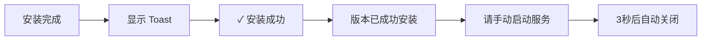
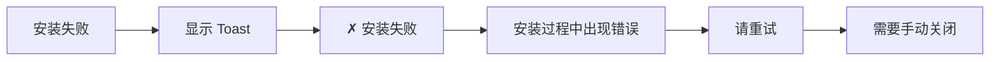
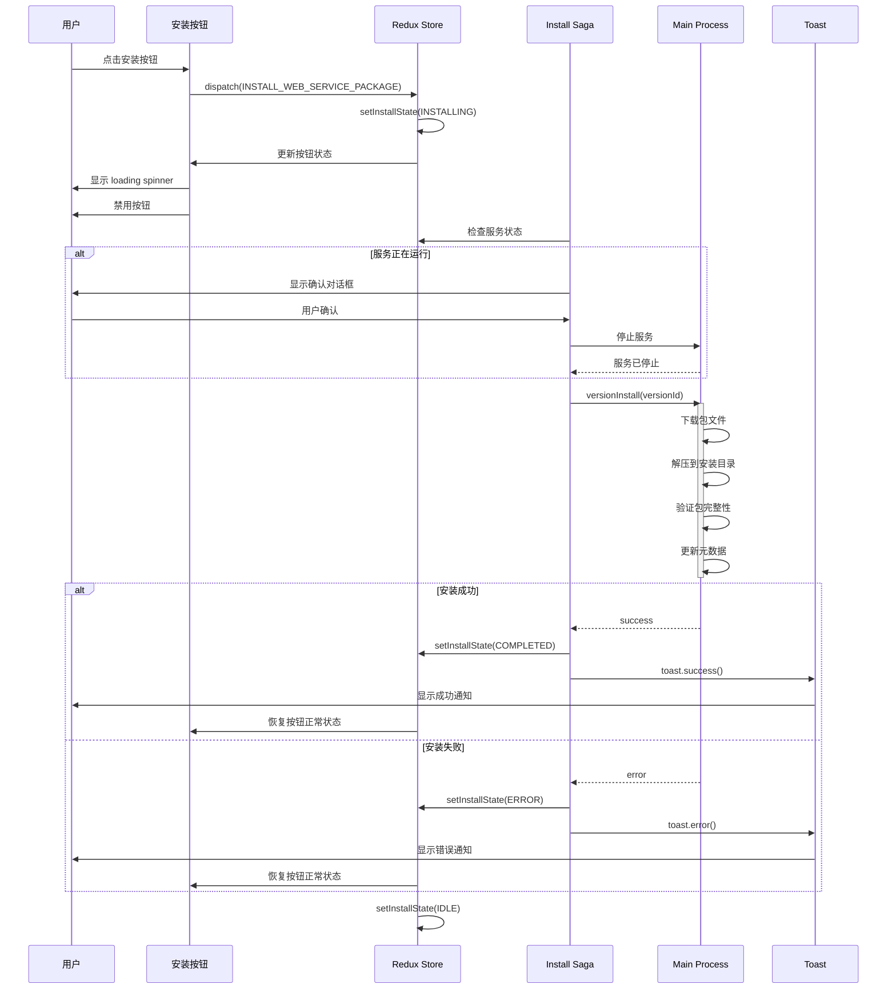
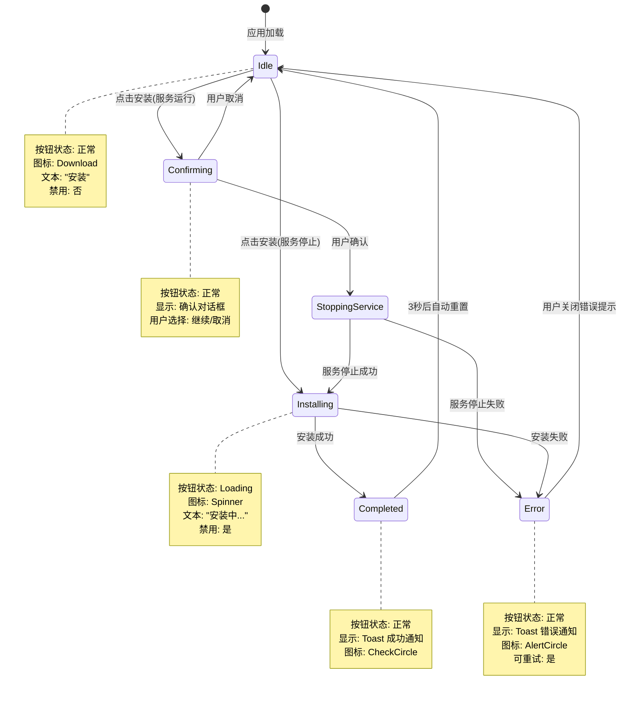
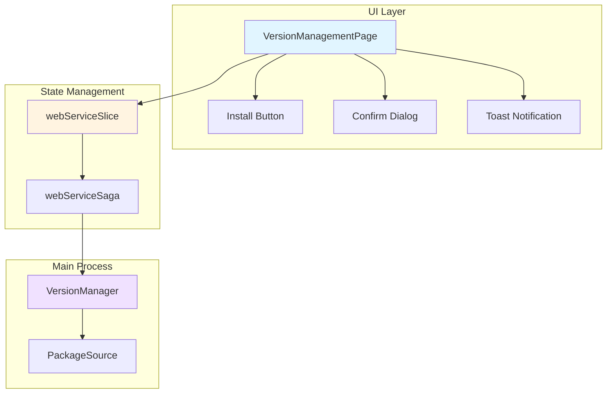
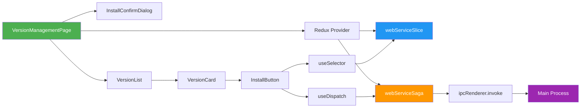
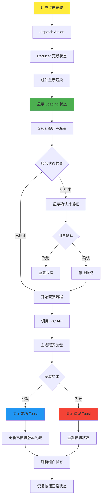
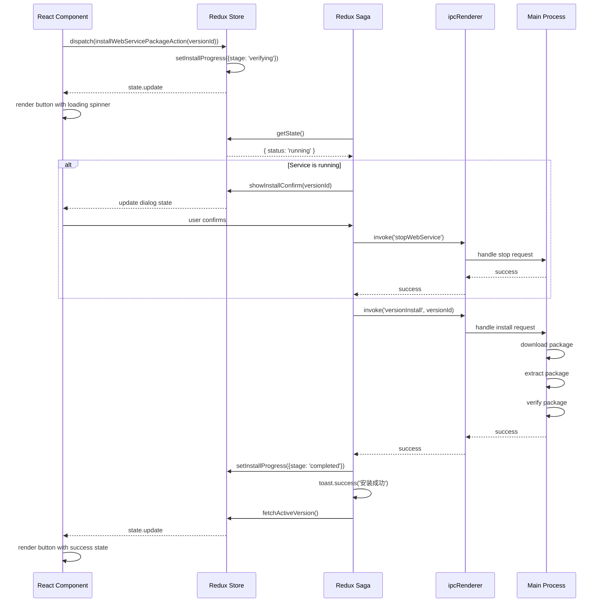

# Design: Install Button Loading State Feedback

## Context

### Background

Hagicode Desktop 是一款基于 Electron 的跨平台桌面应用程序，版本管理界面是其核心功能之一。用户通过此界面安装、切换和管理不同版本的 Web 服务包。

### Current State

当前版本管理界面的安装按钮缺少加载状态反馈：
- 用户点击安装按钮后无视觉变化
- 后台下载和安装过程用户无法感知
- 可能导致用户重复点击和并发安装请求
- 与依赖检查、服务启动等其他异步操作的状态反馈不一致

### Stakeholders

- **最终用户**：需要清晰的操作反馈，了解安装进度
- **开发团队**：需要维护代码一致性，确保状态管理模式统一
- **UX 设计师**：需要确保交互体验与整体应用保持一致

## Goals / Non-Goals

### Goals

1. 提供即时的视觉反馈，确认用户操作已被触发
2. 防止用户在安装过程中重复点击按钮
3. 显示安装进度和当前阶段信息
4. 提供清晰的成功/错误状态反馈
5. 与现有的依赖检查、服务启动操作保持一致的状态反馈模式

### Non-Goals

1. 不修改主进程的 VersionManager 核心逻辑
2. 不改变现有的 IPC 通信协议
3. 不添加新的依赖库（使用已有的 shadcn/ui 和 Sonner）
4. 不实现详细的安装进度条（仅显示 loading 状态）
5. 不处理并发安装请求的场景（通过禁用按钮预防）

## Decisions

### Decision 1: 使用 Redux 状态管理追踪安装状态

**理由**：
- 项目已使用 Redux Toolkit + Redux Saga 管理复杂异步状态
- 现有的 `isInstalling` 和 `installProgress` 状态可直接利用
- 确保状态一致性，避免组件级状态导致的同步问题

**替代方案**：
- **组件级 useState**：被拒绝，因为安装状态需要跨多个组件共享（如版本列表、确认对话框）
- **新的状态管理库**：被拒绝，增加不必要的复杂性和学习成本

### Decision 2: 使用 shadcn/ui Button 组件的 loading 属性

**理由**：
- 项目已集成 shadcn/ui 组件库
- Button 组件内置 loading 状态支持
- 提供一致的视觉样式和交互体验

**实现方式**：
```tsx
<Button
  onClick={() => handleInstall(version.id)}
  disabled={isInstalling || webServiceOperating}
  className="..."
>
  {isInstalling ? (
    <>
      <Loader2 className="animate-spin" />
      {t('versionManagement.installing')}
    </>
  ) : (
    <>
      <Download />
      {t('versionManagement.actions.install')}
    </>
  )}
</Button>
```

### Decision 3: 使用 Sonner Toast 显示成功/错误通知

**理由**：
- 项目已集成 Sonner Toast 库
- 依赖检查和服务启动操作已使用 Sonner 显示通知
- 提供一致的用户体验

**通知类型**：
- `toast.success()`: 安装成功
- `toast.error()`: 安装失败

### Decision 4: 安装状态枚举设计

**状态定义**：
```typescript
export enum InstallState {
  Idle = 'idle',           // 初始状态，未进行安装
  Confirming = 'confirming', // 等待用户确认（服务运行中）
  StoppingService = 'stopping_service', // 停止服务中
  Installing = 'installing', // 安装进行中
  Completed = 'completed',   // 安装成功
  Error = 'error'          // 安装失败
}
```

**理由**：
- 清晰的状态转换路径
- 便于在 UI 中映射不同的显示状态
- 支持复杂场景（如服务运行时的安装确认）

## UI/UX Design

### 安装按钮界面设计

#### 正常状态（未安装版本）

```
┌─────────────────────────────────────────────────────┐
│  Package: hagicode-0.1.0-alpha.8-linux-x64.zip     │
│  Platform: Linux                                     │
│                                                     │
│                          [Download] [安装]           │
└─────────────────────────────────────────────────────┘
```

#### Loading 状态（安装进行中）

```
┌─────────────────────────────────────────────────────┐
│  Package: hagicode-0.1.0-alpha.8-linux-x64.zip     │
│  Platform: Linux                                     │
│                                                     │
│                 [◍ 安装中...] (disabled)             │
│                 正在验证包完整性...                    │
└─────────────────────────────────────────────────────┘
```

#### 已安装状态

```
┌─────────────────────────────────────────────────────┐
│  Package: hagicode-0.1.0-alpha.8-linux-x64.zip     │
│  Platform: Linux • 已安装                            │
│                                                     │
│                          ✓ 已安装                    │
└─────────────────────────────────────────────────────┘
```

### 重新安装按钮界面设计

#### 正常状态

```
┌─────────────────────────────────────────────────────┐
│  Actions: [查看依赖] [重新安装] [打开日志] [切换]    │
└─────────────────────────────────────────────────────┘
```

#### Loading 状态

```
┌─────────────────────────────────────────────────────┐
│  Actions: [查看依赖] [◍ 重新安装中...] [打开日志]    │
│                      正在下载包文件...               │
└─────────────────────────────────────────────────────┘
```

### Toast 通知设计

#### 成功通知



#### 错误通知



### 用户交互流程



### 错误处理 UX

#### 网络错误场景

```
┌─────────────────────────────────────────────────────┐
│  [◍ 安装中...]                                      │
│  正在下载包文件...                                   │
│                                                     │
│  错误: 网络连接失败，请检查网络设置后重试             │
│                [重试] [取消]                         │
└─────────────────────────────────────────────────────┘
```

#### 服务停止失败场景

```
┌─────────────────────────────────────────────────────┐
│  确认安装                                           │
│  安装需要停止当前运行的服务，是否继续？               │
│                                                     │
│  错误: 无法停止服务，请手动停止后重试                 │
│                [关闭]                               │
└─────────────────────────────────────────────────────┘
```

### 状态转换图



## Technical Design

### 架构图



### 组件关系图



### 数据流图



### API 交互序列



### 详细代码变更

#### 前端变更

| 文件路径 | 变更类型 | 变更说明 | 影响组件 |
|---------|---------|---------|---------|
| `src/renderer/components/VersionManagementPage.tsx` | UI修改 | 安装按钮添加 loading 状态显示，连接 Redux 状态 | VersionManagementPage, VersionCard |
| `src/renderer/store/slices/webServiceSlice.ts` | 状态扩展 | 添加 installState 枚举和相关的 action/reducer | Redux Store |
| `src/renderer/store/sagas/webServiceSaga.ts` | Saga修改 | 完善安装流程的状态更新和错误处理 | Install Saga |
| `src/renderer/i18n/locales/zh-CN/pages.json` | 国际化 | 添加安装状态的翻译文本 | 中文界面 |
| `src/renderer/i18n/locales/en-US/pages.json` | 国际化 | 添加安装状态的翻译文本 | 英文界面 |

#### 主进程变更

**无需变更**：现有的 `VersionManager.versionInstall()` 方法已支持异步操作，假设其返回 Promise 或支持进度回调。

### 关键代码片段

#### 安装按钮组件

```tsx
// VersionManagementPage.tsx
const handleInstall = async (versionId: string) => {
  if (installing || webServiceOperating) return;

  // Use Redux action which will check service status and show confirmation dialog if needed
  dispatch(installWebServicePackageAction(versionId));
};

// In the render method
<button
  onClick={() => handleInstall(version.id)}
  disabled={isInstalling || webServiceOperating}
  className="px-4 py-2 bg-primary hover:bg-primary/90 text-primary-foreground rounded-lg transition-colors disabled:opacity-50 disabled:cursor-not-allowed flex items-center gap-2"
>
  {isInstalling ? (
    <>
      <Loader2 className="animate-spin h-4 w-4" />
      {t('versionManagement.installing')}
    </>
  ) : (
    <>
      <Download className="w-4 h-4" />
      {t('versionManagement.actions.install')}
    </>
  )}
</button>
```

#### Redux Slice 更新

```typescript
// webServiceSlice.ts
export enum InstallState {
  Idle = 'idle',
  Confirming = 'confirming',
  StoppingService = 'stopping_service',
  Installing = 'installing',
  Completed = 'completed',
  Error = 'error'
}

export interface WebServiceState {
  // ... existing state
  installState: InstallState;
}

const initialState: WebServiceState = {
  // ... existing initial state
  installState: InstallState.Idle,
};

export const webServiceSlice = createSlice({
  name: 'webService',
  initialState,
  reducers: {
    // ... existing reducers
    setInstallState: (state, action: PayloadAction<InstallState>) => {
      state.installState = action.payload;
    },
  },
});
```

#### Redux Saga 更新

```typescript
// webServiceSaga.ts
function* installWebServicePackageSaga(action: { type: string; payload: string }) {
  const version = action.payload;

  try {
    yield put(setInstallState(InstallState.Installing));
    yield put(setError(null));

    // Check service status before installing
    const currentStatus: ProcessStatus = yield select((state: any) => state.webService.status);

    // If service is running, show confirmation dialog
    if (currentStatus === 'running') {
      yield put(showInstallConfirm(version));
      return; // Wait for user confirmation
    }

    // Service is not running, proceed with installation
    yield call(doInstallPackage, version);
  } catch (error) {
    console.error('Install package saga error:', error);
    yield put(setInstallState(InstallState.Error));
    yield put(setError(error instanceof Error ? error.message : 'Unknown error occurred'));

    // Show error toast
    toast.error('安装失败', {
      description: '安装过程中出现错误，请重试。'
    });
  } finally {
    if (error) {
      yield put(setInstallState(InstallState.Idle));
    }
  }
}

function* doInstallPackage(version: string) {
  yield put(setInstallProgress({ stage: 'verifying', progress: 0, message: 'Starting installation...' }));

  const success: boolean = yield call(window.electronAPI.installWebServicePackage, version);

  if (success) {
    yield put(setInstallState(InstallState.Completed));
    yield put(setInstallProgress({ stage: 'completed', progress: 100, message: 'Installation completed successfully' }));

    // Refresh package info
    yield put(checkPackageInstallationAction());
    // Refresh version
    yield put(fetchWebServiceVersionAction());
    // Refresh active version
    yield put(fetchActiveVersionAction());

    // Show success toast
    toast.success('安装成功', {
      description: '版本已成功安装，请手动启动服务。'
    });

    // Reset to idle state after 3 seconds
    yield delay(3000);
    yield put(setInstallState(InstallState.Idle));
  } else {
    yield put(setInstallState(InstallState.Error));
    yield put(setInstallProgress({ stage: 'error', progress: 0, message: 'Installation failed' }));
    yield put(setError('Failed to install package'));

    // Show error toast
    toast.error('安装失败', {
      description: '安装过程中出现错误，请重试。'
    });

    // Reset to idle state after user closes the error toast
    yield put(setInstallState(InstallState.Idle));
  }
}
```

### 配置变更

无需配置文件变更。此变更不涉及新的配置选项或环境变量。

## Migration Plan

### 实施步骤

1. **状态管理扩展**
   - 在 `webServiceSlice.ts` 中添加 `InstallState` 枚举
   - 扩展 `WebServiceState` 接口以包含 `installState`
   - 添加 `setInstallState` action 和 reducer

2. **Saga 层修改**
   - 更新 `installWebServicePackageSaga` 以管理安装状态
   - 提取 `doInstallPackage` 作为辅助函数
   - 添加成功/错误状态的 Toast 通知

3. **UI 组件更新**
   - 修改 `VersionManagementPage.tsx` 中的安装按钮
   - 使用 `useSelector` 获取安装状态
   - 根据 `installState` 显示不同的 UI

4. **国际化文本添加**
   - 在 `zh-CN/pages.json` 中添加中文翻译
   - 在 `en-US/pages.json` 中添加英文翻译

5. **测试验证**
   - 测试正常安装流程
   - 测试服务运行时的安装（确认对话框）
   - 测试网络错误场景
   - 测试服务停止失败场景

### 回滚策略

如果实施后出现问题，可以通过以下步骤回滚：

1. 从 Redux 状态中移除 `installState` 相关代码
2. 恢复 `VersionManagementPage.tsx` 中的原始按钮实现
3. 移除 Saga 中的状态管理代码
4. 从国际化文件中移除新增的翻译键

**注意**：此变更不涉及数据持久化或主进程修改，回滚不会影响用户数据或应用核心功能。

## Open Questions

### 问题 1: 安装超时处理

**问题**：如果安装过程长时间无响应（超过 5 分钟），是否需要自动取消安装并显示超时错误？

**建议**：
- 添加 5 分钟超时机制
- 超时后显示错误提示并允许用户重试
- 清理部分下载的文件

**决策**：待实施时根据实际需求确定。

### 问题 2: 进度显示粒度

**问题**：是否需要显示详细的下载进度（百分比、速度、剩余时间）？

**建议**：
- 第一阶段：仅显示 loading 状态和当前阶段（下载中、解压中、验证中）
- 第二阶段（可选）：集成主进程的进度回调，显示详细的下载进度

**决策**：先实现第一阶段的简化版本，根据用户反馈决定是否扩展。

### 问题 3: 并发安装限制

**问题**：是否需要防止用户在不同版本上同时发起安装？

**建议**：
- 全局安装状态锁（只有一个版本可以处于安装状态）
- 当一个版本正在安装时，禁用所有其他版本的安装按钮

**决策**：建议实施全局安装锁，避免并发问题。

## 测试策略

### 单元测试

1. **Redux Reducer 测试**
   - 测试 `setInstallState` action 正确更新状态
   - 测试状态转换的正确性

2. **Redux Saga 测试**
   - 测试安装流程的各种路径（成功、失败、服务运行中）
   - 测试 Toast 通知是否正确触发

### 集成测试

1. **UI 组件测试**
   - 测试安装按钮在不同状态下的渲染
   - 测试确认对话框的显示和隐藏

2. **IPC 通信测试**
   - 测试渲染进程与主进程的安装 API 调用
   - 测试错误场景的处理

### 端到端测试

1. **正常安装流程**
   - 用户点击安装按钮
   - 验证 loading 状态显示
   - 验证安装成功后的 Toast 通知
   - 验证版本列表更新

2. **服务运行时安装**
   - 服务正在运行时点击安装
   - 验证确认对话框显示
   - 验证服务停止后开始安装

3. **错误场景测试**
   - 模拟网络错误
   - 模拟安装失败
   - 验证错误 Toast 显示
   - 验证可以重试

### 手动测试清单

- [ ] 点击安装按钮后立即显示 loading 状态
- [ ] Loading 期间按钮被禁用，无法重复点击
- [ ] 安装完成后显示成功 Toast
- [ ] 安装失败时显示错误 Toast
- [ ] 服务运行时显示确认对话框
- [ ] 取消确认对话框后重置状态
- [ ] 确认对话框后正确停止服务并开始安装
- [ ] 国际化文本在中英文界面正确显示
- [ ] 网络错误时显示正确的错误消息
- [ ] 安装成功后版本列表正确更新
