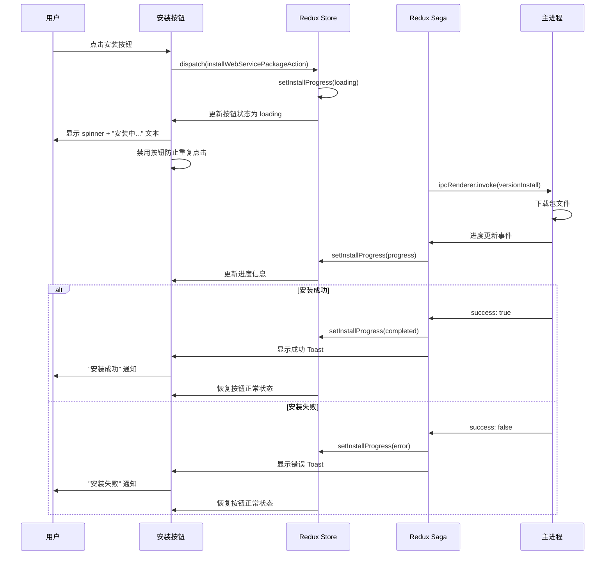
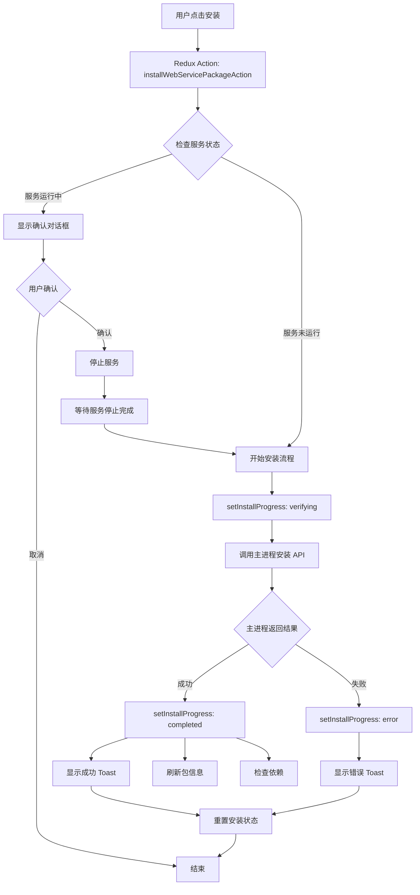
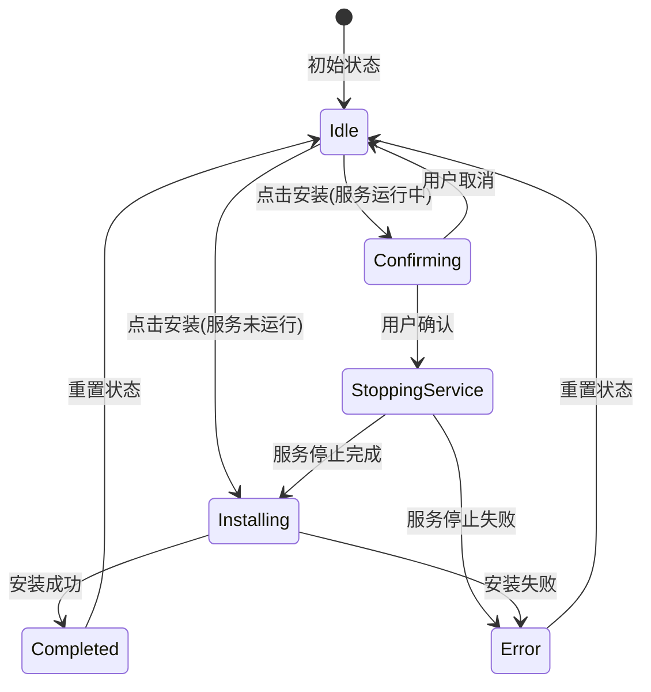

# Change: Add Loading State Feedback to Version Management Install Button

## Why

当用户在版本管理界面点击安装按钮时，当前实现缺少视觉反馈，导致用户无法确认操作是否已被触发。后台下载和安装过程需要时间，但没有加载状态指示，这可能导致用户困惑和重复点击操作。此变更旨在为安装按钮添加适当的加载状态反馈，提供清晰的用户体验。

## What Changes

- 在版本管理界面的安装按钮中添加 loading 状态显示
- 通过 Redux 状态管理追踪安装操作的实时状态
- 使用 shadcn/ui Button 组件的 loading 属性显示 spinner
- 集成 Sonner Toast 显示安装成功/错误通知
- 防止用户在安装过程中重复点击按钮
- 确保与现有的依赖检查和服务启动操作保持一致的状态反馈模式

## UI Design Changes

### 安装按钮状态变化

**当前状态（无加载反馈）**：
```
┌─────────────────────────────────────────┐
│  hagicode-0.1.0-alpha.8-linux-x64.zip   │
│  Linux • 已安装                          │
│                      [安装]              │
└─────────────────────────────────────────┘
```

**Loading 状态（新增）**：
```
┌─────────────────────────────────────────┐
│  hagicode-0.1.0-alpha.8-linux-x64.zip   │
│  Linux • 已安装                          │
│              [安装中...]               │
│              ◍ 正在下载包文件...         │
└─────────────────────────────────────────┘
```

**成功状态（Toast 通知）**：
```
┌─────────────────────────────────────────┐
│           ✓ 安装成功                     │
│  版本已成功安装，请手动启动服务。         │
│                    [关闭]                │
└─────────────────────────────────────────┘
```

**错误状态（Toast 通知）**：
```
┌─────────────────────────────────────────┐
│           ✗ 安装失败                     │
│  安装过程中出现错误，请重试。             │
│              [重试] [关闭]               │
└─────────────────────────────────────────┘
```

### 用户交互流程



## Code Flow Changes

### 数据流变更



### 状态机设计



## Impact

### Affected Specs

- `version-management` - 版本管理能力需要扩展，添加安装状态反馈需求

### Affected Code

| 文件路径 | 变更类型 | 变更原因 | 影响范围 |
|---------|---------|---------|---------|
| `src/renderer/components/VersionManagementPage.tsx` | UI修改 | 安装按钮添加 loading 状态显示 | 版本管理界面 |
| `src/renderer/store/slices/webServiceSlice.ts` | 状态扩展 | 添加安装操作状态追踪 | Redux 状态管理 |
| `src/renderer/store/sagas/webServiceSaga.ts` | Saga修改 | 完善安装流程的状态更新和错误处理 | 副作用管理 |
| `src/renderer/i18n/locales/zh-CN/pages.json` | 国际化 | 添加安装状态的翻译文本 | 中文界面 |
| `src/renderer/i18n/locales/en-US/pages.json` | 国际化 | 添加安装状态的翻译文本 | 英文界面 |

### Technical Scope

- **前端渲染进程 (React)**: 修改 VersionManagementPage 组件的安装按钮 UI
- **状态管理 (Redux)**: 扩展 webServiceSlice 以支持安装状态追踪
- **异步处理 (Redux Saga)**: 更新 webServiceSaga 以处理安装流程的状态变更
- **IPC 通信**: 确保主进程的 VersionManager 安装方法支持进度回调（假设已支持）
- **用户反馈**: 使用 Sonner Toast 显示成功/错误通知

### Breaking Changes

无破坏性变更。此变更仅添加新的 UI 反馈，不修改现有 API 或行为。

### Migration Plan

无需迁移计划。此变更向前兼容，不涉及数据模型或 API 变更。

### Dependencies

- shadcn/ui Button 组件（已集成）
- Redux Toolkit 和 Redux Saga（已集成）
- Sonner Toast 库（已集成）

### Risks / Trade-offs

| 风险 | 缓解措施 |
|------|---------|
| 安装按钮状态可能与实际安装进度不同步 | 使用 Redux 单一数据源确保状态一致性 |
| 网络错误或超时可能导致 loading 状态卡住 | 添加超时机制和错误重置逻辑 |
| 用户可能在 loading 状态下强制关闭应用 | 在应用重启时重置所有安装状态 |
| 与现有依赖检查流程的状态冲突 | 清晰划分安装和依赖检查的状态管理 |

### Success Criteria

1. 用户点击安装按钮后，按钮立即显示 loading 状态
2. Loading 期间按钮被禁用，防止重复点击
3. 安装完成后显示成功 Toast 通知
4. 安装失败时显示错误 Toast 通知并允许重试
5. 状态反馈与现有依赖检查、服务启动操作保持一致
6. 所有界面文本支持中英文国际化

### Priority

**中等优先级**：不影响核心功能，但对用户体验有显著改善作用。建议在下一个迭代中实现。

## Status

**ExecutionCompleted** - 所有任务已完成，代码变更已实施并通过验证。
