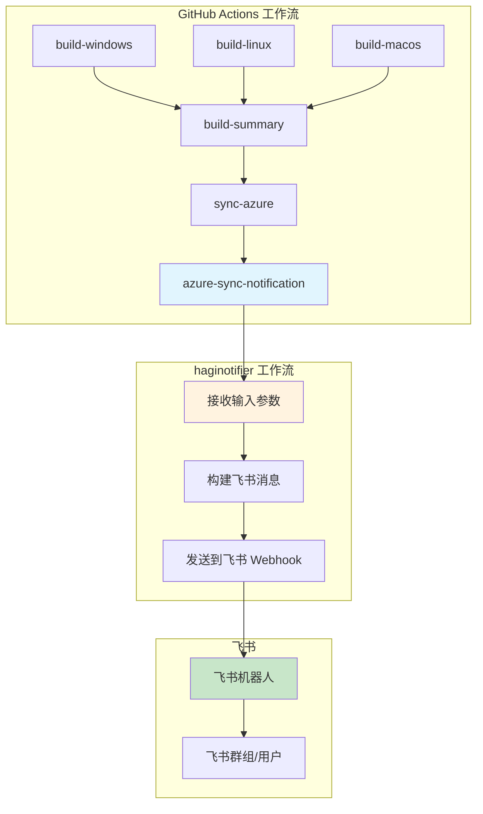
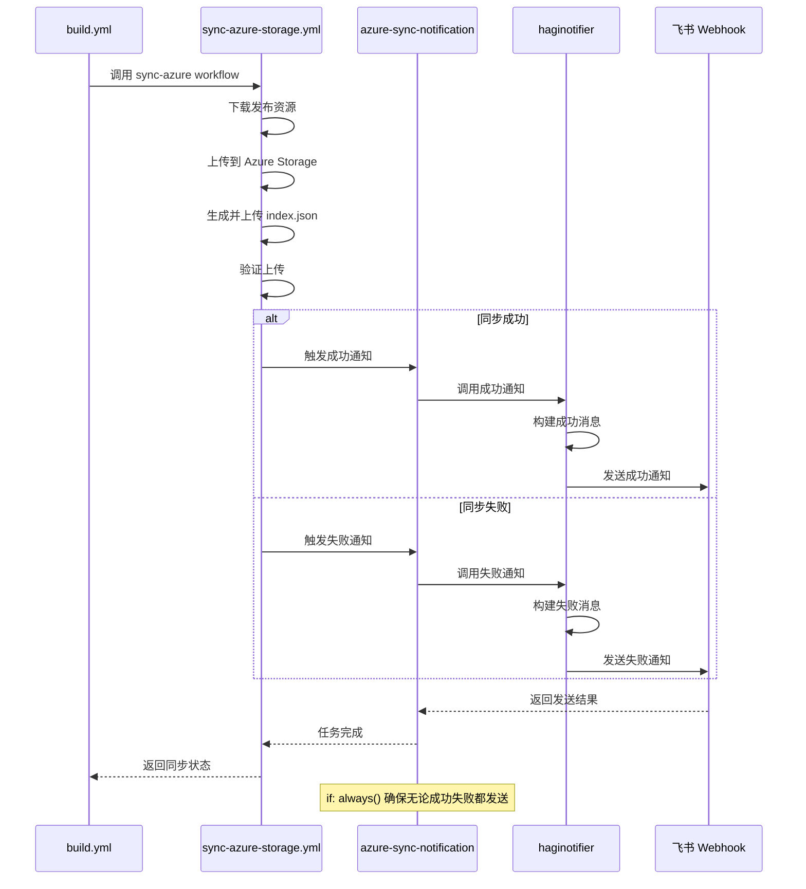

# Change: Azure 同步完成飞书通知

**Change ID:** `azure-sync-lark-notification`
**Status:** ExecutionCompleted
**Created:** 2026-02-10

---

## Why

当前项目在 Azure Storage 同步命令构建完成后，缺少自动化的结果通知机制。这导致：

- 开发团队无法及时获知 Azure Storage 同步状态
- 需要主动检查 GitHub Actions 页面来确认发布包是否成功上传
- 同步失败时无法快速响应和排查问题
- 与现有的飞书构建发布通知体系不一致

为解决这些问题，需要在 Azure 同步工作流完成后自动向飞书推送同步结果通知。

## What Changes

- **新增 Azure 同步通知步骤**：在 sync-azure-storage.yml 工作流中添加通知任务
- **复用现有通知基础设施**：使用项目已集成的 HagiCode-org/haginotifier@v1.0.0 工作流
- **支持同步状态通知**：确保无论同步成功或失败都发送通知
- **包含 Azure 特定信息**：通知包含 Azure Storage 路径、文件数量等同步相关信息

## 代码流程变更

### 通知集成架构



### Azure 同步通知流程



### 飞书通知消息格式

#### 成功通知示例

```
┌─────────────────────────────────────────┐
│ ✅ Azure 同步完成                        │
├─────────────────────────────────────────┤
│                                         │
│ 发布资源已成功同步到 Azure Storage       │
│                                         │
│ 版本: v1.0.0                            │
│ 存储路径: https://<account>.blob.../1.0.0/│
│ 上传文件: 12 个                          │
│                                         │
│ 提交: abc1234                           │
│ 触发者: username                        │
│                                         │
│ [查看详情](GitHub Actions 链接)          │
└─────────────────────────────────────────┘
```

#### 失败通知示例

```
┌─────────────────────────────────────────┐
│ ❌ Azure 同步失败                        │
├─────────────────────────────────────────┤
│                                         │
│ 发布资源同步到 Azure Storage 时发生错误  │
│                                         │
│ 版本: v1.0.0                            │
│ 错误阶段: 上传文件                       │
│                                         │
│ 请检查：                                │
│ • SAS URL 是否有效                      │
│ • 写入权限是否正确配置                  │
│ • 容器是否存在                          │
│                                         │
│ 提交: abc1234                           │
│ [查看详情](GitHub Actions 链接)          │
└─────────────────────────────────────────┘
```

### 代码变更清单

| 文件路径 | 变更类型 | 变更原因 | 影响范围 |
|---------|---------|---------|---------|
| `.github/workflows/sync-azure-storage.yml` | 修改文件 | 添加飞书通知任务 | Azure 同步工作流 |

### 详细变更 - sync-azure-storage.yml

| 属性/配置 | 变更类型 | 具体变更 | 变更原因 |
|----------|---------|---------|---------|
| jobs.azure-sync-notification | 新增 job | 添加 Azure 同步通知任务 | 发送同步结果通知 |
| azure-sync-notification.if | 新增条件 | 设置 if: always() | 无论成功失败都通知 |
| azure-sync-notification.needs | 新增依赖 | 依赖 sync-to-azure 任务 | 确保在同步完成后通知 |
| azure-sync-notification.uses | 新增步骤 | 使用 haginotifier 工作流 | 复用现有通知逻辑 |
| azure-sync-notification.with.message | 新增参数 | 定义通知消息内容 | 发送同步结果信息 |
| azure-sync-notification.with.msg_type | 新增参数 | 设置为 'post' | 使用富文本消息格式 |
| azure-sync-notification.with.title | 新增参数 | 设置通知标题 | 标识通知来源 |
| azure-sync-notification.secrets.FEISHU_WEBHOOK_URL | 新增密钥 | 继承调用方密钥 | 安全传递 Webhook URL |

## Impact

### Affected specs
- `specs/ci-cd/spec.md` - 扩展现有规范，添加 Azure 同步通知功能

### Affected code
- **工作流修改**：
  - `.github/workflows/sync-azure-storage.yml` - 添加 Azure 同步通知任务

### User impact
- **正面影响**：
  - 开发团队将自动收到 Azure 同步结果通知，无需手动检查
  - 同步失败时可以快速响应和排查问题
  - 与现有飞书构建发布通知保持一致的体验
  - 提升发布流程的可观测性和可靠性

- **潜在风险**：
  - 飞书 Webhook URL 泄露可能导致滥用（已通过 GitHub Secrets 机制缓解）
  - haginotifier 服务不可用可能导致通知失败（不影响同步主流程）
  - 通知频率增加可能造成打扰（仅在 Azure 同步流程结束时发送）

### Migration considerations
- 无需迁移，此为新功能
- 依赖现有的 FEISHU_WEBHOOK_URL 密钥配置（已在飞书构建发布通知中配置）

### Performance considerations
- 通知任务异步执行，不阻塞同步流程
- 通知发送时间通常 < 1 秒，对整体流程影响可忽略
- 使用 if: always() 确保即使同步失败也会发送通知

### Security considerations
- 飞书 Webhook URL 通过 secrets: inherit 继承，不会暴露在日志中
- 通知内容不包含敏感信息（仅包含公开的同步状态和路径信息）
- Azure SAS URL 不会被包含在通知消息中
