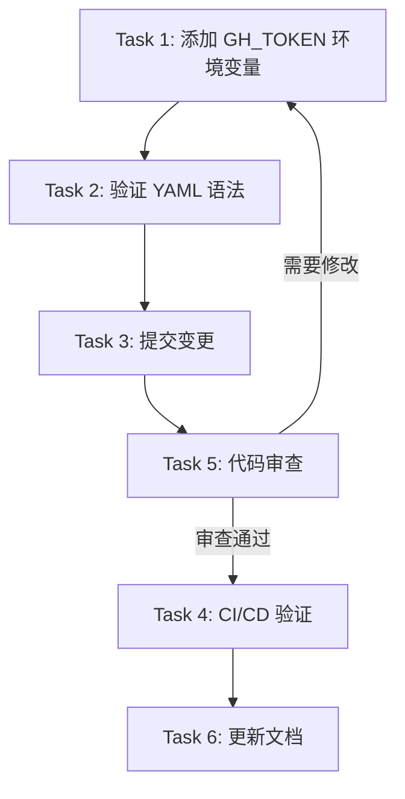

# Tasks: Fix GH_TOKEN Configuration in CI/CD Workflow

## Overview

修复 CI/CD 工作流中 `gh release view` 命令缺少 `GH_TOKEN` 环境变量配置的问题，确保 `index.json` 索引文件生成步骤能够正常执行。

---

## Task 1: 在 sync-azure-storage.yml 中添加 GH_TOKEN 环境变量

**Priority:** High
**Estimated Complexity:** Low

### Description

在 `.github/workflows/sync-azure-storage.yml` 文件的 `Generate and upload index file` 步骤中添加 `GH_TOKEN` 环境变量配置。

### Implementation Steps

1. 打开 `.github/workflows/sync-azure-storage.yml` 文件
2. 定位到第 143 行的 `Generate and upload index file` 步骤
3. 在 `run` 块之后添加 `env` 配置块：

```yaml
      - name: Generate and upload index file
        run: |
          ACCOUNT="${{ steps.sas_info.outputs.account }}"
          CONTAINER="${{ steps.sas_info.outputs.container }}"
          SAS_TOKEN=$(cat /tmp/sas_token.txt)
          RELEASE_TAG="${{ steps.release_info.outputs.tag }}"

          echo "Generating index.json..."

          # Get GitHub Release published_at for fallback
          echo "Fetching GitHub Release publish time..."
          PUBLISHED_AT=$(gh release view "${RELEASE_TAG}" --json publishedAt -q .publishedAt)
          # ... 其余脚本内容
        env:
          GH_TOKEN: ${{ secrets.GITHUB_TOKEN }}
```

### Acceptance Criteria

- [ ] `env: GH_TOKEN: ${{ secrets.GITHUB_TOKEN }}` 已添加到步骤中
- [ ] 缩进和格式符合 YAML 规范
- [ ] 与文件中其他步骤的 `GH_TOKEN` 配置保持一致

---

## Task 2: 验证 YAML 语法

**Priority:** Medium
**Estimated Complexity:** Low

### Description

确保修改后的 YAML 文件语法正确，没有缩进或格式错误。

### Implementation Steps

1. 使用 YAML 验证工具检查语法：
   ```bash
   # 使用 Python 的 YAML 库验证
   python3 -c "import yaml; yaml.safe_load(open('.github/workflows/sync-azure-storage.yml'))"
   ```
2. 或者使用 GitHub Actions 的在线工作流验证工具

### Acceptance Criteria

- [ ] YAML 语法验证通过，无错误
- [ ] 文件可以正常解析

---

## Task 3: 提交变更到代码仓库

**Priority:** High
**Estimated Complexity:** Low

### Description

将修改提交到 Git 仓库，创建 Pull Request 进行代码审查。

### Implementation Steps

1. 暂存修改的文件：
   ```bash
   git add .github/workflows/sync-azure-storage.yml
   ```
2. 创建提交：
   ```bash
   git commit -m "fix(ci): add GH_TOKEN env var for index.json generation step"
   ```
3. 推送到远程仓库并创建 Pull Request
4. 在 PR 描述中引用此 OpenSpec 提案

### Acceptance Criteria

- [ ] 代码已提交
- [ ] PR 已创建
- [ ] PR 描述包含问题说明和修复方案

---

## Task 4: CI/CD 工作流验证

**Priority:** High
**Estimated Complexity:** Medium

### Description

验证修复后的 CI/CD 工作流能够正常运行，特别是 `index.json` 生成步骤。

### Test Cases

1. **手动触发工作流测试**
   - 在 GitHub Actions 中手动触发 `sync-azure-storage.yml` 工作流
   - 输入一个已存在的 release tag
   - 观察工作流执行过程

2. **验证关键步骤**
   - `Determine release tag` 步骤成功
   - `Download release assets` 步骤成功
   - `Generate and upload index file` 步骤成功（不再报错）
   - `Verify upload` 步骤成功

3. **验证 index.json 生成**
   - 检查 Azure Storage 中的 `index.json` 文件
   - 验证 JSON 格式正确
   - 确认 `updatedAt` 和 `lastModified` 字段包含有效时间戳

### Acceptance Criteria

- [ ] 所有工作流步骤成功执行
- [ ] `gh release view` 命令成功返回 `publishedAt`
- [ ] `index.json` 文件成功上传到 Azure Storage
- [ ] 无错误退出代码 (exit code 4)

---

## Task 5: 代码审查

**Priority:** Medium
**Estimated Complexity:** Low

### Description**

审查代码变更，确保修复完整且没有引入新问题。

### Review Checklist

- [ ] 环境变量配置位置正确（在 `run` 块之后）
- [ ] 使用正确的 token 来源：`${{ secrets.GITHUB_TOKEN }}`
- [ ] 与文件中其他使用 `gh` 命令的步骤配置一致
- [ ] 没有遗漏其他需要 `GH_TOKEN` 的步骤
- [ ] 提交信息清晰明确

---

## Task 6: 更新文档（如需要）

**Priority:** Low
**Estimated Complexity:** Low

### Description

如果项目中有 CI/CD 工作流相关文档，更新相关说明。

### Implementation Steps

1. 检查是否存在 CI/CD 文档（如 `docs/ci-cd.md` 或 `README.md` 中的相关章节）
2. 如存在，添加关于 `GH_TOKEN` 配置的说明
3. 如不存在，跳过此任务

### Acceptance Criteria

- [ ] CI/CD 文档已更新（如适用）

---

## Execution Order



**说明**：
- Task 1 → Task 2 → Task 3 必须顺序执行
- Task 5（代码审查）可能需要返回 Task 1 进行修改
- Task 4 必须在代码合并后执行
- Task 6 可选，不影响功能
