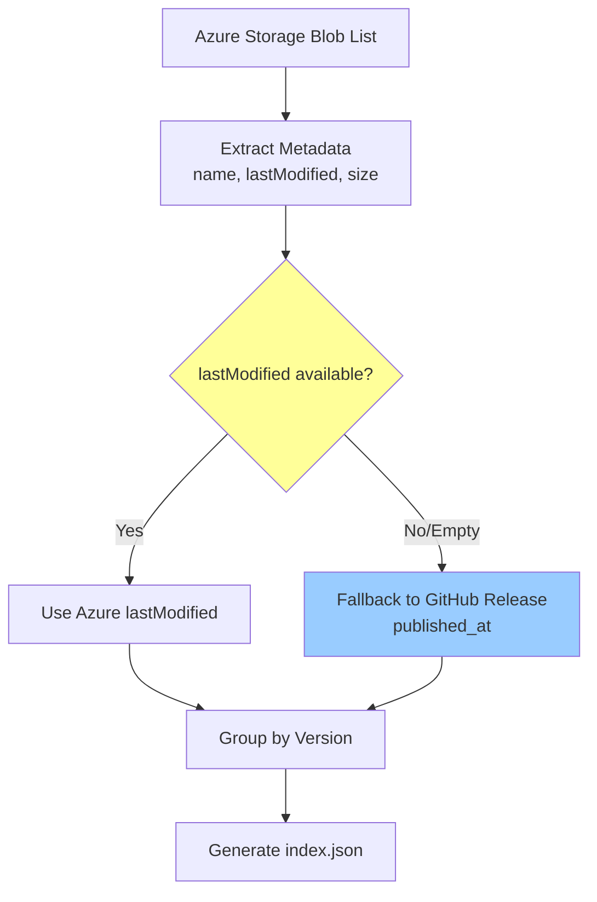

# Change: 修复 index.json 中 Last Modified 字段为空的问题

## Why

当前 index.json 生成流程中，所有版本的 `lastModified` 字段为空值，导致：
- 客户端无法准确判断版本的更新时间
- 影响版本比较和更新检测逻辑
- 用户无法通过 UI 查看版本的发布/修改时间信息

经过代码审查发现问题根源在 `.github/workflows/sync-azure-storage.yml:174` 行：
- assets 数组中的 `lastModified` 字段被设置为 `.lastModified`（Azure Blob 的属性）
- 但在 jq 转换过程中，该属性没有正确传递到最终的 JSON 输出

## What Changes

- **修复 index.json 生成逻辑**：在 `sync-azure-storage.yml` 工作流中修正 jq 脚本，确保 `lastModified` 字段正确填充到每个 asset
- **确保时间戳格式正确**：使用 ISO 8601 格式的时间戳（Azure 默认提供）
- **添加后备方案**：如果 Azure Blob 的 `lastModified` 不可用或为空，使用 GitHub Release 的 `published_at` 时间作为后备值
- **保持向后兼容**：现有字段结构不变，仅修复缺失的数据

## Code Flow Changes

### 后备方案（Fallback）

当 Azure Blob 的 `lastModified` 属性为空或不可用时：
1. 从 GitHub Release API 获取 `published_at` 时间戳
2. 使用该时间作为 `lastModified` 的值
3. 确保时间格式统一为 ISO 8601

## Impact

- **Affected specs**: `ci-cd`
- **Affected code**: `.github/workflows/sync-azure-storage.yml` (第 140-200 行)
- **Data format**: index.json 的 `assets[].lastModified` 字段将包含有效的 ISO 8601 时间戳

## Testing Plan

1. 验证生成的 index.json 中每个 asset 都包含有效的 `lastModified` 字段
2. 确认客户端能正确解析和显示版本时间信息
3. 确保压缩格式 index.json.gz 也包含正确的数据
4. **验证后备方案**：测试当 Azure `lastModified` 不可用时，能正确使用 GitHub Release 的 `published_at` 时间
