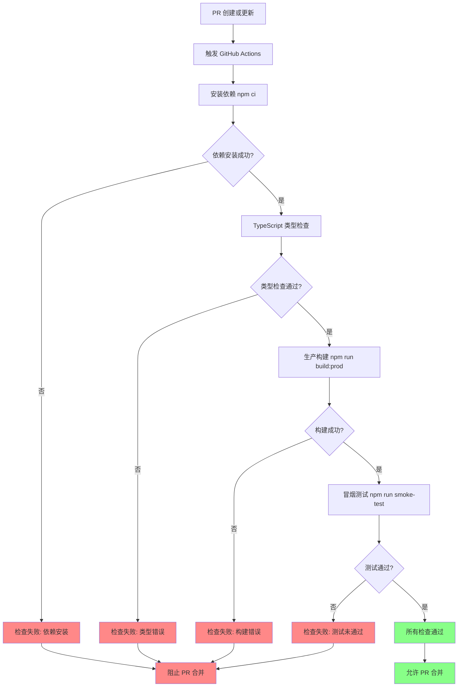
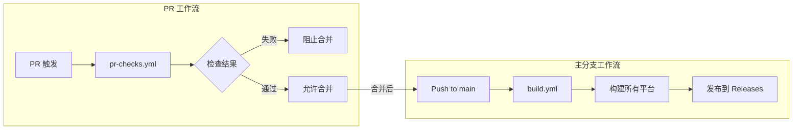

# Change: 为 Pull Request 添加自动化检查

**Status:** ExecutionCompleted

## Why

当前项目在 Pull Request 工作流中缺少自动化质量检查机制，可能导致有问题的代码（编译失败、类型错误、测试未通过）被意外合并到主分支，增加后期修复成本并影响开发效率。

## What Changes

- **新增** Pull Request 检查工作流文件 `.github/workflows/pr-checks.yml`
- **新增** 构建验证检查（依赖安装、TypeScript 类型检查、生产构建）
- **新增** 测试验证检查（单元测试、冒烟测试）
- **新增** 检查通过状态作为 PR 合并的必需条件

## UI Design Changes

不涉及 UI 变更。

## Code Flow Changes

### PR 检查工作流流程图

### 与现有 CI/CD 集成

### 代码变更清单

| 文件路径 | 变更类型 | 变更原因 | 影响范围 |
|---------|---------|---------|---------|
| `.github/workflows/pr-checks.yml` | 新增 | 添加 PR 检查工作流，在 PR 创建或更新时自动执行质量检查 | CI/CD |
| `.github/workflows/build.yml` | 不变 | 保持现有的主分支构建流程不变 | CI/CD |

## Impact

### 影响的规范
- `ci-cd` - 扩展现有 CI/CD 规范，新增 PR 检查要求

### 影响的代码
- **新增文件**: `.github/workflows/pr-checks.yml`
- **现有工作流**: `.github/workflows/build.yml` (无变更)

### 开发流程影响
- PR 创建后会自动触发检查流程，开发者需等待检查完成
- 所有检查通过后才能完成合并（需在 GitHub 仓库设置中配置）
- CI 资源使用增加：每次 PR 创建或更新都会触发检查

### 预期收益
- 代码质量提升：确保合并到主分支的代码通过编译和测试
- 开发效率提升：早期发现问题，减少后期修复成本
- 团队协作改善：明确的检查状态提供清晰的合并反馈
