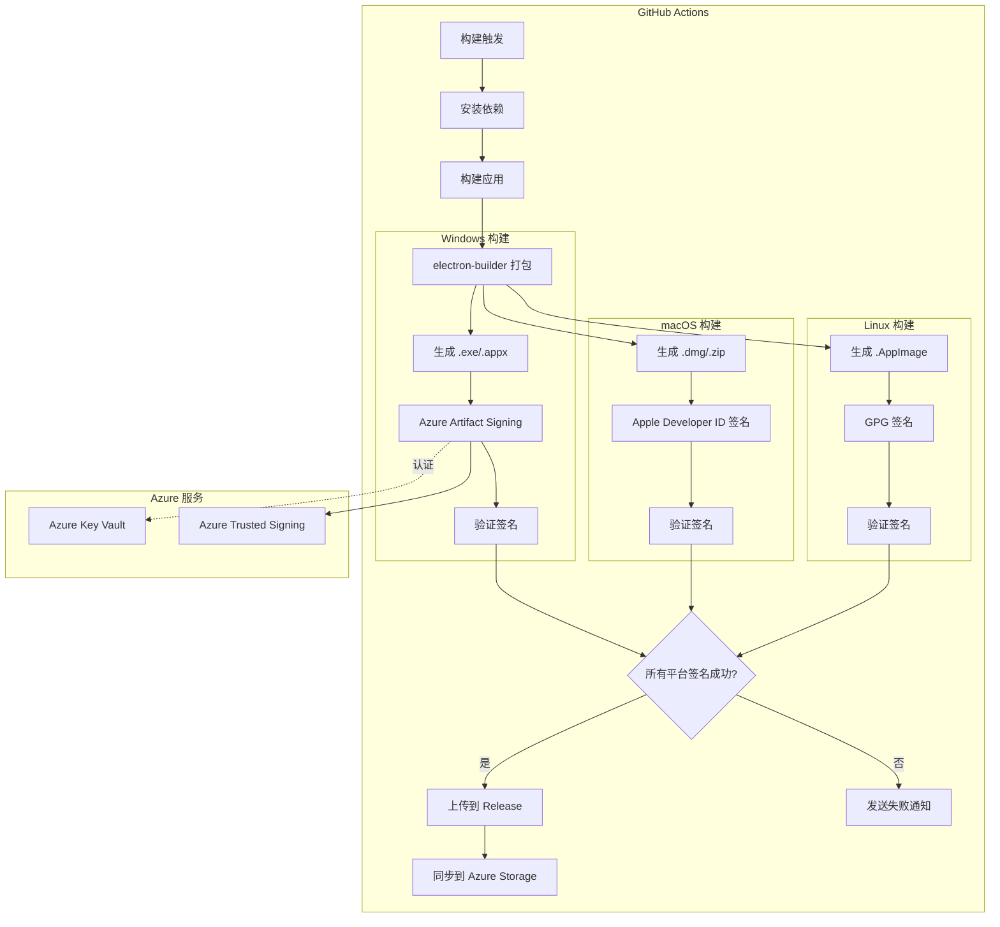
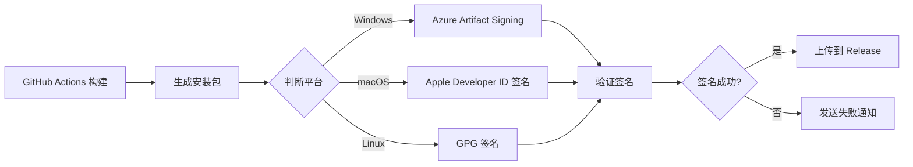

## Context

Hagicode Desktop 是基于 Electron 的跨平台桌面应用，使用 GitHub Actions 进行 CI/CD 自动化构建和发布。当前发布的安装包未经过代码签名，导致用户安装时看到操作系统安全警告，影响用户体验和信任度。

本项目已经使用 Azure Storage 作为发布资源的存储平台，因此使用 Azure Artifact Signing 服务进行代码签名是一个自然的选择，可以利用现有的 Azure 基础设施和凭据。

### Stakeholders

- **最终用户**：希望安装应用时不看到安全警告，希望确认应用来源可信
- **开发者**：希望签名流程完全自动化，无需手动操作
- **安全团队**：希望确保发布的包在传输和存储过程中未被篡改

### Constraints

- **时间约束**：需要尽快实现以改善用户体验
- **技术约束**：必须与现有的 GitHub Actions 工作流集成
- **平台约束**：Windows、macOS、Linux 各有不同的签名机制
- **成本约束**：Azure Trusted Signing 需要付费订阅

## Goals / Non-Goals

### Goals

- 为 Windows 平台实现自动代码签名（最高优先级）
- 为 macOS 平台实现自动代码签名（高优先级）
- 为 Linux 平台实现 GPG 签名（中优先级）
- 签名失败时阻止发布并发送通知
- 完全集成到现有 CI/CD 流程，无需手动操作

### Non-Goals

- 不实现本地开发环境的自动签名（开发者需要手动签名测试版本）
- 不实现自定义签名工具或服务（使用 Azure 托管服务）
- 不实现签名撤销或证书轮换自动化（这些操作通过 Azure Portal 手动完成）

## Decisions

### Decision 1: 使用 Azure Trusted Signing（推荐）

**理由**：
- 微软推荐的云签名服务，专门为 CI/CD 设计
- 无需管理证书私钥，安全性更高
- 支持自动证书轮换
- 与 GitHub Actions 集成良好
- 提供审计日志和合规性支持

**实现方式**：
- 使用 Azure CLI 命令调用签名服务
- 在 GitHub Actions 中配置 Azure 服务主体进行认证
- 对每个平台的安装包调用相应的签名 API

**替代方案**：
- **Azure Key Vault + 传统证书**：需要手动购买和管理证书，适合已有证书的场景
- **DigiCert Signing**：第三方服务，支持多种签名类型，但需要额外的集成工作

### Decision 2: 平台签名优先级

**优先级顺序**：
1. **Windows（最高）**：用户最多，SmartScreen 警告影响最大
2. **macOS（高）**：Gatekeeper 可能阻止安装，影响用户体验
3. **Linux（中）**：Linux 发行版通常有自己的签名机制，GPG 签名相对次要

**理由**：
- Windows 用户占比较大，未签名应用的安全警告最明显
- macOS 的 Gatekeeper 是强制的，未签名应用可能无法安装
- Linux 用户通常更技术化，对 GPG 签名的需求相对较低

### Decision 3: 签名失败处理策略

**策略**：
- 签名失败时立即终止构建
- 阻止上传构建产物到 Release
- 发送飞书通知，包含失败原因和排查建议
- 在 GitHub Actions 日志中记录详细错误信息

**理由**：
- 未签名的安装包不应该发布，这会破坏用户信任
- 快速失败可以节省 CI/CD 资源
- 详细的错误信息有助于快速排查问题

### Decision 4: electron-builder 集成方式

**选择**：在 GitHub Actions 中添加独立的签名步骤，而不是使用 electron-builder 内置的签名功能

**理由**：
- electron-builder 的内置签名需要证书文件，不适合云签名服务
- 独立的签名步骤更灵活，可以使用不同的签名服务
- 便于调试和错误处理
- 可以在不同平台上重用签名逻辑

## Technical Design

### 架构设计



### 数据流



### 代码变更清单

| 文件路径 | 变更类型 | 变更原因 |
|---------|---------|---------|
| `.github/workflows/build.yml` | 修改 | 添加签名步骤和相关配置 |
| `electron-builder.yml` | 修改 | 添加平台特定签名配置 |
| `scripts/ci-build.js` | 修改 | 添加签名验证逻辑（可选） |
| `scripts/sign-artifact.js` | 新增 | 签名辅助脚本（可选） |
| `scripts/verify-signature.js` | 新增 | 签名验证脚本（可选） |

### GitHub Actions 配置示例

#### Windows 签名步骤

```yaml
- name: Sign Windows artifacts
  if: success()
  shell: bash
  run: |
    # 安装 Azure CLI
    curl -sL https://aka.ms/InstallAzureCLIDeb | sudo bash

    # 登录 Azure
    az login --service-principal \
      --user "${{ secrets.AZURE_CLIENT_ID }}" \
      --password "${{ secrets.AZURE_CLIENT_SECRET }}" \
      --tenant "${{ secrets.AZURE_TENANT_ID }}"

    # 签名所有 .exe 文件
    for file in pkg/*.exe; do
      echo "Signing $file"
      az artifacts signing sign \
        --endpoint "${{ secrets.AZURE_SIGNING_ENDPOINT }}" \
        --file "$file" \
        --hash-algorithm SHA256
    done

    # 签名所有 .appx 文件
    for file in pkg/*.appx; do
      echo "Signing $file"
      az artifacts signing sign \
        --endpoint "${{ secrets.AZURE_SIGNING_ENDPOINT }}" \
        --file "$file" \
        --hash-algorithm SHA256
    done
```

#### 签名验证步骤

```yaml
- name: Verify signature
  if: success()
  shell: bash
  run: |
    # Windows 签名验证
    if [[ "$OSTYPE" == "msys" ]]; then
      for file in pkg/*.exe; do
        echo "Verifying $file"
        signtool verify /pa "$file" || exit 1
      done
    fi
```

#### 失败处理步骤

```yaml
- name: Signing failure notification
  if: failure()
  uses: HagiCode-org/haginotifier@v1.0.0
  with:
    message: |
      **代码签名失败**

      平台: ${{ matrix.os }}
      版本: ${{ github.ref_name }}
      提交: `${{ github.sha }}`

      请检查签名配置和证书状态。
    msg_type: 'post'
    title: '代码签名失败 ❌'
  env:
    FEISHU_WEBHOOK_URL: ${{ secrets.FEISHU_WEBHOOK_URL }}
```

### electron-builder 配置更新

```yaml
# electron-builder.yml 添加签名配置
win:
  target:
    - portable
    - nsis
    - appx
  icon: resources/icon.ico
  # 签名配置（通过环境变量传递）
  signingHashAlgorithms:
    - sha256

mac:
  target:
    - target: default
      arch:
        - x64
        - arm64
  icon: resources/icon.icns
  category: public.app-category.utilities
  # 签名配置（通过环境变量传递）
  identity: "${env.APPLE_SIGNING_IDENTITY}"

linux:
  target:
    - AppImage
    - deb
    - tar.gz
  category: Utility
  maintainer: newbe36524 <support@hagicode.com>
```

## Risks / Trade-offs

### 风险

| 风险 | 影响 | 缓解措施 |
|-----|------|---------|
| Azure 订阅过期或凭据失效 | 签名失败，无法发布新版本 | 设置订阅续订提醒，实现健康检查 |
| 证书过期 | 签名失败 | 启用自动证书轮换（Trusted Signing） |
| 签名服务宕机 | 构建失败 | 实现重试机制，准备备用签名方案 |
| 签名增加构建时间 | CI/CD 流程变慢 | 并行执行签名步骤，优化签名请求 |
| 配置错误导致签名失败 | 开发体验受影响 | 提供配置验证脚本，详细错误信息 |

### 权衡

1. **安全性 vs 易用性**
   - 选择：优先安全性，使用 Azure 托管服务而不是本地证书
   - 影响：需要配置 Azure 服务主体，但提供更好的安全性

2. **自动化 vs 灵活性**
   - 选择：优先自动化，完全集成到 CI/CD
   - 影响：牺牲了一些手动签名的灵活性

3. **平台覆盖 vs 开发时间**
   - 选择：优先实现 Windows 签名，macOS 和 Linux 可选
   - 影响：最常见的问题首先解决，资源使用更高效

## Migration Plan

### 实施步骤

1. **阶段 1：准备工作**
   - 配置 Azure 订阅和资源
   - 创建服务主体并分配权限
   - 配置 GitHub Secrets

2. **阶段 2：Windows 签名实现**
   - 更新 build.yml 添加 Windows 签名步骤
   - 实现签名验证
   - 测试签名流程

3. **阶段 3：macOS 签名实现（可选）**
   - 配置 Apple Developer ID
   - 添加 macOS 签名步骤
   - 测试签名和公证流程

4. **阶段 4：Linux 签名实现（可选）**
   - 生成 GPG 密钥对
   - 添加 Linux 签名步骤
   - 测试 GPG 签名验证

5. **阶段 5：部署和监控**
   - 部署到生产环境
   - 监控签名成功率
   - 收集用户反馈

### 回滚计划

如果签名流程出现问题，可以：

1. 禁用签名步骤（通过 feature flag）
2. 临时跳过签名验证
3. 回退到未签名的发布流程

### 验证标准

- [ ] Windows 安装包安装时无 SmartScreen 警告
- [ ] macOS 安装包通过 Gatekeeper 验证
- [ ] Linux 签名文件正确生成
- [ ] 签名失败时正确发送通知
- [ ] CI/CD 流程完全自动化

## Open Questions

1. **Azure 服务选择**：最终选择 Azure Trusted Signing 还是 Azure Key Vault + 传统证书？
2. **macOS 签名范围**：是否需要实现 Apple 公证（Notarization）？这需要额外的 Apple Developer 账户。
3. **Linux 签名优先级**：是否需要 GPG 签名，还是可以跳过？
4. **签名超时时间**：Azure Artifact Signing 的超时时间应该设置为多少？建议 5-10 分钟。
5. **成本预算**：Azure Trusted Signing 的费用预算是多少？
