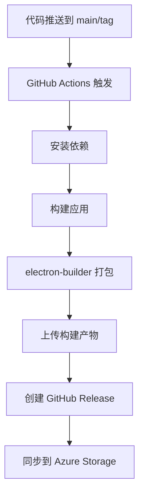
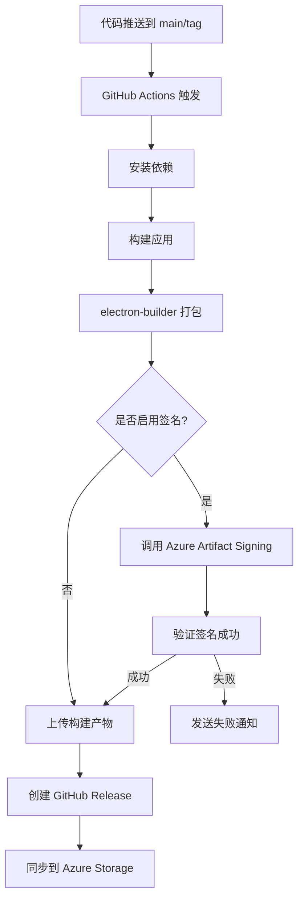
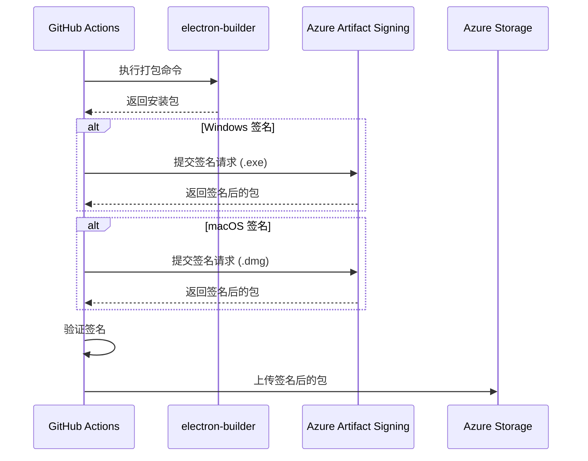

# Change: 为 Hagicode Desktop 添加代码签名

## Why

当前 Hagicode Desktop 发布的安装包未经过代码签名，导致：

- **用户安装体验差**：Windows SmartScreen 显示"无法识别的应用"警告，macOS Gatekeeper 可能阻止安装
- **信任度降低**：未签名的应用容易被用户怀疑安全性
- **分发限制**：部分企业环境和安全策略阻止安装未签名的应用
- **合规性缺失**：企业级应用通常需要代码签名作为基本安全要求

通过引入 Azure Artifact Signing 服务实现自动签名，可以提升用户信任度和安装体验，同时满足企业安全合规要求。

## What Changes

### 核心变更

- **添加 Azure Artifact Signing 集成**：在 GitHub Actions 构建工作流中集成 Azure Trusted Signing 或 Azure Code Signing 服务
- **增强 CI/CD 工作流**：在 electron-builder 打包后添加签名步骤
- **多平台签名支持**：
  - Windows：使用 Authenticode 签名 .exe 和 .appx 安装包
  - macOS：使用 Apple Developer ID 签名 .dmg 和 .app 包（可选）
  - Linux：使用 GPG 签名 .AppImage 包（可选）
- **签名验证机制**：签名后自动验证签名是否成功应用
- **失败处理**：签名失败时阻止发布并发送飞书通知

### 配置变更

- **GitHub Actions Secrets**：添加 Azure 凭据和证书相关密钥
- **electron-builder 配置**：添加签名配置
- **CI/CD 规范更新**：更新 `openspec/specs/ci-cd/spec.md` 以包含签名要求

### 技术实现

- 使用 Azure Trusted Signing（推荐）或 Azure Key Vault 存储证书
- 在 `.github/workflows/build.yml` 中添加签名步骤
- 修改 `scripts/ci-build.js` 或 `electron-builder.yml` 以支持签名配置

## UI Design Changes

无 UI 变更。

## Code Flow Changes

### 当前构建流程

### 新增签名后的构建流程

### 签名服务集成时序图

## Impact

### 受影响的规范

- `openspec/specs/ci-cd/spec.md`：添加代码签名相关要求

### 受影响的代码

- `.github/workflows/build.yml`：添加签名步骤
- `electron-builder.yml`：添加签名配置
- `scripts/ci-build.js`：可能需要修改以支持签名流程

### 新增依赖

- Azure Artifact Signing CLI 或 SDK
- 可能需要添加 macOS 签名工具（codesign）
- 可能需要添加 GPG 工具（Linux 签名）

### 需要配置的 GitHub Secrets

- `AZURE_SIGNING_ENDPOINT`：Azure Artifact Signing 端点
- `AZURE_SIGNING_KEY_URI`：Azure Key Vault 密钥 URI（如使用 Key Vault）
- `AZURE_CLIENT_ID`：Azure 服务主体客户端 ID
- `AZURE_CLIENT_SECRET`：Azure 服务主体密钥
- `AZURE_TENANT_ID`：Azure 租户 ID

### 可选配置（macOS 签名）

- `APPLE_ID`：Apple Developer 账户
- `APPLE_ID_PASSWORD`：App 专用密码
- `APPLE_TEAM_ID`：Apple 团队 ID

### 风险和注意事项

1. **证书过期**：需要监控证书有效期，及时更新
2. **签名失败**：需要实现回退机制和通知机制
3. **构建时间**：签名步骤会增加构建时间
4. **成本**：Azure Trusted Signing 需要付费订阅

### 成功标准

- Windows 安装包在安装时不再显示 SmartScreen 警告
- macOS 安装包可以通过 Gatekeeper 验证（如实现）
- 签名失败时能够正确通知开发者
- CI/CD 流程完全自动化，无需手动签名操作
