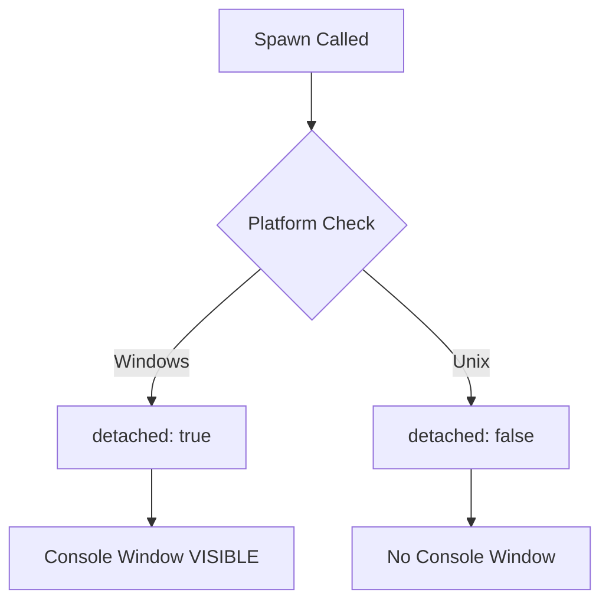
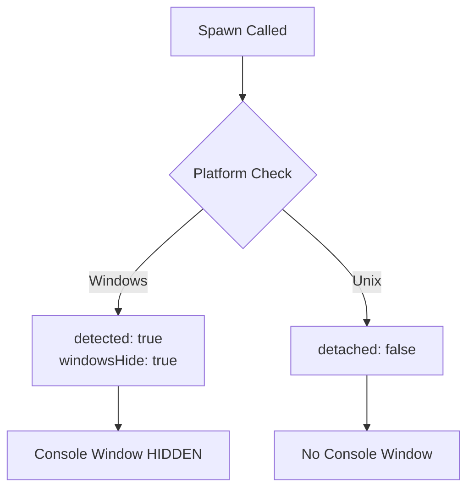

# Change: Hide Windows Console Windows During Batch Script Execution

## Why

On Windows, when Hagicode Desktop executes batch files (.bat) using `child_process.spawn` or `child_process.exec`, a command prompt window appears. This is caused by the default Windows subprocess creation behavior, which creates a visible console window when process options are not properly configured. This disrupts user workflow, confuses non-technical users, and affects the application's professional appearance.

## What Changes

- Add `windowsHide: true` option to all `spawn` calls on Windows platform
- Update `dependency-manager.ts` to include Windows-specific spawn options
- Fix `web-service-manager.ts` to consistently use `windowsHide: true` across all spawn calls
- Ensure all entryPoint script executions (check, install, start) hide console windows on Windows

## Code Flow Changes

### Current Spawn Options (Windows)

### Fixed Spawn Options (Windows)

### Affected Files

| File | Current State | Required Change | Reason |
|------|--------------|-----------------|--------|
| `src/main/dependency-manager.ts` | Missing `windowsHide` | Add `windowsHide: true` on Windows | Entry point scripts show console window |
| `src/main/web-service-manager.ts` | Inconsistent usage | Ensure all spawn calls use `windowsHide: true` | Start script shows console window |

### Detailed Changes - dependency-manager.ts

| Method | Line | Change |
|--------|------|--------|
| `executeEntryPointScript` | 257 | Add `windowsHide: true` to spawn options when `platform === 'win32'` |
| `executeCommandWithRealTimeOutput` | 991 | Add `windowsHide: true` to spawn options when `platform === 'win32'` |

### Detailed Changes - web-service-manager.ts

| Method | Line | Change |
|--------|------|--------|
| `executeStartScript` | 235 | Use `getSpawnOptions()` instead of manual options OR add `windowsHide: true` |
| `getSpawnOptions` | 341 | Already has `windowsHide: true` - ensure consistency |
| `forceKill` | 928 | Add `windowsHide: true` to taskkill spawn call |

## Impact

### Affected specs
- `specs/dependency-management/spec.md` - Process spawning behavior for dependency checks and installation
- `specs/electron-app/spec.md` - Main process platform-specific behavior

### Affected code
- `src/main/dependency-manager.ts` - Entry point script execution
- `src/main/web-service-manager.ts` - Web service startup and process management

### User Experience Impact
- **Eliminates disruption**: No more sudden console windows appearing during background operations
- **Professional appearance**: Application runs smoothly without visual interruptions
- **Reduces confusion**: Non-technical users won't be confused by unexpected command prompts

### Technical Impact
- **Cross-platform consistency**: Windows experience matches macOS/Linux
- **No performance impact**: Only adds process options, doesn't change execution logic
- **Backward compatible**: Doesn't break existing functionality

### Risk Assessment
- **Low risk**: Only adding process options, not changing core logic
- **Reversible**: Can be quickly rolled back if issues arise
- **Testing needed**: Verify on Windows environment that all script execution scenarios work correctly
