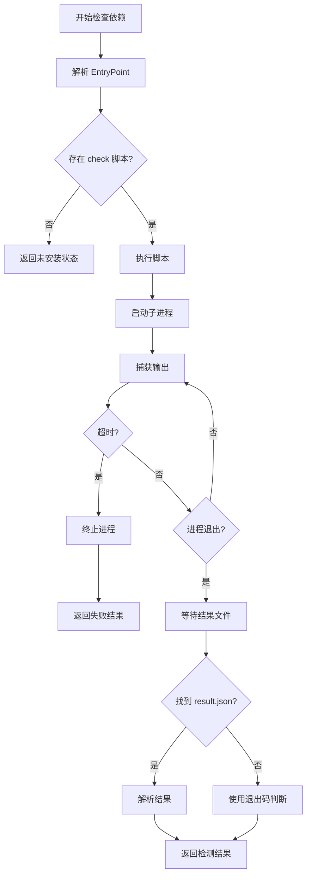
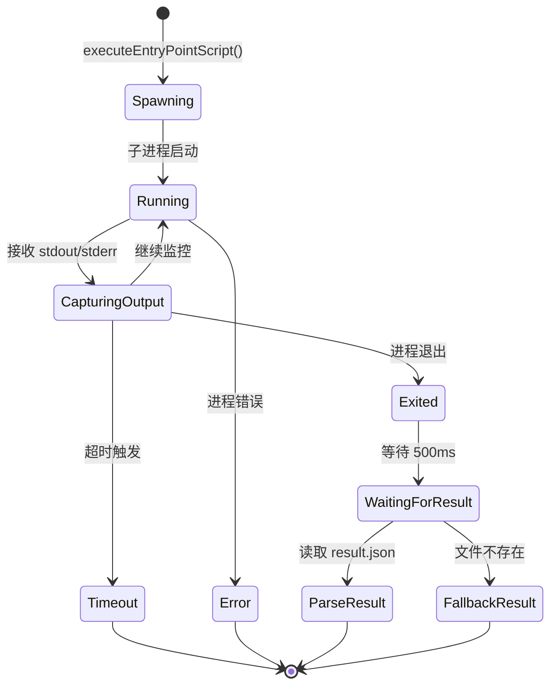

## Context

### 背景
Windows 平台上的依赖检查脚本 `check.bat` 在完成依赖检测后不会自动退出，导致用户需要手动按 `Ctrl+C` 终止进程。根据日志显示：

```
[2026-02-13 20:53:21.937] [error] [DependencyManager] STDERR: ^C
[2026-02-13 20:53:21.938] [info]  [DependencyManager] STDOUT: Terminate batch job (Y/N)?
```

### 约束条件
- 必须保持与现有依赖检测逻辑的兼容性
- 不能影响跨平台（macOS/Linux）的行为
- 修复应该是最小侵入性的
- 必须确保 `check-result.json` 在进程退出前被正确写入

### 利益相关者
- 最终用户：需要流畅的自动化依赖检测体验
- 开发团队：需要可维护的跨平台脚本解决方案

## Goals / Non-Goals

### Goals
- 确保 Windows 依赖检查脚本在完成后自动退出
- 提供健壮的超时机制处理挂起的脚本
- 改进日志记录以便诊断脚本执行问题
- 保持跨平台行为一致性

### Non-Goals
- 不改变依赖检测的核心逻辑
- 不修改 `check-result.json` 的格式
- 不添加新的用户界面元素

## Decisions

### Decision 1: 使用 `exit /b 0` 确保脚本退出

**选择**: 在批处理脚本末尾添加 `exit /b 0` 语句

**原因**:
- `exit /b` 仅退出当前批处理脚本，不会关闭调用者的命令提示符
- 退出码 0 表示成功执行
- 这是 Windows 批处理脚本的标准最佳实践

**替代方案**:
- 使用 `exit`（不带 `/b`）：可能关闭整个命令提示符窗口
- 使用 `goto :eof`：不设置退出码，可能导致错误检测失败
- 不做修改：依赖用户手动终止（当前状态，用户体验差）

### Decision 2: 增强 DependencyManager 的进程管理

**选择**: 在 `executeEntryPointScript` 方法中添加显式的超时和清理逻辑

**原因**:
- 当前已有 5 分钟超时，但可能需要更精细的控制
- Windows 的 `detached: true` 模式可能导致进程管理复杂性
- 需要确保子进程在超时时被正确终止

**替代方案**:
- 仅依赖脚本端的修复：如果脚本逻辑错误，可能导致无限等待
- 使用外部进程管理库：增加依赖复杂度
- 保持现状：用户体验问题未解决

### Decision 3: 日志增强策略

**选择**: 在日志中明确区分正常退出、超时终止和用户中断

**原因**:
- 当前日志无法清楚区分不同的终止原因
- 有助于诊断未来可能出现的问题
- 不影响性能

**实现**:
```
[info] Script exited normally with code: 0
[warn] Script terminated due to timeout (300s)
[info] Script terminated by user (Ctrl+C)
```

## Technical Design

### 脚本执行流程



### 进程生命周期管理



### Windows 特定处理

在 Windows 平台上，`spawn` 使用 `detached: true` 可能导致以下行为：

1. **进程组分离**：子进程可能在独立的进程组中运行
2. **终止复杂性**：需要使用进程组 ID 来终止所有相关进程
3. **控制台窗口**：可能会创建新的控制台窗口

**缓解措施**:
```typescript
// 当前的实现
const child = spawn(command, [], {
  cwd: workingDirectory,
  shell: shell,
  stdio: ['pipe', 'pipe', 'pipe'],
  detached: this.platform === 'win32',  // Windows 特定
});

// 优化后的终止处理
child.on('exit', async (code) => {
  // ... 现有逻辑
});

// 超时终止增强
const killProcess = () => {
  if (this.platform === 'win32') {
    // Windows: 需要终止整个进程组
    try {
      process.kill(-child.pid);
    } catch {
      child.kill();
    }
  } else {
    child.kill();
  }
};
```

## Risks / Trade-offs

### 风险 1: 脚本不存在或路径不正确

**风险**: 项目中可能不存在 `check.bat` 文件，或者其位置与预期不符

**缓解措施**:
- 在诊断阶段确认脚本的实际位置
- 如果脚本不存在，作为提案的一部分创建模板
- 提供清晰的文档说明脚本应放置的位置

### 风险 2: 现有 `check.bat` 有复杂逻辑

**风险**: 现有脚本可能有复杂的控制流程，添加 `exit /b 0` 可能跳过某些清理代码

**缓解措施**:
- 在修改前完全分析现有脚本逻辑
- 确保所有代码路径都有适当的退出处理
- 添加注释说明退出行为

### 风险 3: 跨平台行为不一致

**风险**: 修复 Windows 后，其他平台的行为可能与 Windows 不一致

**缓解措施**:
- 同步检查并更新其他平台的脚本
- 在测试计划中包含所有平台
- 记录任何平台特定的行为差异

### 权衡 1: 超时时间长度

**选项**:
- 短超时（如 30s）：快速失败，但可能误杀正常的慢速检测
- 长超时（如 300s）：容忍慢速操作，但用户等待时间长

**决策**: 保持现有的 5 分钟超时，但添加配置选项允许未来调整

## Migration Plan

### 实施步骤

1. **诊断阶段**（必须首先完成）
   - 确认 `check.bat` 是否存在
   - 分析当前脚本内容
   - 确定需要修改的具体位置

2. **脚本修复**
   - 创建/修改 `check.bat` 添加 `exit /b 0`
   - 移除任何 `pause` 命令
   - 测试脚本独立执行

3. **代码增强**
   - 修改 `dependency-manager.ts` 中的进程管理
   - 添加改进的日志记录
   - 测试超时处理

4. **测试验证**
   - 在真实 Windows 环境中测试
   - 验证所有平台的行为一致性
   - 确认日志输出清晰

### 回滚策略

如果修复引入问题：
- 脚本修改：移除 `exit /b 0`，恢复原始脚本
- 代码修改：回退 `dependency-manager.ts` 的更改
- 使用 Git revert 快速恢复到修复前的状态

### 验收标准

修复成功的标准：
1. Windows 依赖检查在完成后自动退出，无需用户干预
2. 控制台日志显示清晰的执行状态
3. 超时机制能够正确终止挂起的脚本
4. 其他平台的依赖检测不受影响
5. 所有现有的依赖检测结果保持准确

## Open Questions

1. **`check.bat` 的确切位置**: 需要确认脚本是在项目源代码中还是在打包后的应用程序资源中？
2. **脚本生成方式**: `check.bat` 是手动维护的还是通过构建过程自动生成的？
3. **超时配置**: 是否需要将超时时间配置化，而不是硬编码在代码中？
4. **其他脚本**: 是否存在类似的 `install.bat` 或其他可能受影响的批处理脚本？
