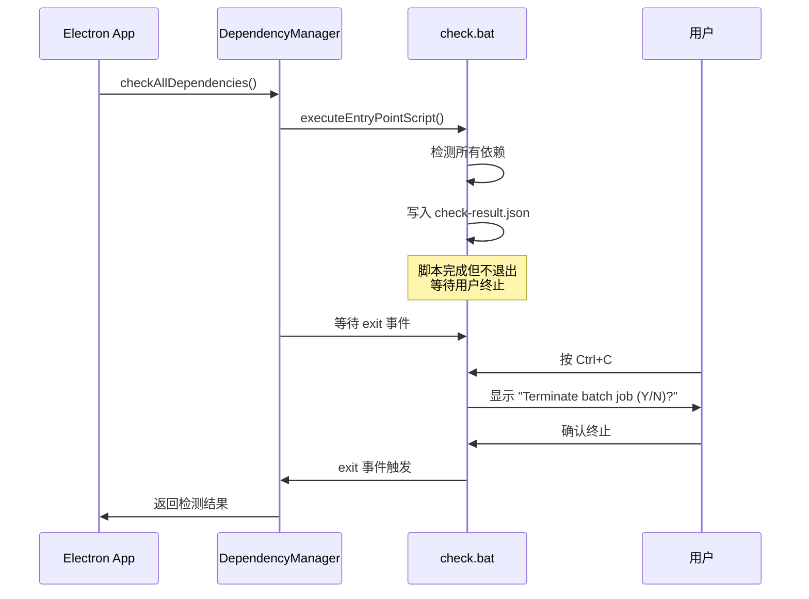
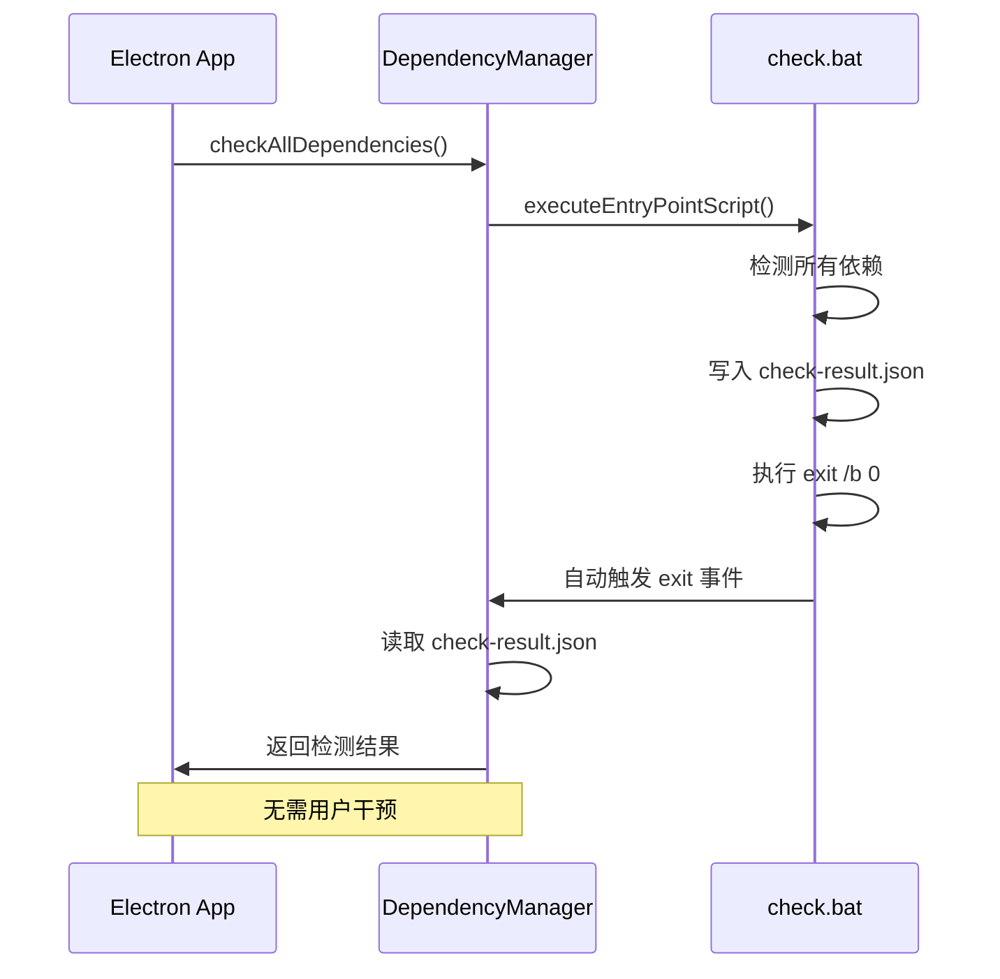
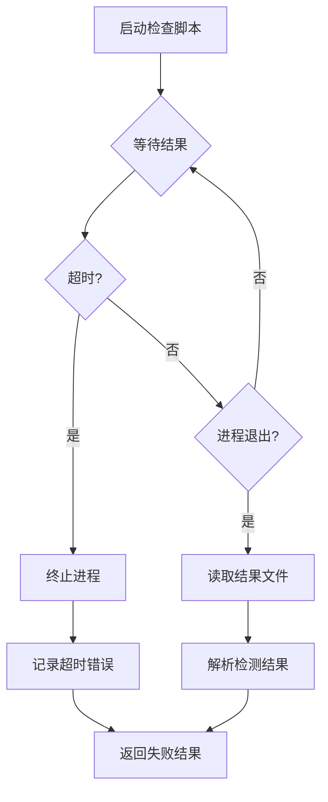

# Change: 修复 Windows 依赖检查脚本自动退出问题

## Why

在 Windows 平台上，依赖检查脚本 `check.bat` 完成依赖检测后不会自动退出，导致用户需要手动按 `Ctrl+C` 终止进程，影响用户体验。日志显示脚本成功完成所有依赖检测并生成 `check-result.json`，但进程仍在等待用户输入终止确认。

## What Changes

- **修改 `check.bat` 脚本**：确保脚本在完成检查后自动退出，添加 `exit /b 0` 语句
- **移除阻塞命令**：检查并移除脚本中可能导致挂起的 `pause` 命令或类似的用户交互提示
- **增强 DependencyManager 进程管理**：在 `src/main/dependency-manager.ts` 中添加超时机制和更好的进程终止处理
- **跨平台一致性验证**：确保 macOS/Linux 版本的对应脚本行为一致

**非破坏性变更**：此修复不影响现有功能，仅改善用户体验

## UI Design Changes

不涉及 UI 变更。此修复主要针对后台脚本执行行为。

## Code Flow Changes

### 当前流程（问题状态）

### 修复后流程

### 增强的超时处理流程

## Impact

### 影响的规范
- `specs/dependency-management/spec.md` - 依赖状态检测要求

### 影响的代码
- `scripts/check.bat` - Windows 批处理检查脚本（如果存在）
- `src/main/dependency-manager.ts` - 进程执行和超时管理逻辑
- 可能需要检查其他平台的对应脚本（`check.sh`）以确保一致性

### 风险评估
- **低风险**：修改仅影响脚本退出行为，不改变依赖检测逻辑
- **向后兼容**：不影响现有检测结果和 API 接口
- **平台特定**：主要修复 Windows 平台，其他平台需要验证一致性

### 用户影响
- **改善前**：用户需要手动终止检查脚本进程
- **改善后**：脚本自动退出，完全自动化的依赖检测流程
